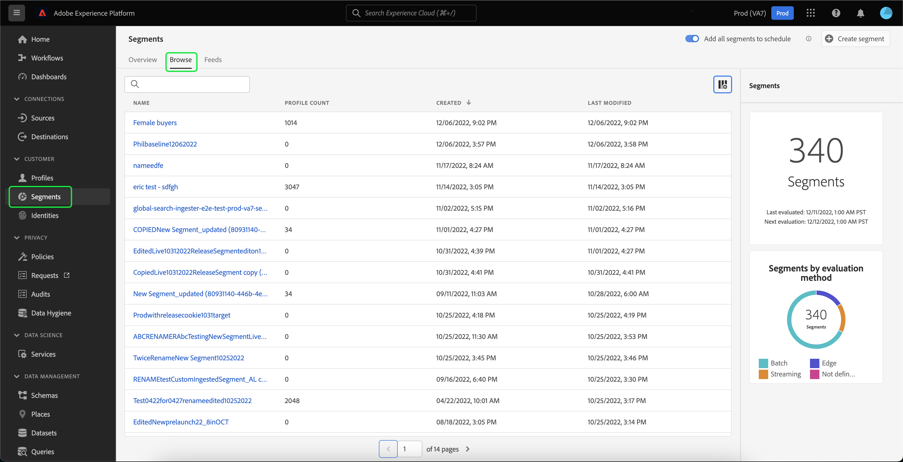
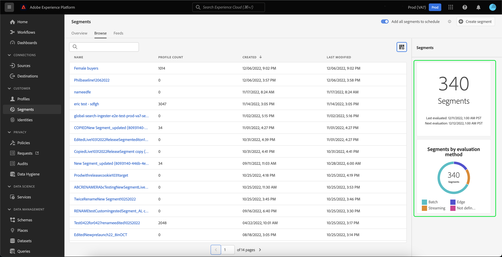

# Guía del usuario del servicio de segmentación

[!DNL Adobe Experience Platform Segmentation Service] proporciona una interfaz de usuario para crear y administrar definiciones de segmentos.

## Primeros pasos

Trabajar con definiciones de segmentos requiere comprender los distintos [!DNL Experience Platform] servicios relacionados con la segmentación. Antes de leer esta guía del usuario, consulte la documentación de los siguientes servicios:

- [[!Servicio de segmentación DNL]](../home.md): [!DNL Segmentation Service] permite dividir los datos almacenados en [!DNL Experience Platform] que se relacionan con personas (como clientes, clientes potenciales, usuarios u organizaciones) en grupos más pequeños.
- [[!Perfil del cliente en tiempo real de DNL]](../../profile/home.md): Proporciona un perfil de consumo unificado y en tiempo real basado en datos agregados de varias fuentes.
- [[!DNL Adobe Experience Platform Identity Service]](../../identity-service/home.md): Permite la creación de perfiles de clientes mediante el enlace de identidades de fuentes de datos dispares que se están ingeriendo en [!DNL Platform].
- [[!Modelo de datos de experiencia DNL (XDM)]](../../xdm/home.md): El marco normalizado por el cual [!DNL Platform] organiza los datos de experiencia del cliente.

También es importante conocer dos términos clave que se utilizan a través de este documento y comprender la diferencia entre ellos:
- **Definición** del segmento: Conjunto de reglas utilizado para describir las características o los comportamientos clave de una audiencia de destinatario.
- **Audiencia**: Conjunto resultante de perfiles que cumplen los criterios de una definición de segmento.

## Información general

En la [[!DNL Experience Platform] interfaz de usuario](http://platform.adobe.com/), seleccione **[!UICONTROL Segmentos]** en el panel de navegación izquierdo para abrir la ficha **[!UICONTROL Información general]** . Esta ficha proporciona vínculos a documentación y vídeos para ayudarle a comprender y comenzar a trabajar con segmentos.

## Examinar

Seleccione la ficha **[!UICONTROL Examinar]** para ver una lista de todas las definiciones de segmentos para la organización de IMS.

Esta vista lista información sobre la definición del segmento, incluido el desglose, la reproducción, el recuento de perfiles, el método de evaluación, la fecha de creación y la fecha de la última modificación.

El desglose muestra un gráfico de barras que describe el porcentaje de perfiles que pertenecen a cada uno de los siguientes estados: [!UICONTROL Introducido], [!UICONTROL Realizado]y [!UICONTROL Saliente].

| Estado | Descripción |
| ------ | ----------- |
| Introducido | Un nuevo perfil dentro del segmento. |
| Realizado | Un perfil existente que se ha mantenido dentro del segmento. |
| Saliendo | Un perfil existente que abandona el segmento. |

La generación representa el porcentaje de perfiles que están cambiando dentro de una definición de segmento en comparación con la última vez que se ejecutó el trabajo de segmento, mientras que el recuento de perfiles representa el número total de perfiles que califican para el segmento.

El método de evaluación puede ser de flujo continuo o por lotes. Los segmentos de flujo se evalúan constantemente a medida que los datos entran en el sistema. Los segmentos por lotes se evalúan según una programación establecida.

En la parte superior de la página hay opciones para agregar todos los segmentos a una programación y crear un nuevo segmento.

Al alternar **[!UICONTROL Añadir todos los segmentos para programarlos]** , se habilitará la segmentación programada. Encontrará más información sobre la segmentación programada en la sección de segmentación [programada de esta guía](#scheduled-segmentation)del usuario.

Si selecciona **[!UICONTROL Crear segmento]** , se le dirigirá al Generador de segmentos. Para obtener más información sobre la creación de segmentos, lea la sección sobre la [creación de segmentos en la guía](#create-segment)del usuario.

La barra lateral derecha contiene información acerca de todos los segmentos dentro de la organización de IMS, enumerando el número total de segmentos, la última fecha de evaluación, la siguiente fecha de evaluación, así como un desglose de los segmentos por método de evaluación.

Al seleccionar la fila de la definición del segmento, se proporciona un resumen de la definición del segmento, incluidas las opciones para editar o eliminar el segmento, la audiencia cualificada para el segmento, el tamaño total de la audiencia, además del nombre, la descripción, el método de evaluación, la fecha de creación y la fecha de la última modificación del segmento.

## Detalles de la definición del segmento {#segment-details}

Para ver más detalles sobre una definición de segmento específica, seleccione el nombre de un segmento en la ficha **[!UICONTROL Examinar]** .

Aparece la página de detalles del segmento. En la parte superior, hay un resumen de la definición del segmento, información sobre el tamaño de audiencia calificado y los destinos para los que se activa el segmento.

### Resumen de segmentos

La sección Resumen **** del segmento proporciona información como el ID, el nombre, la descripción y los detalles de los atributos.

Además, tiene la opción de editar el segmento. Si selecciona **[!UICONTROL Editar segmento]** , se le dirigirá al [!DNL Segment Builder]. Para obtener información más detallada sobre el uso del [!DNL Segment Builder] espacio de trabajo, lea la guía del [[!DNL Segment Builder] usuario](./segment-builder.md).

### Audiencia total en el segmento

La sección audiencia **[!UICONTROL total en el segmento]** muestra la cantidad total de perfiles que califican para el segmento.

Las estimaciones se generan utilizando un tamaño de muestra de los datos de muestra de ese día. Si hay menos de un millón de entidades en el almacén de perfiles, se utiliza el conjunto completo de datos; para entre 1 y 20 millones de entidades se utilizan 1 millón de entidades; y para más de 20 millones de entidades se utiliza el 5% del total. Encontrará más información sobre la generación de estimaciones de segmentos en la sección [de generación de](../tutorials/create-a-segment.md#estimate-and-preview-an-audience) estimaciones del tutorial de creación de segmentos.

### Destinos activados

La sección Destinos **** activados muestra los destinos para los que está activado este segmento.

>[!NOTE]
>
> Los destinos son una función disponible con [!DNL Real-time Customer Data Platform]y le permiten exportar datos a plataformas externas. Para obtener más información sobre los destinos, lea la información general sobre [los destinos](../../rtcdp/destinations/destinations-overview.md). Para obtener información sobre cómo activar un segmento en un destino, lea la [guía sobre cómo activar segmentos en un destino](../../rtcdp/destinations/activate-destinations.md).

### Muestras de perfil

Debajo hay una muestra de perfiles que califican para el segmento, donde se detalla información que incluye el [!DNL Profile] ID, el nombre, el apellido y el correo electrónico personal.

La manera en que se activa el muestreo de datos depende del método de ingestión.

Para la ingestión por lotes, el almacén de perfiles se escanea automáticamente cada quince minutos para ver si un nuevo lote se ha ingerido correctamente desde la ejecución del último trabajo de muestra. Si ese es el caso, el almacén de perfiles se escanea posteriormente para ver si ha habido al menos un cambio del 5% en el número de registros. Si se cumplen estas condiciones, se activa un nuevo trabajo de muestra.

Para la transmisión de transmisiones, el almacén de perfiles se escanea automáticamente cada hora para ver si ha habido al menos un cambio del 5 % en el número de registros. Si se cumple esta condición, se activa un nuevo trabajo de muestra.

El tamaño de muestra del análisis depende del número total de entidades del almacén de perfiles. Estos tamaños de muestra se representan en la siguiente tabla:

| Entidades de la tienda de perfiles | Tamaño de la muestra |
| ------------------------- | ----------- |
| Menos de 1 millón | Conjunto de datos completo |
| 1 a 20 millones | 1 millón |
| Más de 20 millones | 5 % del total |

Para obtener información más detallada sobre cada uno de ellos, [!DNL Profile] seleccione el [!DNL Profile] ID. Para obtener más información sobre los detalles de un perfil, lea la guía [[!DNL Real-time Customer Profile] del usuario](../../profile/ui/user-guide.md#profile-detail).

## Creación de un segmento {#create-segment}

Al seleccionar **[!UICONTROL Crear segmento]** [!DNL Segment Builder] en la esquina superior derecha, se abre el espacio de trabajo, donde puede empezar a crear una definición de segmento.

### [!DNL Segment Builder] workspace

[!DNL Segment Builder] proporciona un espacio de trabajo enriquecido que le permite interactuar con elementos [!DNL Profile] de datos. El espacio de trabajo proporciona controles intuitivos para crear y editar reglas, como mosaicos de arrastrar y soltar utilizados para representar propiedades de datos.

Para obtener información más detallada sobre el uso del [!DNL Segment Builder] espacio de trabajo, lea la guía del [[!DNL Segment Builder] usuario](./segment-builder.md).

## Segmentación programada {#scheduled-segmentation}

Una vez creadas las definiciones de segmentos, puede evaluarlas mediante una evaluación a pedido o programada (continua). La evaluación significa mover [!DNL Real-time Customer Profile] los datos a través de definiciones de segmentos para producir las audiencias correspondientes. Una vez creadas, las audiencias se guardan y almacenan para que se puedan exportar mediante [!DNL Experience Platform] API.

La evaluación a petición implica el uso de la API para realizar evaluaciones y generar audiencias según sea necesario, mientras que la evaluación programada (también conocida como &#39;segmentación programada&#39;) permite crear una programación recurrente para evaluar definiciones de segmentos a una hora específica (como máximo, una vez al día).

### Habilitar la segmentación programada {#enable-scheduled-segmentation}

La activación de las definiciones de segmentos para la evaluación programada se puede realizar mediante la interfaz de usuario o la API. En la interfaz de usuario, vuelva a la ficha **[!UICONTROL Examinar]** de **[!UICONTROL segmentos]** y active la opción de **[!UICONTROL Añadir todos los segmentos para programarlos]**. Esto hará que todos los segmentos se evalúen según la programación establecida por su organización.

>[!NOTE]
>
>La evaluación programada puede habilitarse para entornos limitados con un máximo de cinco (5) directivas de combinación para [!DNL XDM Individual Profile]. Si su organización tiene más de cinco directivas de combinación para [!DNL XDM Individual Profile] dentro de un solo entorno de simulación de pruebas, no podrá usar la evaluación programada.

Actualmente, las programaciones solo se pueden crear mediante la API. Para ver los pasos detallados sobre cómo crear, editar y trabajar con programaciones mediante la API, siga el tutorial para evaluar y acceder a los resultados del segmento, específicamente la sección sobre evaluación [programada mediante la API](../tutorials/evaluate-a-segment.md#scheduled-evaluation).

## Segmentación por flujo continuo {#streaming-segmentation}

La segmentación por flujo continuo es la capacidad de realizar la segmentación [!DNL Platform] en tiempo casi real, mientras se centra en la riqueza de los datos. Con la segmentación de flujo continuo, la cualificación de segmentos ahora se produce cuando los datos llegan a [!DNL Platform]su destino, lo que reduce la necesidad de programar y ejecutar trabajos de segmentación.

Encontrará más información sobre la segmentación de flujo en la guía [del usuario de segmentación de](./streaming-segmentation.md)flujo continuo.

>[!NOTE]
>
>Para que la segmentación por flujo continuo funcione, deberá habilitar la segmentación programada para la organización. Para obtener más información sobre cómo habilitar la segmentación programada, consulte [la sección de segmentación de flujo en esta guía](#scheduled-segmentation)del usuario.

## Violaciones de políticas

>[!NOTE]
>
>Las infracciones de directiva solo se aplican si está creando un segmento que se ha asignado a un destino.

Una vez creado el segmento, el Gobierno de datos de Adobe Experience Platform analizará el segmento para asegurarse de que no haya infracciones de política dentro del segmento. See the [[!DNL Data Governance] overview](../../data-governance/home.md) for more information.

## Próximos pasos y recursos adicionales {#next-steps}

La [!DNL Segmentation Service] interfaz de usuario ofrece un flujo de trabajo completo que le permite aislar audiencias comercializables de [!DNL Real-time Customer Profile] los datos.

Para obtener más información sobre [!DNL Segmentation Service], siga leyendo la documentación. Para aprender a utilizar la [!DNL Segmentation Service] API, lea la guía [[!DNL Segmentation Service] para](../api/overview.md)desarrolladores.
