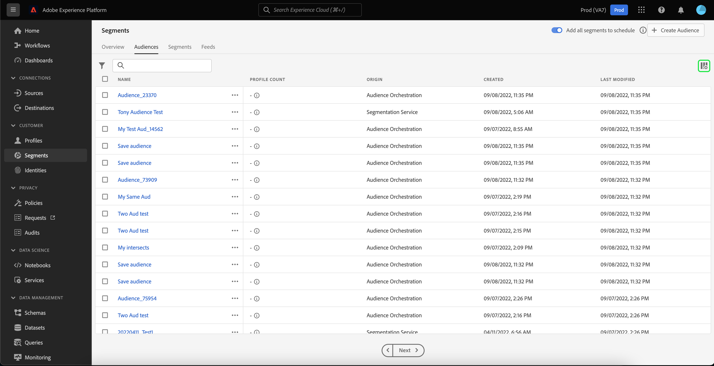
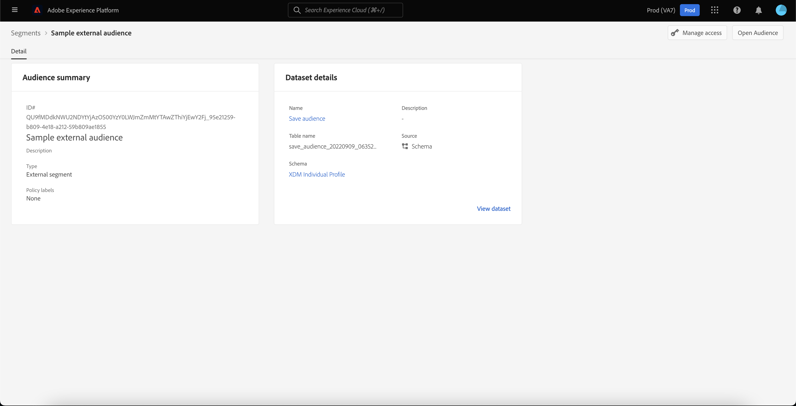

# Guía de la interfaz de usuario del servicio de segmentación

[!DNL Adobe Experience Platform Segmentation Service] proporciona una interfaz de usuario para crear y administrar definiciones de segmentos.

## Primeros pasos

Para trabajar con definiciones de segmentos es necesario comprender las distintas [!DNL Experience Platform] servicios relacionados con la segmentación. Antes de leer esta guía del usuario, consulte la documentación de los siguientes servicios:

- [[!DNL Segmentation Service]](../home.md): [!DNL Segmentation Service] permite dividir los datos almacenados en [!DNL Experience Platform] que se relaciona con individuos (como clientes, posibles clientes, usuarios u organizaciones) en grupos más pequeños.
- [[!DNL Real-time Customer Profile]](../../profile/home.md): Proporciona un perfil de cliente unificado y en tiempo real basado en datos agregados de varias fuentes.
- [[!DNL Adobe Experience Platform Identity Service]](../../identity-service/home.md): Permite la creación de perfiles de clientes al unir identidades de fuentes de datos dispares que se están incorporando en [!DNL Platform].
- [[!DNL Experience Data Model (XDM)]](../../xdm/home.md): El marco normalizado por el cual [!DNL Platform] organiza los datos de experiencia del cliente. Para utilizar mejor la segmentación, asegúrese de que los datos se incorporan como perfiles y eventos según el [prácticas recomendadas para el modelado de datos](../../xdm/schema/best-practices.md).

También es importante conocer dos términos clave que se utilizan en este documento y comprender la diferencia entre ellos:
- **Definición del segmento**: Conjunto de reglas utilizado para describir características o comportamientos clave de una audiencia objetivo.
- **Audiencia**: Conjunto resultante de perfiles que cumplen los criterios de una definición de segmento. Esto se puede crear mediante Adobe Experience Platform (audiencia generada por la plataforma) o desde una fuente externa (audiencia generada externamente).

## Información general

En la interfaz de usuario del Experience Platform, seleccione **[!UICONTROL Segmentos]** en el panel de navegación izquierdo para abrir **[!UICONTROL Información general]** que muestra la [!UICONTROL Segmentos] tablero.

>[!NOTE]
>
>Si su organización es nueva en Platform y aún no tiene conjuntos de datos de perfil activos o políticas de combinación creadas, se crea la variable [!UICONTROL Segmentos] tablero no está visible. En su lugar, la variable [!UICONTROL Información general] muestra vínculos y documentación para ayudarle a empezar con los segmentos.

### [!UICONTROL Segmentos] tablero {#segments-dashboard}

La variable **[!UICONTROL Segmentos]** tablero describe las métricas clave relacionadas con los datos de segmentos de su organización.

Para obtener más información, visite [guía del tablero de segmentos](../../dashboards/guides/segments.md).

## Examinar {#browse}

>[!CONTEXTUALHELP]
>id="platform_segments_browse_churncolumnname"
>title="Pérdida"
>abstract="La pérdida representa el porcentaje de perfiles que cambian dentro de una definición de segmento en comparación con la última vez que se ejecutó el trabajo de segmento."

>[!CONTEXTUALHELP]
>id="platform_segments_browse_evaluationmethodcolumnname"
>title="Método de evaluación"
>abstract="Los métodos de evaluación para segmentos incluyen el lote, la transmisión y el borde."

>[!CONTEXTUALHELP]
>id="platform_segments_browse_addallsegmentstoschedule"
>title="Añadir todos los segmentos a la programación"
>abstract="Habilite para incluir todos los segmentos de evaluación por lotes en la actualización diaria programada a las 3:30 PM UTC. Deshabilite para eliminar todos los segmentos de la actualización programada."

Seleccione el **[!UICONTROL Examinar]** para ver una lista de todas las definiciones de segmentos de su organización.

Esta vista muestra información sobre la definición del segmento, incluido el desglose, la pérdida, el recuento de perfiles, el método de evaluación, la fecha de creación y la fecha de la última modificación.

El desglose muestra un gráfico de barras que resume el porcentaje de perfiles que pertenecen a cada uno de los siguientes estados: [!UICONTROL Realizado], [!UICONTROL Existente]y [!UICONTROL Saliendo]. Además, el desglose mostrado en la variable [!UICONTROL Examinar] es el desglose más preciso del estado del segmento. Si este número difiere con el indicado en la variable [!UICONTROL Información general] , utilice los números de la pestaña [!UICONTROL Examinar] como la fuente de información correcta, ya que la variable [!UICONTROL Información general] los números de tabulación solo se actualizan una vez al día.

| Estado | Descripción |
| ------ | ----------- |
| Realizado | Un nuevo perfil dentro del segmento. |
| Existente | Un perfil existente que se ha mantenido dentro del segmento. |
| Saliendo | Un perfil existente que abandona el segmento. |

La pérdida representa el porcentaje de perfiles que cambian dentro de una definición de segmento en comparación con la última vez que se ejecutó el trabajo del segmento, mientras que el recuento de perfiles representa el número total de perfiles que califican para el segmento.

El método de evaluación puede ser flujo continuo, por lotes o edge. Los segmentos de transmisión se evalúan constantemente a medida que los datos entran en el sistema. Los segmentos por lotes se evalúan según una programación establecida. Los segmentos de Edge se evalúan en tiempo real, lo que permite casos de uso de personalización de la misma página y de la siguiente página.

En la parte superior de la página hay opciones para agregar todos los segmentos a una programación y para crear un nuevo segmento.

Alternar **[!UICONTROL Añadir todos los segmentos a la programación]** habilitará la segmentación programada. Puede encontrar más información sobre la segmentación programada en la [sección de segmentación programada de esta guía del usuario](#scheduled-segmentation).

Selección **[!UICONTROL Crear segmento]** le llevará al Generador de segmentos. Para obtener más información sobre la creación de segmentos, lea la sección sobre [creación de un segmento en la guía del usuario](#create-segment).

La barra lateral derecha contiene información sobre todos los segmentos dentro de la organización, con el número total de segmentos, la última fecha de evaluación, la siguiente fecha de evaluación, así como un desglose de los segmentos por método de evaluación.

Al seleccionar la fila de la definición del segmento, se proporciona un resumen de la definición del segmento, incluidas las opciones para editarlo o eliminarlo, activar el segmento en un destino, la audiencia cualificada para el segmento, el tamaño total de la audiencia, además del nombre, la descripción, el método de evaluación, la fecha de creación y la fecha de última modificación del segmento.

>[!NOTE]
>
> Usted **not** puede eliminar un segmento que se utilice en una activación de destino.

## Detalles de la definición del segmento {#segment-details}

Para ver más detalles sobre una definición de segmento específica, seleccione el nombre de un segmento dentro del **[!UICONTROL Examinar]** pestaña .

Aparecerá la página de detalles del segmento. En la parte superior, hay un resumen de la definición del segmento, información sobre el tamaño de audiencia cualificado, así como los destinos para los que se activa el segmento.

### Resumen de segmentos {#segment-summary}

La variable **[!UICONTROL Resumen de segmentos]** proporciona información como el ID, el nombre, la descripción y los detalles de los atributos.

Además, se le da la opción de activar el segmento en un destino o editar el segmento. Selección **[!UICONTROL Activar en destino]** le permitirá activar el segmento en un destino. Para obtener información más detallada sobre la activación de un segmento en un destino, lea la [información general sobre activación](../../destinations/ui/activation-overview.md).

Selección **[!UICONTROL Editar segmento]** le llevará a [!DNL Segment Builder]. Para obtener información más detallada sobre el uso de la variable [!DNL Segment Builder] espacio de trabajo, lea la [[!DNL Segment Builder] guía del usuario](./segment-builder.md).

### Audiencia total en el segmento

La variable **[!UICONTROL Audiencia total en el segmento]** muestra el número total de perfiles que cumplen los requisitos para el segmento.

Las estimaciones se generan utilizando un tamaño de muestra de los datos de muestra de ese día. Si hay menos de 1 millón de entidades en el almacén de perfiles, se utiliza el conjunto completo de datos; para entre 1 y 20 millones de entidades, se utilizan 1 millón de entidades; y para más de 20 millones de entidades, se utiliza el 5% del total de entidades. Encontrará más información sobre la generación de estimaciones de segmentos en la [sección de generación de estimaciones](../tutorials/create-a-segment.md#estimate-and-preview-an-audience) del tutorial de creación de segmentos.

### Destinos activados

La variable **[!UICONTROL Destinos activados]** muestra los destinos para los que se activa este segmento.

>[!NOTE]
>
> Los destinos son una función disponible con [!DNL Adobe Real-Time Customer Data Platform]y permiten exportar datos a plataformas externas. Para obtener más información sobre los destinos, lea la [información general sobre destinos](../../destinations/home.md). Para obtener información sobre cómo activar un segmento en un destino, consulte [información general sobre activación](../../destinations/ui/activation-overview.md).

### Ejemplos de perfil

Debajo hay una muestra de perfiles que cumplen los requisitos para el segmento, donde se detalla información, incluido el [!DNL Profile] ID, nombre, apellidos y correo electrónico personal.

La forma en que se activa el muestreo de datos depende del método de ingesta.

Para la ingesta por lotes, el almacén de perfiles se analiza automáticamente cada quince minutos para ver si se ha introducido correctamente un nuevo lote desde que se ejecutó el último trabajo de muestreo. Si ese es el caso, el almacén de perfiles se analiza posteriormente para ver si ha habido al menos un cambio del 5 % en el número de registros. Si se cumplen estas condiciones, se activa un nuevo trabajo de muestreo.

Para la transmisión por secuencias, el almacén de perfiles se analiza automáticamente cada hora para ver si ha habido al menos un cambio del 5 % en el número de registros. Si se cumple esta condición, se activa un nuevo trabajo de muestreo.

El tamaño de la muestra depende del número total de entidades en el almacén de perfiles. Estos tamaños de muestra se representan en la siguiente tabla:

| Entidades en el almacén de perfiles | Tamaño de la muestra |
| ------------------------- | ----------- |
| Menos de 1 millón | Conjunto de datos completo |
| de 1 a 20 millones | 1 millón |
| Más de 20 millones | 5 % del total |

Información más detallada sobre cada [!DNL Profile] se puede ver seleccionando la variable [!DNL Profile] ID. Para obtener más información sobre los detalles de un perfil, lea la [[!DNL Real-time Customer Profile] guía del usuario](../../profile/ui/user-guide.md#profile-detail).

## Creación de segmentos {#create-segment}

Selección **[!UICONTROL Crear segmento]** en la esquina superior derecha, se abre la variable [!DNL Segment Builder] espacio de trabajo, donde puede empezar a crear una definición de segmento.

### [!DNL Segment Builder] workspace

[!DNL Segment Builder] proporciona un espacio de trabajo enriquecido que le permite interactuar con [!DNL Profile] elementos de datos. El espacio de trabajo proporciona controles intuitivos para la creación y edición de reglas, como los mosaicos de arrastrar y soltar utilizados para representar propiedades de datos.

Para obtener información más detallada sobre el uso de la variable [!DNL Segment Builder] espacio de trabajo, lea la [[!DNL Segment Builder] guía del usuario](./segment-builder.md).

## Segmentación programada {#scheduled-segmentation}

Una vez creadas las definiciones de segmento, puede evaluarlas mediante una evaluación a petición o programada (continua). Evaluación significa mover [!DNL Real-time Customer Profile] a través de definiciones de segmentos para producir las audiencias correspondientes. Una vez creadas, las audiencias se guardan y almacenan para que se puedan exportar mediante [!DNL Experience Platform] API.

La evaluación bajo demanda implica el uso de la API para realizar evaluaciones y crear audiencias según sea necesario, mientras que la evaluación programada (también conocida como &quot;segmentación programada&quot;) le permite crear una programación recurrente para evaluar definiciones de segmentos en un momento específico (como máximo, una vez al día).

### Habilitar la segmentación programada {#enable-scheduled-segmentation}

La activación de las definiciones de segmentos para la evaluación programada se puede realizar mediante la interfaz de usuario o la API. En la interfaz de usuario, vuelva a la **[!UICONTROL Examinar]** dentro de **[!UICONTROL Segmentos]** y activar **[!UICONTROL Añadir todos los segmentos a la programación]**. Esto hará que todos los segmentos se evalúen según la programación establecida por su organización.

>[!NOTE]
>
>La evaluación programada puede habilitarse para entornos limitados con un máximo de cinco (5) directivas de combinación para [!DNL XDM Individual Profile]. Si su organización tiene más de cinco directivas de combinación para [!DNL XDM Individual Profile] en un entorno limitado, no se puede utilizar la evaluación programada.

Actualmente, las programaciones solo se pueden crear mediante la API . Para ver los pasos detallados sobre la creación, edición y trabajo con programaciones mediante la API, siga el tutorial para evaluar y acceder a los resultados del segmento, específicamente la sección sobre [evaluación programada mediante la API](../tutorials/evaluate-a-segment.md#scheduled-evaluation).

## Audiencias {#audiences}

>[!IMPORTANT]
>
>La funcionalidad de audiencias está actualmente en fase beta limitada y no está disponible para todos los usuarios. La documentación y las funciones están sujetas a cambios.

Seleccione el **[!UICONTROL Audiencias]** para ver una lista de todas las audiencias de su organización.

De forma predeterminada, esta vista muestra información sobre las audiencias, incluido el nombre, el recuento de perfiles, el origen, la fecha de creación y la fecha de la última modificación.

Puede seleccionar el  para cambiar qué campos se muestran.

Aparece una ventana emergente que enumera todos los campos que se pueden mostrar dentro de la tabla.

| Campo | Descripción |
| ----- | ----------- | 
| [!UICONTROL Nombre] | El nombre de la audiencia. |
| [!UICONTROL Recuento de perfiles] | El número total de perfiles que cumplen los requisitos para la audiencia. |
| [!UICONTROL Origen] | Origen de la audiencia. Si esta audiencia fue generada por Platform, tendrá un origen de Segmentation Service. |
| [!UICONTROL Estado del ciclo vital] | El estado de la audiencia. Los valores posibles de este campo incluyen `Draft`, `Published`y `Archived`. |
| [!UICONTROL Frecuencia de actualización] | Valor que indica la frecuencia con la que se actualizan los datos de la audiencia. Los valores posibles de este campo incluyen `On Demand`, `Scheduled`y `Continuous`. |
| [!UICONTROL Última actualización por] | El nombre de la persona que actualizó la audiencia por última vez. |
| [!UICONTROL Creado] | Hora y fecha de creación de la audiencia. |
| [!UICONTROL Última actualización] | Hora y fecha de la última creación de la audiencia. |
| [!UICONTROL Acceso a las etiquetas] | Las etiquetas de acceso para la audiencia. Las etiquetas de acceso le permiten categorizar conjuntos de datos y campos según las políticas de uso que se aplican a esos datos. Estas etiquetas se pueden aplicar en cualquier momento, lo que proporciona flexibilidad en la forma en que elige administrar los datos. Para obtener más información sobre las etiquetas de acceso, lea la documentación de [administración de etiquetas](../../access-control/abac/ui/labels.md). |

Puede seleccionar **[!UICONTROL Crear audiencia]** para crear una audiencia.

Aparece una ventana emergente que le permite elegir entre componer una audiencia o crear reglas.

Selección **[!UICONTROL Componer audiencias]** le lleva al Generador de audiencias. Para obtener más información sobre la creación de audiencias, lea la [Guía de Audience Builder](./audience-builder.md).

Selección **[!UICONTROL Generar regla]** le lleva al Generador de segmentos. Para obtener más información sobre la creación de segmentos, lea la [Guía del Generador de segmentos](./segment-builder.md)

## Detalles de la audiencia {#audience-details}

Para ver más detalles sobre una audiencia específica, seleccione el nombre de una audiencia dentro del [!UICONTROL Audiencias] pestaña .

Aparecerá la página de detalles de audiencia. Esta página difiere en los detalles en función de si la audiencia se generó con Adobe Experience Platform o desde una fuente externa como Audience Orchestration.

### Audiencia generada por la plataforma

Para obtener más información sobre las audiencias generadas por la plataforma, lea la [sección resumen del segmento](#segment-summary).

### Audiencia generada externamente

En la parte superior de la página de detalles de audiencia, hay un resumen de la audiencia y detalles sobre el conjunto de datos en el que se guarda la audiencia.

La variable **[!UICONTROL Resumen de audiencia]** proporciona información como el ID, el nombre, la descripción y los detalles de los atributos.

La variable **[!UICONTROL Detalles del conjunto de datos]** proporciona información como nombre, descripción, nombre de tabla, origen y esquema. Puede seleccionar **[!UICONTROL Ver conjunto de datos]** para ver más información sobre el conjunto de datos.

| Campo | Descripción |
| ----- | ----------- |
| [!UICONTROL Nombre] | El nombre del conjunto de datos. |
| [!UICONTROL Descripción] | Descripción del conjunto de datos. |
| [!UICONTROL Nombre de tabla] | El nombre de tabla del conjunto de datos. |
| [!UICONTROL Fuente] | Origen del conjunto de datos. Para audiencias generadas externamente, este valor es **Esquema**. |
| [!UICONTROL Esquema] | Tipo de esquema XDM al que corresponde el conjunto de datos. |

Para obtener más información sobre los conjuntos de datos, lea la [información general del conjunto de datos](../../catalog/datasets/overview.md).

## Segmentación por transmisión {#streaming-segmentation}

La segmentación por transmisión es la capacidad de realizar segmentación en [!DNL Platform] casi en tiempo real, mientras se centra en la riqueza de los datos. Con la segmentación de flujo continuo, la calificación de segmentos ahora se produce cuando los datos llegan a [!DNL Platform], aliviando la necesidad de programar y ejecutar trabajos de segmentación.

Puede encontrar más información sobre la segmentación de flujo en la sección [guía del usuario de segmentación por secuencias](./streaming-segmentation.md).

>[!NOTE]
>
>Para que la segmentación de flujo continuo funcione, debe habilitar la segmentación programada para la organización. Para obtener más información sobre la activación de la segmentación programada, consulte [la sección de segmentación de flujo continuo de esta guía del usuario](#scheduled-segmentation).

## Segmentación de Edge {#edge-segmentation}

La segmentación de Edge es la capacidad de evaluar segmentos en Platform instantáneamente en el perímetro, habilitando los casos de uso de personalización de la misma página y de la siguiente página.

Puede encontrar más información sobre la segmentación de aristas en la sección [guía de la interfaz de usuario de segmentación de Edge](./edge-segmentation.md)

## Violaciones de políticas

>[!NOTE]
>
>Las infracciones de directiva solo se aplican si está creando un segmento que se ha asignado a un destino.

Una vez que haya terminado de crear su segmento, el control de datos de Adobe Experience Platform analizará el segmento para asegurarse de que no haya infracciones de directiva dentro del segmento. Consulte la [Información general sobre la administración de datos](../../data-governance/home.md) para obtener más información.

## Pasos siguientes y recursos adicionales {#next-steps}

La variable [!DNL Segmentation Service] La interfaz de usuario proporciona un flujo de trabajo enriquecido que le permite aislar las audiencias comercializables de [!DNL Real-time Customer Profile] datos.

Para obtener más información sobre [!DNL Segmentation Service], continúe leyendo la documentación. Para aprender a usar la variable [!DNL Segmentation Service] API, lea la [[!DNL Segmentation Service] guía para desarrolladores](../api/overview.md).
