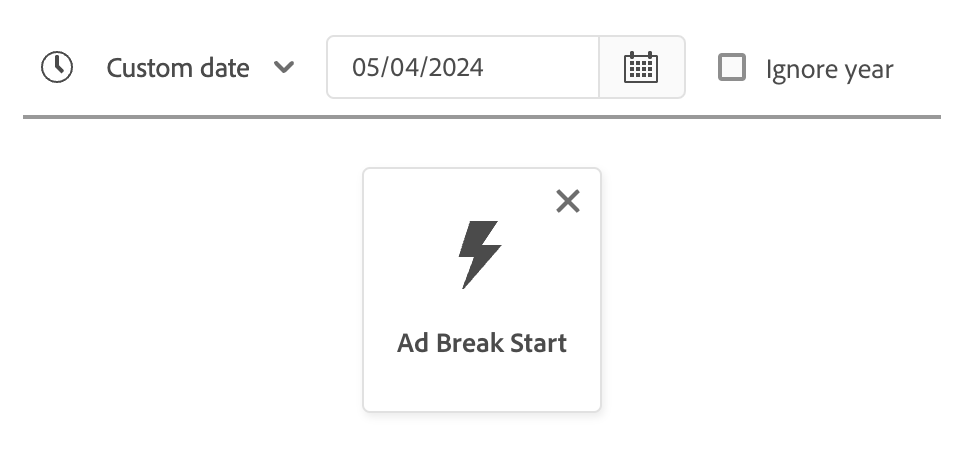
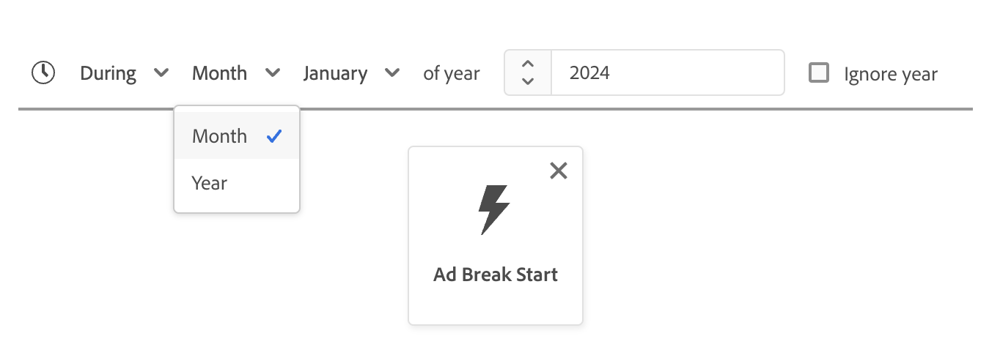
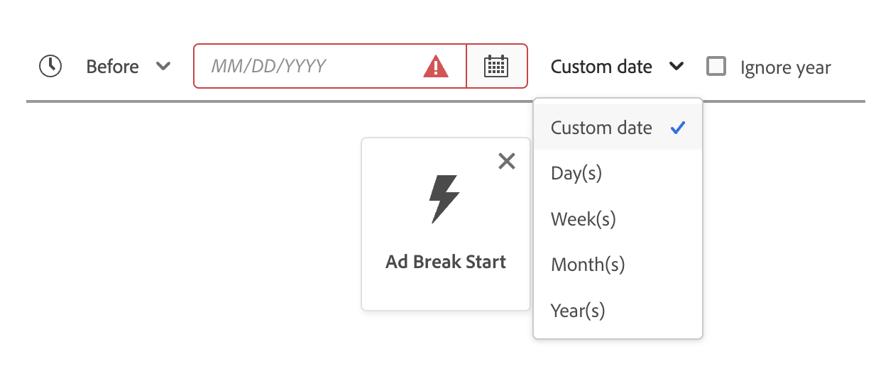
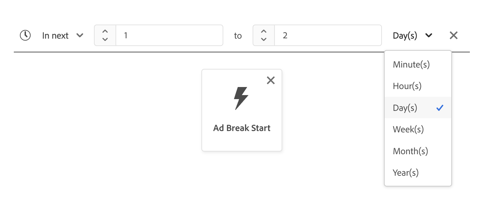

# Guía de la interfaz de usuario de [!DNL Segment Builder]

>[!NOTE]
>
>En esta guía se explica cómo crear audiencias a través de **definiciones de segmentos** mediante el Generador de segmentos. Para obtener información sobre cómo crear audiencias mediante la composición de audiencias, lea la [guía de la interfaz de usuario de la composición de audiencias](./audience-composition.md).

[!DNL Segment Builder] proporciona un espacio de trabajo enriquecido que le permite interactuar con [!DNL Profile] elementos de datos. El espacio de trabajo proporciona controles intuitivos para crear y editar reglas, como mosaicos de arrastrar y soltar utilizados para representar las propiedades de datos.

## Bloques de creación de definición de segmento {#building-blocks}

>[!CONTEXTUALHELP]
>id="platform_segments_createsegment_segmentbuilder_fields"
>title="Campos"
>abstract="Los tres tipos de campo que componen una definición de segmento son atributos, eventos y públicos. Los atributos permiten utilizar atributos de perfil que pertenecen a la clase de perfil XDM individual, los eventos permiten crear un público basado en acciones o eventos que tienen lugar mediante elementos de datos XDM ExperienceEvent y los públicos permiten utilizar públicos importados de fuentes externas."

>[!CONTEXTUALHELP]
>id="platform_segmentation_segmentbuilder_showfullxdmschema"
>title="Mostrar esquema XDM completo"
>abstract="De forma predeterminada, solo se muestran los campos que contienen datos. Habilite esta opción para mostrar todos los campos del esquema XDM."

>[!CONTEXTUALHELP]
>id="platform_segmentation_segmentbuilder_showdeprecatedfields"
>title="Mostrar campos obsoletos"
>abstract="De forma predeterminada, no se muestran los campos XDM obsoletos. Habilite esta opción para mostrar los campos XDM obsoletos."

Los componentes básicos de las definiciones de segmentos son los atributos y los eventos. Además, los atributos y eventos contenidos en las audiencias existentes pueden utilizarse como componentes para nuevas definiciones.

>[!CONTEXTUALHELP]
>id="platform_segments_createsegment_segmentbuilder_summarydata"
>title="Datos de resumen"
>abstract="Los datos de resumen solo aparecen para los atributos de perfil y <b>no</b> para los atributos de evento o de público.  Es posible que los datos de resumen de los atributos de perfil no aparezcan en las siguientes circunstancias: <ol><li>Algunos de los valores del atributo tienen más de 100 caracteres.</li><li>Hay más de 3000 valores únicos para el atributo.</li></ol>"

>[!NOTE]
>
>Si selecciona la burbuja de información de un atributo, puede ver la distribución de los valores del campo, también conocidos como datos de resumen. Estas son **solamente** disponibles en la ficha Atributos y no están disponibles para usarlas en la ficha Eventos o Audiencias.
>
>Los datos de resumen aparecerán si el atributo cumple los siguientes criterios: Todos los valores del atributo tienen 100 caracteres o menos y hay 3000 valores únicos o menos para el atributo.
>
>Sin embargo, un atributo **no** tendrá datos de resumen si son datos de varias entidades vinculadas al perfil a través de una relación. Por ejemplo, si tiene un esquema personalizado llamado `Vehicle`, las **propiedades** del esquema `Vehicle` **no** tendrán datos de resumen.

Puede ver estos componentes básicos en la sección **[!UICONTROL Fields]** a la izquierda del área de trabajo [!DNL Segment Builder]. **[!UICONTROL Fields]** contiene una ficha para cada uno de los componentes principales: &quot;[!UICONTROL Attributes]&quot;, &quot;[!UICONTROL Events]&quot; y &quot;[!UICONTROL Audiences]&quot;.

### Atributos

La ficha **[!UICONTROL Attributes]** le permite examinar [!DNL Profile] atributos que pertenecen a la clase [!DNL XDM Individual Profile]. Cada carpeta se puede expandir para mostrar atributos adicionales, donde cada atributo es un mosaico que se puede arrastrar al lienzo del generador de reglas en el centro del espacio de trabajo. El [lienzo del generador de reglas](#rule-builder-canvas) se analiza con más detalle más adelante en esta guía.

### Eventos

La pestaña **[!UICONTROL Events]** le permite crear una audiencia basada en eventos o acciones que se llevaron a cabo usando [!DNL XDM ExperienceEvent] elementos de datos. También puede encontrar Tipos de eventos en la ficha **[!UICONTROL Events]**, que son una colección de eventos de uso común que le permiten crear definiciones de segmentos más rápidamente.

Además de poder examinar [!DNL ExperienceEvent] elementos, también puede buscar tipos de eventos. Los tipos de eventos utilizan la misma lógica de codificación que [!DNL ExperienceEvents], sin que sea necesario buscar en la clase [!DNL XDM ExperienceEvent] en busca del evento correcto. Por ejemplo, si utiliza la barra de búsqueda para buscar &quot;carrito&quot;, se devolverán los tipos de evento &quot;[!UICONTROL AddCart]&quot; y &quot;[!UICONTROL RemoveCart]&quot;, que son dos acciones de carrito muy utilizadas al crear definiciones de segmento.

Es posible buscar cualquier tipo de componente escribiendo su nombre en la barra de búsqueda, que usa la [sintaxis de búsqueda de Lucene](https://docs.microsoft.com/en-us/azure/search/query-lucene-syntax). Los resultados de la búsqueda comienzan a rellenarse a medida que se introducen palabras completas. Por ejemplo, para generar una regla basada en el campo XDM `ExperienceEvent.commerce.productViews`, empiece a escribir &quot;vistas de producto&quot; en el campo de búsqueda. Una vez escrita la palabra &quot;product&quot;, los resultados de la búsqueda empiezan a aparecer. Cada resultado incluye la jerarquía de objetos a la que pertenece.

>[!NOTE]
>
>Los campos de esquema personalizados definidos por su organización pueden tardar hasta 24 horas en aparecer y estar disponibles para su uso en la creación de reglas.

A continuación, puede arrastrar y soltar fácilmente [!DNL ExperienceEvents] y &quot;[!UICONTROL Event Types]&quot; en su definición de segmento.

De forma predeterminada, solo se muestran los campos de esquema rellenados del almacén de datos. Esto incluye &quot;[!UICONTROL Event Types]&quot;. Si la lista &quot;[!UICONTROL Event Types]&quot; no está visible o solo puede seleccionar &quot;[!UICONTROL Any]&quot; como &quot;[!UICONTROL Event Type]&quot;, seleccione el **icono de engranaje** junto a **[!UICONTROL Fields]** y, a continuación, seleccione **[!UICONTROL Show full XDM schema]** bajo **[!UICONTROL Available Fields]**. Vuelva a seleccionar el **icono de engranaje** para regresar a la ficha **[!UICONTROL Fields]** y debería poder ver varios &quot;[!UICONTROL Event Types]&quot; y campos de esquema, independientemente de si contienen datos o no.

#### Conjuntos de datos de grupos de informes Adobe Analytics

Puede utilizar datos de uno o varios grupos de informes de Adobe Analytics como eventos dentro de la segmentación.

Cuando se utilizan datos de un único grupo de informes Analytics, Experience Platform agregará automáticamente descriptores y nombres descriptivos a las eVars, lo que facilitará la búsqueda de esos campos en [!DNL Segment Builder].

Cuando se utilizan datos de varios grupos de informes de Analytics, no Experience Platform **pueden** agregar automáticamente descriptores ni nombres descriptivos a las eVars. En consecuencia, antes de utilizar los datos de Analytics grupos de informes, debe asignarlos a campos XDM. Encontrará más información sobre la asignación de variables de Analytics a XDM en el guía de conexión de [origen Adobe Analytics](../../sources/tutorials/ui/create/adobe-applications/analytics.md#mapping).

Por ejemplo, imagine una situación en la que tuviera dos grupos de informes con las siguientes variables:

| Campo | Esquema A del grupo de informes | Esquema B del grupo de informes |
| ----- | --------------------- | --------------------- |
| EVAR1 | Dominio de referencia | Sesión iniciada en S/N |
| EVAR2 | Nombre de página | ID de fidelización de miembro |
| EVAR3 | URL | Nombre de página |
| EVAR4 | Términos de búsqueda | Nombre del producto |
| event1 | Clics | Page Views |
| event2 | Page Views | Adiciones al carro de compras |
| event3 | Adiciones al carro | Cierres de compra |
| event4 | Compras | Compras |

En este caso, puede asignar los dos grupos de informes con el esquema siguiente:

>[!NOTE]
>
>Aunque los valores genéricos de eVar aún se rellenan, **no** debería usarlos en sus definiciones de segmento (si es posible), ya que los valores podrían significar cosas diferentes a las que originalmente tenían en sus informes.

Una vez asignados los grupos de informes, puede utilizar estos campos recién asignados dentro de la segmentación y los flujos de trabajo relacionados con el perfil.

| Escenario | Experiencia del esquema de unión | Variable genérica de segmentación | Variable asignada de segmentación |
| -------- | ----------------------- | ----------------------------- | ---------------------------- |
| Grupo de informes único | El descriptor de nombre descriptivo se incluye con variables genéricas.   **Ejemplo:** Nombre de página (eVar2) | <ul><li>Descriptor de nombre descriptivo incluido con variables genéricas</li><li>Las consultas utilizan datos del conjunto de datos específico, ya que es el único</li></ul> | Las consultas pueden utilizar datos de Adobe Analytics y potencialmente otras fuentes. |
| Varios grupos de informes | No se incluyen descriptores de nombres descriptivos con las variables genéricas.   **Ejemplo:** eVar2 | <ul><li>Cualquier campo con varios descriptores aparece como genérico. Esto significa que no aparecen nombres descriptivos en la interfaz de usuario.</li><li>Las consultas pueden utilizar datos de cualquier conjunto de datos que contenga eVar, lo que puede dar como resultado resultados mixtos o incorrectos.</li></ul> | Las consultas utilizan resultados correctamente combinados de varios conjuntos de datos. |

### Públicos

>[!CONTEXTUALHELP]
>id="platform_segmentation_segmentBuilder_b2b_decomposition"
>title="Evaluación compleja"
>abstract="La siguiente expresión es demasiado complicada para expresarse como un solo público. Para utilizar reglas B2B y eventos basados en personas en la misma definición de segmento, siga los pasos a continuación.<ol><li>Cree una definición de segmento que solo haga referencia a los eventos basados en personas y guárdela como su propia definición de segmento.</li><li>En una definición de segmento nueva, importe la definición de segmento creada anteriormente mientras hace referencia a las reglas B2B.</li></ol>"

>[!CONTEXTUALHELP]
>id="platform_segmentation_segmentbuilder_externalaudiences"
>title="Públicos externos"
>abstract="Los públicos importados a través de la pestaña Públicos ahora aparecen automáticamente en Audience Portal. Esto incluye públicos introducidos desde Audience Manager, Customer Journey Analytics, Coincidencia de segmentos y otras integraciones personalizadas.  A finales de septiembre de 2025, los públicos se recuperarán exclusivamente mediante la búsqueda unificada y ya no se admitirá el flujo de trabajo anterior. La coincidencia de segmentos permanece disponible solo para un pequeño número de clientes designados mientras realizamos la transición del servicio. El acceso para los nuevos clientes de Coincidencia de segmentos aún se puede habilitar a petición antes de que el servicio se haya retirado por completo.  En los casos de uso de colaboración de datos en curso, Adobe recomienda pasar a Collaboration, que es la solución compatible a largo plazo."
>additional-url="https://experienceleague.adobe.com/es/docs/experience-platform/segmentation/ui/audience-portal#list" text="Portal de públicos"

>[!NOTE]
>
>Para las audiencias creadas dentro de Experience Platform, solo se mostrarán las audiencias que tengan el **mismo** directiva de combinación.

El **[!UICONTROL Audiences]** pestaña enumera todas las audiencias importadas de fuentes externas, como Adobe Audience Manager o Customer Journey Analytics, así como las audiencias creadas dentro [!DNL Experience Platform]de .

En la ficha **[!UICONTROL Audiences]**, puede ver todos los orígenes disponibles como un grupo de carpetas. A medida que selecciona las carpetas, se pueden ver las subcarpetas y audiencias disponibles. Además, puede seleccionar el icono de carpeta (como se muestra en la imagen de la derecha) para ver la estructura de carpetas (una marca de verificación indica la carpeta en la que se encuentra actualmente) y volver a navegar fácilmente por las carpetas seleccionando el nombre de una carpeta en el árbol.

Puede situarse sobre el ⓘ situado junto a una audiencia para ver información sobre la audiencia, incluido su ID, descripción y la jerarquía de carpetas para localizar la audiencia.

## Lienzo del generador de reglas {#rule-builder-canvas}

>[!IMPORTANT]
>
>A partir de la versión de junio de 2024, las restricciones de tiempo &quot;Este mes&quot; y &quot;Este año&quot; representan &quot;mes hasta la fecha&quot; y &quot;año hasta la fecha&quot; respectivamente. Por ejemplo, si crea una audiencia el 18 de julio buscando &quot;todos los clientes cuyo cumpleaños se celebra este mes&quot;, la audiencia obtendrá todos los clientes cuyo cumpleaños se produzca del 1 al 31 de julio. El 1 de agosto, esta audiencia recibirá todos los clientes cuyo cumpleaños se celebre del 1 al 31 de agosto.
>
>Anteriormente, &quot;Este mes&quot; y &quot;este año&quot; representaban 30 días y 365 días respectivamente, que no tenían en cuenta los meses con 31 días y años bisiestos.
>
>Para actualizar la lógica de sus audiencias, vuelva a guardar las audiencias creadas anteriormente.

Una definición de segmento es un conjunto de reglas que se utilizan para describir las características clave o el comportamiento de una audiencia objetivo. Estas reglas se crean mediante el lienzo del generador de reglas, ubicado en el centro de [!DNL Segment Builder].

Para agregar una regla nueva a su definición de segmento, arrastre un mosaico desde la pestaña **[!UICONTROL Fields]** y suéltelo en el lienzo del generador de reglas. A continuación, se le presentarán opciones específicas del contexto según el tipo de datos que se agregue. Los tipos de datos disponibles incluyen: cadenas, fechas, [!DNL ExperienceEvents], &quot;[!UICONTROL Event Types]&quot; y audiencias.

>[!IMPORTANT]
>
>Los cambios más recientes en Adobe Experience Platform han actualizado el uso de los operadores lógicos `OR` y `AND` entre eventos. Estas actualizaciones no afectarán a las definiciones de segmentos existentes. Sin embargo, estas modificaciones afectarán a todas las actualizaciones posteriores de las definiciones de segmentos existentes y de las definiciones de segmentos recién creadas. Lea [actualización de constantes de tiempo](./segment-refactoring.md) para obtener más información.

Al seleccionar un valor para el atributo, verá una lista de valores de enumeración que el atributo puede ser.

Si selecciona un valor de esta lista de enumeraciones, el valor se delineará con un borde sólido. Sin embargo, para los campos que utilizan `meta:enum` enumeraciones (suaves), también puede seleccionar un valor que no **sea** del lista de enumeraciones. Si crea su propio valor, se delineará con un borde punteado, junto con una advertencia de que este valor no está en el lista de enumeración.

Si está creando varios valores, puede añadirlos todos a la vez mediante la carga masiva. Seleccione el  para mostrar la ventana emergente **[!UICONTROL Add values in bulk]**.

En la ventana emergente **[!UICONTROL Add values in bulk]**, puede cargar un archivo CSV o TSV.

También puede agregar manualmente valores separados por comas.

Tenga en cuenta que se permite un máximo de 250 valores. Si supera esta cantidad, deberá eliminar algunos valores antes de agregar más.

### Adición de públicos

>[!CONTEXTUALHELP]
>id="platform_segmentation_segmentbuilder_addaudiences"
>title="Buscar actualizaciones"
>abstract="El sistema de búsqueda existente se ha actualizado para utilizar la búsqueda unificada. Búsqueda unificada le permite buscar en sus públicos de forma más sencilla y sólida el abono al segmento."

Puede arrastrar y soltar un audiencia desde el **[!UICONTROL Audience]** pestaña al lienzo del generador de regla para hacer referencia a audiencia abono de la nueva definición de segmento. Esto permite incluir o excluir audiencia abono como atributo en las nuevas reglas de definición de segmento.

Para [!DNL Experience Platform] las audiencias creadas con [!DNL Segment Builder], se ofrece la opción de convertir el audiencia en el conjunto de reglas que se usaron en la definición de segmento para ese audiencia. Este Conversión hace una copia de la lógica regla, que luego se puede modificar sin afectar la definición del segmento original. Asegúrese de haber guardado los cambios recientes realizados en la definición de la segmento antes de convertirla a regla lógica.

>[!NOTE]
>
>Al agregar un audiencia de un origen externo, solo se hace referencia al abono de audiencia. No se puede convertir el audiencia a reglas y, por lo tanto, las reglas utilizadas para crear el audiencia original no se pueden modificar en la nueva definición segmento.

Si surge algún conflicto al convertir audiencias en reglas, [!DNL Segment Builder] intentará conservar las opciones existentes lo mejor que pueda.

### Vista de código

También puede ver una versión basada en código de una regla creada en [!DNL Segment Builder]. Una vez que haya creado su regla dentro del lienzo del generador de regla, puede seleccionar **[!UICONTROL Code view]** ver su definición de segmento como PQL.

La vista de código proporciona un botón que le permite copiar el valor de la definición del segmento para utilizarlo en las llamadas de API. Para obtener la última versión de la definición del segmento, asegúrese de haber guardado los cambios más recientes en la definición del segmento.

### Funciones de agregación

Una agregación en [!DNL Segment Builder] es un cálculo en un grupo de atributos XDM cuyo tipo de datos es un número (doble o entero). Las cuatro funciones de agregación compatibles con el Generador de segmentos son SUMA, PROMEDIO, MÍN y MAX.

Para crear una función de agregación, seleccione un evento del carril izquierdo e insértelo en el contenedor [!UICONTROL Events].

Después de colocar el evento dentro del contenedor de eventos, seleccione el icono de puntos suspensivos (...), seguido de **[!UICONTROL Aggregate]**.

Ahora se agrega la agregación. Ahora puede seleccionar la función de agregación, elegir qué atributo agregar, la función de igualdad y el valor. Para el ejemplo siguiente, esta definición de segmento calificaría a cualquier perfil que tenga una suma de valores comprados superior a $100, igualado si cada compra individual es inferior a $100.

### Funciones de recuento {#count-functions}

Las funciones de recuento del Generador de segmentos se utilizan para buscar eventos específicos y contar el número de veces que se realizan. Las funciones de recuento admitidas en el Generador de segmentos son &quot;Al menos&quot;, &quot;Como máximo&quot;, &quot;Exactamente&quot;, &quot;Entre &quot; y &quot;Todo&quot;.

Para crear una función de recuento, seleccione un evento del carril izquierdo e insértelo en el contenedor [!UICONTROL Events].

Después de colocar el evento dentro del contenedor de eventos, seleccione el botón [!UICONTROL At least 1].

Ahora se agrega la función de recuento. Ahora puede seleccionar la función de recuento y el valor de la función. El ejemplo siguiente sería incluir cualquier evento que tenga al menos un clic.

### Restricciones de tiempo {#time-constraints}

Las restricciones de tiempo permiten aplicar restricciones de tiempo en atributos, eventos y la secuencia basada en tiempo entre los eventos.

>[!IMPORTANT]
>
>Si ha creado una definición de segmento con las restricciones temporales de &quot;Este mes&quot; o &quot;Este año&quot; anteriores a junio de 2024, deberá volver a guardar las definiciones de segmento. Antes de junio de 2024, &quot;Este mes&quot; estaba basado en 30 días y &quot;Este año&quot; estaba basado en 365 días.

>[!NOTE]
>
>Tanto la restricción de tiempo de año [omitir](./ignore-year.md) como las [restricciones de tiempo de nivel de regla](./segment-refactoring.md) se refactorizaron anteriormente, con más información disponible en las descripciones generales vinculadas.

La lista de restricciones de tiempo disponibles es la siguiente:

+++ Restricciones de tiempo disponibles

>[!NOTE]
>
>Todas las restricciones temporales se basan en UTC.
>
>Además, si la casilla de verificación [!UICONTROL Ignore year] está habilitada, el año **no** se comparará como parte de la evaluación de la definición del segmento.

| Restricción de tiempo | Descripción | Se puede habilitar Ignorar año | Ejemplo |
| --------------- | ----------- | ------------------- | ------- |
| Hoy | El atributo o evento que se compara **debe** ocurrir hoy. | Sí | {width="100" zoomable="yes"} |
| Ayer | El atributo o evento que se está comparando **debe** producirse ayer. | Sí | {width="100" zoomable="yes"} |
| Este mes | El atributo o evento que se está comparando **debe** producirse este mes del calendario. | Sí | {width="100" zoomable="yes"} |
| Este año | El atributo o evento que se está comparando **debe** producirse este año natural. | No | {width="100" zoomable="yes"} |
| Fecha personalizada | El atributo o evento que se compara **debe** aparecer en la fecha proporcionada. | Sí | {width="100" zoomable="yes"} |
| En los últimos | El atributo o evento que se está comparando **debe** producirse en el último período de tiempo elegido. Este período de tiempo es **inclusive** hasta el momento de la evaluación. | No | {width="100" zoomable="yes"} |
| Desde (hasta) | El atributo o evento que se compara **debe** producirse en las dos fechas de calendario elegidas. Este período de tiempo es **inclusive** de ambas fechas. | Sí, si es una fecha personalizada | {width="100" zoomable="yes"} |
| Durante | El atributo o evento que se está comparando **debe** producirse dentro del mes o año seleccionado. Si selecciona un mes, debe elegir tanto el mes como el año en que tuvo lugar el atributo o la evento.  Si se selecciona un año, solo se debe elegir el año en el que se produjo el atributo o evento. Si selecciona un mes, también puede activar la casilla de verificación [!UICONTROL Ignore year]. | Sí | {width="100" zoomable="yes"} |
| Dentro (+/-) | El atributo o evento que se compara **deben** producirse en un plazo de días, semanas, meses o años después de la fecha seleccionada. Este período de tiempo es **inclusive** de ambas fechas. La fecha seleccionada puede ser hoy, ayer u otra fecha personalizada de su elección. | Sí | {width="100" zoomable="yes"} |
| Antes | El atributo o evento que se compara **debe** aparecer antes de la fecha seleccionada. La fecha seleccionada puede ser una fecha personalizada de su elección o una selección de hace días, semanas, meses o años. | Sí | {width="100" zoomable="yes"} |
| Después | El atributo o evento que se está comparando **debe** producirse después de la fecha seleccionada. La fecha seleccionada puede ser una fecha personalizada de su elección o una selección de hace días, semanas, meses o años. | Sí | {width="100" zoomable="yes"} |
| Rango móvil | El atributo o evento que se compara debe producirse entre las dos fechas relativas. Las fechas se pueden representar en segundos, minutos, horas, días, semanas, meses o años. | No | {width="100" zoomable="yes"} |
| En el siguiente | El atributo o evento que se compara debe producirse en el siguiente período de tiempo seleccionado. Los períodos de tiempo seleccionados incluyen minutos, horas, días, semanas, meses y años. | No | {width="100" zoomable="yes"} |
| Existe | El atributo existe. | No | {width="100" zoomable="yes"} |
| No existe | El atributo no existe. | No | {width="100" zoomable="yes"} |

+++

Cuando se aplica una restricción de tiempo a un evento, se puede aplicar en el nivel de lienzo, en el nivel de tarjeta o entre eventos.

#### Restricción de nivel de lienzo

Para aplicar una restricción temporal a nivel de lienzo, seleccione el icono de reloj que aparece encima de la cronología de los eventos.

Cuando se aplica una restricción de tiempo en el nivel de lienzo, se aplica la restricción de tiempo a **todos** los eventos de la audiencia.

#### Restricción de nivel de tarjeta

Para aplicar una restricción de nivel de tarjeta, seleccione la tarjeta en la que desee aplicar la restricción de tiempo, seguida del icono de puntos suspensivos y **[!UICONTROL Apply time rule]**. Esto le permite seleccionar una restricción de tiempo dentro del contenedor **[!UICONTROL Event Rules]**.

Cuando aplica una restricción de tiempo en el nivel de tarjeta, se aplica la restricción de tiempo en el evento **specified** en la audiencia.

#### Restricción entre eventos

Para aplicar una restricción de tiempo entre eventos, seleccione el icono de reloj entre los dos eventos a los que desee aplicar la restricción de tiempo.

Cuando se aplica una restricción de tiempo entre los evento, esta aplica la restricción de tiempo al tiempo **entre** los eventos.

El lista de las limitaciones de tiempo disponibles para esta operación difiere del lista principal de las restricciones de tiempo y son las siguientes:

+++ Restricciones de tiempo disponibles

| Restricción de tiempo | Descripción |
| --------------- | ----------- |
| Después | Este último evento **debe** como mínimo después del evento anterior. |
| En | Los dos eventos **deben** tener lugar durante el período de tiempo indicado dentro de la restricción de tiempo. |

>[!NOTE]
>
>Al utilizar la restricción de tiempo &quot;Después&quot;, el último evento puede tener lugar durante más tiempo que el indicado en la restricción de tiempo. >
>Por ejemplo, si tiene un evento de Vista de página y un evento de Cierre de compra y pone la restricción de tiempo &quot;Después de 1 hora&quot; entre estos dos eventos, se activaría una definición de segmento con un evento de Cierre de compra 2 horas después del evento de Vista de página.
>
>Además, estas dos restricciones de tiempo se pueden utilizar en coordinación entre sí.
>
>Por ejemplo, si tiene un evento de Vista de página y un evento de Cierre de compra y pone las restricciones de tiempo &quot;Después de 1 hora&quot; y &quot;En un plazo de 24 horas&quot;, se clasificaría una definición de segmento con un evento de Cierre de compra 12 horas después del evento de Vista de página, pero no una definición de segmento con un evento de Cierre de compra 36 horas después del evento de Vista de página.

+++

## Contenedores {#containers}

Las reglas de segmentos se evalúan en el orden en que aparecen en la lista. Los contenedores permiten controlar el orden de ejecución mediante el uso de consultas anidadas.

Una vez que haya agregado al menos un mosaico al lienzo del generador de reglas, puede empezar a agregar contenedores. Para crear un nuevo contenedor, seleccione los puntos suspensivos (...) en la esquina superior derecha del mosaico y, a continuación, seleccione **[!UICONTROL Add container]**.

Aparece un nuevo contenedor como secundario del primer contenedor, pero puede ajustar la jerarquía arrastrando y moviendo los contenedores. El comportamiento predeterminado de una contenedor es &quot;[!UICONTROL Include]&quot; el atributo, el evento o el audiencia proporcionados. Puede establecer el regla en perfiles &quot;[!UICONTROL Exclude]&quot; que coincidan con los criterios de contenedor seleccionando **[!UICONTROL Include]** en la esquina superior izquierda del mosaico y seleccionando &quot;[!UICONTROL Exclude]&quot;.

También se puede extraer una contenedor secundaria y agregarla en línea a la contenedor principal seleccionando &quot;desenvolver contenedor&quot; en la contenedor secundaria. Seleccione los puntos suspensivos (...) en la esquina superior derecha del contenedor secundario para acceder a esta opción.

Una vez que seleccione **[!UICONTROL Unwrap container]** el contenedor secundario se elimina y los criterios aparecen en línea.

>[!NOTE]
>
>Al desajustar contenedores, tenga cuidado de que la lógica siga cumpliendo con la definición de segmento deseada.

## Combinar políticas

>[!CONTEXTUALHELP]
>id="platform_segmentation_createSegment_segmentBuilder_mergePolicies"
>title="Combinar políticas"
>abstract="La política de combinación permiten la combinación de diferentes conjuntos de datos para formar su perfil. Experience Platform ha proporcionado una política de combinación predeterminada o también puede crear una nueva política de combinación predeterminada en Perfiles. Elija una política de combinación que coincida con su propósito de marketing para este público."

[!DNL Experience Platform] le permite reunir datos de varios orígenes y combinarlos para ver una vista completa de cada uno de sus clientes individuales. Al unir estos datos, las políticas de combinación son las reglas que [!DNL Experience Platform] usa para determinar cómo se priorizarán los datos y qué datos se combinarán para crear un perfil.

Puede seleccionar una política de combinación que coincida con su propósito de marketing para esta audiencia o usar la política de combinación predeterminada proporcionada por [!DNL Experience Platform]. Puede crear varias políticas de combinación exclusivas de su organización, incluida la creación de su propia política de combinación predeterminada. Para obtener instrucciones paso a paso sobre cómo crear directivas de combinación para su organización, comience por leer la [descripción general de las directivas de combinación](../../profile/merge-policies/overview.md).

Para seleccionar una política de combinación para su definición de segmento, seleccione el icono de engranaje en la pestaña **[!UICONTROL Fields]** y, a continuación, utilice el menú desplegable **[!UICONTROL Merge Policy]** para seleccionar la política de combinación que desee utilizar.

## Propiedades de público {#audience-properties}

>[!CONTEXTUALHELP]
>id="platform_segments_createsegment_segmentbuilder_segmentproperties"
>title="Propiedades de público"
>abstract="La sección Propiedades del público muestra una estimación del tamaño del público resultante, y también el número de perfiles cualificados en comparación con el número total de perfiles. Esto le permite ajustar el público según sea necesario antes de crear el propio público."

>[!CONTEXTUALHELP]
>id="platform_segments_createsegment_segmentbuilder_refreshestimate"
>title="Actualizar estimaciones"
>abstract="Puede actualizar las estimaciones de la definición del segmento para ver inmediatamente una previsualización de cuántos perfiles cumplen los requisitos para la definición de segmento propuesta. Las estimaciones de público se generan utilizando un tamaño de muestra de los datos de muestra de ese día."
>additional-url="https://experienceleague.adobe.com/docs/experience-platform/segmentation/tutorials/create-a-segment.html?lang=es#estimate-and-preview-an-audience" text="Calcular y previsualizar un público"

>[!CONTEXTUALHELP]
>id="platform_segments_createsegment_segmentbuilder_qualifiedprofiles"
>title="Perfiles cualificados"
>abstract="Los perfiles cualificados indican el número real de perfiles que coinciden con las reglas del público. Este número se actualiza cada 24 horas, después de que se haya ejecutado el trabajo de evaluación de segmentos."

>[!CONTEXTUALHELP]
>id="platform_segments_createsegment_segmentbuilder_estimatedprofiles"
>title="Perfiles estimados"
>abstract="La estimación de perfiles indica un número aproximado de estos, en función del trabajo de muestra, que cumplirían los requisitos para las reglas del público."

Al crear una definición de segmento, la sección **[!UICONTROL Audience properties]** en el lado derecho del espacio de trabajo muestra una estimación del tamaño de la definición de segmento resultante, que le permite ajustar la definición de segmento según sea necesario antes de crear la propia audiencia.

**[!UICONTROL Qualified Profiles]** indica el número **actual** de perfiles que coinciden con las reglas de la definición del segmento. Este número se actualiza cada 24 horas, después de que se haya ejecutado el trabajo de evaluación de segmentos.

La marca de tiempo de los perfiles cualificados indica el trabajo de evaluación de segmentos **por lotes** más reciente y se muestra **no** para las definiciones de segmentos evaluadas mediante streaming o segmentación de Edge. Si edita la definición del segmento, el número de perfiles cualificados seguirá siendo el mismo hasta que se ejecute el siguiente trabajo de evaluación de segmentos.

**[!UICONTROL Estimated Profiles]** indica un **intervalo aproximado** de perfiles, basado en el **trabajo de ejemplo**. Esto significa que los datos de muestra se proyectan en el conjunto de perfiles más grande, lo que se traduce en un número estimado que puede diferir del número real de perfiles cualificados. La muestra de perfil estimada tiene un intervalo de confianza del 95 %.

Cuando realice cambios en las reglas de la audiencia, puede seleccionar el botón **[!UICONTROL Refresh estimate]** para ver un recuento actualizado de los perfiles estimados. Sin embargo, este número sigue estando basado en el trabajo de muestra anterior. El trabajo de muestra se actualiza cuando hay un cambio mayor del 3 % en los datos del cliente o cuando el último trabajo de muestra tiene más de tres días.

Al seleccionar la burbuja de información, se indica la fecha y la hora en que se ejecutó el último trabajo de muestra.

Esta **[!UICONTROL Audience properties]** sección también es donde puede especificar información importante sobre su audiencia, incluido su nombre, descripción y tipo de evaluación. Los nombres se utilizan para identificar su definición de segmento entre los definidos por su organización y, por lo tanto, deben ser descriptivos, concisos y únicos.

A medida que vaya versión el audiencia, podrá vista un previsualización paginado del audiencia seleccionando **[!UICONTROL View Profiles]**.

>[!NOTE]
>
>Las estimaciones de audiencia se generan utilizando un tamaño de muestra de los datos de muestra de ese día. Si hay menos de 1 millón de entidades en el almacén de perfiles, se utiliza el conjunto de datos completo; para entre 1 y 20 millones de entidades, se utiliza 1 millón de entidades; y para más de 20 millones de entidades, se utiliza el 5% del total de entidades.
>
>Además, esta estimación se basa en el momento en que se ejecutó el último trabajo de muestra de perfil. Esto significa que si está utilizando una función de fecha relativa como &quot;Hoy&quot; o &quot;Esta semana&quot;, la estimación basará sus cálculos en el último tiempo de ejecución de la muestra de perfil. Por ejemplo, si hoy es 24 de enero y el último trabajo de muestra de perfil se ejecutó el 22 de enero, la función de fecha relativa &quot;Ayer&quot; se basará en el 21 de enero y no en el 23 de enero.
>
>Encontrará más información sobre la generación de estimaciones para las definiciones de segmentos en la [sección de generación de estimaciones](../tutorials/create-a-segment.md#estimate-and-preview-an-audience) del tutorial de creación de definiciones de segmentos.

También puede seleccionar el método de evaluación. Si sabe qué método de evaluación desea utilizar, puede seleccionarlo mediante la lista desplegable. Si desea saber para qué tipos de evaluación se califica esta definición de segmento, puede seleccionar el icono de examinar  para ver una lista de los métodos de evaluación de definición de segmento disponibles.

Aparece la ventana emergente [!UICONTROL Evaluation method eligibility]. Esta ventana emergente muestra los métodos de evaluación disponibles, que son por lotes, flujo continuo y Edge. La ventana emergente muestra qué métodos de evaluación son elegibles e inelegibles. Según los parámetros que haya utilizado en la definición del segmento, es posible que no cumpla los requisitos para determinados métodos de evaluación. Para obtener más información sobre los requisitos de cada método de evaluación, lea la [segmentación por transmisión](../methods/streaming-segmentation.md#query-types) o las descripciones generales de [segmentación por perímetros](../methods/edge-segmentation.md#query-types).

También puede cambiar el método de evaluación de la definición del segmento una vez que haya terminado de crearla. Si cambia el método de evaluación de Edge o de Transmisión por lotes, **no** podrá cambiarlo de nuevo a Edge o Transmisión por lotes. El cambio en el método de evaluación **solo** surtirá efecto una vez que seleccione **[!UICONTROL Save]** en la ventana emergente. La cancelación del cuadro de diálogo mantendrá **** el método de evaluación original.

Si selecciona un método de evaluación no válido, se le pedirá que cambie las reglas de definición del segmento o que cambie el método de evaluación.

Puede encontrar más información sobre los diferentes métodos de evaluación de definiciones de segmento en la descripción general[ segmentación](../home.md#evaluate-segments).

## Próximos pasos {#next-steps}

El Generador de segmentos proporciona una flujo de trabajo enriquecida que le permite aislar las audiencias comercializables de [!DNL Real-Time Customer Profile] los datos. Después de leer este guía ahora debería ser capaz de:

- Cree definiciones de segmentos utilizando una combinación de atributos, eventos y audiencias existentes como componentes básicos.
- Utilice el lienzo y los contenedores del generador de reglas para controlar el orden en que se ejecutan las reglas de segmentos.
- Vea estimaciones de su audiencia potencial, lo que le permite ajustar sus definiciones de segmento según sea necesario.
- Habilite todas las definiciones de segmentos para la segmentación programada.
- Habilite las definiciones de segmento especificadas para el flujo continuo segmentación.

Para obtener más información acerca de [!DNL Segmentation Service], siga leyendo la documentación y complemente su aprendizaje viendo los vídeos relacionados. Para obtener más información acerca de las otras partes de la interfaz de usuario de [!DNL Segmentation Service], lea la [[!DNL Segmentation Service] guía del usuario](./overview.md).
