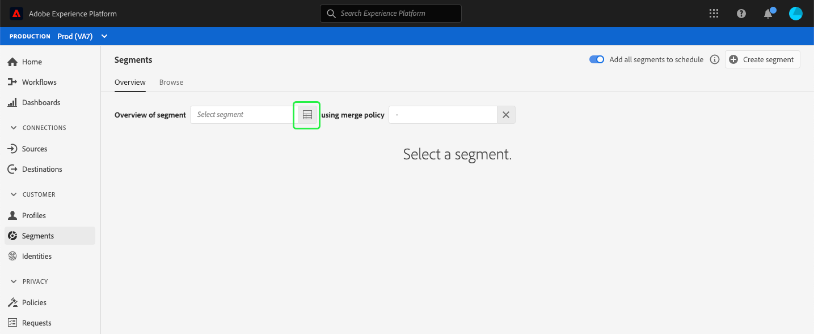
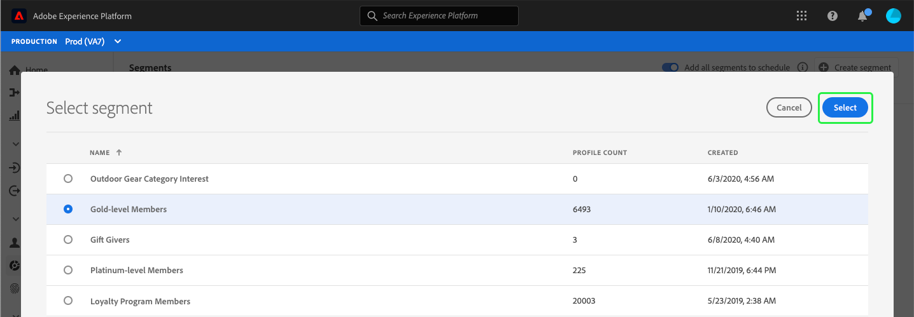

# (Alfa) panel del segmento {#segment-dashboard}

>[!IMPORTANT]
>
>La funcionalidad de panel descrita en este documento se encuentra actualmente en alfa y no está disponible para todos los usuarios. La documentación y las funciones están sujetas a cambios.

La interfaz de usuario (IU) de Adobe Experience Platform proporciona un panel mediante el cual puede realizar vistas de información importante sobre los segmentos, tal como se captura durante una instantánea diaria. Esta guía describe cómo acceder y trabajar con el panel de segmentos en la interfaz de usuario y proporciona más información sobre las visualizaciones que se muestran en el panel.

Para obtener información general sobre todas las funciones del servicio de segmentación de Adobe Experience Platform en la interfaz de usuario de la plataforma, visite la guía de la interfaz de usuario del servicio de [segmentación](overview.md).

## Datos de panel de segmentos

El panel de segmentos muestra una instantánea de los datos de atributos (registros) que su organización tiene dentro del almacén de Perfiles en Experience Platform. La instantánea no incluye datos de eventos (series temporales).

Los datos de atributo de la instantánea muestran los datos exactamente como aparecen en el momento concreto en que se realizó la instantánea. En otras palabras, la instantánea no es una aproximación o muestra de los datos y el panel del segmento no se actualiza en tiempo real.

>[!NOTE]
>
>Los cambios o actualizaciones realizados en los datos desde que se realizó la instantánea no se reflejarán en el panel hasta que se realice la siguiente instantánea.

## Explorar el panel del segmento

Para desplazarse al panel de segmentos dentro de la interfaz de usuario de la plataforma, seleccione **[!UICONTROL Segmentos]** en el carril izquierdo y, a continuación, seleccione la ficha **[!UICONTROL Información general]** para mostrar el panel.

### Seleccionar un segmento

Para seleccionar un segmento para la vista en el panel, elija el selector de cuadro de diálogo para el cuadro de texto **[!UICONTROL Seleccionar segmento]** .

>[!NOTE]
>
>Si ya se ha seleccionado un segmento, utilice `X` para eliminarlo primero y aparecerá el selector de cuadro de diálogo.
>
>

Se abre el cuadro de diálogo **[!UICONTROL Seleccionar segmento]** , que le permite elegir el segmento que desea vista. Después de elegir el segmento que desee, utilice **[!UICONTROL Seleccionar]** para volver al panel.

### Combinar directiva

Después de seleccionar un segmento, el cuadro de texto de la directiva de combinación se rellenará automáticamente con la directiva de combinación relacionada con ese segmento.

Para obtener más información sobre la creación de segmentos en Experience Platform, visite la guía de IU [del Generador de segmentos](segment-builder.md). Para obtener más información sobre las políticas de combinación, lea la información general [sobre el Perfil del cliente en tiempo](../../profile/home.md)real.

### Widgets y métricas

El panel de segmentos está compuesto de utilidades, que son métricas de solo lectura que proporcionan información importante con respecto al segmento seleccionado. La fecha y hora &quot;última actualización&quot; de la utilidad muestran cuándo se realizó la última instantánea de los datos.

## Widgets disponibles

Experience Platform proporciona varias utilidades que puede utilizar para visualizar distintas métricas relacionadas con el segmento. Seleccione el nombre de una utilidad a continuación para obtener más información:

* [[!UICONTROL Tamaño del segmento]](#segment-size)
* [[!UICONTROL Perfiles por Área de nombres]](#profiles-by-namespace)

### [!UICONTROL Tamaño del segmento] {#segment-size}

El widget **[!UICONTROL de tamaño]** del segmento muestra el número total de perfiles combinados dentro del segmento seleccionado en el momento en que se realizó la instantánea. Este número es el resultado de aplicar la directiva de combinación de segmentos a los datos de Perfil para combinar los fragmentos de perfil y formar un único perfil para cada individuo del segmento.

Para obtener más información sobre fragmentos y perfiles combinados, lea la información general [sobre el Perfil del cliente en tiempo](../home.md)real.

### [!UICONTROL Perfiles por Área de nombres] {#profiles-by-namespace}

La utilidad **[!UICONTROL Perfiles por Área de nombres]** muestra el desglose de Áreas de nombres en todos los perfiles combinados del segmento seleccionado. El número total de perfiles por Área de nombres [!UICONTROL de] ID (es decir, sumar los valores mostrados para cada Área de nombres) será generalmente mayor que el número total de perfiles en el segmento porque un perfil podría tener varias Áreas de nombres asociadas. Por ejemplo, si un cliente interactúa con su marca en más de un canal, se pueden asociar varias Áreas de nombres con ese cliente individual.

Para obtener más información sobre las Áreas de nombres de identidad, visite la documentación [de](../../identity-service/home.md)Adobe Experience Platform Identity Service.

## Paneles adicionales

La interfaz de usuario de la plataforma proporciona paneles adicionales para ver instantáneas de los datos en Experience Platform. Estos paneles incluyen el uso [!UICONTROL de Perfiles y]licencias de clientes en tiempo real. Para obtener más información sobre estos paneles adicionales, seleccione uno de los vínculos siguientes:

* [[!DNL Profile] panel](../../profile/ui/profile-dashboard.md)
* [[!UICONTROL Panel de uso] de licencias](../../landing/license-usage-dashboard.md)

## Pasos siguientes

Al seguir este documento ahora debería poder localizar el panel del segmento y seleccionar un segmento para la vista. También debe comprender las métricas que se muestran en los widgets disponibles. Para obtener más información sobre cómo trabajar con segmentos en la interfaz de usuario del Experience Platform, consulte la guía de la interfaz de usuario del servicio de [segmentación](overview.md).