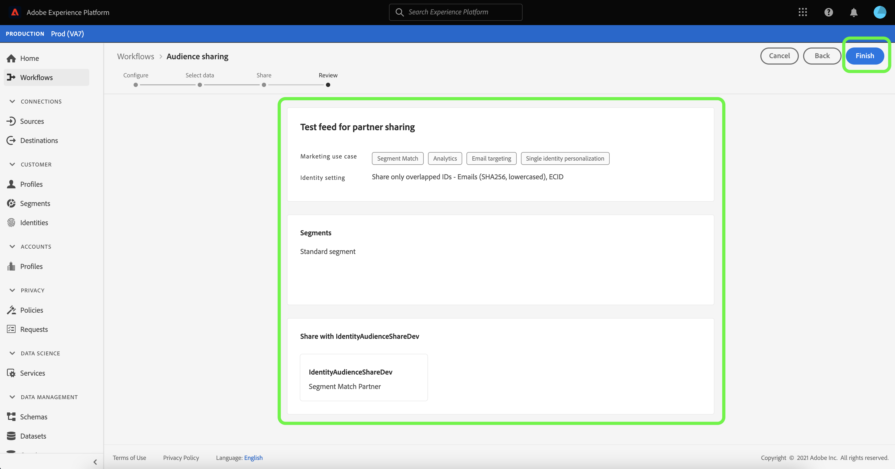

# Información general del [!DNL Segment Match]

Adobe Experience Platform Segment Match es un servicio para compartir segmentos que permite a dos o más usuarios de Platform intercambiar datos de segmentos de forma segura, regulada y compatible con la privacidad. [!DNL Segment Match] utiliza estándares de privacidad de plataforma e identificadores personales como correos electrónicos con hash, números de teléfono con hash y identificadores de dispositivo como IDFA y GAID.

con [!DNL Segment Match] puede:

* Administre el proceso de superposición de identidad.
* Consulte las estimaciones previas al uso compartido.
* Aplique etiquetas de uso de datos para controlar si los datos se pueden compartir con socios.
* Mantener la administración del ciclo de vida de la audiencia compartida después de publicar una fuente y continuar con un intercambio dinámico de datos mediante capacidades para agregar, eliminar y dejar de compartir.

[!DNL Segment Match] utiliza un proceso de superposición de identidad para garantizar que el uso compartido de segmentos se realice de forma segura y centrada en la privacidad. Un **identidad superpuesta** es una identidad que tiene una coincidencia tanto en el segmento como en el segmento del socio seleccionado. Antes de compartir un segmento entre un remitente y un receptor, el proceso de superposición de identidad comprueba la existencia de superposición en áreas de nombres y comprobaciones de consentimiento entre el remitente y el receptor. Ambas comprobaciones de superposición deben pasar para que se comparta un segmento.

Las secciones siguientes proporcionan más información sobre [!DNL Segment Match], incluidos los detalles sobre la configuración y su flujo de trabajo completo.

## Configuración

Las secciones siguientes describen cómo configurar y configurar [!DNL Segment Match]:

### Configuración de datos de identidad y áreas de nombres {#namespaces}

El primer paso para comenzar con [!DNL Segment Match] es para asegurarse de que está incorporando datos con los espacios de nombres de identidad admitidos.

Las áreas de nombres de identidad son un componente de [Servicio de identidad de Adobe Experience Platform](../../../identity-service/home.md). Cada identidad de cliente contiene un área de nombres asociada que indica el contexto de la identidad. Por ejemplo, un área de nombres puede distinguir un valor de &quot;name&quot;@email.com&quot; como dirección de correo electrónico o &quot;443522&quot; como ID de CRM numérico.

Una identidad completa incluye un valor de ID y un área de nombres. Al hacer coincidir datos de registro entre fragmentos de perfil (por ejemplo, al [!DNL Real-Time Customer Profile] combina datos de perfil), tanto el valor de identidad como el área de nombres deben coincidir.

En el contexto de [!DNL Segment Match], las áreas de nombres se utilizan en el proceso de superposición al compartir datos.

La lista de áreas de nombres admitidas es la siguiente:

| Área de nombres | Descripción |
| --------- | ----------- |
| Correos electrónicos (SHA256, en minúsculas) | Un espacio de nombres para direcciones de correo electrónico premarcadas. Los valores proporcionados en este área de nombres se convierten a minúsculas antes de utilizar el hash con SHA256. Los espacios al inicio y al final deben recortarse antes de normalizar una dirección de correo electrónico. Esta configuración no se puede cambiar de forma retroactiva. Platform ofrece dos métodos para admitir el hash en la recopilación de datos mediante [`setCustomerIDs`](https://experienceleague.adobe.com/docs/id-service/using/reference/hashing-support.html?lang=en#hashing-support) y [preparación de datos](../../../data-prep/functions.md#hashing). |
| Teléfono (SHA256_E.164) | Área de nombres que representa los números de teléfono sin procesar que deben tener un hash con los formatos SHA256 y E.164. |
| ECID | Área de nombres que representa un valor de ID de Experience Cloud (ECID). Este espacio de nombres también puede ser referenciado por los siguientes alias: &quot;Adobe Marketing Cloud ID&quot;, &quot;Adobe Experience Cloud ID&quot;, &quot;Adobe Experience Platform ID&quot;. Consulte la [Información general de ECID](../../../identity-service/ecid.md) para obtener más información. |
| Apple IDFA (ID para anunciantes) | Área de nombres que representa Apple ID para anunciantes. Consulte el siguiente documento sobre [anuncios basados en intereses](https://support.apple.com/es-es/HT202074) para obtener más información. |
| Google Ad ID | Área de nombres que representa un ID de publicidad de Google. Consulte el siguiente documento sobre [Google Advertising ID](https://support.google.com/googleplay/android-developer/answer/6048248?hl=en) para obtener más información. |

### Configuración del consentimiento

Debe proporcionar una configuración de consentimiento y establecer su valor predeterminado en `opt-in` o `opt-out` para una comprobación de consentimiento.

La comprobación de consentimiento de inclusión y exclusión determina si puede operar con el consentimiento para compartir datos de usuario de forma predeterminada. Si el valor predeterminado de la configuración de consentimiento está establecido en `opt-out`, los datos de usuario se pueden compartir, a menos que un usuario se excluya explícitamente. Si el valor predeterminado es `opt-in`, los datos de usuario no se pueden compartir, a menos que un usuario participe explícitamente.

La configuración de consentimiento predeterminada para [!DNL Segment Match] está configurado como `opt-out`. Para aplicar un modelo de inclusión para sus datos, envíe una solicitud de correo electrónico a su equipo de cuenta de Adobe.

Para obtener más información sobre `share` para establecer el valor del consentimiento de uso compartido de datos, consulte la siguiente documentación sobre [privacidad y grupo de campos de consentimiento](../../../xdm/field-groups/profile/consents.md). Para obtener información sobre el grupo de campos específico utilizado para capturar el consentimiento del consumidor para la recopilación y el uso de datos relacionados con la privacidad, la personalización y las preferencias de marketing, consulte lo siguiente [Consentimiento para el ejemplo de las preferencias de privacidad, personalización y marketing de GitHub](https://github.com/adobe/xdm/blob/master/docs/reference/datatypes/consent/consent-preferences.schema.md).

### Configuración de etiquetas de uso de datos

El último requisito previo que debe establecer es configurar una nueva etiqueta de uso de datos para evitar el uso compartido de datos. A través de las etiquetas de uso de datos, puede administrar qué datos se pueden compartir a través de [!DNL Segment Match].

Las etiquetas de uso de datos le permiten categorizar conjuntos de datos y campos según las políticas de uso que se aplican a esos datos. Las etiquetas se pueden aplicar en cualquier momento, lo que proporciona flexibilidad en la forma en que elige administrar los datos. Las prácticas recomendadas recomiendan el etiquetado de datos tan pronto como se incorporen al Experience Platform o tan pronto como los datos estén disponibles para su uso en Platform.

[!DNL Segment Match] utiliza la etiqueta C11, una etiqueta de contrato específica para [!DNL Segment Match] que puede agregar manualmente a cualquier conjunto de datos o atributo para asegurarse de que se excluyen del [!DNL Segment Match] proceso de uso compartido de socios. La etiqueta C11 indica los datos que no deben utilizarse en [!DNL Segment Match] procesos. Después de determinar de qué conjuntos de datos o campos desea excluir [!DNL Segment Match] y se ha añadido la etiqueta C11 en consecuencia, la etiqueta se aplica automáticamente mediante la etiqueta [!DNL Segment Match] flujo de trabajo. [!DNL Segment Match] habilita automáticamente la variable [!UICONTROL Restringir el uso compartido de datos] política principal. Para obtener instrucciones específicas sobre cómo aplicar etiquetas de uso de datos a conjuntos de datos, consulte el tutorial en [administración de etiquetas de uso de datos en la interfaz de usuario](../../../data-governance/labels/user-guide.md).

Para obtener una lista de las etiquetas de uso de datos y sus definiciones, consulte la [glosario de etiquetas de uso de datos](../../../data-governance/labels/reference.md). Para obtener información sobre las políticas de uso de datos, consulte la [información general sobre las políticas de uso de datos](../../../data-governance/policies/overview.md).

### Explicación [!DNL Segment Match] permissions

Hay dos permisos asociados con [!DNL Segment Match]:

| Permiso | Descripción |
| --- | --- |
| Administrar conexiones de uso compartido de audiencias | Este permiso le permite completar el proceso de protocolo de enlace con el socio, que conecta dos organizaciones para habilitar [!DNL Segment Match] flujos. |
| Administrar audiencias compartidas | Este permiso le permite crear, editar y publicar fuentes (el paquete de datos utilizado para [!DNL Segment Match]) con socios activos (socios que el usuario administrador ha conectado con **[!UICONTROL Conexiones de uso compartido de audiencias]** acceso). |

Consulte la [información general sobre el control de acceso](../../../access-control/home.md) para obtener más información sobre control de acceso y permisos.

## [!DNL Segment Match] flujo de trabajo completo

Una vez configurados los datos de identidad y los espacios de nombres, la configuración de consentimiento y la etiqueta de uso de datos, puede empezar a trabajar con [!DNL Segment Match] y sus características.

### Administrar socio

En la interfaz de usuario de Platform, seleccione **[!UICONTROL Segmentos]** en el panel de navegación izquierdo y, a continuación, seleccione **[!UICONTROL Fuentes]** en el encabezado superior.

La variable [!UICONTROL Fuentes] contiene una lista de las fuentes recibidas de los socios, así como las fuentes que ha compartido. Para ver una lista de socios existentes o establecer una conexión con un nuevo socio, seleccione **[!UICONTROL Administrar socios]**.

Una conexión entre dos socios es un &quot;protocolo de enlace bidireccional&quot; que actúa como método de autoservicio para que los usuarios conecten sus organizaciones de Platform juntas a nivel de entorno limitado. La conexión es necesaria para informar a Platform de que se ha establecido un acuerdo y que Platform puede facilitar el uso compartido de servicios entre usted y sus socios.

>[!NOTE]
>
>El &quot;protocolo de enlace bidireccional&quot; entre usted y su pareja es estrictamente una conexión. No se intercambian datos durante este proceso.

Puede ver una lista de conexiones con socios existentes en la interfaz principal del [!UICONTROL Administrar socios] en el Navegador. En el carril derecho se encuentra el [!UICONTROL Configuración de uso compartido] , que le ofrece la opción de generar un [!UICONTROL id de conexión] , así como un cuadro de entrada en el que puede introducir el [!UICONTROL id de conexión].

Para crear un [!UICONTROL id de conexión], seleccione **[!UICONTROL Regenerar]** under [!UICONTROL Configuración de uso compartido] y, a continuación, seleccione el icono de copia junto al ID recién generado.

Para conectar un socio con su [!UICONTROL id de conexión], introduzca su valor de ID único en el cuadro de entrada de [!UICONTROL Conectar socio] y, a continuación, seleccione **[!UICONTROL Solicitud]**.

### Crear fuente {#create-feed}

>[!CONTEXTUALHELP]
>id="platform_segment_match_marketing"
>title="Casos de uso de marketing restringidos"
>abstract="Los casos de uso de marketing restringidos ayudan a proporcionar orientación a sus socios para garantizar que los segmentos compartidos se utilizan correctamente según las restricciones de gobernanza de datos."
>text="Learn more in documentation"

A **fuente** es una agrupación de datos (segmentos), las reglas para exponer o utilizar esos datos y las configuraciones que determinan cómo se comparan los datos con los datos de sus socios. Una fuente se puede administrar de forma independiente e intercambiar con otros usuarios de Platform a través de [!DNL Segment Match].

Para crear una fuente nueva, seleccione **[!UICONTROL Crear fuente]** de la variable [!UICONTROL Fuentes] tablero.

La configuración básica de una fuente incluye un nombre, una descripción y configuraciones relacionadas con los casos de uso de marketing y la configuración de identidad. Proporcione un nombre y una descripción para la fuente y, a continuación, aplique los casos de uso de marketing de los que desee excluir los datos. Puede seleccionar más de un caso de uso en una lista que incluya:

* [!UICONTROL Analytics]
* [!UICONTROL Combinación con PII]
* [!UICONTROL Segmentación entre sitios]
* [!UICONTROL Ciencia de datos]
* [!UICONTROL Segmentación por correo electrónico]
* [!UICONTROL Exportación a terceros]
* [!UICONTROL Publicidad en el sitio]
* [!UICONTROL Personalización en el sitio]
* [!UICONTROL Coincidencia de segmentos]
* [!UICONTROL Personalización de identidad única]

Finalmente, seleccione las áreas de nombres de identidad adecuadas para la fuente. Para obtener información sobre las áreas de nombres específicas admitidas por [!DNL Segment Match], consulte la [datos de identidad y tabla de áreas de nombres](#namespaces). Cuando haya terminado, seleccione **[!UICONTROL Siguiente]**.

Una vez que haya establecido la configuración de la fuente, seleccione los segmentos que desee compartir en la lista de segmentos de origen. Puede seleccionar más de un segmento de la lista y utilizar el carril derecho para administrar la lista de segmentos seleccionados. Una vez finalizado, seleccione **[!UICONTROL Siguiente]**.

La variable [!UICONTROL Compartir] , que le proporciona una interfaz para seleccionar los socios con los que desea compartir su fuente. Durante este paso, también puede ver el informe de estimaciones de superposición previas al uso compartido y ver el número de identidades superpuestas por área de nombres entre usted y su socio, el número de identidades superpuestas que tienen consentimiento para compartir datos.

Select **[!UICONTROL Analizar por segmento]** para ver el informe de estimaciones.

El informe de estimaciones de superposición le permite administrar las comprobaciones de superposición y consentimiento por socio y segmento antes de compartir la fuente.

| Métricas | Descripción |
| ------- | ----------- |
| Identidades estimadas con consentimiento | Número total de identidades superpuestas que cumplen los requisitos de consentimiento configurados para su organización. |
| Identidades superpuestas estimadas | El número de identidades que cumplen los requisitos para el segmento seleccionado y que también coinciden con el socio seleccionado. Estas identidades se muestran por área de nombres y no representan identidades de perfil individuales. Las estimaciones de superposición se basan en bocetos de perfil. |

Cuando haya terminado, seleccione **[!UICONTROL Cerrar]**.

Una vez seleccionados los socios y consultados los informes de estimaciones de superposición, seleccione **[!UICONTROL Siguiente]** para continuar.

La variable [!UICONTROL Consulte] aparece, lo que permite revisar la nueva fuente antes de compartirla y publicarla. Este paso incluye detalles sobre la configuración de identidad que ha aplicado, así como información sobre los casos de uso de marketing, segmentos y socios que ha seleccionado.

Select **[!UICONTROL Finalizar]** para continuar.

### Actualizar fuente

Para agregar o quitar segmentos, seleccione **[!UICONTROL Crear fuente]** de la variable [!UICONTROL Fuentes] página y, a continuación, seleccione **[!UICONTROL Fuente existente]**. En la lista de fuentes existentes que aparece, seleccione la fuente que desea actualizar y, a continuación, seleccione **[!UICONTROL Siguiente]**.

Aparecerá la lista de segmentos. Desde aquí, puede añadir nuevos segmentos a la fuente y utilizar el carril derecho para eliminar los segmentos que ya no necesite. Una vez que haya terminado de administrar los segmentos en la fuente, seleccione **[!UICONTROL Siguiente]** y siga los pasos descritos anteriormente para completar la fuente actualizada.

>[!NOTE]
>
>Cuando agrega o elimina un segmento de una fuente compartida, el socio receptor debe confirmar el cambio activando de nuevo el [!DNL Profile] alterne en su lista de fuentes recibidas.

### Aceptar una fuente entrante

Para ver una fuente entrante, seleccione **[!UICONTROL Recibido]** en el encabezado de la variable [!UICONTROL Fuentes] y, a continuación, seleccione la fuente que desee ver en la lista. Para aceptar la fuente, seleccione **[!UICONTROL Habilitar para perfil]** y permitir que el estado se actualice durante unos momentos desde [!UICONTROL Pendiente] a [!UICONTROL Habilitado].

Una vez que acepte una fuente compartida, puede empezar a utilizar los datos compartidos para generar nuevos segmentos.

## Pasos siguientes

Al leer este documento, ha adquirido una comprensión de [!DNL Segment Match], sus capacidades y su flujo de trabajo completo. Consulte los siguientes documentos para obtener más información sobre otros servicios de Platform:

* [[!DNL Segmentation Service]](../../home.md)
* [[!DNL Identity Service]](../../../identity-service/home.md)
* [Información general del [!DNL Real-Time Customer Profile]](../../../profile/home.md)
