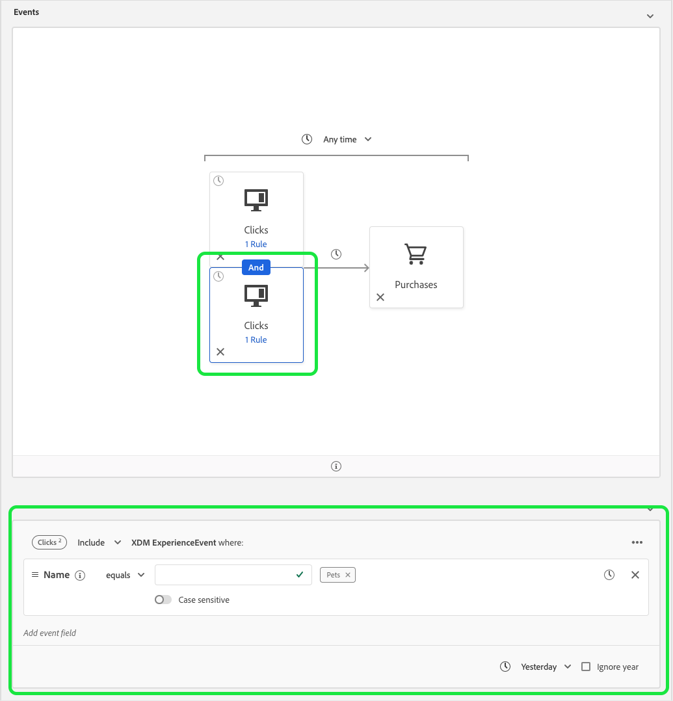

# Refactorización de las limitaciones de tiempo

La versión de octubre de 2020 para Adobe Experience Platform ha introducido cambios de rendimiento en el servicio de segmentación de Adobe Experience Platform que agregan nuevas restricciones al uso de los operadores lógicos O y AND. Estos cambios afectarán a los segmentos recién creados o editados realizados mediante la interfaz de usuario del Generador de segmentos. Esta guía explica cómo mitigar estos cambios.

Antes de la versión de octubre de 2020, todas las restricciones de tiempo a nivel de regla, de grupo y de evento hacían referencia de forma redundante a la misma marca de tiempo. Para aclarar el uso de restricciones de tiempo, se han eliminado las restricciones de tiempo a nivel de regla y de grupo. Para adaptarse a este cambio, todas las restricciones de tiempo deben reescribirse como restricciones de tiempo de nivel de evento.

Anteriormente, un evento individual podía tener varias reglas de restricción de tiempo adjuntas.

Como puede ver, este segmento tiene dos restricciones en el nivel de regla: Uno para &quot;[!UICONTROL Hoy]&quot; y el otro para &quot;[!UICONTROL Ayer]&quot;.

El segmento anterior es equivalente al siguiente — ambas restricciones de tiempo de nivel de evento se han conectado mediante un operador Y. La primera restricción de tiempo de nivel de evento hace referencia a un evento de clics cuyo nombre es igual a &quot;Formación&quot; y se está produciendo hoy, mientras que la segunda restricción de tiempo de nivel de evento hace referencia a un evento de clics cuyo nombre es igual a &quot;Mascotas&quot; y se produjo ayer.

 

Esta refactorización de las restricciones de tiempo también afecta a las restricciones de tiempo que están conectadas mediante un operador O.