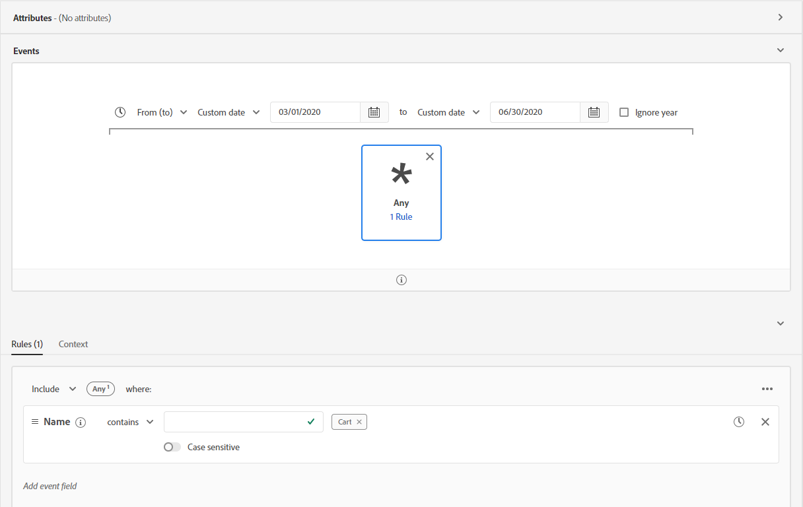

# Segmentación por transmisión

>[!NOTE]
>
>El siguiente documento indica cómo utilizar la segmentación de flujo continuo mediante la interfaz de usuario de . Para obtener información sobre el uso de la segmentación de flujo continuo mediante la API, lea la [guía de API de segmentación por secuencias](../api/streaming-segmentation.md).

Segmentación por transmisión en [!DNL Adobe Experience Platform] permite a los clientes realizar la segmentación en tiempo casi real, mientras se centran en la riqueza de los datos. Con la segmentación de flujo continuo, la calificación de segmentos ahora se produce cuando los datos de flujo continuo llegan a [!DNL Platform], aliviando la necesidad de programar y ejecutar trabajos de segmentación. Con esta capacidad, la mayoría de las reglas de segmentos ahora se pueden evaluar a medida que se pasan los datos a [!DNL Platform], lo que significa que la pertenencia a un segmento se mantendrá actualizada sin ejecutar trabajos de segmentación programados.

>[!NOTE]
>
>La segmentación por transmisión funciona en todos los datos que se introdujeron mediante una fuente de flujo continuo. Los datos introducidos mediante un origen basado en lotes se evaluarán todas las noches, incluso si cumplen los requisitos para la segmentación de flujo continuo.
>
>Además, los segmentos evaluados con la segmentación de flujo continuo pueden variar entre la pertenencia ideal y real si el segmento se basa en otro segmento que se evalúa mediante la segmentación por lotes. Por ejemplo, si el segmento A se basa en el segmento B y el segmento B se evalúa mediante la segmentación por lotes, ya que el segmento B solo se actualiza cada 24 horas, el segmento A se alejará más de los datos reales hasta que se vuelva a sincronizar con la actualización del segmento B.

## Tipos de consultas de segmentación por transmisión {#query-types}

>[!NOTE]
>
>Para que la segmentación de flujo continuo funcione, debe habilitar la segmentación programada para la organización. Para obtener más información sobre la activación de la segmentación programada, consulte [la sección segmentación de flujo continuo en la guía del usuario Segmentación](./overview.md#scheduled-segmentation).

Una consulta se evaluará automáticamente con la segmentación de flujo continuo si cumple cualquiera de los siguientes criterios:

| Tipo de consulta | Detalles | Ejemplo |
| ---------- | ------- | ------- |
| Un solo evento | Cualquier definición de segmento que haga referencia a un solo evento entrante sin restricciones de tiempo. |  |
| Un solo evento dentro de un periodo de tiempo relativo | Cualquier definición de segmento que haga referencia a un solo evento entrante. |  |
| Un solo evento con una ventana de tiempo | Cualquier definición de segmento que haga referencia a un solo evento entrante con un intervalo de tiempo. |  |
| Solo perfil | Cualquier definición de segmento que haga referencia únicamente a un atributo de perfil. |  |
| Un solo evento con un atributo de perfil | Cualquier definición de segmento que haga referencia a un solo evento entrante, sin restricción de tiempo, y uno o más atributos de perfil. **Nota:** La consulta se evalúa inmediatamente cuando se produce el evento. Sin embargo, en el caso de un evento de perfil, debe esperar 24 horas para incorporarse. |  |
| Un solo evento con un atributo de perfil dentro de un periodo de tiempo relativo | Cualquier definición de segmento que haga referencia a un solo evento entrante y a uno o más atributos de perfil. |  |
| Segmento de segmentos | Cualquier definición de segmento que contenga uno o más segmentos de flujo continuo o por lotes. **Nota:** Si se utiliza un segmento de segmentos, se producirá la descalificación del perfil **cada 24 horas**. |  |
| Varios eventos con un atributo de perfil | Cualquier definición de segmento que haga referencia a varios eventos **en las últimas 24 horas** y (opcionalmente) tiene uno o más atributos de perfil. |  |

Una definición de segmento **not** esté habilitado para la segmentación de flujo continuo en los siguientes casos:

- La definición del segmento incluye segmentos o rasgos de Adobe Audience Manager (AAM).
- La definición del segmento incluye varias entidades (consultas de varias entidades).
- La definición del segmento incluye una combinación de un solo evento y un `inSegment` evento.
   - Sin embargo, si el segmento contiene la variable `inSegment` es solo de perfil, la definición del segmento **will** esté habilitado para la segmentación de flujo continuo.

Tenga en cuenta las siguientes directrices cuando realice la segmentación de flujo continuo:

| Tipo de consulta | Pauta |
| ---------- | -------- |
| Consulta de evento único | No hay límites en la ventana retrospectiva. |
| Consulta con historial de eventos | <ul><li>La ventana retrospectiva se limita a **un día**.</li><li>Condición estricta de orden de tiempo **must** existen entre los eventos.</li><li>Se admiten consultas con al menos un evento denegado. Sin embargo, todo el evento **cannot** ser una negación.</li></ul> |

Si se modifica una definición de segmento para que ya no cumpla los criterios de segmentación de flujo continuo, la definición del segmento pasará automáticamente de &quot;Transmisión&quot; a &quot;Lote&quot;.

Además, la descalificación de segmentos, similar a la calificación de segmentos, se produce en tiempo real. Como resultado, si una audiencia ya no cumple los requisitos para un segmento, quedará inmediatamente sin clasificar. Por ejemplo, si la definición del segmento requiere &quot;Todos los usuarios que compraron zapatos rojos en las últimas tres horas&quot;, después de tres horas, todos los perfiles que inicialmente calificaron para la definición del segmento no se calificarán.

## Detalles del segmento de segmentación por transmisión

Después de crear un segmento con la transmisión habilitada, puede ver los detalles de ese segmento.

Específicamente, la variable **[!UICONTROL Total cualificado]** se muestra, que muestra el número total de audiencias cualificadas, según las evaluaciones por lotes y de flujo continuo de este segmento.

Debajo hay un gráfico de líneas que muestra el número de audiencias nuevas que se actualizaron en las últimas 24 horas mediante el método de evaluación de flujo continuo. La lista desplegable se puede ajustar para mostrar las últimas 24 horas, la semana pasada o los últimos 30 días. La variable **[!UICONTROL Se ha actualizado la audiencia nueva]** se basa en el cambio en el tamaño de la audiencia durante el intervalo de tiempo seleccionado, según se evalúa mediante la segmentación de flujo continuo. Esta métrica no incluye el total de audiencias cualificadas de la evaluación diaria de lotes de segmentos.

>[!NOTE]
>
>Un segmento se considera cualificado si pasa de no tener estado a realizado o si pasa de salir a realizarse. Un segmento se considera no clasificado si pasa de realizarse a salir o de existente a salido.
>
>Encontrará más información sobre estos estados en la tabla de estado de la [información general sobre segmentación](./overview.md#browse).

Para obtener información adicional sobre la última evaluación de segmentos, seleccione la burbuja de información junto a **[!UICONTROL Total cualificado]**.

Para obtener más información sobre las definiciones de segmentos, lea la sección anterior sobre [detalles de definición de segmentos](#segment-details).

## Pasos siguientes

En esta guía del usuario se explica cómo funcionan las definiciones de segmentos con transmisión habilitada en Adobe Experience Platform y cómo se monitorizan los segmentos con transmisión habilitada.

Para obtener más información sobre el uso de la interfaz de usuario de Adobe Experience Platform, lea la [Guía del usuario de segmentación](./overview.md).

## Apéndice

La siguiente sección enumera las preguntas más frecuentes sobre la segmentación de flujo continuo:

### ¿La &quot;incalificación&quot; de la segmentación por transmisión también se produce en tiempo real?

En la mayoría de los casos, la descalificación de la segmentación de flujo continuo se produce en tiempo real. Sin embargo, los segmentos de flujo continuo que utilizan segmentos de segmentos sí **not** no cumple los requisitos en tiempo real, en lugar de no cumplir los requisitos después de 24 horas.

### ¿En qué datos funciona la segmentación por secuencias?

La segmentación por transmisión funciona en todos los datos que se introdujeron mediante una fuente de flujo continuo. Los segmentos introducidos mediante un origen basado en lotes se evaluarán todas las noches, incluso si cumplen los requisitos para la segmentación de flujo continuo. Los eventos transmitidos al sistema con una marca de tiempo de más de 24 horas se procesarán en el siguiente trabajo por lotes.

### ¿Cómo se definen los segmentos como segmentación por lotes o de flujo continuo?

Un segmento se define como segmentación por lotes o de flujo continuo basada en una combinación de tipo de consulta y duración del historial de eventos. Puede encontrar una lista de los segmentos que se evaluarán como un segmento de flujo continuo en la [sección tipos de consulta de segmentación de flujo continuo](#query-types).

Tenga en cuenta que si un segmento contiene **both** an `inSegment` y una cadena directa de un solo evento, no se pueden calificar para la segmentación de flujo continuo. Si desea que este segmento cumpla los requisitos para la segmentación de flujo continuo, debe hacer que la cadena directa de un solo evento sea su propio segmento.

### ¿Por qué el número de segmentos &quot;cualificados totales&quot; sigue aumentando mientras que el número de &quot;Últimos X días&quot; permanece en cero en la sección de detalles del segmento?

El número total de segmentos cualificados se obtiene del trabajo diario de segmentación, que incluye audiencias que cumplen los requisitos para segmentos de flujo y por lotes. Este valor se muestra tanto para los segmentos de lote como de flujo continuo.

El número de &quot;Últimos X días&quot; **only** incluye audiencias cualificadas en segmentación de flujo continuo y **only** aumenta si ha transmitido datos al sistema y cuenta para esa definición de flujo continuo. Este valor es **only** para segmentos de flujo continuo. Como resultado, este valor **may** se muestra como 0 para los segmentos por lotes.

Como resultado, si ve que el número en &quot;Últimos X días&quot; es cero y el gráfico de líneas también está reportando cero, tiene **not** transmite todos los perfiles al sistema que cumplen los requisitos para ese segmento.

### ¿Cuánto tarda un segmento en estar disponible?

Un segmento tarda hasta una hora en estar disponible.