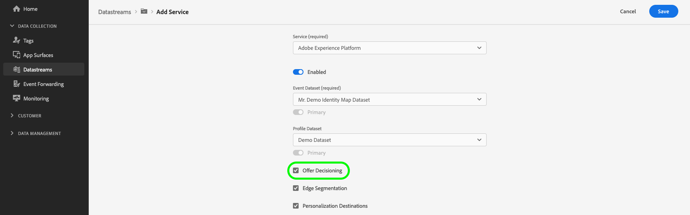

# Personalización mediante Offer decisioning

## Información general {#overview}

La API de servidor de red perimetral puede ofrecer experiencias personalizadas administradas en [offer decisioning](https://experienceleague.adobe.com/docs/journey-optimizer/using/offer-decisioniong/get-started-decision/starting-offer-decisioning.html?lang=en) al canal web.

[!DNL Offer Decisioning] admite una interfaz no visual para crear, activar y ofrecer sus actividades y experiencias de personalización.

## Configurar el conjunto de datos {#configure-your-datastream}

Antes de poder usar la API de servidor junto con el Offer decisioning, debe habilitar la personalización de Adobe Experience Platform en la configuración del conjunto de datos y habilitar la variable **[!UICONTROL offer decisioning]** .

Consulte la [guía sobre la adición de servicios a un conjunto de datos](../edge/datastreams/overview.md#adobe-experience-platform-settings), para obtener información detallada sobre cómo habilitar el Offer decisioning.



## Creación de audiencias {#audience-creation}

[!DNL Offer Decisioning] se basa en el servicio de segmentación de Adobe Experience Platform para la creación de audiencias. Puede encontrar la documentación para la [!DNL Segmentation Service] [here](../segmentation/home.md).

## Definición de ámbitos de decisión {#creating-decision-scopes}

La variable [!DNL Offer Decision Engine] utiliza datos de Adobe Experience Platform y [Perfiles de cliente en tiempo real](../profile/home.md), junto con la variable [!DNL Offer Library], para enviar ofertas a los clientes y canales adecuados en el momento adecuado.

Para obtener más información sobre [!DNL Offer Decisioning Engine], consulte la [documentación](https://experienceleague.adobe.com/docs/journey-optimizer/using/offer-decisioniong/get-started-decision/starting-offer-decisioning.html?lang=es).

Después [configuración del conjunto de datos](#configure-your-datastream), debe definir los ámbitos de decisión que se utilizarán en la campaña de personalización.

[Ámbitos de decisión](https://experienceleague.adobe.com/docs/journey-optimizer/using/offer-decisioniong/create-manage-activities/create-offer-activities.html?lang=en#add-decision-scopes) son las cadenas JSON codificadas con base64 que contienen los ID de actividad y ubicación que desea que [!DNL Offer Decisioning Service] que se utilizará al proponer ofertas.

**Ámbito de decisión JSON**

```json
{
   "activityId":"xcore:offer-activity:11cfb1fa93381aca",
   "placementId":"xcore:offer-placement:1175009612b0100c"
}
```

**Cadena con codificación Base64 del ámbito de decisión**

```shell
"eyJhY3Rpdml0eUlkIjoieGNvcmU6b2ZmZXItYWN0aXZpdHk6MTFjZmIxZmE5MzM4MWFjYSIsInBsYWNlbWVudElkIjoieGNvcmU6b2ZmZXItcGxhY2VtZW50OjExNzUwMDk2MTJiMDEwMGMifQ=="
```

Después de crear las ofertas y colecciones, debe definir una [ámbito de decisión](https://experienceleague.adobe.com/docs/journey-optimizer/using/offer-decisioniong/create-manage-activities/create-offer-activities.html?lang=en#add-decision-scopes).

Copie el ámbito de decisión codificado Base64. Lo utilizará en la variable `query` objeto de la solicitud de API del servidor.


```json
"query":{
   "personalization":{
      "decisionScopes":[
         "eyJ4ZG06YWN0aXZpdHlJZCI6Inhjb3JlOm9mZmVyLWFjdGl2aXR5OjE0ZWZjYTg5NDE4OTUxODEiLCJ4ZG06cGxhY2VtZW50SWQiOiJ4Y29yZTpvZmZlci1wbGFjZW1lbnQ6MTJkNTQ0YWU1NGU3ZTdkYiJ9"
      ]
   }
}
```

## Ejemplo de llamada a la API {#api-example}

**Formato de API**

```http
POST /ee/v2/interact
```

### Solicitud {#request}

A continuación se describe una solicitud completa que incluye un objeto XDM completo, un objeto de datos y una consulta de Offer decisioning.

>[!NOTE]
>
>La variable `xdm` y `data` los objetos son opcionales y solo son necesarios para el Offer decisioning si ha creado segmentos con condiciones que utilizan campos en cualquiera de esos objetos.

```shell
curl -X POST 'https://server.adobedc.net/ee/v2/interact?dataStreamId={DATASTREAM_ID}' \
--header 'x-api-key: {API_KEY}' \
--header 'x-gw-ims-org: {ORG_ID}' \
--header 'Authorization: Bearer {TOKEN}' \
--header 'Content-Type: application/json' \
--data-raw '{
    "event": {
        "xdm": {
            "eventType": "web.webpagedetails.pageViews",
            "identityMap": {
                "ECID": [
                    {
                        "id": "05907638112924484241029082405297151763",
                        "authenticatedState": "ambiguous",
                        "primary": true
                    }
                ]
            },
            "web": {
                "webPageDetails": {
                    "URL": "https://alloystore.dev",
                    "name": "Home Page"
                },
                "webReferrer": {
                    "URL": ""
                }
            },
            "device": {
                "screenHeight": 1440,
                "screenWidth": 3440,
                "screenOrientation": "landscape"
            },
            "environment": {
                "type": "browser",
                "browserDetails": {
                    "viewportWidth": 3440,
                    "viewportHeight": 1440
                }
            },
            "placeContext": {
                "localTime": "2022-03-22T22:45:21.193-06:00",
                "localTimezoneOffset": 360
            },
            "timestamp": "2022-03-23T04:45:21.193Z",
            "implementationDetails": {
                "name": "https://ns.adobe.com/experience/alloy/reactor",
                "version": "1.0",
                "environment": "serverapi"
            }
        },
        "data": {
            "page": {
                "pageInfo": {
                    "pageName": "Promotions",
                    "siteSection": "Home"
                },
                "promos": {
                    "heroPromos": "purse,shoes,sunglasses"
                },
                "customVariables": {
                    "testGroup": "orange/black theme"
                },
                "events": {
                    "homePage": true
                },
                "products": [
                    {
                        "productSKU": "abc123",
                        "productName": "shirt"
                    }
                ]
            },
            "__adobe.target": {
                "profile.eyeColor": "brown",
                "profile.hairColor": "brown"
            }
        }
    },
    "query": {
        "personalization": {
            "decisionScopes": [
                "eyJ4ZG06YWN0aXZpdHlJZCI6Inhjb3JlOm9mZmVyLWFjdGl2aXR5OjE0ZWZjYTg5NDE4OTUxODEiLCJ4ZG06cGxhY2VtZW50SWQiOiJ4Y29yZTpvZmZlci1wbGFjZW1lbnQ6MTJkNTQ0YWU1NGU3ZTdkYiJ9"
            ]
        }
    }
}'
```

### Respuesta {#response}

La red perimetral devolverá una respuesta similar a la que se muestra a continuación.

```json
{
   "requestId":"b375077d-7e1d-4c18-b7d3-e4da0fb4fbc5",
   "handle":[
      {
         "payload":[
            
         ],
         "type":"personalization:decisions",
         "eventIndex":0
      },
      {
         "payload":[
            {
               "id":"120d5db7-181c-42c5-8653-88b3cd3e1e69",
               "scope":"eyJ4ZG06YWN0aXZpdHlJZCI6Inhjb3JlOm9mZmVyLWFjdGl2aXR5OjE0ZWZjYTg5NDE4OTUxODEiLCJ4ZG06cGxhY2VtZW50SWQiOiJ4Y29yZTpvZmZlci1wbGFjZW1lbnQ6MTJkNTQ0YWU1NGU3ZTdkYiJ9",
               "activity":{
                  "id":"xcore:offer-activity:14efca8941895181",
                  "etag":"1"
               },
               "placement":{
                  "id":"xcore:offer-placement:12d544ae54e7e7db",
                  "etag":"1"
               },
               "items":[
                  {
                     "id":"xcore:personalized-offer:14efc848a3577d92",
                     "etag":"2",
                     "schema":"https://ns.adobe.com/experience/offer-management/content-component-json",
                     "data":{
                        "id":"xcore:personalized-offer:14efc848a3577d92",
                        "format":"application/json",
                        "language":[
                           "en-us"
                        ],
                        "content":"{\n\t\"ODEFirstTest\" : \"Personalizaton Content\"\n}",
                        "characteristics":{
                           "reporting":"testRequest"
                        }
                     }
                  }
               ]
            }
         ],
         "type":"personalization:decisions",
         "eventIndex":0
      },
      {
         "payload":[
            {
               "key":"kndctr_53A16ACB5CC1D3760A495C99_AdobeOrg_identity",
               "value":"CiYwNTkwNzYzODExMjkyNDQ4NDI0MTAyOTA4MjQwNTI5NzE1MTc2M1IOCLr6xb39LxgBKgNPUjLwAbr6xb39Lw==",
               "maxAge":34128000
            }
         ],
         "type":"state:store"
      }
   ]
}
```

Si el visitante cumple los requisitos para una actividad de personalización basada en los datos enviados a [!DNL Offer Decisioning], el contenido de la actividad relevante se encuentra en la sección `handle` objeto, donde el tipo es `personalization:decisions`.

Se devolverá otro contenido en la variable `handle` también. Otros tipos de contenido no son relevantes para [!DNL Offer Decisioning] personalización. Si el visitante cumple los requisitos para varias actividades, se incluirá en una matriz.

En la tabla siguiente se explican los elementos clave de esa parte de la respuesta.

| Propiedad | Descripción | Ejemplo |
|---|---|---|
| `scope` | El ámbito de decisión asociado con las ofertas propuestas que se devolvieron. | `"scope": "eyJhY3Rpdml0eUlkIjoieGNvcmU6b2ZmZXItYWN0aXZpdHk6MTFjZmIxZmE5MzM4MWFjYSIsInBsYWNlbWVudElkIjoieGNvcmU6b2ZmZXItcGxhY2VtZW50OjExNzUwMDk2MTJiMDEwMGMifQ=="` |
| `activity.id` | ID exclusivo de la actividad de oferta. | `"id": "xcore:offer-activity:11cfb1fa93381aca"` |
| `placement.id` | ID exclusivo de la ubicación de la oferta. | `"id": "xcore:offer-placement:1175009612b0100c"` |
| `items.id` | ID exclusivo de la oferta propuesta. | `"id": "xcore:personalized-offer:124cc332095cfa74"` |
| `schema` | Esquema del contenido asociado con la oferta propuesta. | `"schema": "https://ns.adobe.com/experience/offer-management/content-component-html"` |
| `data.id` | ID exclusivo de la oferta propuesta. | `"id": "xcore:personalized-offer:124cc332095cfa74"` |
| `format` | El formato del contenido asociado con la oferta propuesta. | `"format": "text/html"` |
| `language` | Matriz de idiomas asociados al contenido de la oferta propuesta. | `"language": [ "en-US" ]` |
| `content` | Contenido asociado con la oferta propuesta en formato de cadena. | `"content": "<p style="color:red;">20% Off on shipping</p>"` |
| `deliveryUrl` | Contenido de imagen asociado con la oferta propuesta en formato de URL. | `"deliveryURL": "https://image.jpeg"` |
| `characteristics` | El objeto JSON que contiene las características asociadas con la oferta propuesta. | `"characteristics": { "foo": "bar", "foo1": "bar1" }` |
