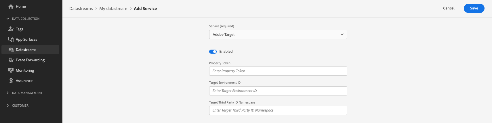

# Personalización mediante Adobe Target

## Información general {#overview}

La API del servidor de red perimetral puede ofrecer y procesar experiencias personalizadas creadas en Adobe Target con la ayuda del [Compositor de experiencias basadas en formularios](https://experienceleague.adobe.com/docs/target/using/experiences/form-experience-composer.html).

>[!IMPORTANT]
>
>Experiencias de personalización creadas mediante [Compositor de experiencias visuales (VEC) de Target](https://experienceleague.adobe.com/docs/target/using/experiences/vec/visual-experience-composer.html) no son totalmente compatibles con la API de servidor. La API de servidor puede **recuperar** actividades creadas por VEC, pero la API de servidor no puede **render** actividades creadas por VEC. Si desea procesar actividades creadas por VEC, implemente [personalización híbrida](../web-sdk/personalization/hybrid-personalization.md) mediante el SDK web y la API del servidor de red perimetral.

## Configuración de la secuencia de datos {#configure-your-datastream}

Antes de poder usar la API de servidor junto con Adobe Target, debe habilitar la personalización de Adobe Target en la configuración del conjunto de datos.

Consulte la [guía sobre cómo agregar servicios a un conjunto de datos](../datastreams/overview.md#adobe-target-settings), para obtener información detallada sobre cómo habilitar Adobe Target.

Al configurar la secuencia de datos, puede (opcionalmente) proporcionar valores para [!DNL Property Token], [!DNL Target Environment ID], y [!DNL Target Third Party ID Namespace].



## Parámetros personalizados {#custom-parameters}

La mayoría de los campos de la [!DNL XDM] Una parte de cada solicitud se serializa en notación de puntos y luego se envía a Target como personalizada o [!DNL mbox] parámetros.


### Ejemplo {#custom-parameters-example}

Dado el siguiente ejemplo de XDM:

```json
"xdm":{
   "marketing":{
      "campaignGroup":"winter22",
      "campaignName":"homeOwnerPromo22",
      "trackingCode":"hop22"
   }
}
```

Al crear audiencias en Target, los siguientes valores estarán disponibles como parámetros personalizados:

* `marketing.campaignGroup`
* `marketing.campaignName`
* `marketing.trackingCode`

## Actualizaciones de perfil de Target {#profile-update}

El [!DNL Server API] permite realizar actualizaciones en el perfil de Target. Para actualizar un perfil de Target, asegúrese de que los datos de perfil se pasan en la variable `data` parte de la solicitud en el siguiente formato:

```json
"data":  {
    "__adobe.target": {
        "profile.eyeColor": "brown",
        "profile.hairColor": "brown"
    }
}
```

## Consulta de actividades de Target {#querying-target-activities}

### Esquemas {#schemas}

La parte de consulta de la solicitud determina qué contenido devuelve Target. En el `personalization` objeto, `schemas` determina el tipo de contenido que Target devolverá.

En situaciones en las que no esté seguro del tipo de ofertas que va a recuperar, debe incluir los cuatro esquemas en la consulta de personalización a la red perimetral:

* **Ofertas basadas en HTML:**
https://ns.adobe.com/personalization/html-content-item
* **Ofertas basadas en JSON:**
https://ns.adobe.com/personalization/json-content-item
* **Ofertas de redireccionamiento de Target**
https://ns.adobe.com/personalization/redirect-item
* **Ofertas de manipulación de DOM de Target**
https://ns.adobe.com/personalization/dom-action

### Ámbitos de decisión {#decision-scopes}

Adobe Target [!DNL mbox] nombres deben incluirse en la `decisionScopes` para devolver el contenido adecuado.

#### Ejemplo {#decision-scopes-example}

En el ejemplo siguiente, los cuatro tipos de oferta se solicitan junto con una actividad de Target llamada `serverapimbox`.

```json
"query":{
   "personalization":{
      "schemas":[
         "https://ns.adobe.com/personalization/html-content-item",
         "https://ns.adobe.com/personalization/json-content-item",
         "https://ns.adobe.com/personalization/redirect-item",
         "https://ns.adobe.com/personalization/dom-action"
      ],
      "decisionScopes":[
         "serverapimbox"
      ]
   }
}
```

## Ejemplo de llamada de API {#api-example}

**Formato de API**

```http
POST /ee/v2/interact
```

### Solicitud {#request}

A continuación, se describe una solicitud completa que incluye un objeto XDM completo, parámetros de perfil, junto con la consulta de Target adecuada.

```shell
curl -X POST 'https://server.adobedc.net/ee/v2/interact?dataStreamId={DATASTREAM_ID}' \
--header 'x-api-key: {API_KEY}' \
--header 'x-gw-ims-org: {ORG_ID}' \
--header 'Authorization: Bearer {TOKEN}' \
--header 'Content-Type: application/json' \
--data-raw '{
    "event": {
        "xdm": {
            "eventType": "web.webpagedetails.pageViews",
            "identityMap": {
                "ECID": [
                    {
                        "id": "05907638112924484241029082405297151763",
                        "authenticatedState": "ambiguous",
                        "primary": true
                    }
                ]
            },
            "web": {
                "webPageDetails": {
                    "URL": "https://alloystore.dev",
                    "name": "Home Page"
                },
                "webReferrer": {
                    "URL": ""
                }
            },
            "device": {
                "screenHeight": 1440,
                "screenWidth": 3440,
                "screenOrientation": "landscape"
            },
            "environment": {
                "type": "browser",
                "browserDetails": {
                    "viewportWidth": 3440,
                    "viewportHeight": 1440
                }
            },
            "placeContext": {
                "localTime": "2022-03-22T22:45:21.193-06:00",
                "localTimezoneOffset": 360
            },
            "timestamp": "2022-03-23T04:45:21.193Z",
            "implementationDetails": {
                "name": "https://ns.adobe.com/experience/alloy/reactor",
                "version": "1.0",
                "environment": "serverapi"
            },
            "data": {
                "__adobe": {
                    "target": {
                        "profile.eyeColor": "brown",
                        "profile.hairColor": "brown",
                        "profile.shoeColor": "black"
                    }
                }
            }
        }
    },
    "query": {
        "personalization": {
            "schemas": [
                "https://ns.adobe.com/personalization/html-content-item",
                "https://ns.adobe.com/personalization/json-content-item",
                "https://ns.adobe.com/personalization/redirect-item",
                "https://ns.adobe.com/personalization/dom-action"
            ],
            "decisionScopes": [
                "serverapimbox"
            ]
        }
    }
}'
```

### Respuesta {#response}

La red perimetral devolverá una respuesta similar a la que se muestra a continuación.

```json
{
   "requestId":"10959bbf-f83d-40e1-9521-d9145f19cdc5",
   "handle":[
      {
         "payload":[
            {
               "id":"AT:eyJhY3Rpdml0eUlkIjoiMTQwMjgxIiwiZXhwZXJpZW5jZUlkIjoiMCJ9",
               "scope":"serverapimbox",
               "scopeDetails":{
                  "decisionProvider":"TGT",
                  "activity":{
                     "id":"140281"
                  },
                  "experience":{
                     "id":"0"
                  },
                  "strategies":[
                     {
                        "algorithmID":"0",
                        "trafficType":"0"
                     }
                  ],
                  "characteristics":{
                     "eventToken":"xycjBJlZhwVV5MN0kMkmoGqipfsIHvVzTQxHolz2IpTMromRrB5ztP5VMxjHbs7c6qPG9UF4rvQTJZniWgqbOw=="
                  }
               },
               "items":[
                  {
                     "id":"282484",
                     "schema":"https://ns.adobe.com/personalization/json-content-item",
                     "meta":{
                        "offer.name":"/server_apiform/experiences/0/pages/0/zones/0/1648103551041",
                        "experience.id":"0",
                        "activity.name":"Server API Form",
                        "activity.id":"140281",
                        "experience.name":"Experience A",
                        "option.id":"2",
                        "offer.id":"282484"
                     },
                     "data":{
                        "id":"282484",
                        "format":"application/json",
                        "content":{
                           "value":"a/b json experience a",
                           "platform":"server"
                        }
                     }
                  }
               ]
            }
         ],
         "type":"personalization:decisions",
         "eventIndex":0
      },
      {
         "payload":[
            {
               "key":"kndctr_53A16ACB5CC1D3760A495C99_AdobeOrg_identity",
               "value":"CiYwNTkwNzYzODExMjkyNDQ4NDI0MTAyOTA4MjQwNTI5NzE1MTc2M1IOCL-pwpv9LxgBKgNPUjLwAb-pwpv9Lw==",
               "maxAge":34128000
            }
         ],
         "type":"state:store"
      }
   ]
}
```

Si el visitante cumple los requisitos para una actividad de personalización basada en los datos enviados a Adobe Target, el contenido de la actividad correspondiente se encuentra en `handle` objeto, donde el tipo es `personalization:decisions`.

Otros contenidos a veces se devuelven en `handle` y también. Otros tipos de contenido no son relevantes para la personalización de Target. Si el visitante cumple los requisitos para varias actividades, cada actividad será una actividad independiente `personalization` en la matriz.

En la tabla siguiente se explican los elementos clave de esa parte de la respuesta.

| Propiedad | Descripción | Ejemplo |
|---|---|---|
| `scope` | El nombre del mbox de Target que resultó en las ofertas propuestas. | `"scope": "serverapimbox"` |
| `items[].schema` | El esquema del contenido asociado con la oferta propuesta. Esto se relacionará con el tipo de actividad que seleccionó al crear la actividad de personalización. | `"schema": "https://ns.adobe.com/personalization/json-content-item",` |
| `items[].meta.activity.id` | ID único de la actividad de oferta. Normalmente es un número de 6 dígitos. | `"activity.id": "140281"` |
| `items[].meta.activity.name` | Nombre de la actividad de oferta especificada por el usuario. Esto se proporciona durante el paso de creación de la actividad. | `"activity.name": "Server API Form"` |
| `items[].meta.experience.id` | El ID único de la experiencia de personalización. | `"experience.id": "0"` |
| `items[].meta.experience.name` | El nombre único de la experiencia de personalización. | `"experience.name": "Experience A"` |
| `items[].data.id` | El ID de la oferta propuesta. | `"id": "282484"` |
| `items[].data.format` | El formato del contenido asociado con la oferta propuesta. | `"format: "application/json` |
| `items[].data.content` | Contenido asociado con la oferta propuesta. Se utilizará para personalizar el contenido de la aplicación que realiza la llamada. | `"content": "<CONTENT CONFIGURED IN TARGET>"` |

## Aplicación de ejemplo de personalización del lado del servidor {#sample}

La aplicación de ejemplo se encuentra en [esta URL](https://github.com/adobe/alloy-samples/tree/main/target/personalization-server-side) muestra cómo utilizar Adobe Experience Platform para obtener contenido de personalización de Adobe Target. La página web cambia según el contenido de personalización devuelto.

Esta muestra hace lo siguiente _no_ depender de bibliotecas del lado del cliente como [!DNL Web SDK] para obtener contenido de personalización. En su lugar, utiliza las API de Adobe Experience Platform para recuperar el contenido personalizado. A continuación, la implementación genera el HTML del lado del servidor en función del contenido de personalización devuelto.
