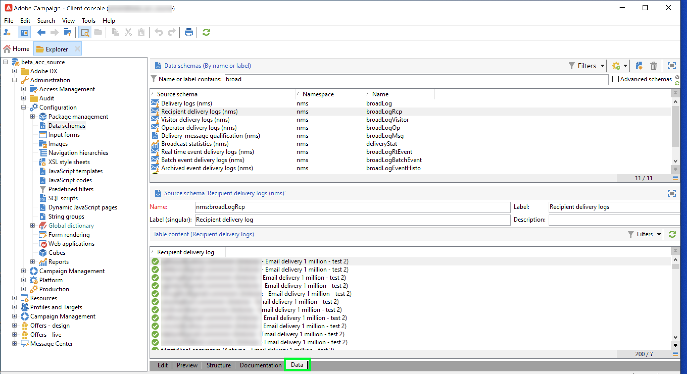
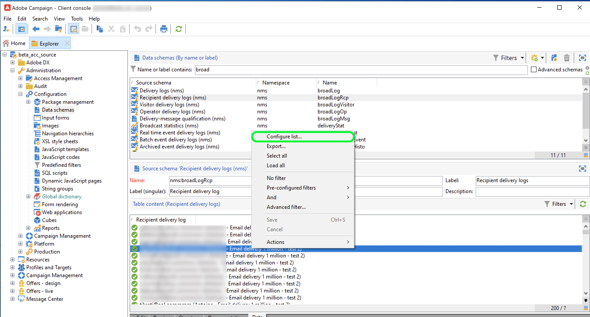

# Adobe Campaign Managed Cloud Services

Adobe Campaign Managed Cloud Services ofrece una plataforma administrada para diseñar experiencias multicanal para clientes, apoyar la orquestación visual de la campaña, la administración de interacciones en tiempo real y la ejecución multicanal. Para obtener más información, consulte la [documentación de Adobe Campaign v8](https://experienceleague.adobe.com/docs/campaign/campaign-v8/campaign-home.html?lang=es).

El conector de origen de Adobe Campaign Managed Cloud Services le permite introducir datos de registro de envío y seguimiento de Adobe Campaign v8 en Adobe Experience Platform. Este conector funciona como una fuente por lotes dentro de Platform.

## Requisitos previos

Antes de poder crear una conexión de origen para llevar la versión 8 de Campaign a Experience Platform, primero debe completar los siguientes requisitos previos:

* [Configure la importación del registro de eventos mediante la consola del cliente de Adobe Campaign](#view-delivery-and-tracking-log-data)
* [Creación de un esquema XDM ExperienceEvent](#create-a-schema)
* [Crear un conjunto de datos](#create-a-dataset)

### Visualización de datos de registro de envío y seguimiento {#view-delivery-and-tracking-log-data}

>[!IMPORTANT]
>
>Debe tener acceso a la consola del cliente de Adobe Campaign v8 para ver los datos de registro en Campaign. Visite la [documentación de Campaign v8](https://experienceleague.adobe.com/docs/campaign/campaign-v8/deploy/connect.html) para obtener información sobre cómo descargar e instalar la consola del cliente.

Inicie sesión en la instancia de Campaign v8 a través de la consola del cliente. En la ficha [!DNL Explorer], seleccione [!DNL Administration] y luego seleccione [!DNL Configuration]. A continuación, seleccione [!DNL Data schemas] y aplique el filtro `broadLog` para el nombre o la etiqueta. En la lista que aparece, seleccione el esquema de origen de registros de envío de destinatarios con el nombre `broadLogRcp`.

A continuación, seleccione la ficha **Datos**.

Haga clic con el botón derecho/pulsación de tecla en el panel de datos para abrir el menú contextual. Aquí, seleccione **Configurar lista...**

Aparecerá la ventana de configuración de la lista, que le proporcionará una interfaz en la que puede añadir los campos deseados a la lista preexistente para ver los datos en el panel de datos.

Ahora puede ver los registros de envío de los destinatarios, incluidos los campos de configuración añadidos en el paso anterior.

>[!TIP]
>
>Puede repetir los mismos pasos, pero filtrar por `tracking` para ver los datos del registro de seguimiento.

### Creación de un esquema {#create-a-schema}

A continuación, cree un esquema XDM ExperienceEvent para los registros de envío y de seguimiento. Debe aplicar el grupo de campos Registros de envío de Campaign al esquema de registros de envío y el grupo de campos Registros de seguimiento de Campaign al esquema de registros de seguimiento. También debe definir el campo `externalID` como la identidad principal del esquema.

>[!NOTE]
>
>El esquema ExperienceEvent de XDM debe estar habilitado para el perfil a fin de poder introducir los datos de Campaign en [!DNL Real-Time Customer Profile].

Para obtener instrucciones detalladas sobre cómo crear un esquema, lea la guía sobre [creación de un esquema XDM en la interfaz de usuario](../../../xdm/tutorials/create-schema-ui.md).

### Crear un conjunto de datos {#create-a-dataset}

Finalmente, debe crear un conjunto de datos para los esquemas. Para obtener instrucciones detalladas sobre cómo crear un conjunto de datos, lea la guía sobre [crear un conjunto de datos en la interfaz de usuario](../../../catalog/datasets/user-guide.md).

## Latencia esperada para la fuente de Adobe Campaign Managed Cloud Services {#latency}

La latencia de extremo a extremo desde un evento de Campaign hasta la disponibilidad de datos en Experience Platform suele ser de 15 a 30 minutos en configuraciones estándar (incluida la replicación de 15 minutos, la exportación de microlotes y un flujo de datos de Experience Platform programado), suponiendo que los volúmenes de datos sean normales y que no haya registro de pendientes. Este es un proceso casi en tiempo real que se logra a través de la sincronización programada de micro-lotes (por lo general en el orden de decenas de minutos), pero no es flujo continuo.

| Situación | Detalles | Latencia esperada |
| --- | --- | --- |
| El evento de campaña se genera en una instancia intermediaria/del centro de mensajes | Se produce un evento de envío o seguimiento (envío, apertura, clic, etc.) en un nodo de ejecución de Campaign v8 (centro de mensajes/medio). | Tiempo real dentro del tiempo de ejecución de la campaña (actualmente no visible en Experience Platform). |
| Replicación desde el tiempo de ejecución a la base de datos de marketing de Campaign | Los datos de evento se replican desde el centro de mensajes/mid a la base de datos de marketing de Campaign ([!DNL Snowflake] o [!DNL Postgres], según el tamaño del cliente). Los patrones de integración estándar suponen un trabajo de replicación normal. | ~15 minutos, según la cadencia de replicación estándar de 15 minutos. |
| Exportar desde la base de datos de marketing de Campaign a la zona de aterrizaje (como [!DNL Data Landing Zone], [!DNL Amazon S3] o [!DNL Azure Blob]) | Un flujo de trabajo de exportación (Servicio de exportación) en Campaign se ejecuta según una programación para extraer los registros de envío y seguimiento nuevos o modificados y escribirlos como microlotes en una zona de aterrizaje basada en archivos. | Minutos, más el intervalo de programación de exportación. |
| El flujo de datos de origen de Experience Platform recoge los archivos exportados | El origen de Adobe Campaign Managed Cloud Services está configurado como un flujo de datos por lotes en Experience Platform [!DNL Flow Service]. Analiza periódicamente la zona de aterrizaje, ingiere nuevos archivos y los escribe en los conjuntos de datos de ExperienceEvent configurados. La monitorización expone los &quot;lotes correctos&quot; y los &quot;lotes fallidos&quot;. | Minutos, además del intervalo de programación del flujo de datos. |
| Datos disponibles en el lago de datos y el perfil del cliente en tiempo real | Una vez introducido el lote, los registros se dirigen al lago de datos y (si el conjunto de datos tiene habilitado el perfil) se actualizan al Perfil del cliente en tiempo real. Se aplican SLA estándar de Experience Platform para la ingesta por lotes y la ingesta de perfiles. | Dentro de la misma ventana de ejecución que el flujo de datos, es decir, poco después de que se complete la ejecución por lotes. Los registros suelen estar disponibles en minutos para los servicios descendentes. |

{style="table-layout:auto"}

## Crear una conexión de origen de Adobe Campaign Managed Cloud Services mediante la interfaz de usuario de Experience Platform

Ahora que ha accedido a los registros de datos en la consola del cliente de Campaign, ha creado un esquema y un conjunto de datos, puede continuar con la creación de una conexión de origen para llevar los datos de Campaign Managed Services a Experience Platform.

Para obtener instrucciones detalladas sobre cómo llevar los datos de registros de envío y registros de seguimiento de Campaign v8 a Experience Platform, lea la guía sobre [creación de una conexión de origen de Campaign Managed Services en la interfaz de usuario](../../tutorials/ui/create/adobe-applications/campaign.md).

>[!IMPORTANT]
>
>Hay un caso límite en el que la interacción de un destinatario de correo electrónico eliminado recientemente con un correo electrónico podría volver a introducir información personal en Experience Platform. En algunos casos, esto podría volver a habilitar el marketing para ese usuario.
>
>* Este escenario solo está activo entre el momento en que se ha ejecutado una solicitud de privacidad en Experience Platform y el momento en que se ha ejecutado en Adobe Campaign Classic. Una vez que la solicitud se ejecuta en Campaign, se realiza una comprobación para asegurarse de que el registro no se exporta a Campaign. Vuelva a emitir una solicitud RGPD después de 72 horas de ejecución para resolverlo.
