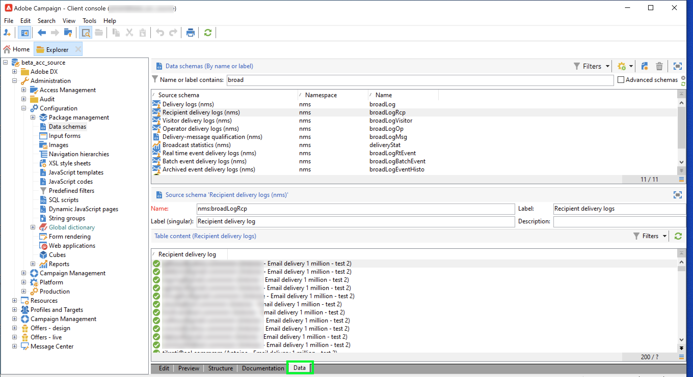

# Adobe Campaign Managed Cloud Services

Adobe Experience Platform permite la ingesta de datos de fuentes externas, al tiempo que permite estructurar, etiquetar y mejorar los datos entrantes mediante los servicios de Platform. Puede ingerir datos de una variedad de fuentes, como aplicaciones de Adobe, almacenamiento basado en la nube, bases de datos y muchas otras.

Adobe Campaign Managed Cloud Services proporciona una plataforma de Managed Services para diseñar experiencias de clientes en canales múltiples y proporciona un entorno para la organización de campañas visuales, la administración de interacciones en tiempo real y la ejecución en canales múltiples. Visite la [Documentación de Adobe Campaign v8](https://experienceleague.adobe.com/docs/campaign/campaign-v8/campaign-home.html?lang=en) para obtener más información.

La fuente de Adobe Campaign Managed Cloud Services le permite llevar los registros de envío y los datos de registros de seguimiento de Adobe Campaign v8 a Adobe Experience Platform.

## Requisitos previos

Antes de crear una conexión de origen para llevar Campaign v8 al Experience Platform, debe completar los siguientes requisitos previos:

* [Configure la importación del registro de eventos mediante la consola del cliente de Adobe Campaign](#view-delivery-and-tracking-log-data)
* [Creación de un esquema XDM ExperienceEvent](#create-a-schema)
* [Crear un conjunto de datos](#create-a-dataset)

### Ver datos de registro de envío y seguimiento {#view-delivery-and-tracking-log-data}

>[!IMPORTANT]
>
>Debe tener acceso a la consola del cliente de Adobe Campaign v8 para poder ver los datos de registro en Campaign. Visite la [Documentación de Campaign v8](https://experienceleague.adobe.com/docs/campaign/campaign-v8/deploy/connect.html?lang=en) para obtener información sobre cómo descargar e instalar la consola del cliente.

Inicie sesión en la instancia de Campaign v8 a través de la consola de cliente. En el [!DNL Explorer] , seleccione [!DNL Administration] y, a continuación, seleccione [!DNL Configuration]. A continuación, seleccione [!DNL Data schemas] y, a continuación, aplique la variable `broadLog` filtro por nombre o etiqueta. En la lista que aparece, seleccione el esquema de origen de los registros de envío de destinatario con el nombre `broadLogRcp`.

A continuación, seleccione la **Datos** pestaña .

Clic con el botón derecho/pulsación de teclas en el panel de datos para abrir el menú contextual. Desde aquí, seleccione **Configurar lista...**

Aparecerá la ventana de configuración de la lista, que le proporciona una interfaz en la que puede agregar los campos deseados a la lista preexistente para ver los datos en el panel de datos.

Ahora puede ver los registros de envío de los destinatarios, incluidos los campos de configuración agregados en el paso anterior.

>[!TIP]
>
>Puede repetir los mismos pasos, pero filtrar por `tracking` para ver los datos del registro de seguimiento.

### Creación de un esquema {#create-a-schema}

A continuación, cree un esquema XDM ExperienceEvent para los registros de envío y de seguimiento. Debe aplicar el grupo de campos Registros de entrega de campaña al esquema de registros de envío y al grupo de campos Registros de seguimiento de campaña al esquema de registros de seguimiento. También debe definir la variable `externalID` como identidad principal del esquema.

>[!NOTE]
>
>El esquema XDM ExperienceEvent debe estar habilitado para el perfil para poder introducir los datos de Campaign en [!DNL Real-time Customer Profile].

Para obtener instrucciones detalladas sobre cómo crear un esquema, consulte la guía de [creación de un esquema XDM en la interfaz de usuario](../../../xdm/tutorials/create-schema-ui.md).

### Crear un conjunto de datos {#create-a-dataset}

Finalmente, debe crear un conjunto de datos para los esquemas. Para obtener instrucciones detalladas sobre cómo crear un conjunto de datos, consulte la guía de [creación de un conjunto de datos en la interfaz de usuario](../../../catalog/datasets/user-guide.md).

## Creación de una conexión de origen de Adobe Campaign Managed Cloud Services mediante la interfaz de usuario de Platform

Ahora que ha accedido a los registros de datos en la consola del cliente de Campaign, ha creado un esquema y un conjunto de datos, puede continuar creando una conexión de origen para llevar los datos de Campaign Managed Services a Platform.

Para obtener instrucciones detalladas sobre cómo llevar los datos de registros de envío y registros de seguimiento de Campaign v8 a Experience Platform, consulte la guía de [creación de una conexión de origen de Managed Services Campaign en la interfaz de usuario](../../tutorials/ui/create/adobe-applications/campaign.md).