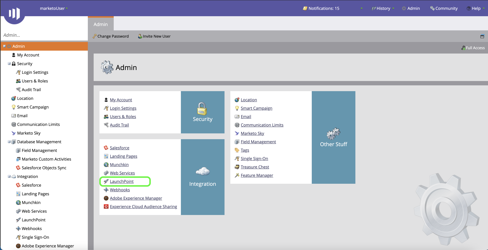

# Autentique su [!DNL Marketo Engage] conector de origen

Antes de crear un [!DNL Marketo Engage] (en lo sucesivo, &quot;el[!DNL Marketo]&quot;) conector de origen, primero debe configurar un servicio personalizado a través del [!DNL Marketo] , así como recuperar valores para su ID de Munchkin, ID de cliente y secreto de cliente.

La documentación siguiente proporciona los pasos para adquirir credenciales de autenticación para crear una [!DNL Marketo] conector de origen.

## Configuración de una función nueva

El primer paso para adquirir las credenciales de autenticación es configurar una nueva función mediante la función [[!DNL Marketo]](https://app-sjint.marketo.com/#MM0A1) interfaz.

Iniciar sesión en [!DNL Marketo] y seleccione **[!DNL Admin]** en la barra de navegación superior.

La variable *[!DNL Users & Role]s* contiene información sobre usuarios, funciones e historiales de inicio de sesión. Para crear una función nueva, seleccione **[!DNL Roles]** en el encabezado superior y, a continuación, seleccione **[!DNL New Role]**.

Aparece el cuadro de diálogo **[!DNL Create New Role]**. Proporcione un nombre y una descripción y, a continuación, seleccione los permisos que desee conceder para esta función. Los permisos están restringidos a espacios de trabajo específicos y los usuarios solo pueden realizar acciones en espacios de trabajo en los que tengan permisos.

Una vez seleccionados los permisos que desea conceder, seleccione **[!DNL Create]**.

Puede administrar permisos restringidos en la API al crear funciones con [!DNL Marketo]. En lugar de seleccionar &quot;API de acceso&quot;, puede proporcionar una función con el nivel mínimo de acceso seleccionando los siguientes permisos:

* [!DNL Read-Only Activity]
* [!DNL Read-Only Assets]
* [!DNL Read-Only Campaign]
* [!DNL Read-Only Company]
* [!DNL Read-Only Custom Object]
* [!DNL Read-Only Custom Object Type]
* [!DNL Read-Only Named Account]
* [!DNL Read-Only Named Account List]
* [!DNL Read-Only Opportunity]
* [!DNL Read-Only Person]
* [!DNL Read-Only Sales Person]

## Configuración de un nuevo usuario

De forma similar a las funciones, puede configurar un nuevo usuario desde la variable **[!DNL Users & Roles]** página. La variable **[!DNL Users]** proporciona una lista de usuarios activos aprovisionados actualmente en Marketo. Select **[!DNL Invite New User]** para aprovisionar un nuevo usuario.

Aparece un menú de cuadro de diálogo emergente. Proporcione la información apropiada para su correo electrónico, nombre, apellidos y motivo. Durante este paso, también puede establecer una fecha de caducidad para el acceso a la nueva cuenta de usuario que está invitando. Cuando termine, seleccione **[!DNL Next]**.

>[!IMPORTANT]
>
>Al configurar un usuario nuevo, debe asignar acceso a un usuario que esté dedicado exclusivamente al servicio personalizado que está creando.

Seleccione los campos adecuados en la **[!DNL Permissions]** y, a continuación, seleccione **[!DNL API Only]** para proporcionar una función de API al nuevo usuario. Select **[!DNL Next]** para continuar.

Para completar el proceso, seleccione **[!DNL Send]**.

## Configuración de un servicio personalizado

Una vez que haya establecido un nuevo usuario, puede configurar un servicio personalizado para recuperar las nuevas credenciales. En la página de administración, seleccione **[!DNL LaunchPoint]**.

La variable **[!DNL Installed services]** contiene una lista de servicios existentes; para crear un nuevo servicio personalizado, seleccione **[!DNL New]** y, a continuación, seleccione **[!DNL New Service]**.

Asigne un nombre descriptivo al nuevo servicio y, a continuación, seleccione **[!DNL Custom]** de la variable **[!DNL Service]** menú desplegable. Proporcione una descripción adecuada y, a continuación, seleccione el usuario que desea aprovisionar en el **[!DNL API Only User]** menú desplegable. Una vez rellenados los detalles necesarios, seleccione **[!DNL Create]** para crear el nuevo servicio personalizado.

## Obtenga su ID de cliente y secreto de cliente

Con la creación de un nuevo servicio personalizado, ahora puede recuperar valores para el ID de cliente y el secreto de cliente. En el **[!DNL Installed Services]** , busque el servicio personalizado al que desea acceder y, a continuación, seleccione **[!DNL View Details]**.

Aparece un cuadro de diálogo que contiene el ID de cliente y el secreto de cliente.

## Obtenga su ID de Munchkin

El paso final que debe completar para autenticar su [!DNL Marketo] el conector de origen es para recuperar su ID de Munchkin. En la página de administración, seleccione **[!DNL Munchkin]** en el **[!DNL Integration]** panel.

La variable *[!DNL Munchkin]* aparece, con su ID de Munchkin único en la parte superior del panel.

Combinado con su ID de cliente y secreto de cliente, puede utilizar su ID de Munchkin para configurar una nueva cuenta y [crear una nueva [!DNL Marketo] conexión de origen](../../../tutorials/ui/create/adobe-applications/marketo.md) en Experience Platform.
