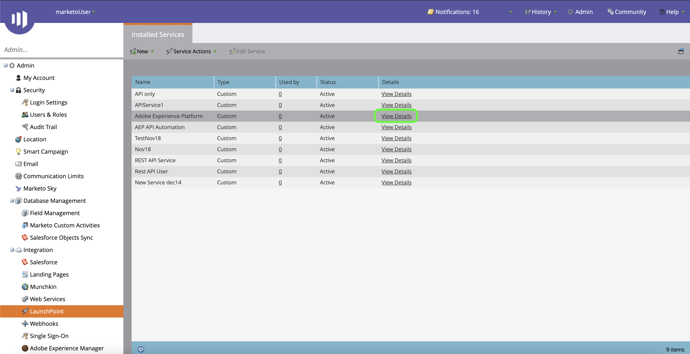

# Autenticar el conector de origen [!DNL Marketo Engage]

Para poder crear un conector de origen de [!DNL Marketo Engage] (denominado en adelante &quot;[!DNL Marketo]&quot;), primero debe configurar un servicio personalizado a través de la interfaz [!DNL Marketo], así como recuperar los valores del ID de Munchkin, el ID de cliente y el secreto de cliente.

La documentación siguiente proporciona pasos sobre cómo adquirir credenciales de autenticación para crear un conector de origen de [!DNL Marketo].

## Configurar una función nueva

El primer paso para adquirir las credenciales de autenticación es configurar una función nueva a través de la interfaz [[!DNL Marketo]](https://app-sjint.marketo.com/#MM0A1).

Inicie sesión en [!DNL Marketo] y seleccione **[!DNL Admin]** en la barra de navegación superior.

La página *[!DNL Users & Role]s* contiene información sobre usuarios, roles e historiales de inicio de sesión. Para crear un rol nuevo, seleccione **[!DNL Roles]** en el encabezado superior y luego seleccione **[!DNL New Role]**.

Aparece el cuadro de diálogo **[!DNL Create New Role]**. Proporcione un nombre y una descripción y, a continuación, seleccione los permisos que desee conceder para esta función. Los permisos están restringidos a espacios de trabajo específicos y los usuarios solo pueden realizar acciones en espacios de trabajo en los que tienen permisos.

Una vez que haya seleccionado los permisos que desea conceder, seleccione **[!DNL Create]**.

Puede administrar permisos restringidos en la API al crear funciones con [!DNL Marketo]. En lugar de seleccionar &quot;API de acceso&quot;, puede proporcionar a un rol el nivel mínimo de acceso seleccionando los siguientes permisos:

* [!DNL Read-Only Activity]
* [!DNL Read-Only Assets]
* [!DNL Read-Only Campaign]
* [!DNL Read-Only Company]
* [!DNL Read-Only Custom Object]
* [!DNL Read-Only Custom Object Type]
* [!DNL Read-Only Named Account]
* [!DNL Read-Only Named Account List]
* [!DNL Read-Only Opportunity]
* [!DNL Read-Only Person]
* [!DNL Read-Only Sales Person]

## Configuración de un nuevo usuario

De forma similar a las funciones, puede configurar un nuevo usuario desde la página **[!DNL Users & Roles]**. La página **[!DNL Users]** proporciona una lista de los usuarios activos que están aprovisionados actualmente en Marketo. Seleccione **[!DNL Invite New User]** para aprovisionar un nuevo usuario.

Aparecerá un menú de diálogo emergente. Proporcione la información adecuada para su correo electrónico, nombre, apellidos y motivo. Durante este paso, también puede establecer una fecha de caducidad para el acceso de la nueva cuenta de usuario que está invitando. Cuando termine, seleccione **[!DNL Next]**.

>[!IMPORTANT]
>
>Al configurar un usuario nuevo, debe asignar acceso a un usuario que esté dedicado estrictamente al servicio personalizado que está creando.

Seleccione los campos adecuados en el paso **[!DNL Permissions]** y, a continuación, active la casilla de verificación **[!DNL API Only]** para proporcionar una función de API al nuevo usuario. Seleccione **[!DNL Next]** para continuar.

Para completar el proceso, seleccione **[!DNL Send]**.

## Configurar un servicio personalizado

Una vez que haya establecido un nuevo usuario, puede configurar un servicio personalizado para recuperar las nuevas credenciales. En la página de administración, seleccione **[!DNL LaunchPoint]**.

La página **[!DNL Installed services]** contiene una lista de servicios existentes. Para crear un nuevo servicio personalizado, seleccione **[!DNL New]** y después seleccione **[!DNL New Service]**.

Proporcione a su nuevo servicio un nombre descriptivo para mostrar y luego seleccione **[!DNL Custom]** en el menú desplegable **[!DNL Service]**. Proporcione una descripción adecuada y, a continuación, seleccione el usuario que desee aprovisionar en el menú desplegable **[!DNL API Only User]**. Una vez que haya completado los detalles necesarios, seleccione **[!DNL Create]** para crear su nuevo servicio personalizado.

## Obtenga su ID de cliente y secreto de cliente

Con un nuevo servicio personalizado creado, ahora puede recuperar valores para el ID de cliente y el secreto de cliente. En el menú **[!DNL Installed Services]**, busque el servicio personalizado al que desee tener acceso y, a continuación, seleccione **[!DNL View Details]**.

Aparece un cuadro de diálogo que contiene su ID de cliente y secreto de cliente.

## Obtén tu Munchkin ID

El paso final que debe completar para autenticar el conector de origen [!DNL Marketo] es recuperar el ID de Munchkin. En la página de administración, seleccione **[!DNL Munchkin]** en el panel **[!DNL Integration]**.

Aparecerá la página *[!DNL Munchkin]* con el identificador único de Munchkin en la parte superior del panel.

Combinado con tu ID de cliente y tu secreto de cliente, puedes usar tu ID de Munchkin para configurar una nueva cuenta y [crear una nueva [!DNL Marketo] conexión de origen](../../../tutorials/ui/create/adobe-applications/marketo.md) en el Experience Platform.
