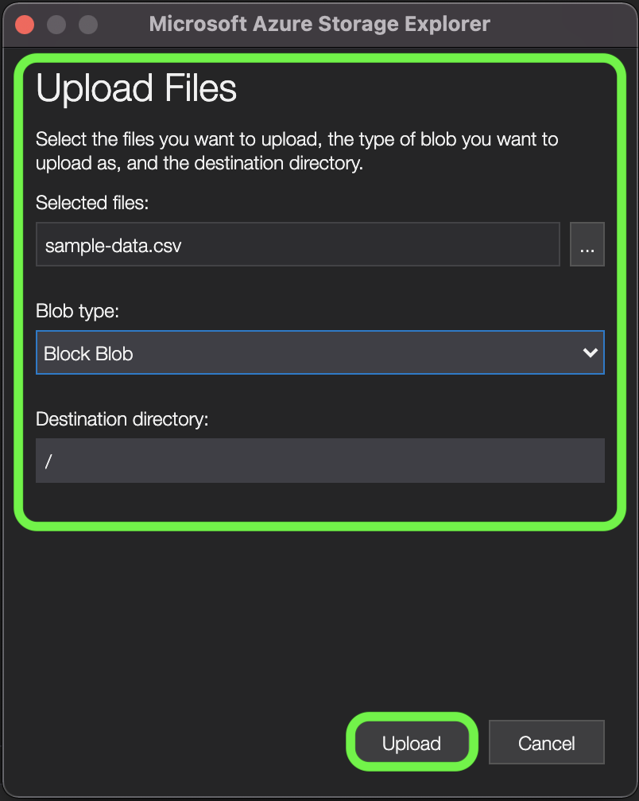

# [!DNL Data Landing Zone]

>[!IMPORTANT]
>
>Esta página es específica para el conector [!DNL Data Landing Zone] *source* en Experience Platform. Para obtener información sobre cómo conectarse al conector [!DNL Data Landing Zone] *destination*, consulte la [[!DNL Data Landing Zone] página de documentación de destino](/help/destinations/catalog/cloud-storage/data-landing-zone.md).

[!DNL Data Landing Zone] es una interfaz de almacenamiento de [!DNL Azure Blob] aprovisionada por Adobe Experience Platform, que le permite acceder a una función de almacenamiento de archivos segura y basada en la nube para traer archivos a Experience Platform. Tiene acceso a un contenedor [!DNL Data Landing Zone] por zona protegida, y el volumen total de datos en todos los contenedores se limita a los datos totales proporcionados con su licencia de productos y servicios de Experience Platform. Todos los clientes de Experience Platform están aprovisionados con un contenedor [!DNL Data Landing Zone] por zona protegida. Puede leer y escribir archivos en su contenedor a través de [!DNL Azure Storage Explorer] o de la interfaz de línea de comandos.

[!DNL Data Landing Zone] admite la autenticación basada en SAS y sus datos están protegidos con mecanismos de seguridad de almacenamiento estándar de [!DNL Azure Blob] en reposo y en tránsito. La autenticación basada en SAS le permite tener acceso de forma segura a su contenedor de [!DNL Data Landing Zone] a través de una conexión pública a Internet. No se requieren cambios de red para tener acceso al contenedor de [!DNL Data Landing Zone], lo que significa que no es necesario configurar listas de permitidos ni configuraciones entre regiones para la red. Experience Platform exige una caducidad estricta de siete días para todos los archivos y carpetas cargados en un contenedor de [!DNL Data Landing Zone]. Todos los archivos y carpetas se eliminan pasados siete días.

## Configurar el origen de [!DNL Data Landing Zone] para Experience Platform en Azure {#azure}

Siga los pasos a continuación para aprender a configurar su cuenta de [!DNL Data Landing Zone] para Experience Platform en Azure.

>[!NOTE]
>
>Si desea tener acceso a [!DNL Data Landing Zone] desde [!DNL Azure Data Factory], debe crear un servicio vinculado para [!DNL Data Landing Zone] mediante las [credenciales SAS](../../tutorials/ui/create/cloud-storage/data-landing-zone.md#retrieve-your-data-landing-zone-credentials) proporcionadas por Experience Platform. Una vez que haya creado el servicio vinculado, podrá explorar su [!DNL Data Landing Zone] seleccionando la ruta de acceso del contenedor en lugar de la ruta de acceso raíz predeterminada.

### Restricciones de nomenclatura para archivos y directorios

A continuación se muestra una lista de restricciones que debe tener en cuenta al nombrar los archivos o directorios de almacenamiento en la nube.

- Los nombres de componentes de directorio y archivo no pueden superar los 255 caracteres.
- Los nombres de directorio y archivo no pueden terminar con una barra diagonal (`/`). Si se proporciona, se eliminará automáticamente.
- Los siguientes caracteres de URL reservadas deben ser de escape correcto: `! ' ( ) ; @ & = + $ , % # [ ]`
- No se permiten los siguientes caracteres: `" \ / : | < > * ?`.
- No se permiten caracteres de ruta de URL no válidos. Los puntos de código como `\uE000`, si bien son válidos en los nombres de archivo NTFS, no son caracteres Unicode válidos. Además, algunos caracteres ASCII o Unicode, como los caracteres de control (como `0x00` a `0x1F`, `\u0081`, etc.), tampoco están permitidos. Para las reglas que rigen las cadenas Unicode en HTTP/1.1, consulte [RFC 2616, Section 2.2: Basic Rules](https://www.ietf.org/rfc/rfc2616.txt) y [RFC 3987](https://www.ietf.org/rfc/rfc3987.txt).
- No se permiten los siguientes nombres de archivo: LPT1, LPT2, LPT3, LPT4, LPT5, LPT6, LPT7, LPT8, LPT9, COM1, COM2, COM3, COM4, COM5, COM6, COM7, COM8, COM9, PRN, AUX, NUL, CON, CLOCK$, carácter de punto (.) y dos caracteres de punto (..).

### Administrar el contenido de la zona de aterrizaje de datos{#manage-the-contents-of-your-data-landing-zone}

Puede usar [[!DNL Azure Storage Explorer]](https://azure.microsoft.com/en-us/features/storage-explorer/) para administrar el contenido de su contenedor de [!DNL Data Landing Zone].

En la interfaz de usuario de [!DNL Azure Storage Explorer], seleccione el icono de conexión en el panel de navegación izquierdo. Aparecerá la ventana **Seleccionar recurso**, que le proporcionará las opciones para conectarse a. Seleccione **[!DNL Blob container]** para conectarse a [!DNL Data Landing Zone].


A continuación, seleccione **URL de firma de acceso compartido (SAS)** como método de conexión y, a continuación, seleccione **Siguiente**.


Después de seleccionar el método de conexión, debe proporcionar **nombre para mostrar** y la URL de SAS de contenedor **[!DNL Blob]** que corresponda a su contenedor [!DNL Data Landing Zone].

>[!TIP]
>
>Puede recuperar sus credenciales de [!DNL Data Landing Zone] del catálogo de orígenes en la interfaz de usuario de Experience Platform.

Proporcione su URL SAS [!DNL Data Landing Zone] y seleccione **Siguiente**


Aparece la ventana **Resumen**, que le proporciona una descripción general de la configuración, incluida información sobre el extremo y los permisos de [!DNL Blob]. Cuando esté listo, seleccione **Conectar**.


Una conexión correcta actualiza la interfaz de usuario de [!DNL Azure Storage Explorer] con el contenedor de [!DNL Data Landing Zone].


Con el contenedor [!DNL Data Landing Zone] conectado a [!DNL Azure Storage Explorer], ahora puede empezar a cargar archivos en el contenedor [!DNL Data Landing Zone]. Para cargar, selecciona **Cargar** y luego selecciona **Cargar archivos**.


Una vez que haya seleccionado el archivo que desea cargar, debe identificar el tipo de [!DNL Blob] con el que desea cargarlo y el directorio de destino deseado. Cuando termine, seleccione **Cargar**.

| [!DNL Blob] tipos | Descripción |
| --- | --- |
| Bloquear [!DNL Blob] | Los bloques [!DNL Blobs] están optimizados para cargar grandes cantidades de datos de manera eficiente. El bloque [!DNL Blobs] es la opción predeterminada para [!DNL Data Landing Zone]. |
| Anexar [!DNL Blob] | Anexar [!DNL Blobs] está optimizado para anexar datos al final del archivo. |



### Cargar archivos en su [!DNL Data Landing Zone] mediante la interfaz de línea de comandos

También puede usar la interfaz de línea de comandos de su dispositivo y acceder a cargar archivos en su [!DNL Data Landing Zone].

### Carga de un archivo mediante Bash

El siguiente ejemplo usa Bash y cURL para cargar un archivo en un [!DNL Data Landing Zone] con la API REST [!DNL Azure Blob Storage]:

```shell
# Set Azure Blob-related settings
DATE_NOW=$(date -Ru | sed 's/\+0000/GMT/')
AZ_VERSION="2018-03-28"
AZ_BLOB_URL="<URL TO BLOB ACCOUNT>"
AZ_BLOB_CONTAINER="<BLOB CONTAINER NAME>"
AZ_BLOB_TARGET="${AZ_BLOB_URL}/${AZ_BLOB_CONTAINER}"
AZ_SAS_TOKEN="<SAS TOKEN, STARTING WITH ? AND ENDING WITH %3D>"

# Path to the file we wish to upload
FILE_PATH="</PATH/TO/FILE>"
FILE_NAME=$(basename "$FILE_PATH")

# Execute HTTP PUT to upload file (remove '-v' flag to suppress verbose output)
curl -v -X PUT \
   -H "Content-Type: application/octet-stream" \
   -H "x-ms-date: ${DATE_NOW}" \
   -H "x-ms-version: ${AZ_VERSION}" \
   -H "x-ms-blob-type: BlockBlob" \
   --data-binary "@${FILE_PATH}" "${AZ_BLOB_TARGET}/${FILE_NAME}${AZ_SAS_TOKEN}"
```

### Carga de un archivo mediante Python

El siguiente ejemplo usa [!DNL Microsoft's] Python v12 SDK para cargar un archivo en un [!DNL Data Landing Zone]:

>[!TIP]
>
>Aunque el ejemplo siguiente utiliza el URI SAS completo para conectarse a un contenedor de [!DNL Azure Blob], puede utilizar otros métodos y operaciones para autenticarse. Consulte este [[!DNL Microsoft] documento sobre Python v12 SDK](https://docs.microsoft.com/en-us/azure/storage/blobs/storage-quickstart-blobs-python) para obtener más información.

```py
import os
from azure.storage.blob import ContainerClient

try:
    # Set Azure Blob-related settings
    sasUri = "<SAS URI>"
    srcFilePath = "<FULL PATH TO FILE>" 
    srcFileName = os.path.basename(srcFilePath)

    # Connect to container using SAS URI
    containerClient = ContainerClient.from_container_url(sasUri)

    # Upload file to Data Landing Zone with overwrite enabled
    with open(srcFilePath, "rb") as fileToUpload:
        containerClient.upload_blob(srcFileName, fileToUpload, overwrite=True)

except Exception as ex:
    print("Exception: " + ex.strerror)
```

### Cargar un archivo mediante [!DNL AzCopy]

El siguiente ejemplo utiliza la utilidad [!DNL Microsoft's] [!DNL AzCopy] para cargar un archivo en un [!DNL Data Landing Zone]:

>[!TIP]
>
>Aunque el ejemplo siguiente utiliza el comando `copy`, puede usar otros comandos y opciones para cargar un archivo en su [!DNL Data Landing Zone], usando [!DNL AzCopy]. Consulte este [[!DNL Microsoft AzCopy] documento](https://docs.microsoft.com/en-us/azure/storage/common/storage-ref-azcopy?toc=/azure/storage/blobs/toc.json) para obtener más información.

```bat
set sasUri=<FULL SAS URI, PROPERLY ESCAPED>
set srcFilePath=<PATH TO LOCAL FILE(S); WORKS WITH WILDCARD PATTERNS>

azcopy copy "%srcFilePath%" "%sasUri%" --overwrite=true --recursive=true
```

## Configurar el origen de [!DNL Data Landing Zone] para Experience Platform en Amazon Web Service {#aws}

>[!AVAILABILITY]
>
>Esta sección se aplica a las implementaciones de Experience Platform que se ejecutan en Amazon Web Service (AWS). Experience Platform que se ejecuta en AWS está disponible actualmente para un número limitado de clientes. Para obtener más información sobre la infraestructura de Experience Platform compatible, consulte la [descripción general de la nube múltiple de Experience Platform](https://experienceleague.adobe.com/en/docs/experience-platform/landing/multi-cloud).

Siga los pasos a continuación para aprender a configurar su cuenta de [!DNL Data Landing Zone] para Experience Platform en Amazon Web Service (AWS).

### LISTA DE PERMITIDOS de direcciones IP para la conexión en AWS

Debe añadir direcciones IP específicas de la región a la lista de permitidos antes de conectar las fuentes a Experience Platform en AWS. Para obtener más información, lea la guía de [inclusión en la lista de permitidos de direcciones IP para conectarse a Experience Platform en AWS](../../ip-address-allow-list.md).

### Configurar la CLI de AWS y realizar operaciones

- Lea la guía sobre [instalar o actualizar a la última versión de la CLI de AWS](https://docs.aws.amazon.com/cli/latest/userguide/getting-started-install.html).

### Configuración de la CLI de AWS con credenciales temporales

Utilice el comando AWS `configure` para configurar su CLI con claves de acceso y un token de sesión.

```shell
aws configure
```

Cuando se le solicite, introduzca los siguientes valores:

- ID. de clave de acceso de AWS: `{YOUR_ACCESS_KEY_ID}`
- Clave de acceso secreto de AWS: `{YOUR_SECRET_ACCESS_KEY}`
- Nombre de región predeterminado: `{YOUR_REGION}` (por ejemplo, `us-west-2`)
- Formato de salida predeterminado: `json`

A continuación, establezca el token de sesión:

```shell
aws configure set aws_session_token your-session-token
```

### Trabajar con archivos en [!DNL Amazon S3]

>[!BEGINTABS]

>[!TAB Cargar un archivo a Amazon S3]

Plantilla:

```shell
aws s3 cp local-file-path s3://bucketName/dlzFolder/remote-file-Name
```

Por ejemplo:

```shell
aws s3 cp example.txt s3://bucketName/dlzFolder/example.txt
```


>[!TAB Descargar un archivo de Amazon S3]

Plantilla:

```shell
aws s3 cp s3://bucketName/dlzFolder/remote-file local-file-path
```

Por ejemplo:

```shell
aws s3 cp s3://bucketName/dlzFolder/example.txt example.txt
```

>[!ENDTABS]

### Use sus credenciales de [!DNL Data Landing Zone] para iniciar sesión en la consola de AWS

#### Extraiga sus credenciales

En primer lugar, debe obtener lo siguiente:

- `awsAccessKeyId`
- `awsSecretAccessKey`
- `awsSessionToken`

#### Generar un token de inicio de sesión

A continuación, utilice las credenciales extraídas para crear una sesión y generar un token de inicio de sesión con el punto final de AWS Federation:

```py
import json
import requests
 
# Example DLZ response with credentials
response_json = '''{
    "credentials": {
        "awsAccessKeyId": "your-access-key",
        "awsSecretAccessKey": "your-secret-key",
        "awsSessionToken": "your-session-token"
    }
}'''
 
# Parse credentials
response_data = json.loads(response_json)
aws_access_key_id = response_data['credentials']['awsAccessKeyId']
aws_secret_access_key = response_data['credentials']['awsSecretAccessKey']
aws_session_token = response_data['credentials']['awsSessionToken']
 
# Create session dictionary
session = {
    'sessionId': aws_access_key_id,
    'sessionKey': aws_secret_access_key,
    'sessionToken': aws_session_token
}
 
# Generate the sign-in token
signin_token_url = "https://signin.aws.amazon.com/federation"
signin_token_payload = {
    "Action": "getSigninToken",
    "Session": json.dumps(session)
}
signin_token_response = requests.post(signin_token_url, data=signin_token_payload)
signin_token = signin_token_response.json()['SigninToken']
```

#### Construir la URL de inicio de sesión en la consola de AWS

Una vez que tenga el token de inicio de sesión, podrá generar la URL que inicie sesión en la consola de AWS y apunte directamente al bloque [!DNL Amazon S3] deseado.

```py
from urllib.parse import quote
 
# Define the S3 bucket and folder path you want to access
bucket_name = "your-bucket-name"
bucket_path = "your-bucket-folder"
 
# Construct the destination URL
destination_url = f"https://s3.console.aws.amazon.com/s3/buckets/{bucket_name}?prefix={bucket_path}/&tab=objects"
 
# Create the final sign-in URL
signin_url = f"https://signin.aws.amazon.com/federation?Action=login&Issuer=YourAppName&Destination={quote(destination_url)}&SigninToken={signin_token}"
 
print(f"Sign-in URL: {signin_url}")
```

#### Acceso a la consola de AWS

Por último, vaya a la dirección URL generada para iniciar sesión directamente en la consola de AWS con sus credenciales de [!DNL Data Landing Zone], lo que proporciona acceso a una carpeta específica dentro de un bloque de [!DNL Amazon S3]. La dirección URL de inicio de sesión le lleva directamente a esa carpeta, lo que garantiza que solo vea y administre los datos permitidos.

## Conectar [!DNL Data Landing Zone] a Experience Platform

>[!IMPORTANT]
>
>- Para conectarse al origen, necesita los permisos de control de acceso de **[!UICONTROL Ver orígenes]** y **[!UICONTROL Administrar orígenes]**. Para obtener más información, lea la [descripción general del control de acceso](../../../access-control/home.md) o póngase en contacto con el administrador del producto para obtener los permisos necesarios.
>
>- Actualmente no se admiten vínculos privados al conectarse a Experience Platform mediante [!DNL Data Landing Zone]. Los únicos métodos admitidos para el acceso son los enumerados [aquí](#manage-the-contents-of-your-data-landing-zone).

La siguiente documentación proporciona información sobre cómo obtener datos del contenedor de [!DNL Data Landing Zone] a Adobe Experience Platform mediante API o la interfaz de usuario.

### Uso de API

- [Crear una conexión de origen  [!DNL Data Landing Zone]  mediante la API de Flow Service](../../tutorials/api/create/cloud-storage/data-landing-zone.md)
- [Cree un flujo de datos para una fuente de almacenamiento en la nube mediante la API de Flow Service](../../tutorials/api/collect/cloud-storage.md)

### Uso de la IU

- [Conectar  [!DNL Data Landing Zone] a Experience Platform mediante la interfaz de usuario](../../tutorials/ui/create/cloud-storage/data-landing-zone.md)
- [Cree un flujo de datos para una conexión de almacenamiento en la nube en la IU](../../tutorials/ui/dataflow/batch/cloud-storage.md)

