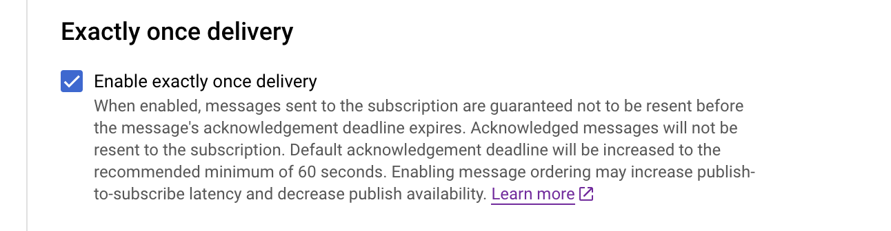

# [!DNL Google PubSub] origen

>[!IMPORTANT]
>
>El [!DNL Google PubSub] La fuente de está disponible en el catálogo de fuentes de para los usuarios que han adquirido Real-time Customer Data Platform Ultimate.

Adobe Experience Platform proporciona conectividad nativa para proveedores en la nube como [!DNL AWS], [!DNL Google Cloud Platform], y [!DNL Azure], lo que le permite introducir datos de estos sistemas en Platform para utilizarlos en servicios y destinos descendentes.

Las fuentes de almacenamiento en la nube pueden llevar los datos a Platform sin necesidad de descargarlos, formatearlos o cargarlos. Los datos introducidos pueden tener el formato XDM JSON, XDM Parquet o estar delimitados. Cada paso del proceso se integra en el flujo de trabajo de fuentes. Platform le permite introducir datos de [!DNL Google PubSub] en tiempo real.

## Requisitos previos {#prerequisites}

Esta sección describe la configuración de requisitos previos que debe completar antes de conectar su [!DNL Google PubSub] cuenta para el Experience Platform.

### Crear cuenta de servicio {#create-service-account}

A **cuenta de servicio** es un tipo de cuenta que a menudo utiliza una aplicación o una carga de trabajo informática, en lugar de una persona. Una cuenta de servicio se identifica mediante su dirección de correo electrónico, que es única para la cuenta.

* Por un lado, las cuentas de servicio son **principales** - puede conceder acceso a las cuentas de servicio a [!DNL Google Cloud] recursos. Por ejemplo, puede otorgar a una cuenta de servicio la función de administrador de proceso `(roles/compute.admin)` en un proyecto determinado. Esto permite que la cuenta de servicio pueda administrar los recursos de Compute Engine en ese proyecto en particular.
* Por otro lado, las cuentas de servicio también son recursos: puede dar a otras entidades principales permiso para acceder a la cuenta de servicio. Por ejemplo, puede otorgar a un usuario la función Usuario de cuenta de servicio `(roles/iam.serviceAccountUser)` en una cuenta de servicio para permitir que el usuario adjunte esa cuenta de servicio a los recursos. También puede otorgar a un usuario la función Administrador de cuentas de servicio `(roles/iam.serviceAccountAdmin)` para permitir que el usuario complete tareas como ver, editar, deshabilitar y eliminar la cuenta de servicio.

Para obtener más información sobre cómo determinar el tipo de autenticación adecuado para su caso de uso, lea la [[!DNL Google] guía de métodos de autenticación](https://cloud.google.com/docs/authentication).

Siga los pasos descritos a continuación para crear una cuenta de servicio:

En primer lugar, vaya a [!DNL IAM] página de la [!DNL Google Developer Console] y luego seleccione **[!DNL Create Service Account]**.

A continuación, introduzca un nombre para mostrar y un ID para la cuenta de servicio y, a continuación, seleccione **[!DNL Create and Continue]**.

### Generar claves de cuenta de servicio {#generate-service-account-keys}

Para generar claves para la cuenta de servicio, seleccione el encabezado claves en la página cuentas de servicio. Desde allí, seleccione **[!DNL Add key]** y luego seleccione **[!DNL Create new key]** en el menú desplegable. También puede utilizar este panel para cargar una clave existente.

Cuando se realice correctamente, recibirá un mensaje que indica que la clave privada se ha guardado en el equipo y que se descargará un archivo. A continuación, puede utilizar el contenido de este archivo como credenciales al crear su [!DNL Google PubSub] cuenta en el Experience Platform.

### Conceder permisos en los niveles de tema y suscripción {#grant-permissions}

Para conceder permisos en los niveles de tema y suscripción, vaya a la página de consola del tema y seleccione **[!DNL Show info panel]**. A continuación, debajo de [!DNL Permissions] pestaña, seleccione [!DNL Add Principal] y, a continuación, agregue el principal de la cuenta de servicio junto con los permisos.

## Configuraciones para una optimización óptima [!DNL Google PubSub usage] {#optimal-configurations}

Esta sección describe las configuraciones que se recomiendan para optimizar el uso del [!DNL Google PubSub] origen en el Experience Platform.

### Propiedades de suscripción {#subscription-properties}

Utilice el [!DNL Google Developer Console] hasta **aumentar el plazo de confirmación**. Esto permite que [!DNL Google Publisher] para esperar según el tiempo configurado antes de volver a enviar el mensaje. Este retraso ayuda a reducir la carga innecesaria en el nivel del suscriptor.

Activar **[!DNL exactly one delivery]**. Esta configuración informa a la [!DNL Google Publisher] para garantizar que los mensajes enviados a la suscripción no se vuelvan a enviar antes de que caduque el plazo de confirmación. Puede utilizar esta configuración para asegurarse de que los mensajes de confirmación no se reenvíen a la suscripción.

Puede activar **[!DNL Retry after exponential backoff delay]** para reducir el riesgo de sobrecargar aún más el servidor. Puede habilitar esta configuración en la variable [!DNL Google Developer Console] para mitigar mejor los errores transitorios (errores temporales que normalmente se resuelven por sí mismos), proporcionando al sistema más tiempo para recuperarse antes de intentar otra conexión.

Usted debe **establezca una duración de retención de mensaje de suscripción de 24 horas o más** para garantizar que los datos no reconocidos no se pierdan durante las cargas máximas. Además, **habilitar un tema de carta muerta** para garantizar que la pérdida de datos no se produzca incluso durante casos excepcionales.

>[!IMPORTANT]
>
>Solo puede crear un flujo de datos de origen por [!DNL Google PubSub] suscripción. La reutilización de una suscripción, incluso en entornos limitados, provoca la pérdida de datos.

## Connect [!DNL Google PubSub] al Experience Platform

La siguiente documentación proporciona información sobre cómo conectarse [!DNL Google PubSub] Vaya a Platform mediante las API o la interfaz de usuario de:

### Uso de API

* [Crear una conexión de Google PubSub source mediante la API de Flow Service](../../tutorials/api/create/cloud-storage/google-pubsub.md)
* [Recopilación de datos de flujo continuo mediante la API de Flow Service](../../tutorials/api/collect/streaming.md)

### Uso de la IU

* [Cree una conexión de origen Google PubSub en la interfaz de usuario de](../../tutorials/ui/create/cloud-storage/google-pubsub.md)
* [Configure un flujo de datos para una conexión de almacenamiento en la nube en la IU](../../tutorials/ui/dataflow/streaming/cloud-storage-streaming.md)
