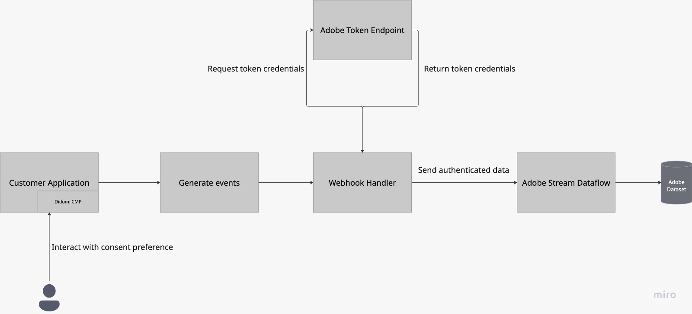

# [!DNL Didomi]

>[!AVAILABILITY]
>
>El origen [!DNL Didomi] está en la versión beta. Lea los [términos y condiciones](../../home.md#terms-and-conditions) en la descripción general de orígenes para obtener más información sobre el uso de orígenes etiquetados como beta.

[!DNL Didomi] es una plataforma de administración de preferencias y consentimiento que ayuda a las organizaciones a recopilar, administrar y aplicar las opciones del usuario con respecto a los datos personales en sitios web, aplicaciones y herramientas internas.

Adobe Experience Platform admite la ingesta de datos de una amplia gama de sistemas externos, incluido el almacenamiento en la nube, bases de datos y aplicaciones como [!DNL Didomi], a través de un sistema de conectores de origen. Utilice fuentes para autenticar sistemas externos, administrar el flujo de datos a Experience Platform y garantizar una ingesta coherente y estructurada de los datos de sus clientes.

Utilice el origen [!DNL Didomi] para transmitir en tiempo real los datos de preferencias y consentimiento de usuario de la plataforma de administración de preferencias y consentimiento [!DNL Didomi] a Experience Platform. A través del origen [!DNL Didomi], puede centralizar los datos de consentimiento en Experience Platform y actuar en consecuencia, manteniendo así los perfiles de los clientes y los flujos de trabajo descendentes compatibles y actualizados.

## Requisitos previos

Complete los pasos previos descritos a continuación para conectar correctamente su cuenta de [!DNL Didomi] a Experience Platform.

### LISTA DE PERMITIDOS de direcciones IP

Debe añadir direcciones IP específicas de la región a la lista de permitidos antes de conectar los orígenes a Experience Platform. Para obtener más información, lea la guía de [inclusión en la lista de permitidos de direcciones IP para conectarse a Experience Platform](../../ip-address-allow-list.md).

### Configuración de permisos en Experience Platform

Debe tener los permisos para **[!UICONTROL Ver fuentes]** y **[!UICONTROL Administrar fuentes]** habilitados en su cuenta para conectar su cuenta de [!DNL Didomi] a Experience Platform. Póngase en contacto con el administrador del producto para obtener los permisos necesarios. Para obtener más información, lea la [guía de la interfaz de usuario de control de acceso](../../../access-control/ui/overview.md).

### Recopilar credenciales de API de Adobe

Para conectar [!DNL Didomi] a Experience Platform de forma segura, debe autenticarse con las credenciales de la API de Adobe. Estas credenciales son esenciales para configurar el webhook y la ingesta de datos.

Lea la guía sobre [introducción a las API de Experience Platform](../../../landing/api-authentication.md) para obtener información sobre cómo realizar llamadas a las API de Experience Platform correctamente.

### Creación de un esquema de Experience Platform

>[!TIP]
>
>Puede omitir este paso si ya tiene un esquema XDM existente.

Un esquema **Experience Data Model (XDM)** define la estructura de los datos que enviará de [!DNL Didomi] (por ejemplo, ID de usuario y propósitos de consentimiento) a Experience Platform.

Para crear un esquema, seleccione [!UICONTROL Esquemas] en la navegación izquierda de la interfaz de usuario de Experience Platform y seleccione **[!UICONTROL Crear esquema]**. A continuación, seleccione **[!UICONTROL Estándar]** como tipo de esquema y, a continuación, seleccione **[!UICONTROL Manual]** para crear manualmente los campos. Seleccione una clase base para el esquema y proporcione un nombre para el esquema.

Una vez creado, actualice el esquema añadiendo cualquiera de los campos obligatorios. Asegúrese de que al menos un campo sea un campo [!UICONTROL Identidad] para informar a Experience Platform sobre los valores de identidad principales. Por último, asegúrese de habilitar la opción [!UICONTROL Perfil] para almacenar correctamente sus datos.

Para obtener más información, lea la guía sobre [creación de esquemas en la interfaz de usuario](../../../xdm/tutorials/create-schema-ui.md).

### Crear un conjunto de datos

>[!TIP]
>
>Puede omitir este paso si ya tiene un conjunto de datos.

Se usa un **conjunto de datos** en Experience Platform para almacenar datos entrantes basados en el esquema que defina.

Para crear un conjunto de datos, seleccione [!UICONTROL Conjuntos de datos] en la navegación izquierda de la interfaz de usuario de Experience Platform y, a continuación, seleccione **[!UICONTROL Crear conjunto de datos]**. A continuación, seleccione **[!UICONTROL Crear conjunto de datos a partir del esquema]** y luego seleccione el esquema que desea asociar con el nuevo conjunto de datos.

## Configurar el webhook HTTP en la consola [!DNL Didomi]

[!DNL Webhooks] le permite suscribirse a eventos activados en la plataforma [!DNL Didomi] cuando los usuarios interactúan con sus preferencias de consentimiento. Cuando se produce un evento relevante (por ejemplo, cuando un usuario da o retira su consentimiento) [!DNL Didomi] envía una solicitud HTTP POST en tiempo real que contiene una carga útil JSON al extremo [!DNL webhook] configurado.

Para garantizar la compatibilidad con Experience Platform, su webhook debe cumplir los siguientes requisitos.

| Campo | Descripción | Ejemplo |
| --- | --- | --- | 
| Secreto del cliente | La clave secreta asociada a las credenciales de la API de Adobe. | `d8f3b2e1-4c9a-4a7f-9b2e-8f1c3d2a1b6e` |
| Clave de API | Clave de API pública utilizada para autenticar solicitudes en los servicios de Adobe. |
| Tipo de concesión | Método mediante el cual una aplicación obtiene un token de acceso del servidor de autorización. Establezca este valor en `client_credentials`. | `client_credentials` |
| Ámbito | Los ámbitos de autorización definen los permisos o niveles de acceso específicos que una aplicación solicita al proveedor de API. | `openid,AdobeID,read_organizations,additional_info.projectedProductContext,session` |
| Encabezado de autenticación | Encabezados adicionales necesarios para la solicitud de token de Adobe. | `{"Content-type": "application/x-www-form-urlencoded"}` |
| URL de token | Punto final de token de Adobe. | `https://ims-na1.adobelogin.com/ims/token/v3` |
| URL de extremo | La dirección URL final del conector de Adobe (proporcionada al final de la configuración). | `https://dcs.adobedc.net/collection/your-adobe-endpoint-id` |

{style="table-layout:auto"}

A continuación, configure las siguientes opciones para su [!DNL webhook].

| Campo | Descripción | Valor |
| ---| --- | --- | 
| Encabezados de solicitud | Encabezados personalizados para [!DNL webhook]. Asegúrese de incluir `x-adobe-flow-id`. Puede recuperar este valor después de crear su [flujo de datos](../../tutorials/ui/create/consent-and-preferences/didomi.md#retrieve-the-streaming-endpoint-url). | `{"Content-Type": "application/json", "Cache-Control": "no-cache", "x-adobe-flow-id": "{DATAFLOW_ID}"}` |
| Flatten | Esta propiedad debe comprobarse, ya que garantiza que los datos de [!DNL webhook] se envíen como un objeto plano. | Habilitado |
| Tipos de eventos | Seleccione el grupo específico de [!DNL Didomi] eventos (`event.*` o `user.*`) que deben almacenar en déclencheur [!DNL webhook]. Use `event.*` para hacer un seguimiento de los cambios de preferencias o consentimiento, y use `user.*` para hacer un seguimiento de las actualizaciones del perfil de usuario. Esta selección es necesaria para asegurarse de que solo se envían eventos compatibles a Adobe. Adobe solo admite un esquema por flujo de datos, por lo que la selección de ambos tipos de evento puede provocar errores de ingesta. | La lista de tipos de eventos admitidos es la siguiente: <ul><li>`Event.created`</li><li>`Event.updated`</li><li>`Event.deleted`</li><li>`User.created`</li><li>`User.updated`</li><li>`User.deleted`</li></ul> |

### Descargar el archivo de carga útil de ejemplo {#download-the-sample-payload-file}

En función del grupo de eventos que haya seleccionado, descargue el **archivo de carga útil de ejemplo** adecuado directamente desde la consola [!DNL Didomi]. Este archivo representa la estructura de los datos y se utiliza durante los pasos de esquema y asignación en Adobe.

| **Grupo de eventos** | **Archivo de muestra para descargar** | **Opción de filtrado** |
| --- | ---| --- |
| `event.*` | Descargar una muestra para `event.created` | Filtrar solo para `event.*` eventos |
| `user.*` | Descargar una muestra para `user.created` | Filtrar solo para `user.*` eventos |

## Conecte su cuenta de [!DNL Didomi] a Experience Platform

Lea la guía de [conexión [!DNL Didomi] a Experience Platform](../../tutorials/ui/create/consent-and-preferences/didomi.md) para aprender a crear una conexión de origen e ingerir datos de preferencias y consentimiento de [!DNL Didomi] en Experience Platform.
