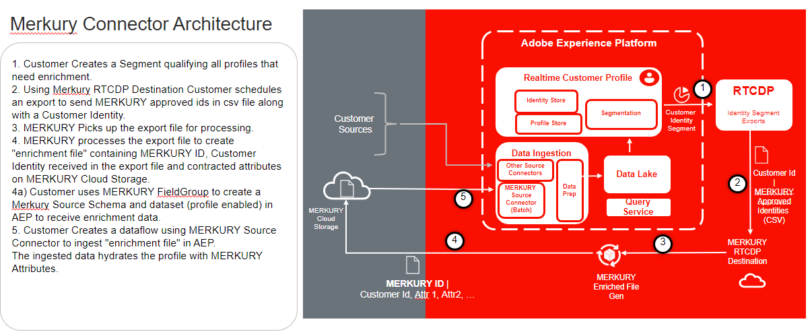

# [!DNL Merkury Enterprise Identity Resolution]

>[!NOTE]
>
>El origen [!DNL Merkury Enterprise Identity Resolution] está en la versión beta. Lea [información general de orígenes](../../home.md#terms-and-conditions) para obtener más información sobre el uso de orígenes etiquetados como beta.

Adobe Experience Platform es compatible con la ingesta de datos desde una aplicación de socio de datos. La compatibilidad con socios de datos incluye [!DNL Merkury Enterprise Identity Resolution].

Puede usar [!DNL Merkury] por [!DNL Merkle] para reconocer a más visitantes digitales, incluso sin usar cookies, y ofrecer las experiencias relevantes y personalizadas que necesita el cliente.

Puede usar la **ID de persona** como parte de la fuente [!DNL Merkury] para combinar todo lo que su organización conoce sobre un individuo en un único perfil completo. Estos detalles pueden incluir lo siguiente:

- comportamientos digitales
- preferencias de compra
- información de identificación, como un nombre, una dirección de correo electrónico, una dirección física o un ID de dispositivo.

Puede dar formato a los datos introducidos como Experience Data Model (XDM) JSON, XDM Parquet o delimitado. Cada paso del proceso está integrado en el trabajo de las fuentes

## LISTA DE PERMITIDOS de direcciones IP

Se debe agregar una lista de direcciones IP a una lista de permitidos antes de trabajar con conectores de origen. Si no se agregan las direcciones IP específicas de la región a la lista de permitidos, pueden producirse errores o no rendimiento al utilizar fuentes. Consulte la página [lista de permitidos de direcciones IP](../../ip-address-allow-list.md) para obtener más información.

## Restricciones de nomenclatura para archivos y directorios

A continuación se muestra una lista de restricciones que debe tener en cuenta al nombrar el archivo o directorio de almacenamiento en la nube.

- Los nombres de componentes de directorio y archivo no pueden superar los 255 caracteres.
- Los nombres de directorio y archivo no pueden terminar con una barra diagonal (`/`). Si se proporciona, se eliminará automáticamente.
- Los siguientes caracteres de URL reservadas deben ser de escape correcto: `! ' ( ) ; @ & = + $ , % # [ ]`
- No se permiten los siguientes caracteres: `" \ / : | < > * ?`.
- No se permiten caracteres de ruta de URL no válidos. Los puntos de código como `\uE000`, si bien son válidos en los nombres de archivo NTFS, no son caracteres Unicode válidos. Además, algunos caracteres ASCII o Unicode, como los caracteres de control (0x00 a 0x1F, \u0081, etc.), tampoco están permitidos. Para las reglas que rigen las cadenas Unicode en HTTP/1.1, consulte [RFC 2616, Section 2.2: Basic Rules](https://www.ietf.org/rfc/rfc2616.txt) y [RFC 3987](https://www.ietf.org/rfc/rfc3987.txt).
- No se permiten los siguientes nombres de archivo: LPT1, LPT2, LPT3, LPT4, LPT5, LPT6, LPT7, LPT8, LPT9, COM1, COM2, COM3, COM4, COM5, COM6, COM7, COM8, COM9, PRN, AUX, NUL, CON, CLOCK$, carácter de punto (.) y dos caracteres de punto (..).

## Requisitos previos

Debe cumplir los siguientes requisitos previos para poder empezar a usar el origen [!DNL Merkury]:

- Debe completar la configuración de [!DNL Merkury] con su equipo de [!DNL Merkury].
- Debe recuperar sus credenciales (clave de acceso, clave secreta y nombre del contenedor) de su equipo [!DNL Merkury]. 

>[!NOTE]
>
>Una ruta de acceso de archivo como `myBucket/folder/subfolder/subsubfolder/abc.csv` puede llevarle únicamente a obtener acceso a `subsubfolder/abc.csv`. Si desea acceder a la subcarpeta, puede especificar el parámetro de contenedor como myBucket y folderPath como folder/subfolder para garantizar que la exploración de archivos comience en la subcarpeta en lugar de `subsubfolder/abc.csv`.

## Pasos siguientes

Al leer este documento, ha completado la configuración de requisitos previos necesaria para llevar los datos de su cuenta de [!DNL Merkury] al Experience Platform. Ahora puede continuar con la guía de [conexión [!DNL Merkury] al Experience Platform mediante la interfaz de usuario](../../tutorials/ui/create/data-partners/merkury.md).
