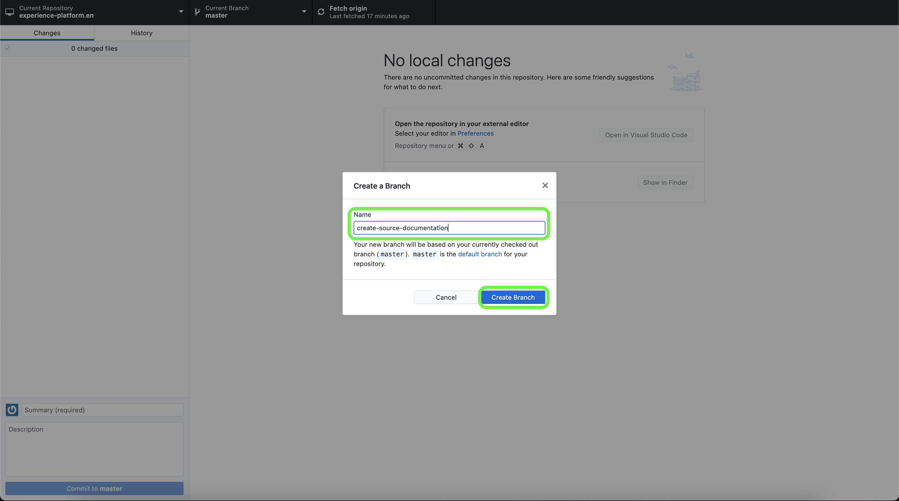

# Utilice un editor de texto en el entorno local para crear una página de documentación de fuentes

Este documento proporciona pasos sobre cómo utilizar el entorno local para crear documentación para el origen y enviar una solicitud de extracción (PR).

>[!TIP]
>
>Los siguientes documentos de la guía de contribución de Adobe se pueden utilizar para respaldar aún más su proceso de documentación: <ul><li>[Instalar las herramientas de creación de Git y Markdown](https://experienceleague.adobe.com/docs/contributor/contributor-guide/setup/install-tools.html?lang=es)</li><li>[Configurar el repositorio Git localmente para la documentación](https://experienceleague.adobe.com/docs/contributor/contributor-guide/setup/local-repo.html?lang=es)</li><li>[Flujo de trabajo de contribución en GitHub para cambios importantes](https://experienceleague.adobe.com/docs/contributor/contributor-guide/setup/full-workflow.html?lang=es)</li></ul>

## Requisitos previos

El siguiente tutorial requiere que tenga GitHub Desktop instalado en el equipo local. Si no tiene GitHub Desktop, puede descargar la aplicación [aquí](https://desktop.github.com/).

## Conéctese a GitHub y configure su entorno de creación local

El primer paso para configurar el entorno de creación local es ir al [repositorio de GitHub de Adobe Experience Platform](https://github.com/AdobeDocs/experience-platform.es).

En la página principal del repositorio de GitHub de Experience Platform, seleccione **Fork**.

Para clonar el repositorio en el equipo local, seleccione **Código**. En el menú desplegable que aparece, seleccione **HTTPS** y, a continuación, seleccione **Abrir con GitHub Desktop**.

>[!TIP]
>
>Para obtener más información, consulte el tutorial sobre [configuración local del repositorio Git para la documentación](https://experienceleague.adobe.com/docs/contributor/contributor-guide/setup/local-repo.html?lang=es#create-a-local-clone-of-the-repository).

A continuación, espere unos momentos para que GitHub Desktop clone el repositorio `experience-platform.en`.

Una vez completado el proceso de clonación, vaya a GitHub Desktop para crear una nueva rama. Seleccione **Principal** en la barra de navegación superior y luego seleccione **Nueva rama**

En el panel emergente que aparece, escriba un nombre descriptivo para la rama y, a continuación, seleccione **Crear rama**.

A continuación, seleccione **Publicar rama**.

## Crear la página de documentación para el origen

Con el repositorio clonado en el equipo local y una nueva rama creada, ahora puedes empezar a crear la página de documentación para tu nuevo origen a través del [editor de texto que elijas](https://experienceleague.adobe.com/docs/contributor/contributor-guide/setup/install-tools.html?lang=es#understand-markdown-editors).

Adobe recomienda usar [Visual Studio Code](https://code.visualstudio.com/) e instalar la extensión de Adobe Markdown Authoring. Para instalar la extensión, inicie Visual Studio Code y, a continuación, seleccione la ficha **Extensiones** en el panel de navegación izquierdo.

A continuación, escriba `Adobe Markdown Authoring` en la barra de búsqueda y seleccione **Instalar** en la página que aparece.

Con el equipo local listo, descargue la [plantilla de documentación de orígenes](../assets/api-template.zip) y extraiga el archivo en `experience-platform.en/help/sources/tutorials/api/create/...`, donde [`...`] representa la categoría que elija. Por ejemplo, si está creando un origen de base de datos, seleccione la carpeta de base de datos.

Finalmente, siga las instrucciones descritas en la plantilla y edite la plantilla con la información relevante perteneciente a su fuente.

## Envíe su documentación para su revisión

Para crear una solicitud de extracción (PR) y enviar la documentación para su revisión, primero guarde el trabajo en [!DNL Visual Studio Code] (o en el editor de texto que haya elegido). A continuación, con GitHub Desktop, introduzca un mensaje de confirmación y seleccione **Confirmar para crear-documentación-origen**.

A continuación, seleccione **Origen push** para cargar el trabajo en la rama remota.

Para crear una solicitud de extracción, seleccione **Crear solicitud de extracción**.

Asegúrese de que las ramas base y de comparación son correctas. Agregue una nota al PR, describiendo su actualización, y luego seleccione **Crear solicitud de extracción**. Se abrirá una PR para fusionar la rama de trabajo del trabajo en la rama maestra del repositorio de Adobe.

>[!TIP]
>
>Deje seleccionada la casilla de verificación **Permitir ediciones por responsables** para garantizar que el equipo de documentación de Adobe pueda realizar ediciones en la PR.

Puede confirmar que la solicitud de extracción se ha enviado inspeccionando la pestaña solicitudes de extracción en https://github.com/AdobeDocs/experience-platform.en.

