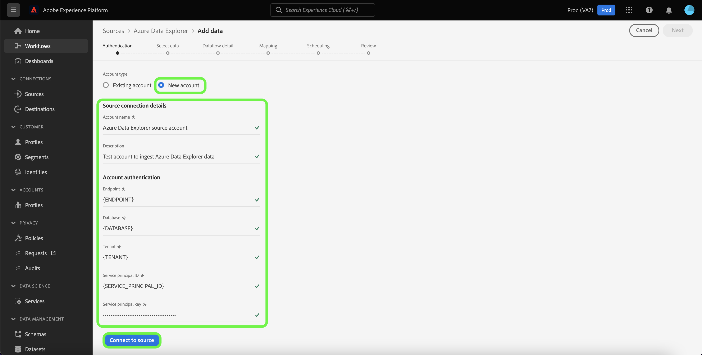

# Crear un *SU ORIGEN* conexión de origen en la interfaz de usuario

*A medida que avanza por esta plantilla, reemplace o elimine todos los párrafos en cursiva (empezando por esta).*

*Comience por actualizar los metadatos (título y descripción) en la parte superior de la página. Ignore todas las instancias de UICONTROL en esta página. Esta es una etiqueta que ayuda a nuestros procesos de traducción automática a traducir correctamente la página a los múltiples idiomas que admitimos. Agregaremos etiquetas a su documentación después de que la envíe.*

Este tutorial proporciona los pasos para crear una *SU FUENTE* conector de origen mediante la interfaz de usuario de Platform.

## Información general

*Proporcione una breve descripción general de su empresa, incluido el valor que proporciona a los clientes. Incluya un vínculo a la página de inicio de la documentación del producto para obtener más información.*

>[!IMPORTANT]
>
>Esta página de documentación fue creada por el *SU ORIGEN* equipo. Para cualquier consulta o solicitud de actualización, póngase en contacto directamente con ellos en *Insertar vínculo o dirección de correo electrónico donde se pueda contactar para obtener actualizaciones*.

## Requisitos previos

*Agregue información en esta sección sobre todo lo que los clientes deben tener en cuenta antes de comenzar a configurar el origen en la interfaz de usuario de Adobe Experience Platform. Puede tratarse de lo siguiente:*

* *necesidad de añadirse a una lista de permitidos*
* *requisitos para el hash de correo electrónico*
* *cualquier detalle de la cuenta de su parte*
* *cómo obtener las credenciales de autenticación para conectarse a la plataforma*

### Recopilar credenciales necesarias

Para poder conectarse *SU ORIGEN* En Platform, debe proporcionar valores para las siguientes propiedades de conexión:

| Credencial | Descripción | Ejemplo |
| --- | --- | --- |
| *credencial uno* | *Agregue una breve descripción a la credencial de autenticación de su fuente aquí* | *Agregue un ejemplo de la credencial de autenticación de su origen aquí* |
| *credencial dos* | *Agregue una breve descripción a la credencial de autenticación de su fuente aquí* | *Agregue un ejemplo de la credencial de autenticación de su origen aquí* |
| *credencial tres* | *Agregue una breve descripción a la credencial de autenticación de su fuente aquí* | *Agregue un ejemplo de la credencial de autenticación de su origen aquí* |

Para obtener más información sobre estas credenciales, consulte la *SU ORIGEN* documentación de autenticación. *Agregue un vínculo a la documentación de autenticación de su plataforma aquí*.

## Conecte su *SU FUENTE* account

En la IU de Platform, seleccione **[!UICONTROL Fuentes]** desde la barra de navegación izquierda para acceder a [!UICONTROL Fuentes] workspace. El [!UICONTROL Catálogo] La pantalla muestra una variedad de fuentes con las que puede crear una cuenta.

Puede seleccionar la categoría adecuada del catálogo en la parte izquierda de la pantalla. También puede encontrar la fuente específica con la que desea trabajar utilizando la opción de búsqueda.

En el *CATEGORÍA DEL ORIGEN* categoría, seleccionar *SU FUENTE*, y luego seleccione **[!UICONTROL Añadir datos]**.

>[!TIP]
>
>Las capturas de pantalla utilizadas a continuación son ejemplos. Al crear su documentación, reemplace las imágenes por capturas de pantalla de su origen real. Puede utilizar la misma trama de marcado y el mismo color, así como los mismos nombres de archivo. Asegúrese de que la captura de pantalla capture toda la pantalla de la interfaz de usuario de Platform. Para obtener información sobre cómo cargar las capturas de pantalla, consulte la guía de [enviar la documentación para su revisión](./github.md).

El **[!UICONTROL Conectar su cuenta de origen]** página. En esta página, puede usar credenciales nuevas o existentes.

### Cuenta existente

Para utilizar una cuenta existente, seleccione la *SU FUENTE* cuenta con la que desea crear un nuevo flujo de datos y seleccione **[!UICONTROL Siguiente]** para continuar.

### Nueva cuenta

Si está creando una cuenta nueva, seleccione **[!UICONTROL Nueva cuenta]** y, a continuación, proporcione un nombre, una descripción opcional y sus credenciales. Cuando termine, seleccione **[!UICONTROL Conectar con el origen]** y, a continuación, espere un poco para que se establezca la nueva conexión.

## Pasos siguientes

*Los flujos de trabajo para los pasos restantes de la creación de un flujo de datos están modularizados. Si desea realizar alguna llamada específica con respecto a su fuente, consulte la sección de recursos adicionales a continuación.*

Al seguir este tutorial, ha establecido una conexión con su *SU FUENTE* cuenta. Ahora puede continuar con el siguiente tutorial y [configuración de un flujo de datos para introducir datos en Platform](https://experienceleague.adobe.com/docs/experience-platform/sources/ui-tutorials/dataflow/crm.html).

## Recursos adicionales

*Esta es una sección opcional en la que puede proporcionar más vínculos a la documentación del producto o a cualquier otro paso, captura de pantalla o matiz que considere importante para que el cliente tenga éxito. Puede utilizar esta sección para agregar información o sugerencias sobre todo el flujo de trabajo del origen, especialmente si hay problemas concretos que un usuario final podría encontrar.*
