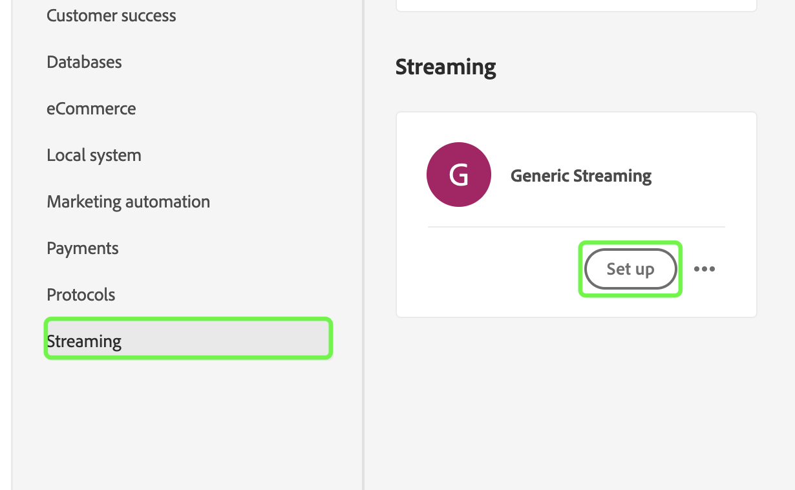

# Probar y enviar el origen

Los pasos finales para integrar su nuevo origen en Adobe Experience Platform mediante fuentes de autoservicio (SDK de transmisión) son probar y enviar el nuevo origen. Una vez que haya completado la especificación de conexión y haya actualizado la especificación del flujo de transmisión, puede empezar a probar la funcionalidad de su fuente a través de la API o la interfaz de usuario. Cuando se realice correctamente, puede enviar la nueva fuente poniéndose en contacto con el representante de Adobe.

En el siguiente documento se proporcionan los pasos para probar y depurar el origen mediante el [[!DNL Flow Service] API](https://www.adobe.io/experience-platform-apis/references/flow-service/).

## Primeros pasos

* Para obtener información sobre cómo realizar llamadas correctamente a las API de Platform, consulte la guía de [introducción a las API de Platform](../../../landing/api-guide.md).
* Para obtener información sobre cómo generar sus credenciales para las API de plataforma, consulte el tutorial sobre [autenticación y acceso a las API de Experience Platform](../../../landing/api-authentication.md).
* Para obtener información sobre cómo configurar [!DNL Postman] para las API de plataforma, consulte el tutorial en [configuración de la consola de desarrollador y [!DNL Postman]](../../../landing/postman.md).
* Para ayudarle con el proceso de prueba y depuración, descargue el [Entorno y recopilación de verificación de fuentes de autoservicio aquí](../assets/sdk-verification.zip) y siga los pasos descritos a continuación.

## Probar el origen mediante la API

Para probar el origen mediante la API, debe ejecutar el [Entorno y recopilación de verificación de fuentes autoservidas](../assets/sdk-verification.zip) en [!DNL Postman] proporciona las variables de entorno apropiadas que pertenecen a su origen.

Para iniciar las pruebas, primero debe configurar la colección y el entorno en [!DNL Postman]. A continuación, especifique el ID de especificación de conexión que desea probar.

>[!NOTE]
>
>Todas las variables de ejemplo siguientes son valores de marcador de posición que debe actualizar, excepto para `flowSpecificationId` y `targetConnectionSpecId`, que son valores fijos.

| Parámetro | Descripción | Ejemplo |
| --- | --- | --- |
| `x-api-key` | Identificador único utilizado para autenticar llamadas a las API de Experience Platform. Consulte el tutorial en [autenticación y acceso a las API de Experience Platform](../../../landing/api-authentication.md) para obtener información sobre cómo recuperar su `x-api-key`. | `c8d9a2f5c1e03789bd22e8efdd1bdc1b` |
| `x-gw-ims-org-id` | Una entidad corporativa que puede ser propietaria o titular de licencias de productos y servicios y permitir el acceso a sus miembros. Consulte el tutorial en [configuración de la consola de desarrollador y [!DNL Postman]](../../../landing/postman.md) para obtener instrucciones sobre cómo recuperar su `x-gw-ims-org-id` información. | `ABCEH0D9KX6A7WA7ATQE0TE@adobeOrg` |
| `authorizationToken` | Token de autorización necesario para completar llamadas a las API de Experience Platform. Consulte el tutorial en [autenticación y acceso a las API de Experience Platform](../../../landing/api-authentication.md) para obtener información sobre cómo recuperar su `authorizationToken`. | `Bearer authorizationToken` |
| `schemaId` | Para que los datos de origen se utilicen en Platform, se debe crear un esquema de destino para estructurar los datos de origen según sus necesidades. Para ver los pasos detallados sobre cómo crear un esquema XDM de destino, consulte el tutorial sobre [creación de un esquema con la API](../../../xdm/api/schemas.md). | `https://ns.adobe.com/{TENANT_ID}.schemas.0ef4ce0d390f0809fad490802f53d30b` |
| `schemaVersion` | La versión única que corresponde al esquema. | `application/vnd.adobe.xed-full-notext+json; version=1` |
| `schemaAltId` | La variable `meta:altId` que se devuelve junto con la variable  `schemaId` al crear un nuevo esquema. | `_{TENANT_ID}.schemas.0ef4ce0d390f0809fad490802f53d30b` |
| `dataSetId` | Para ver los pasos detallados sobre cómo crear un conjunto de datos de destinatario, consulte el tutorial en [creación de un conjunto de datos mediante la API](../../../catalog/api/create-dataset.md). | `5f3c3cedb2805c194ff0b69a` |
| `mappings` | Los conjuntos de asignaciones se pueden utilizar para definir cómo se asignan los datos de un esquema de origen al de un esquema de destino. Para ver los pasos detallados sobre cómo crear una asignación, consulte el tutorial sobre [creación de un conjunto de asignaciones mediante la API](../../../data-prep/api/mapping-set.md). | `[{"destinationXdmPath":"person.name.firstName","sourceAttribute":"email.email_id","identity":false,"version":0},{"destinationXdmPath":"person.name.lastName","sourceAttribute":"email.activity.action","identity":false,"version":0}]` |
| `mappingId` | ID exclusivo que corresponde al conjunto de asignaciones. | `bf5286a9c1ad4266baca76ba3adc9366` |
| `connectionSpecId` | El ID de especificación de conexión que corresponde a su origen. Este es el ID que generó después de [creación de una nueva especificación de conexión](./create.md). | `2e8580db-6489-4726-96de-e33f5f60295f` |
| `flowSpecificationId` | El ID de especificación de flujo de `GenericStreamingAEP`. **Este es un valor fijo**. | `e77fde5a-22a8-11ed-861d-0242ac120002` |
| `targetConnectionSpecId` | El ID de conexión de destino del lago de datos en el que llegan los datos ingestados. **Este es un valor fijo**. | `c604ff05-7f1a-43c0-8e18-33bf874cb11c` |
| `verifyWatTimeInSecond` | El intervalo de tiempo designado que debe seguirse al comprobar la finalización de una ejecución de flujo. | `40` |
| `startTime` | La hora de inicio designada para el flujo de datos. La hora de inicio debe tener un formato de tiempo Unix. | `1597784298` |

Una vez que haya proporcionado todas las variables de entorno, puede empezar a ejecutar la colección utilizando la variable [!DNL Postman] interfaz. En el [!DNL Postman] , seleccione los puntos suspensivos (**...**) al lado [!DNL Sources SSSs Verification Collection] y, a continuación, seleccione **Ejecutar colección**.

La variable [!DNL Runner] , lo que le permite configurar el orden de ejecución del flujo de datos. Select **Ejecutar la colección de verificación de SSS** para ejecutar la colección.

>[!NOTE]
>
>Puede desactivar **Eliminar flujo** de la lista de comprobación del orden de ejecución si prefiere usar el panel de control de fuentes en la interfaz de usuario de Platform. Sin embargo, una vez finalizada la prueba, debe asegurarse de que los flujos de prueba se eliminen.

## Probar el origen mediante la interfaz de usuario

Para probar el origen en la interfaz de usuario, vaya al catálogo de fuentes del simulador para pruebas de la organización en la interfaz de usuario de Platform. Desde aquí, debería ver que su nueva fuente aparece en la sección *Transmisión* categoría.

Ahora que el nuevo origen está disponible en el simulador de pruebas, debe seguir el flujo de trabajo de las fuentes para probar las funcionalidades. Para empezar, seleccione **[!UICONTROL Configuración]**.

La variable [!UICONTROL Añadir datos] aparece. Para comprobar que el origen puede transmitir datos, utilice el lado izquierdo de la interfaz para cargar [un ejemplo de datos JSON](../assets/testing/raw.json.zip). Una vez cargados los datos, el lado derecho de la interfaz se actualiza a una vista previa de la jerarquía de archivos de los datos. Select **[!UICONTROL Siguiente]** para continuar.

La variable [!UICONTROL Detalles de flujo de datos] le permite seleccionar si desea utilizar un conjunto de datos existente o un nuevo conjunto de datos. Durante este proceso, también puede configurar los datos para que se introduzcan en Perfil y habilitar opciones como [!UICONTROL Diagnóstico de errores] y [!UICONTROL Ingesta parcial].

Para realizar pruebas, seleccione **[!UICONTROL Nuevo conjunto de datos]** y proporcione un nombre de conjunto de datos de salida. Durante este paso, también puede proporcionar una descripción opcional para agregar más información al conjunto de datos. A continuación, seleccione un esquema para asignarlo mediante la variable [!UICONTROL Búsqueda avanzada] o desplazándose por la lista de esquemas existentes en el menú desplegable. Una vez que haya seleccionado un esquema, proporcione un nombre y una descripción para el flujo de datos.

Cuando termine, seleccione **[!UICONTROL Siguiente]**.

La variable [!UICONTROL Asignación] aparece, proporcionando una interfaz para asignar los campos de origen del esquema de origen a los campos XDM de destino adecuados en el esquema de destino.

Platform proporciona recomendaciones inteligentes para campos asignados automáticamente en función del esquema o conjunto de datos de destino que haya seleccionado. Puede ajustar manualmente las reglas de asignación para adaptarlas a sus casos de uso. En función de sus necesidades, puede elegir asignar campos directamente o utilizar funciones de preparación de datos para transformar los datos de origen a fin de derivar valores calculados o calculados. Para ver los pasos completos sobre el uso de la interfaz del asignador y los campos calculados, consulte la [Guía de la interfaz de usuario de preparación de datos](../../../data-prep/ui/mapping.md)

Una vez asignados correctamente los datos de origen, seleccione **[!UICONTROL Siguiente]**.

La variable **[!UICONTROL Consulte]** , lo que le permite revisar el nuevo flujo de datos antes de crearlo. Los detalles se agrupan en las siguientes categorías:

* **[!UICONTROL Conexión]**: Muestra el nombre de su cuenta, el tipo de fuente y otra información diversa específica del origen de almacenamiento de la nube de flujo continuo que está utilizando.
* **[!UICONTROL Asignación de campos de conjunto de datos y asignación]**: Muestra el conjunto de datos de destino y el esquema que está utilizando para el flujo de datos.

Una vez que haya revisado el flujo de datos, seleccione **[!UICONTROL Finalizar]** y permitir que se cree un flujo de datos.

Finalmente, debe recuperar el punto final de flujo del flujo de datos. Este punto final se utilizará para suscribirse a su enlace web, permitiendo que su fuente de transmisión se comunique con el Experience Platform. Para recuperar el extremo de flujo continuo, vaya a la [!UICONTROL Actividad de flujo de datos] del flujo de datos que acaba de crear y copie el extremo desde la parte inferior del [!UICONTROL Propiedades] panel.

## Enviar el origen

Una vez que la fuente pueda completar todo el flujo de trabajo, puede ponerse en contacto con el representante de Adobe y enviar la fuente para integrarla en otras organizaciones de Experience Platform.
