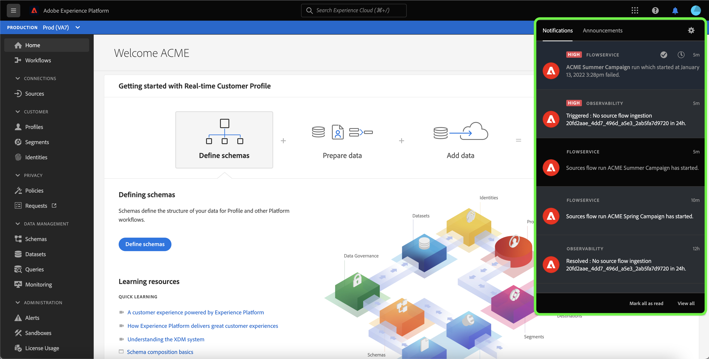

# Suscripción a alertas para flujos de datos de origen en la IU

Adobe Experience Platform le permite suscribirse a alertas basadas en eventos relativas a actividades de Adobe Experience Platform. Las alertas reducen o eliminan la necesidad de sondear la [[!DNL Observability Insights] API](../../../observability/api/overview.md) para comprobar si un trabajo se ha completado, si se ha alcanzado un hito determinado dentro de un flujo de trabajo o si se ha producido algún error.

Puede suscribirse a alertas al crear un flujo de datos para recibir mensajes de alerta sobre el estado, el éxito o el error de la ejecución del flujo.

Este documento proporciona pasos sobre cómo suscribirse y recibir mensajes de alertas para los flujos de datos de origen.

## Introducción

Este documento requiere un entendimiento práctico de los siguientes componentes de Adobe Experience Platform:

* [Fuentes](../../home.md): [!DNL Experience Platform] permite la ingesta de datos de varias fuentes al tiempo que le ofrece la capacidad de estructurar, etiquetar y mejorar los datos entrantes mediante los servicios de [!DNL Experience Platform].
* [Observabilidad](../../../observability/home.md): [!DNL Observability Insights] le permite supervisar las actividades de Experience Platform mediante el uso de métricas estadísticas y notificaciones de eventos.
   * [Alertas](../../../observability/alerts/overview.md): Cuando se alcanza un conjunto determinado de condiciones en las operaciones de Experience Platform (como un problema potencial cuando el sistema incumple un umbral), Experience Platform puede enviar mensajes de alerta a cualquier usuario de su organización que se haya suscrito a ellos.

## Suscripción a alertas en la IU {#subscribe-sources-alerts}

>[!CONTEXTUALHELP]
>id="platform_sources_alerts_subscribe"
>title="Suscripción a las alertas de fuentes"
>abstract="Las alertas permiten recibir notificaciones en función del estado de sus flujos de datos de origen. Puede configurar notificaciones de alerta para obtener actualizaciones si el flujo de datos se ha iniciado, ha fallado o no ha ingerido datos."
>text="Learn more in documentation"

>[!IMPORTANT]
>
>Debe habilitar notificaciones instantáneas de correos electrónicos para su cuenta de Experience Platform a fin de recibir notificaciones de alerta basadas en correo electrónico para sus flujos de datos.

Puede habilitar alertas para los flujos de datos durante el paso [!UICONTROL Detalle del flujo de datos] del flujo de trabajo de orígenes en el área de trabajo de orígenes.

Las alertas disponibles para los flujos de datos de origen son:

>[!NOTE]
>
>Las alertas no admiten actualmente fuentes de flujo continuo. Solo puede suscribirse a las notificaciones de alerta para orígenes de lotes.

| Alertas | Descripción |
| --- | --- |
| Inicio de ejecución de flujo de fuentes | Esta alerta le envía un mensaje cuando se ha iniciado el flujo de datos de origen. |
| Ejecución correcta de flujo de orígenes | Esta alerta le envía un mensaje cuando los datos de su origen se incorporan correctamente a Experience Platform. |
| Error de ejecución de flujo de orígenes | Esta alerta le envía un mensaje si se produce un error en el flujo de datos. |

Seleccione las alertas a las que desee suscribirse y, a continuación, seleccione **[!UICONTROL Siguiente]** para revisar y finalizar el flujo de datos.

Consulte las siguientes guías para ver los pasos detallados sobre la creación de un flujo de datos de origen en la interfaz de usuario:

* [Advertising](./dataflow/advertising.md)
* [Almacenamiento en la nube](./dataflow/batch/cloud-storage.md)
* [CRM](./dataflow/crm.md)
* [Base de datos](./dataflow/databases.md)
* [Comercio electrónico](./dataflow/ecommerce.md)
* [Archivos locales](./create/local-system/local-file-upload.md)
* [Automatización de marketing](./dataflow/marketing-automation.md)
* [Pagos](./dataflow/payments.md)
* [Protocolos](./dataflow/protocols.md)

## Recibir alertas

Una vez que se ejecute el flujo de datos, puede recibir alertas a través de la interfaz de usuario o por correo electrónico.

### En la IU de

Las alertas se representan en la interfaz de usuario mediante un icono de notificación en el encabezado superior de la interfaz de usuario de Experience Platform. Seleccione el icono de notificación para ver mensajes de alerta específicos relacionados con los flujos de datos.

Aparecerá el panel de notificaciones, que mostrará una lista de las actualizaciones de estado del flujo de datos que ha creado.

Puede colocar el ratón encima de un mensaje de alerta para marcarlo como leído o seleccionar el icono del reloj para definir recordatorios futuros sobre el estado del flujo de datos.

Seleccione el mensaje de alerta para ver información específica sobre el flujo de datos.

Aparece la página [!UICONTROL Resumen de ejecución de flujo de datos]. La mitad superior de la pantalla muestra una descripción general del flujo de datos, incluida información sobre sus atributos, el ID de ejecución del flujo de datos correspondiente y el resumen de errores de alto nivel.

La mitad inferior de la página muestra cualquier [!UICONTROL error de ejecución de flujo de datos] que se haya producido durante la fase de ejecución del flujo de datos. Desde aquí, puede obtener una vista previa de los diagnósticos de error o utilizar la [[!DNL Data Access] API](https://www.adobe.io/experience-platform-apis/references/data-access/) para descargar los diagnósticos de error o el manifiesto de archivo que corresponda a su flujo de datos.

Para obtener más información sobre la administración de errores de flujo de datos, consulte la guía sobre [supervisión de orígenes y flujos de datos en la IU](../../../dataflows/ui/monitor-sources.md).

### Por correo electrónico

Las alertas de sus flujos de datos también se le envían por correo electrónico. Seleccione el nombre del flujo de datos en el cuerpo del correo electrónico para ver más información sobre el flujo de datos.

Similar a la alerta de interfaz de usuario, aparece la página [!UICONTROL Información general sobre la ejecución del flujo de datos], que le proporciona una interfaz para investigar cualquier error asociado con el flujo de datos.

## Suscripción y cancelación de la suscripción a alertas

Puede suscribirse a más alertas o cancelar la suscripción a alertas establecidas para un flujo de datos existente en la página [!UICONTROL Flujos de datos]. Busque el flujo de datos que cree en la lista y, a continuación, seleccione los puntos suspensivos (`...`) para ver un menú desplegable de opciones. A continuación, seleccione **[!UICONTROL Suscribir alertas]** para modificar la configuración de alertas del flujo de datos.

Aparece una ventana emergente que le proporciona una lista de fuentes y alertas. Seleccione las alertas a las que desee suscribirse o anule la selección de las alertas cuya suscripción desee cancelar. Cuando termine, seleccione **[!UICONTROL Guardar]**.

## Pasos siguientes

Este documento proporciona una guía paso a paso sobre cómo suscribirse a alertas en contexto para los flujos de datos de origen. Para obtener más información, consulte la [guía de la interfaz de usuario de alertas](../../../observability/alerts/ui.md).