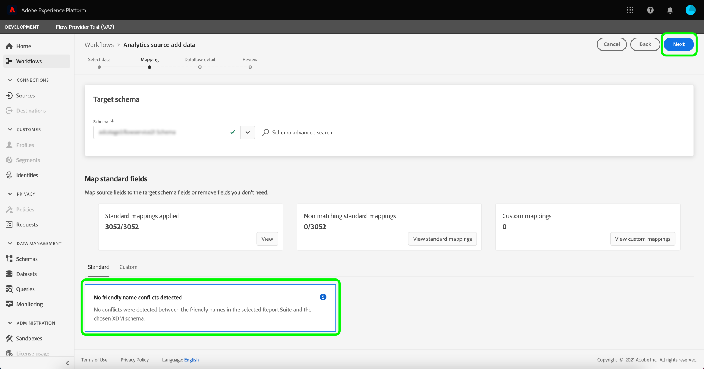
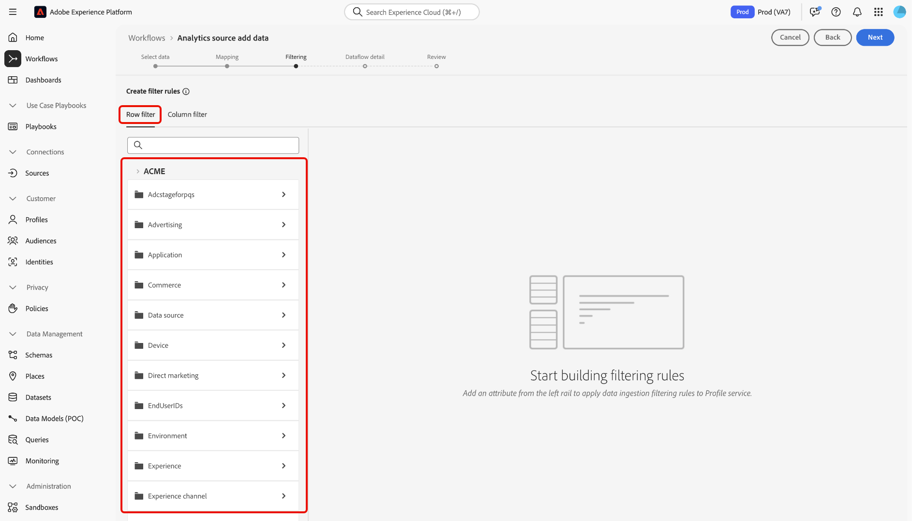
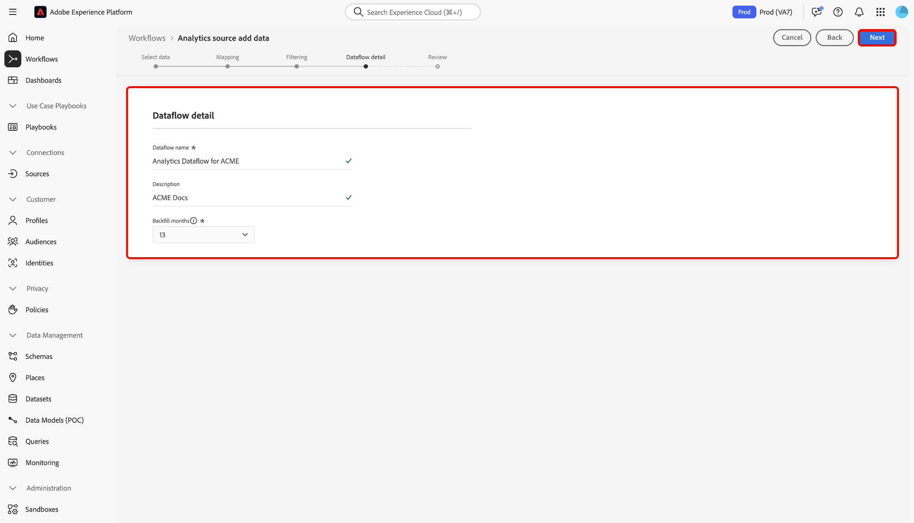
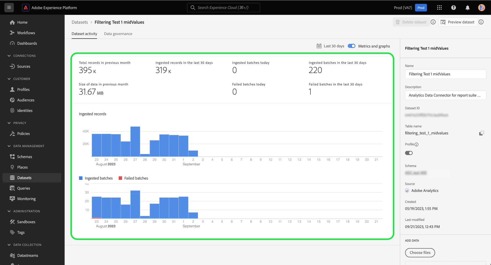

# Crear una conexión de origen de Adobe Analytics en la interfaz de usuario

Este tutorial proporciona los pasos para crear una conexión de origen de Adobe Analytics en la interfaz de usuario para introducir datos del grupo de informes de Adobe Analytics en Adobe Experience Platform.

## Introducción

Este tutorial requiere una comprensión práctica de los siguientes componentes de Experience Platform:

* Sistema [Experience Data Model (XDM)](../../../../../xdm/home.md): El marco estandarizado mediante el cual Experience Platform organiza los datos de experiencia del cliente.
* [Perfil del cliente en tiempo real](../../../../../profile/home.md): Proporciona un perfil de consumidor unificado en tiempo real basado en datos agregados de múltiples fuentes.
* [Zonas protegidas](../../../../../sandboxes/home.md): El Experience Platform proporciona zonas protegidas virtuales que dividen una sola instancia de Platform en entornos virtuales independientes para ayudar a desarrollar y evolucionar aplicaciones de experiencia digital.

### Terminología clave

Es importante comprender los siguientes términos clave utilizados en este documento:

* **Atributo estándar**: Los atributos estándar son cualquier atributo predefinido por el Adobe. Contienen el mismo significado para todos los clientes y están disponibles en los grupos de campos de datos de origen [!DNL Analytics] y de esquema [!DNL Analytics].
* **Atributo personalizado**: Los atributos personalizados son cualquier atributo en la jerarquía de variables personalizadas de [!DNL Analytics]. Los atributos personalizados se utilizan dentro de una implementación de Adobe Analytics para capturar información específica en un grupo de informes y pueden diferir en su uso de un grupo de informes a otro. Los atributos personalizados incluyen eVars, props y listas. Consulte la siguiente [[!DNL Analytics] documentación sobre variables de conversión](https://experienceleague.adobe.com/docs/analytics/admin/admin-tools/conversion-variables/conversion-var-admin.html) para obtener más información sobre eVars.
* **Cualquier atributo de los grupos de campos personalizados**: Los atributos que se originan en grupos de campos creados por clientes están todos definidos por el usuario y no se consideran atributos estándar ni personalizados.
* **Nombres descriptivos**: Los nombres descriptivos son etiquetas proporcionadas por humanos para variables personalizadas en una implementación de [!DNL Analytics]. Consulte la siguiente [[!DNL Analytics] documentación sobre variables de conversión](https://experienceleague.adobe.com/docs/analytics/admin/admin-tools/conversion-variables/conversion-var-admin.html) para obtener más información sobre nombres descriptivos.

## Crear una conexión de origen con Adobe Analytics

>[!NOTE]
>
>Al crear un flujo de datos de origen de Analytics en una zona protegida de producción, se crean dos flujos de datos:
>
>* Un flujo de datos que rellena los datos históricos del grupo de informes con un retraso de 13 meses en el lago de datos. Este flujo de datos finaliza cuando se completa el relleno.
>* Flujo de flujo de datos que envía datos activos al lago de datos y a [!DNL Real-Time Customer Profile]. Este flujo de datos se ejecuta continuamente.

En la interfaz de usuario de Platform, seleccione **[!UICONTROL Sources]** en el panel de navegación izquierdo para acceder al área de trabajo [!UICONTROL Sources]. La pantalla [!UICONTROL Catálogo] muestra una variedad de orígenes con los que puede crear una cuenta.

Puede seleccionar la categoría adecuada del catálogo en la parte izquierda de la pantalla. También puede utilizar la barra de búsqueda para reducir los orígenes mostrados.

En la categoría **[!UICONTROL aplicaciones de Adobe]**, seleccione **[!UICONTROL Adobe Analytics]** y, a continuación, **[!UICONTROL Agregar datos]**.

### Seleccionar datos

>[!IMPORTANT]
>
>Los grupos de informes enumerados en la pantalla pueden provenir de varias regiones. Usted es responsable de comprender las limitaciones y obligaciones de sus datos y de cómo los utiliza en las regiones cruzadas de Adobe Experience Platform. Asegúrese de que su empresa lo permita.

El paso **[!UICONTROL Agregar datos de origen de Analytics]** le proporciona una lista de [!DNL Analytics] datos de grupo de informes con los que crear una conexión de origen.

Un grupo de informes es un contenedor de datos que forma la base de los informes de [!DNL Analytics]. Una organización puede tener muchos grupos de informes, cada uno con diferentes conjuntos de datos.

Puede ingerir grupos de informes de cualquier región (Estados Unidos, Reino Unido o Singapur) siempre y cuando se asignen a la misma organización que la instancia de zona protegida Experience Platform en la que se crea la conexión de origen. Un grupo de informes se puede ingerir utilizando un solo flujo de datos activo. Ya se ha introducido un grupo de informes que no se puede seleccionar, ya sea en la zona protegida que está utilizando o en una zona protegida diferente.

Se pueden realizar varias conexiones entrantes para colocar varios grupos de informes en la misma zona protegida. Si los grupos de informes tienen distintos esquemas para las variables (como eVars o eventos), deben asignarse a campos específicos en los grupos de campos personalizados y evitar conflictos de datos con [preparación de datos](../../../../../data-prep/ui/mapping.md). Los grupos de informes solo se pueden añadir a una sola zona protegida.

>[!NOTE]
>
>Los datos de varios grupos de informes se pueden habilitar para Perfil del cliente en tiempo real solo si no hay conflictos de datos, como dos propiedades personalizadas (eVars, listas y props) con un significado diferente.

Para crear una conexión de origen de [!DNL Analytics], seleccione un grupo de informes y, a continuación, seleccione **[!UICONTROL Siguiente]** para continuar.

&lt;!: los grupos de informes de Analytics se pueden configurar para una zona protegida a la vez. Para importar el mismo grupo de informes en una zona protegida diferente, el flujo del conjunto de datos deberá eliminarse y volver a crearse una instancia mediante la configuración para una zona protegida diferente.—>

### Asignación

>[!IMPORTANT]
>
>Las transformaciones de la preparación de datos pueden añadir latencia al flujo de datos general. La latencia adicional añadida varía en función de la complejidad de la lógica de transformación.

Antes de poder asignar los datos de [!DNL Analytics] al esquema XDM de destino, primero debe seleccionar si está utilizando un esquema predeterminado o personalizado.

Un esquema predeterminado crea un nuevo esquema en su nombre, que contiene el grupo de campos [!DNL Adobe Analytics ExperienceEvent Template]. Para usar un esquema predeterminado, seleccione **[!UICONTROL Esquema predeterminado]**.

Con un esquema personalizado, puede elegir cualquier esquema disponible para los datos de [!DNL Analytics], siempre y cuando ese esquema tenga el grupo de campos [!DNL Adobe Analytics ExperienceEvent Template]. Para usar un esquema personalizado, seleccione **[!UICONTROL Esquema personalizado]**.

La página [!UICONTROL Mapping] proporciona una interfaz para asignar campos de origen a sus campos de esquema de destino correspondientes. Desde aquí, puede asignar variables personalizadas a nuevos grupos de campos de esquema y aplicar cálculos según sea compatible con la preparación de datos. Seleccione un esquema de destino para iniciar el proceso de asignación.

>[!TIP]
>
>En el menú de selección de esquemas solo se muestran los esquemas que tienen el grupo de campos [!DNL Adobe Analytics ExperienceEvent Template]. Se omiten otros esquemas. Si no hay esquemas adecuados disponibles para los datos del grupo de informes, debe crear un nuevo esquema. Para ver los pasos detallados sobre la creación de esquemas, consulte la guía de [creación y edición de esquemas en la interfaz de usuario](../../../../../xdm/ui/resources/schemas.md).

La sección [!UICONTROL Asignar campos estándar] muestra paneles para [!UICONTROL asignaciones estándar aplicadas], [!UICONTROL asignaciones estándar no coincidentes] y [!UICONTROL Asignaciones personalizadas]. Consulte la siguiente tabla para obtener información específica sobre cada categoría:

| Asignar campos estándar | Descripción |
| --- | --- |
| [!UICONTROL Asignaciones estándar aplicadas] | El panel [!UICONTROL Asignaciones estándar aplicadas] muestra la cantidad total de atributos asignados. Las asignaciones estándar hacen referencia a conjuntos de asignaciones entre todos los atributos de los datos de origen [!DNL Analytics] y los atributos correspondientes del grupo de campos [!DNL Analytics]. Están preasignados y no se pueden editar. |
| [!UICONTROL Asignaciones estándar no coincidentes] | El panel [!UICONTROL Asignaciones estándar no coincidentes] hace referencia al número de atributos asignados que contienen conflictos de nombres descriptivos. Estos conflictos aparecen cuando se reutiliza un esquema que ya tiene un conjunto rellenado de descriptores de campo de un grupo de informes diferente. Puede continuar con el flujo de datos [!DNL Analytics] incluso con conflictos de nombres descriptivos. |
| [!UICONTROL Asignaciones personalizadas] | El panel [!UICONTROL Asignaciones personalizadas] muestra el número de atributos personalizados asignados, incluidos eVars, props y listas. Las asignaciones personalizadas hacen referencia a conjuntos de asignaciones entre atributos personalizados en los datos de origen [!DNL Analytics] y atributos en grupos de campos personalizados incluidos en el esquema seleccionado. |

Para obtener una vista previa del grupo de campos de esquema de plantilla [!DNL Analytics] ExperienceEvent, seleccione **[!UICONTROL Ver]** en el panel [!UICONTROL Asignaciones estándar aplicadas].

La página [!UICONTROL Grupo de campos de esquema de plantilla Adobe Analytics ExperienceEvent] proporciona una interfaz que se utilizará para inspeccionar la estructura del esquema. Cuando termine, seleccione **[!UICONTROL Cerrar]**.

Platform detecta automáticamente los conjuntos de asignaciones para cualquier conflicto de nombres descriptivos. Si no hay conflictos con sus conjuntos de asignaciones, seleccione **[!UICONTROL Siguiente]** para continuar.

>[!TIP]
>
>Si existen conflictos de nombres descriptivos entre el grupo de informes de origen y el esquema seleccionado, aún puede continuar con el flujo de datos [!DNL Analytics], lo que reconoce que los descriptores de campo no se cambiarán. También puede optar por crear un nuevo esquema con un conjunto de descriptores en blanco.

#### Asignaciones personalizadas

Puede utilizar las funciones de preparación de datos para agregar nuevas asignaciones personalizadas o campos calculados para atributos personalizados. Para agregar asignaciones personalizadas, seleccione **[!UICONTROL Personalizado]**.

Según sus necesidades, puede seleccionar **[!UICONTROL Agregar nueva asignación]** o **[!UICONTROL Agregar campo calculado]** y continuar creando asignaciones personalizadas para sus atributos personalizados. Para ver los pasos detallados sobre cómo usar las funciones de preparación de datos, lee la [guía de la interfaz de usuario de la preparación de datos](../../../../../data-prep/ui/mapping.md).

La siguiente documentación proporciona más recursos para comprender la preparación de datos, los campos calculados y las funciones de asignación:

* [Resumen de preparación de datos](../../../../../data-prep/home.md)
* [Funciones de asignación de preparación de datos](../../../../../data-prep/functions.md)
* [Añadir campos calculados](../../../../../data-prep/ui/mapping.md#calculated-fields)

<!-- 
To use Data Prep functions and add new mapping or calculated fields for custom attributes, select **[!UICONTROL View custom mappings]**.

Next, select **[!UICONTROL Add new mapping]**.

Depending on your needs, you can select either **[!UICONTROL Add new mapping]** or **[!UICONTROL Add calculated field]** from the options that appear. 

An empty mapping set appears. Select the mapping icon to add a source field.

You can use the interface to navigate through the source schema structure and identify the new source field that you want to use. Once you have selected the source field that you want to map, select **[!UICONTROL Select]**.

Next, select the mapping icon under [!UICONTROL Target Field] to map your selected source field to its appropriate target field.

Similar to the source schema, you can use the interface to navigate through the target schema structure and select the target field you want to map to. Once you have selected the appropriate target field, select **[!UICONTROL Select]**.

With your custom mapping set completed, select **[!UICONTROL Next]** to proceed.

 -->

## Filtrado para el perfil del cliente en tiempo real {#filtering-for-profile}

>[!CONTEXTUALHELP]
>id="platform_data_prep_analytics_filtering"
>title="Crear reglas de filtro"
>abstract="Defina las reglas de filtrado de nivel de fila y columna al enviar datos al perfil del cliente en tiempo real. Utilice el filtrado de nivel de fila para aplicar condiciones y dictar qué datos **incluir para la ingesta de perfiles**. Utilice el filtrado de nivel de columna para seleccionar las columnas de datos que desea **excluir para la ingesta de perfiles**. Las reglas de filtrado no se aplican a los datos enviados al lago de datos."

Una vez que haya completado las asignaciones para los datos del grupo de informes [!DNL Analytics], puede aplicar reglas y condiciones de filtrado para incluir o excluir selectivamente los datos de la ingesta en el Perfil del cliente en tiempo real. La compatibilidad con el filtrado solo está disponible para los datos de [!DNL Analytics] y los datos solo se filtran antes de introducir [!DNL Profile.]. Todos los datos se incorporan al lago de datos.

>[!BEGINSHADEBOX]

**Información adicional sobre preparación de datos y filtrado de datos de Analytics para el perfil del cliente en tiempo real**

* Puede utilizar la funcionalidad de filtrado para los datos que se dirigen a Perfil, pero no para los que se dirigen al lago de datos.
* Puede utilizar el filtrado para los datos activos, pero no puede filtrar los datos de relleno.
   * El origen [!DNL Analytics] no rellena los datos en el perfil.
* Si usa las configuraciones de la preparación de datos durante la configuración inicial de un flujo de [!DNL Analytics], esos cambios también se aplicarán al relleno automático de 13 meses.
   * Sin embargo, este no es el caso del filtrado, ya que solo se reserva para datos activos.
* La preparación de datos se aplica a las rutas de ingesta por flujo continuo y por lotes. Si modifica una configuración de preparación de datos existente, esos cambios se aplican a los nuevos datos entrantes en las rutas de ingesta por flujo continuo y por lotes.
   * Sin embargo, cualquier configuración de la preparación de datos no se aplica a los datos que ya se han introducido en Experience Platform, independientemente de si son datos de flujo continuo o por lotes.
* Los atributos estándar de Analytics siempre se asignan automáticamente. Por lo tanto, no se pueden aplicar transformaciones a atributos estándar.
   * Sin embargo, puede filtrar los atributos estándar siempre que no sean necesarios en el servicio de identidad o en el perfil.
* No se puede utilizar el filtrado a nivel de columna para filtrar los campos obligatorios y los campos de identidad.
* Aunque puede filtrar las identidades secundarias, específicamente AAID y AACustomID, no puede filtrar los ECID.
* Cuando se produce un error de transformación, la columna correspondiente resulta en NULL.

>[!ENDSHADEBOX]

### Filtrado de nivel de fila

>[!IMPORTANT]
>
>Utilice el filtrado de nivel de fila para aplicar condiciones y dictar qué datos **incluir para la ingesta de perfiles**. Use el filtrado a nivel de columna para seleccionar las columnas de datos que desea **excluir para la ingesta de perfiles**.

Puede filtrar los datos de la ingesta de [!DNL Profile] en los niveles de fila y columna. El filtrado de nivel de fila permite definir criterios como que la cadena contiene, es igual a, comienza o termina con. También puede usar el filtrado de nivel de fila para unir condiciones usando `AND` así como `OR`, y negar condiciones usando `NOT`.

Para filtrar los datos de [!DNL Analytics] en el nivel de fila, seleccione **[!UICONTROL Filtro de fila]**.

Utilice el carril izquierdo para navegar por la jerarquía de esquemas y seleccionar el atributo de esquema que desee para explorar en profundidad un esquema determinado.

Una vez identificado el atributo que desea configurar, selecciónelo y arrástrelo del carril izquierdo al panel de filtrado.

Para configurar diferentes condiciones, seleccione **[!UICONTROL es igual a]** y luego seleccione una condición en la ventana desplegable que aparece.

La lista de condiciones configurables incluye:

* [!UICONTROL es igual que]
* [!UICONTROL no es igual a]
* [!UICONTROL comienza con]
* [!UICONTROL termina con]
* [!UICONTROL no termina con]
* [!UICONTROL contiene]
* [!UICONTROL no contiene]
* [!UICONTROL existe]
* [!UICONTROL no existe]

A continuación, introduzca los valores que desea incluir en función del atributo seleccionado. En el ejemplo siguiente, [!DNL Apple] y [!DNL Google] están seleccionados para su ingesta como parte del atributo **[!UICONTROL Manufacturer]**.

Para especificar más las condiciones de filtrado, agregue otro atributo del esquema y, a continuación, agregue valores basados en ese atributo. En el ejemplo siguiente, se agrega el atributo **[!UICONTROL Model]** y los modelos como [!DNL iPhone 13] y [!DNL Google Pixel 6] se filtran para su ingesta.

Para agregar un nuevo contenedor, seleccione los puntos suspensivos (`...`) en la parte superior derecha de la interfaz de filtrado y, a continuación, seleccione **[!UICONTROL Agregar contenedor]**.

Una vez agregado un nuevo contenedor, seleccione **[!UICONTROL Include]** y, a continuación, seleccione **[!UICONTROL Exclude]** en la ventana desplegable que aparece.

A continuación, complete el mismo proceso arrastrando los atributos de esquema y agregando sus valores correspondientes que desee excluir del filtrado. En el ejemplo siguiente, [!DNL iPhone 12], [!DNL iPhone 12 mini] y [!DNL Google Pixel 5] se filtran para no ser excluidos del atributo **[!UICONTROL Modelo]**, el horizontal se excluye de la **[!UICONTROL orientación de la pantalla]** y el número de modelo [!DNL A1633] se excluye de **[!UICONTROL Número de modelo]**.

Cuando termine, seleccione **[!UICONTROL Siguiente]**.

### Filtrado de nivel de columna

Seleccione **[!UICONTROL Filtro de columna]** del encabezado para aplicar el filtrado de nivel de columna.

La página se actualiza a un árbol de esquema interactivo y muestra los atributos de esquema en el nivel de columna. Aquí puede seleccionar las columnas de datos que desea excluir de la ingesta de [!DNL Profile]. También puede expandir una columna y seleccionar atributos específicos para la exclusión.

De manera predeterminada, todos los [!DNL Analytics] van a [!DNL Profile] y este proceso permite que las ramas de los datos XDM se excluyan de la ingesta de [!DNL Profile].

Cuando termine, seleccione **[!UICONTROL Siguiente]**.

### Filtrar identidades secundarias

Utilice un filtro de columna para excluir las identidades secundarias de la ingesta de perfiles. Para filtrar identidades secundarias, seleccione **[!UICONTROL Filtro de columna]** y luego seleccione **[!UICONTROL _identidades]**.

El filtro solo se aplica cuando una identidad se marca como secundaria. Si se seleccionan identidades, pero llega un evento con una de las identidades marcadas como principales, estas no se filtran.

### Proporcionar detalles del flujo de datos

Aparece el paso **[!UICONTROL Detalle del flujo de datos]**, donde debe proporcionar un nombre y una descripción opcional para el flujo de datos. Seleccione **[!UICONTROL Siguiente]** cuando haya terminado.

### Revisar

Aparecerá el paso [!UICONTROL Revisar], que le permitirá revisar su nuevo flujo de datos de Analytics antes de crearlo. Los detalles de la conexión se agrupan por categorías, incluidas:

* [!UICONTROL Conexión]: Muestra la plataforma de origen de la conexión.
* [!UICONTROL Tipo de datos]: muestra el grupo de informes seleccionado y su ID de grupo de informes correspondiente.

## Monitorización del flujo de datos {#monitor-your-dataflow}

Una vez completado el flujo de datos, seleccione **[!UICONTROL Flujos de datos]** en el catálogo de fuentes para supervisar la actividad y el estado de los datos.

Aparece una lista de los flujos de datos de Analytics existentes en su organización. Aquí, seleccione un conjunto de datos de destinatario para ver su actividad de ingesta correspondiente.

La página [!UICONTROL Actividad del conjunto de datos] proporciona información sobre el progreso de los datos que se envían de Analytics al Experience Platform. La interfaz muestra métricas como el número de registros ingeridos, el número de lotes ingeridos y el número de lotes fallidos.

El origen crea una instancia de dos flujos de conjuntos de datos. Un flujo representa los datos de relleno y el otro es para los datos activos. Los datos de relleno no están configurados para su incorporación al Perfil del cliente en tiempo real, sino que se envían al lago de datos para casos de uso analíticos y de ciencia de datos.

Para obtener más información sobre el relleno, los datos activos y sus respectivas latencias, lea la [descripción general del origen de Analytics](../../../../connectors/adobe-applications/analytics.md).

+++Ver lotes individuales mediante la interfaz de monitorización heredada

La página de actividad del conjunto de datos no muestra una lista de lotes individuales. Para ver una lista de lotes individuales, seleccione un gráfico en la interfaz de actividad del conjunto de datos.

Se le redirigirá al panel de monitorización. A continuación, seleccione **[!UICONTROL SOLO ERRORES DE INGESTA: SÍ]** para borrar el filtro y ver una lista de lotes individuales.

La interfaz se actualiza a una lista de lotes individuales, que incluye información sobre sus métricas respectivas.

| Métricas | Descripción |
| --- | --- |
| ID de lote | El ID de un lote determinado. Este valor se genera internamente. |
| Nombre del conjunto de datos | Nombre de un conjunto de datos determinado que se utiliza para los datos de Analytics. |
| Fuente | Origen de los datos introducidos. |
| Actualizado   | La fecha de la iteración de ejecución de flujo más reciente. |
| Registros en conjunto de datos | Recuento total de registros en el conjunto de datos. **Nota**: este parámetro mostrará ocasionalmente un estado de `in-progress`. Este estado indica que el proceso de ingesta de registros aún no ha finalizado. |
| Nuevos fragmentos de perfil | Recuento total de nuevos fragmentos de perfil que se ingirieron. |
| Fragmentos de perfil existentes | Recuento total de fragmentos de perfil existentes. |
| Registros de identidad vinculados | El recuento total de registros de identidad que se vincularon después de la ingesta. |
| Registros en el perfil | Recuento total de registros que se ingirieron en el perfil del cliente en tiempo real. |

{style="table-layout:auto"}

+++

## Pasos siguientes y recursos adicionales

Una vez creada la conexión, el flujo de datos se crea automáticamente para contener los datos entrantes y rellenar un conjunto de datos con el esquema seleccionado. Además, se rellenan los datos de forma retroactiva y se introducen hasta 13 meses de datos históricos. Cuando la ingesta inicial se complete, [!DNL Analytics] datos y los servicios de Platform secundarios, como [!DNL Real-Time Customer Profile] y el servicio de segmentación, los usarán. Consulte los siguientes documentos para obtener más información:

* [Información general de [!DNL Real-Time Customer Profile]](../../../../../profile/home.md)
* [Información general de [!DNL Segmentation Service]](../../../../../segmentation/home.md)
* [Información general de [!DNL Data Science Workspace]](../../../../../data-science-workspace/home.md)
* [Información general de [!DNL Query Service]](../../../../../query-service/home.md)

El siguiente vídeo tiene como objetivo ayudarle a comprender la ingesta de datos mediante el conector de Source de Adobe Analytics:

>[!WARNING]
>
> La interfaz de usuario [!DNL Platform] que se muestra en el siguiente vídeo no está actualizada. Consulte la documentación anterior para obtener las capturas de pantalla y la funcionalidad más recientes de la interfaz de usuario.

>[!VIDEO](https://video.tv.adobe.com/v/29687?quality=12&learn=on)
