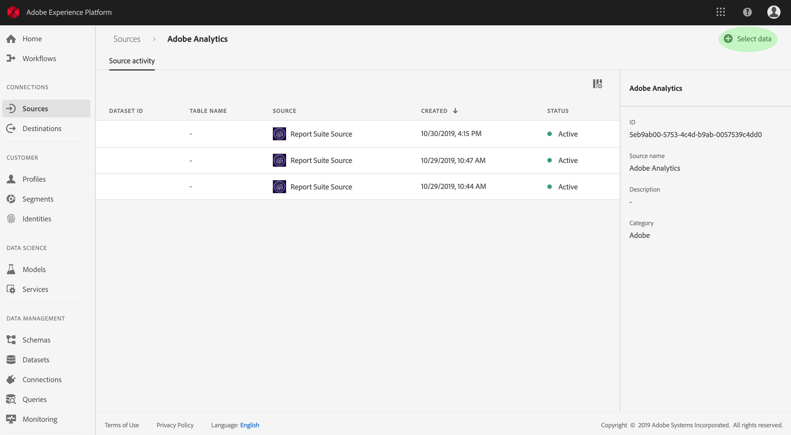

# Creación de un conector de origen de Adobe Analytics en la interfaz de usuario

En este tutorial se proporcionan pasos para crear un conector de origen de Adobe Analytics en la interfaz de usuario con el fin de introducir datos de consumo en la plataforma de Adobe Experience.

## Creación de una conexión de origen con Adobe Analytics

Inicie sesión en <a href="https://platform.adobe.com" target="_blank">Adobe Experience Platform</a> y, a continuación, seleccione **Fuentes** en la barra de navegación izquierda para acceder al espacio de trabajo de fuentes. La pantalla *Catálogo* muestra los orígenes disponibles para crear conexiones enlazadas y cada origen muestra el número de conexiones existentes asociadas a ellos. Seleccione la opción para **Adobe Analytics** y, a continuación, haga clic en Origen **de** Vista para ver todas las conexiones enlazadas en él establecidas.

La pantalla actividad ** de origen lista todas las conexiones previamente establecidas con Adobe Analytics. Para crear una nueva conexión, haga clic en **Seleccionar datos**.

>[!NOTE] Se pueden realizar varias conexiones enlazadas a un origen para introducir datos diferentes.

En la lista de los grupos de informes disponibles, seleccione el que desee incluir en la plataforma y haga clic en **Siguiente**.

>[!NOTE] Solo se puede seleccionar un grupo de informes por conexión de origen de Analytics. Además, sólo puede existir un grupo de informes en un solo simulador de pruebas.

Aparece el paso *Revisar* , que le permite revisar la nueva conexión enlazada de Analytics antes de crearla. Los detalles de la conexión se agrupan por categorías, entre ellas:

* *Detalles* de la fuente: Muestra el tipo de conexión de origen y el grupo de informes seleccionado.
* *Detalles* del Destinatario: Al crear otros conectores de origen, este contenedor muestra en qué conjunto de datos se están invirtiendo los datos de origen, incluido el esquema al que se adhiere el conjunto de datos. Los datos de Analytics se asignan e ingestan automáticamente en Perfiles de cliente en tiempo real.

## Pasos siguientes

Una vez creada la conexión, se crea automáticamente un esquema de destinatario y un conjunto de datos para contener los datos entrantes. Además, se rellenan los datos de forma retroactiva y se ingieren hasta 13 meses de datos históricos. Cuando se completa la ingestión inicial, los datos de Analytics y se utilizan en los servicios de plataforma descendente, como el servicio de Perfil y segmentación de clientes en tiempo real. Consulte los siguientes documentos para obtener más información:

* [Información general sobre el Perfil del cliente en tiempo real](../../../../../profile/home.md)
* [Descripción general del servicio de segmentación](../../../../../segmentation/home.md)
* [Información general sobre el área de trabajo de ciencias de datos](../../../../../data-science-workspace/home.md)
* [Visión general del servicio de Consulta](../../../../../query-service/home.md)

