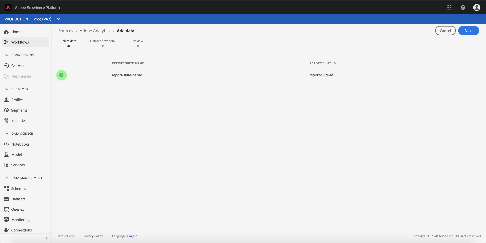
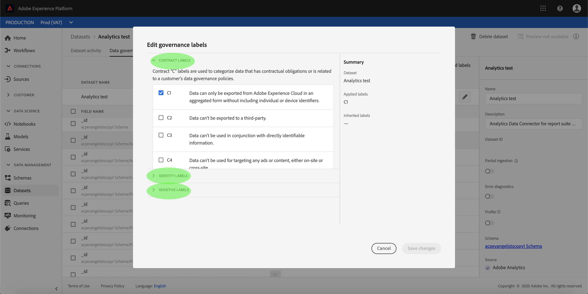

# Creación de un conector de origen de Adobe Analytics en la interfaz de usuario

En este tutorial se proporcionan pasos para crear un conector de origen de Adobe Analytics en la interfaz de usuario con el fin de incorporar datos de consumo a Adobe Experience Platform.

## Primeros pasos

Este tutorial requiere un conocimiento práctico de los siguientes componentes de Adobe Experience Platform:

* [Sistema](../../../../../xdm/home.md)de modelo de datos de experiencia (XDM): El esquema estandarizado por el cual el Experience Platform organiza los datos de experiencia del cliente.
* [Perfil](../../../../../profile/home.md)del cliente en tiempo real: Proporciona un perfil de consumo unificado y en tiempo real basado en datos agregados de varias fuentes.
* [Simuladores](../../../../../sandboxes/home.md): Experience Platform proporciona entornos limitados virtuales que dividen una sola instancia de Plataforma en entornos virtuales independientes para ayudar a desarrollar y desarrollar aplicaciones de experiencia digital.

## Creación de una conexión de origen con Adobe Analytics

Inicie sesión en [Adobe Experience Platform](https://platform.adobe.com) y, a continuación, seleccione **[!UICONTROL Fuentes]** en la barra de navegación izquierda para acceder al espacio de trabajo de orígenes. La pantalla **Catálogo** muestra los orígenes disponibles para crear conexiones de entrada y cada origen muestra el número de cuentas existentes y los flujos de conjuntos de datos asociados a ellas.

Puede seleccionar la categoría adecuada en el catálogo a la izquierda de la pantalla. También puede encontrar la fuente específica con la que desea trabajar mediante la opción de búsqueda.

En la categoría de aplicaciones **[!UICONTROL de]** Adobe, seleccione **[!UICONTROL Adobe Analytics]** para mostrar una barra de información en el lado derecho de la pantalla. La barra de información proporciona una breve descripción de la fuente seleccionada, así como opciones para conectarse con la fuente o la vista de la misma. Para vista de cuentas existentes, seleccione **[!UICONTROL Cuentas]**.

### Seleccionar datos

Aparece el paso de **[!UICONTROL Adobe Analytics]** . En esta pantalla se muestran los flujos de conjuntos de datos previamente establecidos para Analytics. Puede crear un nuevo flujo de conjuntos de datos haciendo clic en **[!UICONTROL Seleccionar datos]**.

>[!NOTE]
>
>Se pueden realizar varias conexiones enlazadas a un origen para introducir datos diferentes.

<!---Analytics report suites can be configured for one sandbox at a time. To import the same report suite into a different sandbox, the dataset flow will have to be deleted and instantiated again via configuration for a different sandbox.--->

En la lista de los grupos de informes disponibles, seleccione el que desee incluir en la plataforma y haga clic en **[!UICONTROL Siguiente]**.

### Asigne un nombre al flujo de conjuntos de datos

Aparece el paso de detalle **[!UICONTROL del flujo de]** datos, donde debe proporcionar un nombre y una descripción opcional para el flujo de conjuntos de datos. Seleccione **[!UICONTROL Siguiente]** cuando termine.

### Revise el flujo de conjuntos de datos

Aparece el paso **[!UICONTROL Revisar]** , que le permite revisar el nuevo flujo de conjuntos de datos enlazados en Analytics antes de crearlo. Los detalles de la conexión se agrupan por categorías, entre ellas:

* **[!UICONTROL Conexión]**: Muestra el tipo de conexión de origen y el grupo de informes seleccionado.
* **[!UICONTROL Asignar campos]** de conjunto de datos y mapa: Al crear otros conectores de origen, este contenedor muestra en qué conjunto de datos se están invirtiendo los datos de origen, incluido el esquema al que se adhiere el conjunto de datos. El esquema de salida y el conjunto de datos se configuran automáticamente para los flujos de conjuntos de datos de Analytics.

### Monitoree el flujo de conjuntos de datos

Una vez creado el flujo del conjunto de datos, puede monitorear los datos que se están ingeriendo a través de él. En la pantalla **[!UICONTROL Catálogo]** , seleccione Flujos **[!UICONTROL de]** conjuntos de datos para la vista de una lista de flujos establecidos asociados a su cuenta de Analytics.

Aparece la pantalla Flujos **de** conjuntos de datos. En esta página hay un par de flujos de conjuntos de datos, incluida información sobre su nombre, datos de origen, tiempo de creación y estado.

El conector crea una instancia de dos flujos de conjuntos de datos. Un flujo representa los datos de relleno y el otro es para los datos activos. Los datos de relleno no están configurados para Perfil, pero se envían al lago de datos para casos de uso analíticos y de ciencia de datos.

Para obtener más información sobre el relleno, los datos activos y sus respectivas latencias, consulte la descripción general [del conector de datos de](../../../../connectors/adobe-applications/analytics.md)Analytics.

Seleccione el flujo del conjunto de datos que desee vista desde la lista.

Se abre la página **actividad** del conjunto de datos. Esta página muestra la velocidad de los mensajes que se consumen en forma de gráfico. Seleccione Administración *de datos* en el encabezado superior para acceder a los campos de etiquetado.

Las etiquetas heredadas de un flujo de datos se pueden vista desde la pantalla Administración de *datos* . Para acceder a etiquetas específicas, seleccione el botón de edición en la parte superior derecha.

Aparece el panel **Editar etiquetas** de gobernanza. Esta pantalla le permite acceder y editar el contrato, la identidad y las etiquetas sensibles de un flujo de datos.

Para obtener más información sobre cómo etiquetar datos procedentes de Analytics, visite la guía [de etiquetas de uso de](../../../../../data-governance/labels/user-guide.md)datos.

## Próximos pasos y recursos adicionales

Una vez creada la conexión, se crea automáticamente un esquema de destinatario y un flujo de conjuntos de datos para contener los datos entrantes. Además, se rellenan los datos de forma retroactiva y se introducen hasta 13 meses de datos históricos. Cuando se completa la ingestión inicial, los datos de Analytics y se utilizan en los servicios de plataforma descendente, como el servicio de Perfil y segmentación de clientes en tiempo real. Consulte los siguientes documentos para obtener más información:

* [Información general sobre el Perfil del cliente en tiempo real](../../../../../profile/home.md)
* [Descripción general del servicio de segmentación](../../../../../segmentation/home.md)
* [Información general sobre el área de trabajo de ciencias de datos](../../../../../data-science-workspace/home.md)
* [Visión general del servicio de consulta](../../../../../query-service/home.md)

El siguiente vídeo está diseñado para admitir su comprensión de la ingesta de datos mediante el conector Adobe Analytics Source:

>[!WARNING]
>
> La interfaz de usuario que [!DNL Platform] se muestra en el siguiente vídeo no está actualizada. Consulte la documentación anterior para obtener las capturas de pantalla y la funcionalidad más recientes de la interfaz de usuario.

>[!VIDEO](https://video.tv.adobe.com/v/29687?quality=12&learn=on)

