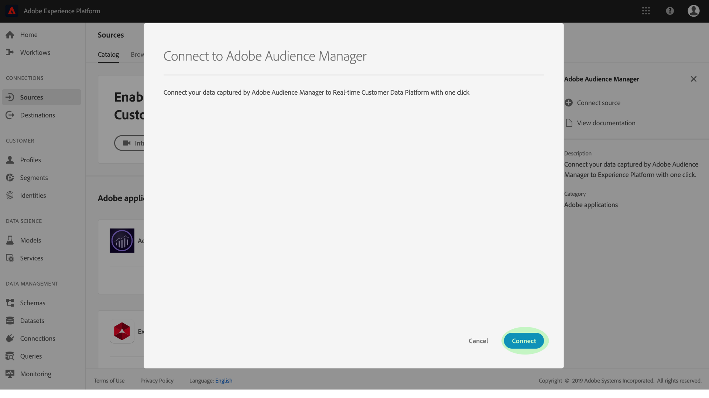

# Creación de un conector de origen de Adobe Audience Manager en la interfaz de usuario

Este tutorial lo acompaña a través de los pasos para crear un conector de origen para Adobe Audience Manager con el fin de incorporar datos de Evento de experiencias de consumo a la plataforma mediante la interfaz de usuario.

## Creación de una conexión de origen con Adobe Audience Manager

Inicie sesión en [Adobe Experience Platform](https://platform.adobe.com) y, a continuación, seleccione **Fuentes** en la barra de navegación izquierda para acceder al espacio de trabajo de orígenes. La pantalla *Catálogo* muestra una serie de orígenes para los que puede crear conexiones de origen y cada origen muestra el número de conexiones existentes asociadas a ellas.

En la categoría de aplicaciones *de* Adobe, seleccione **Adobe Audience Manager** para mostrar una barra de información en la parte derecha de la pantalla. La barra de información proporciona una breve descripción de la fuente seleccionada, así como opciones para la vista de la documentación o la conexión con la fuente.

Para crear un nuevo conector de origen para Adobe Audience Manager, haga clic en **Añadir datos**.

Aparecerá un cuadro de diálogo. Haga clic en **Conectar** para crear la conexión.

Si se establece una conexión de origen con Adobe Audience Manager, se mostrará la página actividad *de* origen del conector de Audience Manager.

Si desea pausar los datos del Audience Manager entrante, puede hacerlo haciendo clic en la lista de flujo de datos y alternando su *estado* desde la columna derecha *Propiedades* .

## Pasos siguientes

Mientras un flujo de datos de Audience Manager está activo, los datos entrantes se ingieren automáticamente en Perfiles del cliente en tiempo real. Ahora puede utilizar estos datos entrantes y crear segmentos de audiencia mediante el servicio de segmentación de plataformas. Consulte los siguientes documentos para obtener más información:

- [Información general sobre el Perfil del cliente en tiempo real](../../../../../profile/home.md)
- [Descripción general del servicio de segmentación](../../../../../segmentation/home.md)