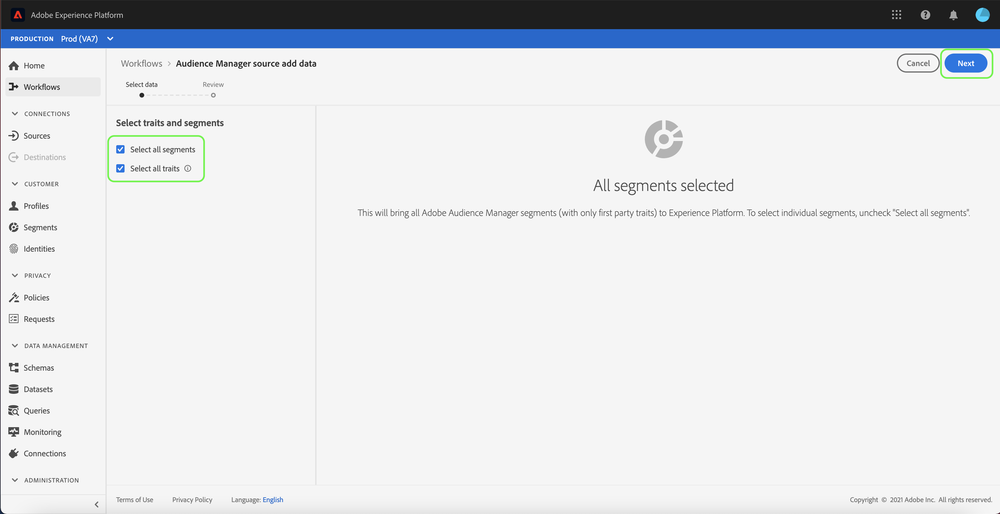

# Crear una conexión de origen de Adobe Audience Manager en la interfaz de usuario

Este tutorial le guiará por los pasos para crear un conector de origen para Adobe Audience Manager para introducir datos de evento de experiencia del consumidor en Platform mediante la interfaz de usuario.

## Crear una conexión de origen con Adobe Audience Manager

En la IU de Platform, seleccione **[!UICONTROL Fuentes]** desde la navegación izquierda para acceder a [!UICONTROL Fuentes] workspace. El [!UICONTROL Catálogo] La pantalla muestra una variedad de fuentes con las que puede crear una cuenta.

Puede seleccionar la categoría adecuada del catálogo en la parte izquierda de la pantalla. También puede encontrar la fuente específica con la que desea trabajar en la barra de búsqueda.

En [!UICONTROL Aplicación de Adobe], seleccione **[!UICONTROL Adobe Audience Manager]** y luego seleccione **[!UICONTROL Configuración de]**.

### Seleccionar características y segmentos

>[!NOTE]
>
>No se pueden introducir datos regionales del origen del Audience Manager al Experience Platform. Si tiene casos de uso de Analytics que requieren datos regionales, utilice el [Conector de origen de Analytics](../adobe-applications/analytics.md).

El [!UICONTROL Seleccionar características y segmentos] Este paso aparece y le proporciona una interfaz interactiva para explorar y seleccionar sus rasgos, segmentos y datos.

* El panel izquierdo de la interfaz contiene la variable [!UICONTROL Seleccionar características y segmentos] , así como un directorio jerárquico de todos los segmentos disponibles.
* La mitad derecha de la interfaz le permite interactuar con segmentos seleccionados y elegir entre los datos específicos que desea utilizar.

Para navegar por los segmentos disponibles, seleccione la carpeta a la que desee acceder desde el [!UICONTROL Todos los segmentos] panel. La selección de una carpeta le permite recorrer la jerarquía de una carpeta y le proporciona una lista de segmentos por los que filtrar.

Una vez que haya identificado y seleccionado los segmentos que desea utilizar, aparecerá un nuevo panel a la derecha que mostrará la lista de los elementos seleccionados. Puede seguir accediendo a diferentes carpetas y seleccionar distintos segmentos para la conexión. Al seleccionar más segmentos, se actualiza el panel de la derecha.

También puede seleccionar la variable **[!UICONTROL Seleccionar todos los segmentos]** y **[!UICONTROL Seleccionar todos los rasgos]** cajas. La selección de todos los segmentos llevará los segmentos del Audience Manager a Platform, mientras que la selección de todas las características habilita todas las características de origen del Audience Manager.

>[!WARNING]
>
>La ingesta de poblaciones de segmentos de Audience Manager de tamaño considerable tiene un impacto directo en el recuento total de perfiles al enviar por primera vez un segmento de Audience Manager a Platform mediante la fuente de Audience Manager. Esto significa que la selección de todos los segmentos puede dar lugar potencialmente a un recuento de perfiles que supere el derecho de uso de la licencia. Revise su [asignación de uso de licencias](../../../../../dashboards/guides/license-usage.md) antes de continuar.

Una vez finalizado, seleccione **[!UICONTROL Siguiente]**

El [!UICONTROL Revisar] Este paso aparece, lo que le permite revisar los rasgos y segmentos seleccionados antes de conectarlos a Platform. Los detalles se agrupan en las siguientes categorías:

* **[!UICONTROL Conexión]**: Muestra la plataforma de origen y el estado de la conexión.
* **[!UICONTROL Datos seleccionados]**: Muestra el número de segmentos seleccionados y las características habilitadas.

Una vez revisado el flujo de datos, seleccione **[!UICONTROL Finalizar]** y deje pasar un tiempo para crear el flujo de datos.

## Pasos siguientes

Mientras hay un flujo de datos de Audience Manager activo, los datos entrantes se incorporan automáticamente a los perfiles de cliente en tiempo real. Ahora puede utilizar estos datos entrantes y crear segmentos de audiencia mediante el servicio de segmentación de Platform. Consulte los siguientes documentos para obtener más información:

* [Resumen del perfil del cliente en tiempo real](../../../../../profile/home.md)
* [Resumen del servicio de segmentación](../../../../../segmentation/home.md)
