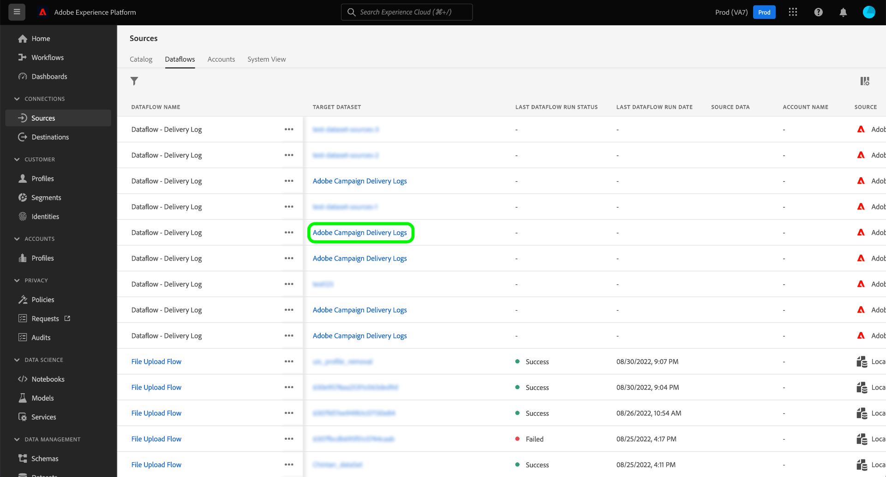

# Creación de una conexión de origen de Adobe Campaign Managed Cloud Services mediante la interfaz de usuario de Platform

Este tutorial proporciona pasos para crear una conexión de origen para llevar los datos de Adobe Campaign Managed Cloud Services a Adobe Experience Platform.

## Primeros pasos

Esta guía requiere una comprensión práctica de los siguientes componentes del Experience Platform:

* [Fuentes](../../../../home.md): Platform permite la ingesta de datos de varias fuentes, al tiempo que permite estructurar, etiquetar y mejorar los datos entrantes mediante los servicios de Platform.
* [[!DNL Experience Data Model (XDM)] Sistema](../../../../../xdm/home.md): El marco estandarizado mediante el cual el Experience Platform organiza los datos de experiencia del cliente.
   * [Aspectos básicos de la composición del esquema](../../../../../xdm/schema/composition.md): Obtenga información sobre los componentes básicos de los esquemas XDM, incluidos los principios clave y las prácticas recomendadas en la composición de esquemas.
   * [Tutorial del Editor de esquemas](../../../../../xdm/tutorials/create-schema-ui.md): Obtenga información sobre cómo crear esquemas personalizados mediante la interfaz de usuario del Editor de esquemas.
* [Sandboxes](../../../../../sandboxes/home.md): Platform proporciona entornos limitados virtuales que dividen una sola instancia de Platform en entornos virtuales independientes para ayudar a desarrollar y desarrollar aplicaciones de experiencia digital.

## Conectar Adobe Campaign Managed Cloud Services a Platform

En la interfaz de usuario de Platform, seleccione **[!UICONTROL Fuentes]** desde el panel de navegación izquierdo para acceder a la [!UICONTROL Fuentes] espacio de trabajo. La variable [!UICONTROL Catálogo] muestra una variedad de fuentes con las que puede crear una cuenta.

Puede seleccionar la categoría adecuada del catálogo en la parte izquierda de la pantalla. También puede utilizar la barra de búsqueda para reducir los orígenes mostrados.

En el **[!UICONTROL aplicaciones de Adobe]** categoría, seleccione **[!UICONTROL Adobe Campaign Managed Cloud Services]** y, a continuación, seleccione **[!UICONTROL Añadir datos]**.

### Seleccionar datos {#select-data}

>[!CONTEXTUALHELP]
>id="platform_sources_campaign_instance"
>title="Instancia del entorno de Adobe Campaign"
>abstract="Nombre del entorno de Adobe Campaign que desea utilizar."
>text="Learn more in documentation"

>[!CONTEXTUALHELP]
>id="platform_sources_campaign_mapping"
>title="Asignación de destino"
>abstract="Las asignaciones de destino son objetos técnicos que Campaign utiliza para enviar mensajes y contienen toda la configuración técnica necesaria para realizar envíos (direcciones, números de teléfono, indicadores de inclusión, identificadores adicionales…)."
>text="Learn more in documentation"

>[!CONTEXTUALHELP]
>id="platform_sources_campaign_schema"
>title="Nombre del esquema"
>abstract="Nombre de la entidad definida en la base de datos de Adobe Campaign."
>text="Learn more in documentation"

La variable [!UICONTROL Seleccionar datos] aparece, proporcionando una interfaz para configurar su [!UICONTROL Instancia de Adobe Campaign], [!UICONTROL Asignación de destino]y [!UICONTROL Nombre del esquema].

| Propiedad | Descripción |
| --- | --- |
| Instancia de Adobe Campaign | Nombre de la instancia de entorno de Adobe Campaign que está utilizando. |
| Asignación de destino | Los objetos técnicos utilizados por Campaign para enviar mensajes y contienen toda la configuración técnica necesaria para realizar envíos. |
| Nombre del esquema | El nombre de la entidad de esquema que va a traer a Platform. Las opciones incluyen Registro de entregas y Registro de seguimiento. |

Una vez que haya proporcionado valores para la instancia de Campaign, la asignación de destino y el nombre del esquema, la pantalla se actualiza para mostrar una previsualización del esquema, así como un conjunto de datos de ejemplo. Cuando termine, seleccione **[!UICONTROL Siguiente]**.

### Usar un conjunto de datos existente

La variable [!UICONTROL Detalles de flujo de datos] le permite seleccionar si desea utilizar un conjunto de datos existente o configurar un nuevo conjunto de datos para el flujo de datos.

Para usar un conjunto de datos existente, seleccione **[!UICONTROL Conjunto de datos existente]**. Puede recuperar un conjunto de datos existente mediante la variable [!UICONTROL Búsqueda avanzada] o desplazándose por la lista de conjuntos de datos existentes en el menú desplegable.

Con un conjunto de datos seleccionado, proporcione un nombre para el flujo de datos y una descripción opcional.

### Usar un nuevo conjunto de datos

Para utilizar un nuevo conjunto de datos, seleccione **[!UICONTROL Nuevo conjunto de datos]** y, a continuación, proporcione un nombre de conjunto de datos de salida y una descripción opcional. A continuación, seleccione un esquema para asignarlo mediante la variable [!UICONTROL Búsqueda avanzada] o desplazándose por la lista de esquemas existentes en el menú desplegable. Cuando termine, seleccione **[!UICONTROL Siguiente]**.

### Habilitar alertas

Puede activar las alertas para recibir notificaciones sobre el estado del flujo de datos. Seleccione una alerta de la lista para suscribirse y recibir notificaciones sobre el estado de su flujo de datos. Para obtener más información sobre las alertas, consulte la guía de [suscripción a alertas de fuentes mediante la interfaz de usuario](../../alerts.md).

Cuando haya terminado de proporcionar detalles al flujo de datos, seleccione **[!UICONTROL Siguiente]**.

### Asignación de campos de datos a un esquema XDM

La variable [!UICONTROL Asignación] aparece, proporcionando una interfaz para asignar los campos de origen del esquema de origen a los campos XDM de destino adecuados en el esquema de destino.

Platform proporciona recomendaciones inteligentes para campos asignados automáticamente en función del esquema o conjunto de datos de destino que haya seleccionado. Puede ajustar manualmente las reglas de asignación para adaptarlas a sus casos de uso. En función de sus necesidades, puede elegir asignar campos directamente o utilizar funciones de preparación de datos para transformar los datos de origen a fin de derivar valores calculados o calculados. Para ver los pasos completos sobre el uso de la interfaz del asignador y los campos calculados, consulte la [Guía de la interfaz de usuario de preparación de datos](../../../../../data-prep/ui/mapping.md).

>[!IMPORTANT]
>
>Al asignar los campos de origen a campos XDM de destino, debe asegurarse de asignar el campo de identidad principal designado a su campo XDM de destino adecuado.

Una vez asignados correctamente los datos de origen, seleccione **[!UICONTROL Siguiente]**.

### Revise el flujo de datos

La variable **[!UICONTROL Consulte]** , lo que le permite revisar el nuevo flujo de datos antes de crearlo. Los detalles se agrupan en las siguientes categorías:

* **[!UICONTROL Conexión]**: Muestra el tipo de origen, la ruta correspondiente del archivo de origen elegido y la cantidad de columnas dentro de ese archivo de origen.
* **[!UICONTROL Asignación de campos de conjunto de datos y asignación]**: Muestra en qué conjunto de datos se están incorporando los datos de origen, incluido el esquema al que se adhiere el conjunto de datos.

Una vez que haya revisado el flujo de datos, seleccione **[!UICONTROL Finalizar]** y permitir que se cree un flujo de datos.

### Monitorizar la actividad del conjunto de datos

Una vez creado el flujo de datos, puede monitorizar los datos que se están incorporando a través de él para ver información sobre las tasas ingeridas y los lotes correctos y fallidos.

Para comenzar a ver la actividad del conjunto de datos, seleccione **[!UICONTROL Flujos de datos]** en el catálogo de fuentes.

A continuación, seleccione el conjunto de datos de destino en la lista de flujos de datos que aparecen.

Aparece la página de actividad del conjunto de datos. Desde aquí puede ver información sobre el rendimiento del flujo de datos, incluida la tasa de ingesta, los lotes con éxito y los lotes con errores.

Esta página también le proporciona una interfaz para actualizar la descripción de metadatos de su flujo de datos, habilitar la ingesta parcial y los diagnósticos de error, así como agregar nuevos datos al conjunto de datos.

## Pasos siguientes

Al seguir este tutorial, ha creado correctamente un flujo de datos para introducir los datos de registros de envío y registros de seguimiento de Campaign v8 en Platform. Los datos entrantes ahora se pueden usar en servicios de Platform descendentes como [!DNL Real-Time Customer Profile] y [!DNL Data Science Workspace]. Consulte los siguientes documentos para obtener más información:

* [Información general del [!DNL Real-Time Customer Profile]](../../../../../profile/home.md)
* [Información general del [!DNL Data Science Workspace]](../../../../../data-science-workspace/home.md)
