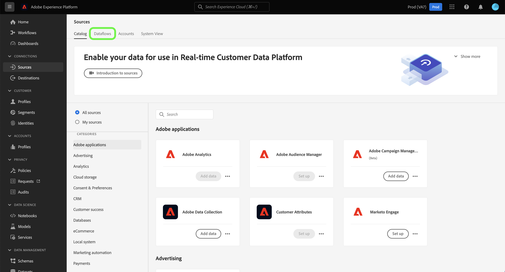

# Crear una conexión de origen de Adobe Campaign Managed Cloud Services mediante la IU de Platform

Este tutorial proporciona pasos para crear una conexión de origen para llevar los datos de Adobe Campaign Managed Cloud Services a Adobe Experience Platform.

## Introducción

Esta guía requiere una comprensión práctica de los siguientes componentes de Experience Platform:

* [Fuentes](../../../../home.md): Platform permite la ingesta de datos de varias fuentes, al tiempo que le ofrece la capacidad de estructurar, etiquetar y mejorar los datos entrantes mediante los servicios de Platform.
* [[!DNL Experience Data Model (XDM)] Sistema](../../../../../xdm/home.md): El marco estandarizado mediante el cual el Experience Platform organiza los datos de experiencia del cliente.
   * [Aspectos básicos de la composición de esquemas](../../../../../xdm/schema/composition.md): obtenga información sobre los componentes básicos de los esquemas XDM, incluidos los principios clave y las prácticas recomendadas en la composición de esquemas.
   * [Tutorial del editor de esquemas](../../../../../xdm/tutorials/create-schema-ui.md): Aprenda a crear esquemas personalizados mediante la interfaz de usuario del editor de esquemas.
* [Zonas protegidas](../../../../../sandboxes/home.md): Platform proporciona zonas protegidas virtuales que dividen una sola instancia de Platform en entornos virtuales independientes para ayudar a desarrollar y evolucionar aplicaciones de experiencia digital.

## Conectar Adobe Campaign Managed Cloud Services a Platform

En la interfaz de usuario de Platform, seleccione **[!UICONTROL Sources]** en el panel de navegación izquierdo para acceder al área de trabajo [!UICONTROL Sources]. La pantalla [!UICONTROL Catálogo] muestra una variedad de orígenes con los que puede crear una cuenta.

Puede seleccionar la categoría adecuada del catálogo en la parte izquierda de la pantalla. También puede utilizar la barra de búsqueda para reducir los orígenes mostrados.

En la categoría **[!UICONTROL aplicaciones de Adobe]**, seleccione **[!UICONTROL Adobe Campaign Managed Cloud Services]** y, a continuación, **[!UICONTROL Agregar datos]**.

### Seleccionar datos {#select-data}

>[!CONTEXTUALHELP]
>id="platform_sources_campaign_instance"
>title="Instancia del entorno de Adobe Campaign"
>abstract="Nombre del entorno de Adobe Campaign que desea utilizar."
>text="Learn more in documentation"

>[!CONTEXTUALHELP]
>id="platform_sources_campaign_mapping"
>title="Asignación de destino"
>abstract="Las asignaciones de destino son objetos técnicos que Campaign utiliza para enviar mensajes y contienen toda la configuración técnica necesaria para realizar envíos (direcciones, números de teléfono, indicadores de inclusión, identificadores adicionales…)."
>text="Learn more in documentation"

>[!CONTEXTUALHELP]
>id="platform_sources_campaign_schema"
>title="Nombre del esquema"
>abstract="Nombre de la entidad definida en la base de datos de Adobe Campaign."
>text="Learn more in documentation"

Aparecerá el paso [!UICONTROL Seleccionar datos], que le proporcionará una interfaz para configurar su [!UICONTROL instancia de Adobe Campaign], [!UICONTROL asignación de destino] y [!UICONTROL nombre del esquema].

| Propiedad | Descripción |
| --- | --- |
| Instancia de Adobe Campaign | El nombre de la instancia de entorno de Adobe Campaign que está utilizando. |
| Asignación de destino | Los objetos técnicos utilizados por Campaign para enviar mensajes y contienen toda la configuración técnica necesaria para realizar envíos. |
| Nombre del esquema | El nombre de la entidad de esquema que está trayendo a Platform. Las opciones incluyen Registro de envío y Registro de seguimiento. |

Una vez que haya proporcionado los valores de la instancia de Campaign, la asignación de destino y el nombre del esquema, la pantalla se actualiza para mostrar una vista previa del esquema y un conjunto de datos de ejemplo. Cuando termine, seleccione **[!UICONTROL Siguiente]**.

### Usar un conjunto de datos existente

La página [!UICONTROL Detalles del flujo de datos] le permite seleccionar si desea utilizar un conjunto de datos existente o configurar uno nuevo para su flujo de datos.

Para usar un conjunto de datos existente, seleccione **[!UICONTROL Conjunto de datos existente]**. Puede recuperar un conjunto de datos existente mediante la opción [!UICONTROL Búsqueda avanzada] o desplazándose por la lista de conjuntos de datos existentes en el menú desplegable.

Con un conjunto de datos seleccionado, proporcione un nombre para el flujo de datos y una descripción opcional.

### Usar un nuevo conjunto de datos

Para usar un nuevo conjunto de datos, seleccione **[!UICONTROL Nuevo conjunto de datos]** y, a continuación, proporcione un nombre de conjunto de datos de salida y una descripción opcional. A continuación, seleccione un esquema al que asignar con la opción [!UICONTROL Búsqueda avanzada] o desplazándose por la lista de esquemas existentes en el menú desplegable. Cuando termine, seleccione **[!UICONTROL Siguiente]**.

### Habilitar alertas

Puede activar alertas para recibir notificaciones sobre el estado del flujo de datos. Seleccione una alerta de la lista para suscribirse y recibir notificaciones sobre el estado del flujo de datos. Para obtener más información sobre las alertas, consulte la guía sobre [suscripción a alertas de fuentes mediante la interfaz de usuario](../../alerts.md).

Cuando termine de proporcionar detalles al flujo de datos, seleccione **[!UICONTROL Siguiente]**.

### Asignación de campos de datos a un esquema XDM

Aparecerá el paso [!UICONTROL Mapping], que le proporcionará una interfaz para asignar los campos de origen del esquema de origen a sus campos XDM de destino adecuados en el esquema de destino.

Platform proporciona recomendaciones inteligentes para campos asignados automáticamente en función del esquema o el conjunto de datos de destino seleccionado. Puede ajustar manualmente las reglas de asignación para adaptarlas a sus casos de uso. En función de sus necesidades, puede elegir asignar campos directamente o utilizar funciones de preparación de datos para transformar los datos de origen y derivar valores calculados o calculados. Para ver los pasos detallados sobre el uso de la interfaz de asignador y los campos calculados, consulte la [guía de la interfaz de usuario de la preparación de datos](../../../../../data-prep/ui/mapping.md).

>[!IMPORTANT]
>
>Al asignar los campos de origen a los campos XDM de destino, debe asegurarse de asignar el campo de identidad principal designado a su campo XDM de destino adecuado.

Una vez que los datos de origen estén asignados correctamente, seleccione **[!UICONTROL Siguiente]**.

### Revisión del flujo de datos

Aparece el paso **[!UICONTROL Revisar]**, que le permite revisar el nuevo flujo de datos antes de crearlo. Los detalles se agrupan en las siguientes categorías:

* **[!UICONTROL Conexión]**: muestra el tipo de origen, la ruta de acceso relevante del archivo de origen elegido y la cantidad de columnas dentro de ese archivo de origen.
* **[!UICONTROL Asignar campos de conjunto de datos y asignación]**: muestra en qué conjunto de datos se están ingiriendo los datos de origen, incluido el esquema al que se adhiere el conjunto de datos.

Una vez que haya revisado el flujo de datos, seleccione **[!UICONTROL Finalizar]** y espere un poco para que se cree el flujo de datos.

### Monitorice la actividad del conjunto de datos

Una vez creado el flujo de datos, puede monitorizar los datos que se están introduciendo a través de él para ver información sobre las tasas de ingesta y los lotes correctos y fallidos.

Para comenzar a ver su actividad del conjunto de datos, seleccione **[!UICONTROL Flujos de datos]** en el catálogo de fuentes.

A continuación, seleccione el conjunto de datos de destino de la lista de flujos de datos que aparecen.

Aparecerá la página de actividad del conjunto de datos. Aquí puede ver información sobre el rendimiento del flujo de datos, incluida la tasa de ingesta, los lotes correctos y los lotes fallidos.

Esta página también le proporciona una interfaz para actualizar la descripción de metadatos del flujo de datos, habilitar la ingesta parcial y los diagnósticos de error, así como añadir nuevos datos al conjunto de datos.

## Pasos siguientes

Al seguir este tutorial, ha creado correctamente un flujo de datos para llevar los datos de los registros de envío y de seguimiento de Campaign v8 a Platform. Ahora, los servicios de la plataforma descendente como [!DNL Real-Time Customer Profile] y [!DNL Data Science Workspace] pueden usar los datos entrantes. Consulte los siguientes documentos para obtener más información:

* [Información general de [!DNL Real-Time Customer Profile]](../../../../../profile/home.md)
* [Información general de [!DNL Data Science Workspace]](../../../../../data-science-workspace/home.md)
