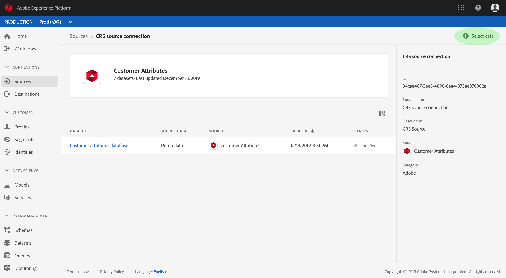
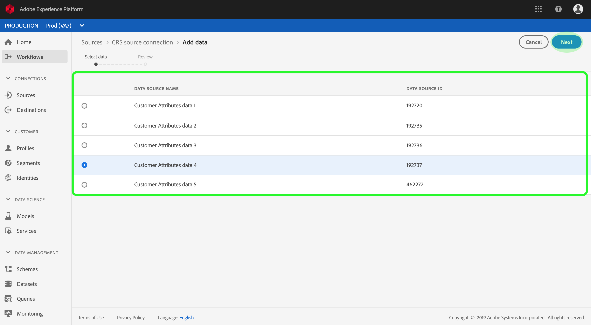

# Creación de un conector de origen de atributos del cliente en la interfaz de usuario

Este tutorial proporciona los pasos para crear un conector de origen en la interfaz de usuario para recopilar datos de perfil de atributos del cliente en Adobe Experience Platform. Para obtener más información sobre los atributos del cliente, consulte el documento [de](https://docs.adobe.com/content/help/es-ES/core-services/interface/customer-attributes/attributes.html)información general.

## Creación de una conexión de origen

Inicie sesión en <a href="https://platform.adobe.com" target="_blank">Adobe Experience Platform</a> y, a continuación, seleccione **Fuentes** en la barra de navegación izquierda para acceder al espacio de trabajo de fuentes. La pantalla *Catálogo* muestra los orígenes disponibles para crear conexiones de entrada y cada origen muestra el número de conexiones existentes asociadas a ellos. Seleccione la opción Atributos **del** cliente y, a continuación, haga clic en Origen **de** Connect. Deje que transcurra algún tiempo para que la conexión se establezca, se le redirigirá si la conexión se realiza correctamente.

>[!NOTE] Si ya ha establecido un conector de origen para los datos de perfil de atributos del cliente, se desactivará la opción de conexión con el origen.

La pantalla actividad ** de origen lista todas las conexiones establecidas anteriormente para los datos de perfil de atributos del cliente. Para crear una nueva conexión, haga clic en **Seleccionar datos**.

>[!NOTE] Se pueden realizar varias conexiones de entrada a un origen para introducir datos diferentes.

En la lista de conjuntos de datos de perfiles de atributos del cliente disponibles, seleccione el que desee incluir en la plataforma y haga clic en **Siguiente**.

>[!NOTE] Sólo se puede seleccionar un conjunto de datos por conexión de origen de atributos del cliente.

Aparece el paso *Revisar* , que le permite revisar la nueva conexión de entrada antes de crearla. Los detalles de la conexión se agrupan por categorías, entre ellas:

* *Detalles* de la fuente: Muestra el tipo de conexión de origen y los datos de origen seleccionados.
* *Detalles* del Destinatario: Al crear otros conectores de origen, este contenedor muestra en qué conjunto de datos se están invirtiendo los datos de origen, incluido el esquema al que se adhiere el conjunto de datos. Los datos de perfil de atributos del cliente se asignan automáticamente y se ingieren en Perfiles del cliente en tiempo real.

## Pasos siguientes

Una vez creada la conexión, se crea automáticamente un esquema de destinatario y un conjunto de datos para contener los datos entrantes. Cuando se completa la ingestión inicial, los datos de perfil de atributos del cliente pueden ser utilizados por los servicios de plataforma descendente, como el servicio de Perfil y segmentación del cliente en tiempo real. Consulte los siguientes documentos para obtener más información:

* [Información general sobre el Perfil del cliente en tiempo real](../../../../../profile/home.md)
* [Descripción general del servicio de segmentación](../../../../../segmentation/home.md)
