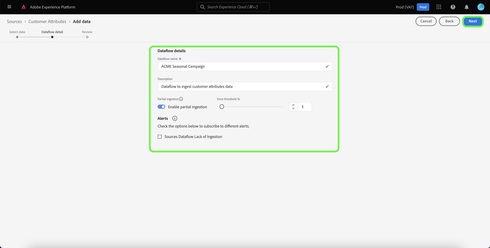

# Creación de una conexión de origen de Atributos del cliente en la interfaz de usuario

Este tutorial proporciona los pasos para crear una conexión de origen en la interfaz de usuario para introducir los datos de perfil de los Atributos del cliente en Adobe Experience Platform. Para obtener más información sobre los Atributos del cliente, consulte la [Información general sobre Atributos del cliente](https://experienceleague.adobe.com/docs/core-services/interface/customer-attributes/attributes.html?lang=es).

>[!IMPORTANT]
>
>Actualmente, el origen Atributos del cliente no admite la activación o desactivación de flujos de datos.

## Crear una conexión de origen

>[!NOTE]
>
>Si ya ha establecido una conexión de origen para los datos de perfil de Atributos del cliente, se desactiva la opción de conectarse con el origen.

En la interfaz de usuario de Platform, seleccione **[!UICONTROL Fuentes]** desde el panel de navegación izquierdo para acceder a la [!UICONTROL Fuentes] espacio de trabajo. La variable [!UICONTROL Catálogo] muestra una variedad de orígenes con los que puede crear una conexión.

Puede seleccionar la categoría adecuada del catálogo en la parte izquierda de la pantalla. También puede encontrar la fuente específica con la que desea trabajar mediante la barra de búsqueda.

En el [!UICONTROL aplicaciones de Adobe] categoría, seleccione **[!UICONTROL Atributos del cliente]** y, a continuación, seleccione **[!UICONTROL Añadir datos]**.

### Seleccionar fuente de datos de atributos del cliente

La variable [!UICONTROL Añadir datos] lista todas las fuentes de datos disponibles para Atributos del cliente. Solo se puede seleccionar un conjunto de datos por conexión de origen de Atributos del cliente.

>[!NOTE]
>
>Los grupos de campos, esquemas y conjuntos de datos se crean de forma predeterminada como parte del aprovisionamiento de flujo. Se mantendrán tal cual y tendrá que eliminarlas manualmente si es necesario.

La evolución del esquema no es compatible con la fuente de atributos del cliente. Si se cambia la entrada de esquema de un origen de datos de atributos del cliente, se volverá incompatible con Platform. Como solución alternativa, puede eliminar un flujo de datos de atributos del cliente existente, junto con su conjunto de datos, esquema y grupo de campos asociados, y luego crear uno nuevo con el esquema actualizado y el origen de datos.

>[!IMPORTANT]
>
>Aunque puede eliminar un flujo de datos de atributos del cliente, su conjunto de datos correspondiente permanecerá incluso después de eliminar el flujo de datos. Consulte la guía de [eliminación de un conjunto de datos](../../../../../catalog/datasets/user-guide.md) para ver los pasos sobre cómo eliminar manualmente un conjunto de datos.

Para crear una nueva conexión, seleccione una fuente de datos de la lista y, a continuación, seleccione **[!UICONTROL Siguiente]**.

### Proporcionar detalles de flujo de datos

La variable [!UICONTROL Detalles de flujo de datos] , lo que le permite proporcionar un nombre y una breve descripción para el flujo de datos. Durante este proceso, también puede configurar las opciones de [!UICONTROL Diagnóstico de errores], [!UICONTROL Ingesta parcial]y [!UICONTROL Alertas].

[!UICONTROL Diagnóstico de errores] permite generar mensajes de error detallados para cualquier registro erróneo que se produzca en el flujo de datos, mientras que [!UICONTROL Ingesta parcial] le permite introducir datos que contengan errores, hasta un umbral determinado que defina manualmente. Consulte la [información general sobre la ingesta parcial de lotes](../../../../../ingestion/batch-ingestion/partial.md) para obtener más información.

Puede activar las alertas para recibir notificaciones sobre el estado del flujo de datos. Seleccione una alerta de la lista para suscribirse y recibir notificaciones sobre el estado de su flujo de datos. Para obtener más información sobre las alertas, consulte la guía de [suscripción a alertas de fuentes mediante la interfaz de usuario](../../alerts.md).

Cuando haya terminado de proporcionar detalles al flujo de datos, seleccione **[!UICONTROL Siguiente]**.

### Revisar flujo de datos

La variable [!UICONTROL Consulte] , lo que le permite revisar el nuevo flujo de datos antes de crearlo. Los detalles se agrupan en las siguientes categorías:

* **[!UICONTROL Conexión]**: Muestra el tipo de origen, la ruta correspondiente del archivo de origen elegido y el número de columnas dentro de ese archivo de origen.
* **[!UICONTROL Asignación de campos de conjunto de datos y asignación]**: Muestra en qué conjunto de datos se están incorporando los datos de origen, incluido el esquema al que se adhiere el conjunto de datos.

## Pasos siguientes

Una vez creada la conexión, se crea automáticamente un esquema de destinatario y un conjunto de datos para contener los datos entrantes. Cuando termina la ingesta inicial, los atributos del cliente los datos de perfil pueden ser utilizados por servicios de Platform descendentes como [!DNL Real-Time Customer Profile] y [!DNL Segmentation Service]. Consulte los siguientes documentos para obtener más información:

* [Información general del [!DNL Real-Time Customer Profile]](../../../../../profile/home.md)
* [Información general del [!DNL Segmentation Service]](../../../../../segmentation/home.md)
