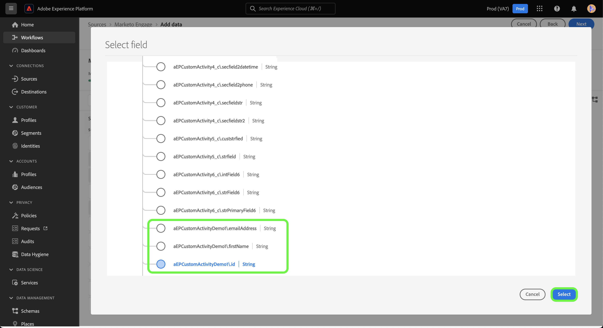

# Crear un [!DNL Marketo Engage] conexión de origen y flujo de datos para datos de actividad personalizados en la IU de

>[!NOTE]
>
>Este tutorial proporciona pasos específicos sobre cómo configurar y traer **actividad personalizada** datos de [!DNL Marketo] al Experience Platform. Para ver los pasos de cómo llevar **actividad estándar** datos, lea la [[!DNL Marketo] Guía de IU](./marketo.md).

Además de [actividades estándar](../../../../connectors/adobe-applications/mapping/marketo.md#activities), también puede utilizar la variable [!DNL Marketo] fuente para llevar los datos de las actividades personalizadas a Adobe Experience Platform. Este documento proporciona pasos sobre cómo crear una conexión de origen y un flujo de datos para los datos de actividad personalizados utilizando [!DNL Marketo] en la interfaz de usuario.

## Introducción

Este tutorial requiere una comprensión práctica de los siguientes componentes de Adobe Experience Platform:

* [Utilidad de generación automática de esquemas y áreas de nombres B2B](../../../../connectors/adobe-applications/marketo/marketo-namespaces.md): la utilidad de generación automática de esquemas y áreas de nombres B2B le permite utilizar [!DNL Postman] para generar automáticamente valores para los esquemas y áreas de nombres B2B. Primero debe completar los espacios de nombres y esquemas B2B antes de crear un [!DNL Marketo] conexión de origen y flujo de datos.
* [Fuentes](../../../../home.md): Experience Platform permite la ingesta de datos desde varias fuentes y, al mismo tiempo, le ofrece la capacidad de estructurar, etiquetar y mejorar los datos entrantes mediante los servicios de Platform.
* [Modelo de datos de experiencia (XDM)](../../../../../xdm/home.md): El marco estandarizado mediante el cual Experience Platform organiza los datos de experiencia del cliente.
   * [Crear y editar esquemas en la interfaz de usuario](../../../../../xdm/ui/resources/schemas.md): Aprenda a crear y editar esquemas en la interfaz de usuario.
* [Áreas de nombres de identidad](../../../../../identity-service/namespaces.md): las áreas de nombres de identidad son un componente de [!DNL Identity Service] que sirven como indicadores del contexto al que se relaciona una identidad. Una identidad completa incluye un valor de ID y un área de nombres.
* [[!DNL Real-Time Customer Profile]](/help/profile/home.md): Proporciona un perfil de consumidor unificado y en tiempo real basado en los datos agregados de varias fuentes.
* [Zonas protegidas](../../../../../sandboxes/home.md): El Experience Platform proporciona entornos limitados virtuales que dividen una sola instancia de Platform en entornos virtuales independientes para ayudar a desarrollar y evolucionar aplicaciones de experiencia digital.

## Recupere los detalles personalizados de la actividad

El primer paso para importar datos de actividad personalizados de [!DNL Marketo] ir al Experience Platform es recuperar el nombre de la API y el nombre para mostrar de la actividad personalizada.

Inicie sesión en su cuenta utilizando [[!DNL Marketo]](https://app-sjint.marketo.com/#MM0A1) interfaz. En el panel de navegación izquierdo, debajo de [!DNL Database Management], seleccione **Actividades personalizadas de Marketo**.

La interfaz se actualiza para mostrar las actividades personalizadas, incluida la información sobre sus respectivos nombres para mostrar y nombres de API. También puede utilizar el carril derecho para seleccionar y ver otras actividades personalizadas de su cuenta.


Seleccionar **Campos** en el encabezado superior para ver los campos asociados con la actividad personalizada. En esta página, puede ver los nombres, nombres de API, descripciones y tipos de datos de los campos en su actividad personalizada. Los detalles sobre campos individuales se utilizan en un paso posterior, al crear un esquema.


## Configurar grupos de campos para actividades personalizadas en el esquema de actividades B2B

En el *[!UICONTROL Esquemas]* en el panel de la IU de Experience Platform, seleccione **[!UICONTROL Examinar]** y luego seleccione **[!UICONTROL Actividad B2B]** de la lista de esquemas.

>[!TIP]
>
>Utilice la barra de búsqueda para acelerar la navegación por la lista de esquemas.


### Crear un nuevo grupo de campos para una actividad personalizada

A continuación, agregue un nuevo grupo de campos al [!DNL B2B Activity] esquema. Este grupo de campos debe corresponder a la actividad personalizada que desea introducir y debe utilizar el nombre para mostrar de la actividad personalizada que recuperó anteriormente.

Para añadir un nuevo grupo de campos, seleccione **[!UICONTROL + Agregar]** al lado del *[!UICONTROL Grupos de campos]* panel debajo de *[!UICONTROL Composición]*.


El *[!UICONTROL Adición de grupos de campos]* aparece una ventana. Seleccionar **[!UICONTROL Crear nuevo grupo de campos]** y, a continuación, proporcione el mismo nombre para mostrar para la actividad personalizada que recuperó en un paso anterior y proporcione una descripción opcional para el nuevo grupo de campos. Cuando termine, seleccione **[!UICONTROL Adición de grupos de campos]**.


Una vez creado, el nuevo grupo de campos para la actividad personalizada aparece en la variable [!UICONTROL Grupos de campos] catálogo.


### Añadir un nuevo campo a la estructura de esquema

A continuación, añada un nuevo campo al esquema. Este nuevo campo debe configurarse como `type: object` y contendrán los campos individuales de la actividad personalizada.

Para agregar un nuevo campo, seleccione el signo más (`+`) junto al nombre del esquema. Una entrada para *[!UICONTROL Campo sin título | Tipo]* aparece. A continuación, configure las propiedades del campo mediante la variable *[!UICONTROL Propiedades del campo]* panel. Establezca el nombre del campo como el nombre de la API de su actividad personalizada y establezca el nombre para mostrar como el nombre para mostrar de su actividad personalizada. A continuación, defina el tipo como `object` y asigne el grupo de campos al grupo de campos de actividad personalizada que creó en el paso anterior. Cuando termine, seleccione **[!UICONTROL Aplicar]**.


El nuevo campo aparece en el esquema.


### Añadir subcampos al campo de objeto {#add-sub-fields-to-the-object-field}

El último paso para preparar el esquema es añadir campos individuales dentro del campo que ha creado en el paso anterior.


## Creación de un flujo de datos

Una vez completada la configuración del esquema, ahora puede continuar con la creación de un flujo de datos para los datos de actividad personalizados.

En la IU de Platform, seleccione **[!UICONTROL Fuentes]** desde la barra de navegación izquierda para acceder a [!UICONTROL Fuentes] workspace. El [!UICONTROL Catálogo] La pantalla muestra una variedad de fuentes con las que puede crear una cuenta.

Puede seleccionar la categoría adecuada del catálogo en la parte izquierda de la pantalla. También puede encontrar la fuente específica con la que desea trabajar en la barra de búsqueda.

En el [!UICONTROL aplicaciones de Adobe] categoría, seleccionar **[!UICONTROL Marketo Engage]**. A continuación, seleccione **[!UICONTROL Añadir datos]** para crear una nueva [!DNL Marketo] flujo de datos.


### Seleccionar datos

Seleccionar **[!UICONTROL Actividades]** de la lista de [!DNL Marketo] conjuntos de datos y seleccione **[!UICONTROL Siguiente]**.


### Detalles de flujo de datos

Siguiente, [proporcione información para el flujo de datos](./marketo.md#provide-dataflow-details), incluidos nombres y descripciones para el conjunto de datos y flujo de datos, el esquema que utilizará y las configuraciones para [!DNL Profile] ingesta, diagnósticos de error e ingesta parcial.


### Asignación

Las asignaciones para campos de actividad estándar se rellenan automáticamente, pero los campos de actividad personalizados deben asignarse manualmente a sus campos de destino correspondientes.

Para empezar a asignar los campos de actividad personalizados, seleccione **[!UICONTROL Nuevo tipo de campo]** y luego seleccione **[!UICONTROL Añadir nuevo campo]**.


Desplácese por la estructura de datos de origen y busque el campo de actividad personalizado que desee introducir. Cuando termine, seleccione **[!UICONTROL Seleccionar]**.

>[!TIP]
>
>Para evitar confusiones y gestionar nombres de campo duplicados, los campos de actividad personalizados llevan como prefijo el nombre de la API.



Para añadir un campo de destino, seleccione el icono de esquema  y, a continuación, seleccione los campos de actividad personalizados del esquema de target.


Repita los pasos para agregar el resto de los campos personalizados de asignación de actividades. Cuando termine, seleccione **[!UICONTROL Siguiente]**.


### Consulte

El *[!UICONTROL Revisar]* Este paso aparece, lo que le permite revisar el nuevo flujo de datos antes de crearlo. Los detalles se agrupan en las siguientes categorías:

* **[!UICONTROL Conexión]**: Muestra el tipo de origen, la ruta relevante de la entidad de origen elegida y la cantidad de columnas dentro de esa entidad de origen.
* **[!UICONTROL Asignar campos de conjunto de datos y asignación]**: Muestra en qué conjunto de datos se están ingiriendo los datos de origen, incluido el esquema al que se adhiere el conjunto de datos.

Una vez revisado el flujo de datos, seleccione **[!UICONTROL Guardar e introducir]** y deje pasar un tiempo para crear el flujo de datos.


### Añadir actividades personalizadas a un flujo de datos de actividades existente {#add-to-existing-dataflows}

Para agregar datos de actividad personalizados a un flujo de datos existente, modifique las asignaciones de un flujo de datos de actividades existente con los datos de actividad personalizados que desee introducir. Esto le permite introducir actividad personalizada en el mismo conjunto de datos de actividades existentes. Para obtener más información sobre cómo actualizar las asignaciones de un flujo de datos existente, lea la guía sobre [actualización de flujos de datos en la IU](../../update-dataflows.md).

### Uso [!DNL Query Service] para filtrar actividades para actividades personalizadas {#query-service-filter}

Una vez completado el flujo de datos, puede utilizar [Servicio de consultas](../../../../../query-service/home.md) para filtrar actividades para los datos de actividad personalizados.

Cuando se incorporan actividades personalizadas en Platform, el nombre de la API de la actividad personalizada se convierte automáticamente en su `eventType`. Uso `eventType={API_NAME}` para filtrar datos de actividad personalizados.

```sql
SELECT * FROM with_custom_activities_ds_today WHERE eventType='aepCustomActivityDemo1' 
```

Utilice el `IN` para filtrar varias actividades personalizadas:

```sql
SELECT * FROM $datasetName WHERE eventType='{API_NAME}'
SELECT * FROM $datasetName WHERE eventType IN ('aepCustomActivityDemo1', 'aepCustomActivityDemo2')
```

La siguiente imagen muestra un ejemplo de instrucción SQL en la variable [Editor de consultas](../../../../../query-service/ui/user-guide.md) que filtra los datos de actividad personalizados.


## Pasos siguientes

Al seguir este tutorial, ha configurado un esquema de Platform para [!DNL Marketo] datos de actividad personalizados y creó un flujo de datos para llevar esos datos a Platform. Para obtener información general sobre [!DNL Marketo] fuente, lea la [[!DNL Marketo] descripción general de origen](../../../../connectors/adobe-applications/marketo/marketo.md).
