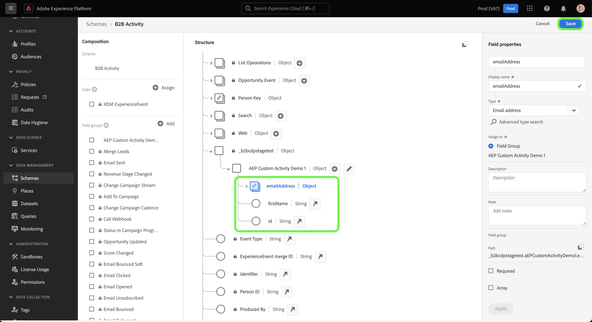
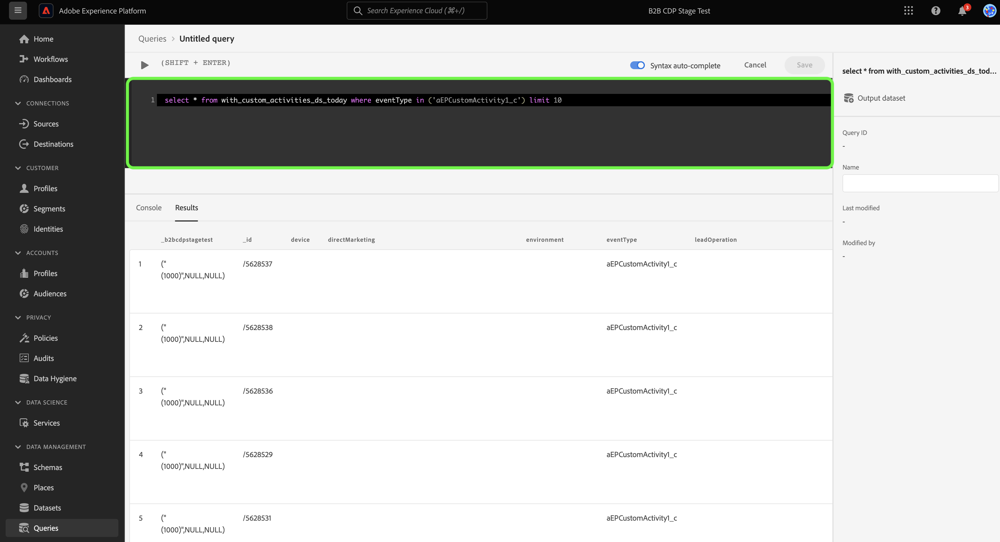

# Crear una conexión de origen y un flujo de datos de [!DNL Marketo Engage] para los datos de actividad personalizados en la interfaz de usuario

>[!NOTE]
>
>Este tutorial proporciona pasos específicos sobre cómo configurar y llevar los datos de **actividad personalizada** de [!DNL Marketo] a Experience Platform. Para obtener información sobre cómo obtener los datos de **actividad estándar**, lea la [[!DNL Marketo] guía de la interfaz de usuario](./marketo.md).

Además de [actividades estándar](../../../../connectors/adobe-applications/mapping/marketo.md#activities), también puede usar la fuente [!DNL Marketo] para llevar datos de actividades personalizadas a Adobe Experience Platform. Este documento proporciona pasos sobre cómo crear una conexión de origen y un flujo de datos para los datos de actividad personalizados utilizando el origen [!DNL Marketo] en la interfaz de usuario.

## Introducción

Este tutorial requiere una comprensión práctica de los siguientes componentes de Adobe Experience Platform:

* [Utilidad de generación automática de esquemas y áreas de nombres B2B](../../../../connectors/adobe-applications/marketo/marketo-namespaces.md): La utilidad de generación automática de esquemas y áreas de nombres B2B le permite usar [!DNL Postman] para generar automáticamente valores para sus esquemas y áreas de nombres B2B. Primero debe completar los esquemas y áreas de nombres B2B antes de crear una conexión de origen y un flujo de datos de [!DNL Marketo].
* [Fuentes](../../../../home.md): Experience Platform permite la ingesta de datos de varias fuentes al tiempo que le ofrece la capacidad de estructurar, etiquetar y mejorar los datos entrantes mediante los servicios de Experience Platform.
* [Modelo de datos de experiencia (XDM)](../../../../../xdm/home.md): El marco de trabajo estandarizado mediante el cual Experience Platform organiza los datos de experiencia del cliente.
   * [Crear y editar esquemas en la interfaz de usuario](../../../../../xdm/ui/resources/schemas.md): Aprenda a crear y editar esquemas en la interfaz de usuario.
* [Áreas de nombres de identidad](../../../../../identity-service/features/namespaces.md): Las áreas de nombres de identidad son un componente de [!DNL Identity Service] que sirven como indicadores del contexto al que se relaciona una identidad. Una identidad completa incluye un valor de ID y un área de nombres.
* [[!DNL Real-Time Customer Profile]](/help/profile/home.md): proporciona un perfil de consumidor unificado y en tiempo real basado en los datos agregados de varias fuentes.
* [Zonas protegidas](../../../../../sandboxes/home.md): Experience Platform proporciona zonas protegidas virtuales que dividen una sola instancia de Experience Platform en entornos virtuales independientes para ayudar a desarrollar y evolucionar aplicaciones de experiencia digital.

## Recupere los detalles personalizados de la actividad

El primer paso para llevar los datos de actividad personalizados de [!DNL Marketo] a Experience Platform es recuperar el nombre de API y el nombre para mostrar de la actividad personalizada.

Inicie sesión en su cuenta mediante la interfaz [[!DNL Marketo]](https://app-sjint.marketo.com/#MM0A1). En el panel de navegación izquierdo, debajo de [!DNL Database Management], seleccione **Actividades personalizadas de Marketo**.

La interfaz se actualiza para mostrar las actividades personalizadas, incluida la información sobre sus respectivos nombres para mostrar y nombres de API. También puede utilizar el carril derecho para seleccionar y ver otras actividades personalizadas de su cuenta.


Seleccione **Campos** del encabezado superior para ver los campos asociados con su actividad personalizada. En esta página, puede ver los nombres, nombres de API, descripciones y tipos de datos de los campos en su actividad personalizada. Los detalles sobre campos individuales se utilizan en un paso posterior, al crear un esquema.


## Configurar grupos de campos para actividades personalizadas en el esquema de actividades B2B

En el panel *[!UICONTROL Esquemas]* de la interfaz de usuario de Experience Platform, seleccione **[!UICONTROL Examinar]** y, a continuación, seleccione **[!UICONTROL Actividad B2B]** de la lista de esquemas.

>[!TIP]
>
>Utilice la barra de búsqueda para acelerar la navegación por la lista de esquemas.


### Crear un nuevo grupo de campos para una actividad personalizada

A continuación, agregue un nuevo grupo de campos al esquema [!DNL B2B Activity]. Este grupo de campos debe corresponder a la actividad personalizada que desea introducir y debe utilizar el nombre para mostrar de la actividad personalizada que recuperó anteriormente.

Para agregar un nuevo grupo de campos, seleccione **[!UICONTROL + Agregar]** junto al panel *[!UICONTROL Grupos de campos]* en *[!UICONTROL Composición]*.


Aparece la ventana *[!UICONTROL Agregar grupos de campos]*. Seleccione **[!UICONTROL Crear nuevo grupo de campos]** y, a continuación, proporcione el mismo nombre para mostrar para la actividad personalizada que recuperó en un paso anterior y proporcione una descripción opcional para el nuevo grupo de campos. Cuando termine, seleccione **[!UICONTROL Agregar grupos de campos]**.


Una vez creado, el nuevo grupo de campos para la actividad personalizada aparece en el catálogo [!UICONTROL Grupos de campos].


### Añadir un nuevo campo a la estructura de esquema

A continuación, añada un nuevo campo al esquema. Este nuevo campo debe establecerse en `type: object` y contendrá los campos individuales de la actividad personalizada.

Para agregar un nuevo campo, seleccione el signo más (`+`) junto al nombre del esquema. Una entrada para *[!UICONTROL campo sin título | Aparece Type]*. A continuación, configure las propiedades del campo mediante el panel *[!UICONTROL Propiedades del campo]*. Establezca el nombre del campo como el nombre de la API de su actividad personalizada y establezca el nombre para mostrar como el nombre para mostrar de su actividad personalizada. A continuación, establezca el tipo como `object` y asigne el grupo de campos al grupo de campos de actividad personalizada que creó en el paso anterior. Cuando termine, seleccione **[!UICONTROL Aplicar]**.


El nuevo campo aparece en el esquema.


### Añadir subcampos al campo de objeto {#add-sub-fields-to-the-object-field}

El último paso para preparar el esquema es añadir campos individuales dentro del campo que ha creado en el paso anterior.



## Creación de un flujo de datos

Una vez completada la configuración del esquema, ahora puede continuar con la creación de un flujo de datos para los datos de actividad personalizados.

En la interfaz de usuario de Experience Platform, seleccione **[!UICONTROL Fuentes]** en la barra de navegación izquierda para acceder al área de trabajo de [!UICONTROL Fuentes]. La pantalla [!UICONTROL Catálogo] muestra una variedad de orígenes con los que puede crear una cuenta.

Puede seleccionar la categoría adecuada del catálogo en la parte izquierda de la pantalla. También puede encontrar la fuente específica con la que desea trabajar en la barra de búsqueda.

En la categoría [!UICONTROL aplicaciones de Adobe], seleccione **[!UICONTROL Marketo Engage]**. A continuación, seleccione **[!UICONTROL Agregar datos]** para crear un nuevo flujo de datos de [!DNL Marketo].


### Seleccionar datos

Seleccione **[!UICONTROL Actividades]** de la lista de [!DNL Marketo] conjuntos de datos y luego seleccione **[!UICONTROL Siguiente]**.


### Detalles del flujo de datos

A continuación, [proporcione información para su flujo de datos](./marketo.md#provide-dataflow-details), incluidos nombres y descripciones para su conjunto de datos y flujo de datos, el esquema que utilizará y las configuraciones para la ingesta de [!DNL Profile], los diagnósticos de error y la ingesta parcial.


### Asignación

Las asignaciones para campos de actividad estándar se rellenan automáticamente, pero los campos de actividad personalizados deben asignarse manualmente a sus campos de destino correspondientes.

Para empezar a asignar los campos de actividad personalizados, seleccione **[!UICONTROL Nuevo tipo de campo]** y, a continuación, seleccione **[!UICONTROL Agregar nuevo campo]**.


Desplácese por la estructura de datos de origen y busque el campo de actividad personalizado que desee introducir. Cuando termine, seleccione **[!UICONTROL Seleccionar]**.

>[!TIP]
>
>Para evitar confusiones y gestionar nombres de campo duplicados, los campos de actividad personalizados llevan como prefijo el nombre de la API.


Para agregar un campo de destino, seleccione el icono de esquema  y, a continuación, seleccione los campos de actividad personalizados del esquema de destino.


Repita los pasos para agregar el resto de los campos personalizados de asignación de actividades. Cuando termine, seleccione **[!UICONTROL Siguiente]**.


### Revisar

Aparece el paso *[!UICONTROL Revisar]*, que le permite revisar el nuevo flujo de datos antes de crearlo. Los detalles se agrupan en las siguientes categorías:

* **[!UICONTROL Conexión]**: muestra el tipo de origen, la ruta de acceso relevante de la entidad de origen elegida y la cantidad de columnas dentro de esa entidad de origen.
* **[!UICONTROL Asignar campos de conjunto de datos y asignación]**: muestra en qué conjunto de datos se están ingiriendo los datos de origen, incluido el esquema al que se adhiere el conjunto de datos.

Una vez que haya revisado el flujo de datos, seleccione **[!UICONTROL Guardar e ingerir]** y espere un poco para que se cree el flujo de datos.


### Añadir actividades personalizadas a un flujo de datos de actividades existente {#add-to-existing-dataflows}

Para agregar datos de actividad personalizados a un flujo de datos existente, modifique las asignaciones de un flujo de datos de actividades existente con los datos de actividad personalizados que desee introducir. Esto le permite introducir actividad personalizada en el mismo conjunto de datos de actividades existentes. Para obtener más información sobre cómo actualizar las asignaciones de un flujo de datos existente, lea la guía sobre [actualización de flujos de datos en la interfaz de usuario](../../update-dataflows.md).

### Usar [!DNL Query Service] para filtrar actividades para actividades personalizadas {#query-service-filter}

Una vez completado el flujo de datos, puede usar [Query Service](../../../../../query-service/home.md) para filtrar las actividades de los datos de actividad personalizados.

Cuando se incorporan actividades personalizadas en Experience Platform, el nombre de la API de la actividad personalizada se convierte automáticamente en su `eventType`. Use `eventType={API_NAME}` para filtrar datos de actividad personalizados.

```sql
SELECT * FROM with_custom_activities_ds_today WHERE eventType='aepCustomActivityDemo1' 
```

Utilice la cláusula `IN` para filtrar varias actividades personalizadas:

```sql
SELECT * FROM $datasetName WHERE eventType='{API_NAME}'
SELECT * FROM $datasetName WHERE eventType IN ('aepCustomActivityDemo1', 'aepCustomActivityDemo2')
```

La siguiente imagen muestra una instrucción SQL de ejemplo en el [Editor de consultas](../../../../../query-service/ui/user-guide.md) que filtra datos de actividades personalizadas.



## Pasos siguientes

Al seguir este tutorial, ha configurado un esquema de Experience Platform para [!DNL Marketo] datos de actividad personalizados y ha creado un flujo de datos para llevar esos datos a Experience Platform. Para obtener información general sobre el origen [!DNL Marketo], lea la [[!DNL Marketo] descripción general del origen](../../../../connectors/adobe-applications/marketo/marketo.md).
