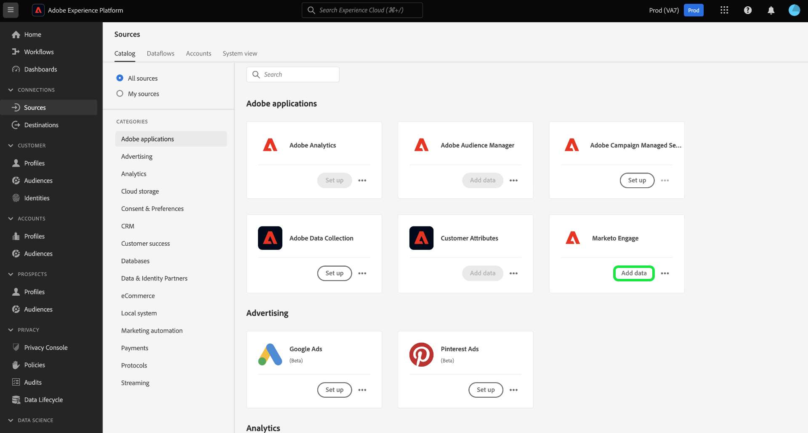

# Cree un [!DNL Marketo Engage] conector de origen en la interfaz de usuario

>[!IMPORTANT]
>
>Antes de crear una [!DNL Marketo Engage] conexión de origen y flujo de datos, primero debe asegurarse de que tiene [ha asignado el ID de organización de Adobe IMS](https://experienceleague.adobe.com/docs/marketo/using/product-docs/core-marketo-concepts/miscellaneous/set-up-adobe-organization-mapping.html?lang=en) en [!DNL Marketo]. Además, debe asegurarse de haber completado [rellenado automático de [!DNL Marketo] Esquemas y áreas de nombres B2B](../../../../connectors/adobe-applications/marketo/marketo-namespaces.md) antes de crear una conexión de origen y un flujo de datos.

Este tutorial proporciona los pasos para crear un [!DNL Marketo Engage] (en lo sucesivo, &quot;el[!DNL Marketo]&quot;) conector de origen en la interfaz de usuario para introducir datos B2B en Adobe Experience Platform.

## Primeros pasos

Este tutorial requiere una comprensión práctica de los siguientes componentes de Adobe Experience Platform:

* [Áreas de nombres B2B y utilidad de generación automática de esquemas](../../../../connectors/adobe-applications/marketo/marketo-namespaces.md): La utilidad de generación automática de esquemas y espacios de nombres B2B le permite utilizar [!DNL Postman] para generar automáticamente valores para los esquemas y espacios de nombres B2B. Debe completar primero los esquemas y áreas de nombres B2B antes de crear un [!DNL Marketo] conexión de origen y flujo de datos.
* [Fuentes](../../../../home.md): Experience Platform permite la ingesta de datos de varias fuentes, al mismo tiempo que le ofrece la capacidad de estructurar, etiquetar y mejorar los datos entrantes mediante los servicios de Platform.
* [Modelo de datos de experiencia (XDM)](../../../../../xdm/home.md): El marco estandarizado mediante el cual el Experience Platform organiza los datos de experiencia del cliente.
   * [Crear y editar esquemas en la interfaz de usuario](../../../../../xdm/ui/resources/schemas.md): Aprenda a crear y editar esquemas en la interfaz de usuario.
* [Espacios de nombres de identidad](../../../../../identity-service/namespaces.md): Las áreas de nombres de identidad son un componente de [!DNL Identity Service] que sirven de indicadores del contexto al que se refiere una identidad. Una identidad completa incluye un valor de ID y un área de nombres.
* [[!DNL Real-Time Customer Profile]](/help/profile/home.md): Proporciona un perfil de cliente unificado y en tiempo real basado en datos agregados de varias fuentes.
* [Sandboxes](../../../../../sandboxes/home.md): Experience Platform proporciona entornos limitados virtuales que dividen una sola instancia de Platform en entornos virtuales independientes para ayudar a desarrollar y desarrollar aplicaciones de experiencia digital.

### Recopilar las credenciales necesarias

Para acceder a su [!DNL Marketo] en Platform, debe proporcionar los siguientes valores:

| Credencial | Descripción |
| ---------- | ----------- |
| `munchkinId` | El ID de Munchkin es el identificador único de un [!DNL Marketo] instancia. |
| `clientId` | El ID de cliente único de su [!DNL Marketo] instancia. |
| `clientSecret` | El secreto de cliente único de su [!DNL Marketo] instancia. |

Para obtener más información sobre la adquisición de estos valores, consulte la [[!DNL Marketo] guía de autenticación](../../../../connectors/adobe-applications/marketo/marketo-auth.md).

Una vez que haya recopilado las credenciales necesarias, puede seguir los pasos de la siguiente sección.

## Conecte su [!DNL Marketo] account

En la interfaz de usuario de Platform, seleccione **[!UICONTROL Fuentes]** en la barra de navegación izquierda para acceder a la [!UICONTROL Fuentes] espacio de trabajo. La variable [!UICONTROL Catálogo] muestra una variedad de fuentes para las que puede crear una cuenta.

Puede seleccionar la categoría adecuada del catálogo en la parte izquierda de la pantalla. También puede encontrar la fuente específica con la que desea trabajar mediante la barra de búsqueda.

En el [!UICONTROL aplicaciones de Adobe] categoría, seleccione **[!UICONTROL Marketo Engage]**. A continuación, seleccione **[!UICONTROL Añadir datos]** para crear un [!DNL Marketo] flujo de datos.

La variable **[!UICONTROL Conectar cuenta de Marketo Engage]** se abre. En esta página puede usar una cuenta nueva o acceder a una existente.

### Cuenta existente

Para crear un flujo de datos con una cuenta existente, seleccione **[!UICONTROL Cuenta existente]** y, a continuación, seleccione [!DNL Marketo] cuenta que desee utilizar. Select **[!UICONTROL Siguiente]** para continuar.

### Nueva cuenta

Si está creando una cuenta nueva, seleccione **[!UICONTROL Nueva cuenta]**. En el formulario de entrada que aparece, indique un nombre de cuenta, una descripción opcional y su [!DNL Marketo] credenciales de autenticación. Cuando termine, seleccione **[!UICONTROL Conectar a origen]** y, a continuación, permita que la nueva conexión se establezca durante algún tiempo.

## Selección de un conjunto de datos

Después de crear el [!DNL Marketo] cuenta, el siguiente paso proporciona una interfaz que puede explorar [!DNL Marketo] conjuntos de datos.

La mitad izquierda de la interfaz es un navegador de directorios, que muestra los 10 [!DNL Marketo] conjuntos de datos. Un funcionamiento completo [!DNL Marketo] la conexión de origen requiere la ingesta de los nueve conjuntos de datos diferentes. Si también utiliza la variable [!DNL Marketo] característica de marketing basado en cuentas (ABM), también debe crear un décimo flujo de datos para introducir la variable [!UICONTROL Cuentas con nombre] conjunto de datos.

>[!NOTE]
>
>A efectos de abreviación, el siguiente tutorial utiliza [!UICONTROL Oportunidades] como ejemplo, pero los pasos descritos a continuación se aplican a cualquiera de los 10 [!DNL Marketo] conjuntos de datos.

Seleccione el conjunto de datos que desee ingerir primero y, a continuación, seleccione **[!UICONTROL Siguiente]**.

## Proporcionar detalles de flujo de datos

La variable [!UICONTROL Detalles de flujo de datos] le permite seleccionar si desea utilizar un conjunto de datos existente o un nuevo conjunto de datos. Durante este proceso, también puede configurar las opciones de [!UICONTROL Conjunto de datos del perfil], [!UICONTROL Diagnóstico de errores], [!UICONTROL Ingesta parcial]y [!UICONTROL Alertas].

### Usar un conjunto de datos existente

Para introducir datos en un conjunto de datos existente, seleccione **[!UICONTROL Conjunto de datos existente]**. Puede recuperar un conjunto de datos existente mediante la variable [!UICONTROL Búsqueda avanzada] o desplazándose por la lista de conjuntos de datos existentes en el menú desplegable. Una vez que haya seleccionado un conjunto de datos, proporcione un nombre y una descripción para el flujo de datos.

### Usar un nuevo conjunto de datos

Para introducir en un nuevo conjunto de datos, seleccione **[!UICONTROL Nuevo conjunto de datos]** y, a continuación, proporcione un nombre de conjunto de datos de salida y una descripción opcional. A continuación, seleccione un esquema para asignarlo mediante la variable [!UICONTROL Búsqueda avanzada] o desplazándose por la lista de esquemas existentes en el menú desplegable. Una vez que haya seleccionado un esquema, proporcione un nombre y una descripción para el flujo de datos.

### Habilitar [!DNL Profile] y diagnóstico de errores

A continuación, seleccione la **[!UICONTROL Conjunto de datos del perfil]** alternar para habilitar su conjunto de datos para [!DNL Profile]. Esto le permite crear una vista holística de los atributos y comportamientos de una entidad. Datos de todos [!DNL Profile]Los conjuntos de datos habilitados para se incluirán en [!DNL Profile] Los cambios y se aplican cuando guarda el flujo de datos.

[!UICONTROL Diagnóstico de errores] permite generar mensajes de error detallados para cualquier registro erróneo que se produzca en el flujo de datos, mientras que [!UICONTROL Ingesta parcial] le permite introducir datos que contengan errores, hasta un umbral determinado que defina manualmente. Consulte la [información general sobre la ingesta parcial de lotes](../../../../../ingestion/batch-ingestion/partial.md) para obtener más información.

>[!IMPORTANT]
>
>La variable [!DNL Marketo] El conector utiliza la ingesta por lotes para introducir todos los registros históricos y utiliza la ingesta de flujo continuo para las actualizaciones en tiempo real. Esto permite que el conector continúe transmitiendo durante la ingesta de registros erróneos. Active la variable **[!UICONTROL Ingesta parcial]** alterne y establezca la variable [!UICONTROL Umbral de error %] para evitar que falle el flujo de datos.

### Habilitar alertas

Puede activar las alertas para recibir notificaciones sobre el estado del flujo de datos. Seleccione una alerta de la lista para suscribirse y recibir notificaciones sobre el estado de su flujo de datos. Para obtener más información sobre las alertas, consulte la guía de [suscripción a alertas de fuentes mediante la interfaz de usuario](../../alerts.md).

Cuando haya terminado de proporcionar detalles al flujo de datos, seleccione **[!UICONTROL Siguiente]**.

## Asigne un [!DNL Marketo] campos de origen del conjunto de datos para dirigirse a campos XDM

La variable [!UICONTROL Asignación] aparece, proporcionando una interfaz para asignar los campos de origen del esquema de origen a los campos XDM de destino adecuados en el esquema de destino.

Cada [!DNL Marketo] el conjunto de datos tiene que seguir sus propias reglas de asignación específicas. Consulte lo siguiente para obtener más información sobre cómo asignar [!DNL Marketo] conjuntos de datos para XDM:

* [Actividades](../../../../connectors/adobe-applications/mapping/marketo.md#activities)
* [Programas](../../../../connectors/adobe-applications/mapping/marketo.md#programs)
* [Pertenencia a programas](../../../../connectors/adobe-applications/mapping/marketo.md#program-memberships)
* [Compañías](../../../../connectors/adobe-applications/mapping/marketo.md#companies)
* [Listas estáticas](../../../../connectors/adobe-applications/mapping/marketo.md#static-lists)
* [Pertenencia a listas estáticas](../../../../connectors/adobe-applications/mapping/marketo.md#static-list-memberships)
* [Cuentas con nombre](../../../../connectors/adobe-applications/mapping/marketo.md#named-accounts)
* [Oportunidades](../../../../connectors/adobe-applications/mapping/marketo.md#opportunities)
* [Funciones de contacto de oportunidad](../../../../connectors/adobe-applications/mapping/marketo.md#opportunity-contact-roles)
* [Personas](../../../../connectors/adobe-applications/mapping/marketo.md#persons)

En función de sus necesidades, puede elegir asignar campos directamente o utilizar funciones de preparación de datos para transformar los datos de origen a fin de derivar valores calculados o calculados. Para ver los pasos completos sobre el uso de la interfaz de asignación, consulte la [Guía de la interfaz de usuario de preparación de datos](../../../../../data-prep/ui/mapping.md).

Una vez que los conjuntos de asignaciones estén listos, seleccione **[!UICONTROL Siguiente]** y permitir que se cree un nuevo flujo de datos durante unos momentos.

## Revise el flujo de datos

La variable **[!UICONTROL Consulte]** , lo que le permite revisar el nuevo flujo de datos antes de crearlo. Los detalles se agrupan en las siguientes categorías:

* **[!UICONTROL Conexión]**: Muestra el tipo de origen, la ruta de acceso relevante de la entidad de origen elegida y la cantidad de columnas dentro de esa entidad de origen.
* **[!UICONTROL Asignación de campos de conjunto de datos y asignación]**: Muestra en qué conjunto de datos se están incorporando los datos de origen, incluido el esquema al que se adhiere el conjunto de datos.

Una vez que haya revisado el flujo de datos, seleccione **[!UICONTROL Guardar e incorporar]** y permitir que se cree un flujo de datos.

## Monitorizar el flujo de datos

Una vez creado el flujo de datos, puede monitorizar los datos que se incorporan a través de él para ver información sobre las tasas de ingesta, el éxito y los errores. Para obtener más información sobre cómo monitorizar los flujos de datos, consulte el tutorial en [monitorización de flujos de datos en la interfaz de usuario](../../../../../dataflows/ui/monitor-sources.md).

## Eliminar los atributos

Los atributos personalizados de los conjuntos de datos no se pueden ocultar ni eliminar de forma retroactiva. Si desea ocultar o eliminar un atributo personalizado de un conjunto de datos existente, debe crear un nuevo conjunto de datos sin este atributo personalizado, un nuevo esquema XDM y configurar un nuevo flujo de datos para el nuevo conjunto de datos que cree. También debe deshabilitar o eliminar el flujo de datos original que consta del conjunto de datos con el atributo personalizado que desea ocultar o eliminar.

## Eliminar el flujo de datos

Puede eliminar flujos de datos que ya no sean necesarios o que se hayan creado incorrectamente empleando la función **[!UICONTROL Eliminar]** en la función [!UICONTROL Flujos de datos] espacio de trabajo. Para obtener más información sobre cómo eliminar flujos de datos, consulte el tutorial sobre [eliminación de flujos de datos en la interfaz de usuario](../../delete.md).

## Pasos siguientes

Siguiendo este tutorial, ha creado correctamente un flujo de datos para [!DNL Marketo] datos. Los datos entrantes ahora se pueden usar en servicios de Platform descendentes como [!DNL Real-Time Customer Profile] y [!DNL Data Science Workspace]. Consulte los siguientes documentos para obtener más información:

* [Información general del [!DNL Real-Time Customer Profile]](/help/profile/home.md)
* [Información general del [!DNL Data Science Workspace]](/help/data-science-workspace/home.md)
