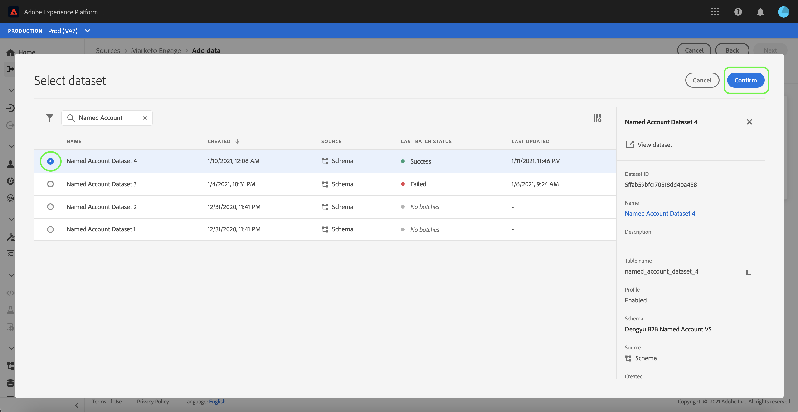
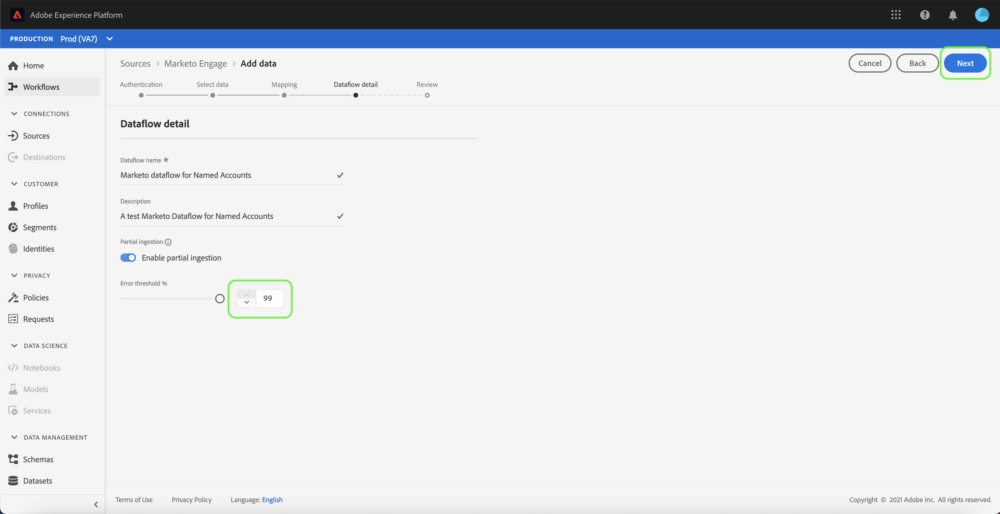

# (Beta) Crear un conector de origen [!DNL Marketo Engage] en la interfaz de usuario

>[!IMPORTANT]
>
>El origen [!DNL Marketo Engage] de Adobe Experience Platform está actualmente en versión beta. La documentación y la funcionalidad están sujetas a cambios.

Este tutorial proporciona los pasos para crear un conector de origen [!DNL Marketo Engage] (denominado en adelante &quot;[!DNL Marketo]&quot;) en la interfaz de usuario para introducir datos B2B en Adobe Experience Platform.

## Primeros pasos

Este tutorial requiere una comprensión práctica de los siguientes componentes de Adobe Experience Platform:

* [Fuentes](../../../../home.md): Experience Platform permite la ingesta de datos de varias fuentes, al mismo tiempo que le ofrece la capacidad de estructurar, etiquetar y mejorar los datos entrantes mediante los servicios de Platform.
* [Modelo de datos de experiencia (XDM)](../../../../../xdm/home.md): El marco estandarizado mediante el cual el Experience Platform organiza los datos de experiencia del cliente.
   * [Cree y edite esquemas en la interfaz de usuario](../../../../../xdm/ui/resources/schemas.md): Aprenda a crear y editar esquemas en la interfaz de usuario.
* [Espacios de nombres](../../../../../identity-service/namespaces.md) de identidad: Las áreas de nombres de identidad son un componente de  [!DNL Identity Service] que sirve como indicadores del contexto al que se relaciona una identidad. Una identidad completa incluye un valor de ID y un área de nombres.
* [[!DNL Real-time Customer Profile]](/help/profile/home.md): Proporciona un perfil de cliente unificado y en tiempo real basado en datos agregados de varias fuentes.
* [Simuladores para pruebas](../../../../../sandboxes/home.md): Experience Platform proporciona entornos limitados virtuales que dividen una sola instancia de Platform en entornos virtuales independientes para ayudar a desarrollar y desarrollar aplicaciones de experiencia digital.

### Recopilar las credenciales necesarias

Para acceder a su cuenta [!DNL Marketo] en Platform, debe proporcionar los siguientes valores:

| Credencial | Descripción |
| ---------- | ----------- |
| `munchkinId` | El ID de Munchkin es el identificador único de una instancia [!DNL Marketo] específica. |
| `clientId` | El ID de cliente único de su instancia [!DNL Marketo]. |
| `clientSecret` | El secreto de cliente único de su instancia [!DNL Marketo]. |

Para obtener más información sobre la adquisición de estos valores, consulte la [[!DNL Marketo] guía de autenticación](../../../../connectors/adobe-applications/marketo/marketo-auth.md).

Una vez que haya recopilado las credenciales necesarias, puede seguir los pasos de la siguiente sección.

## Conecte su cuenta [!DNL Marketo]

En la interfaz de usuario de Platform, seleccione **[!UICONTROL Sources]** en la barra de navegación izquierda para acceder al espacio de trabajo [!UICONTROL Sources]. La pantalla [!UICONTROL Catalog] muestra una variedad de fuentes con las que puede crear una cuenta.

Puede seleccionar la categoría adecuada del catálogo en la parte izquierda de la pantalla. También puede encontrar la fuente específica con la que desea trabajar mediante la barra de búsqueda.

En la categoría [!UICONTROL Adobe applications], seleccione **[!UICONTROL Marketo Engage]**. A continuación, seleccione **[!UICONTROL Add data]** para crear un nuevo flujo de datos [!DNL Marketo].

Aparece la página **[!UICONTROL Connect to Marketo Engage]**. En esta página puede usar una cuenta nueva o acceder a una existente.

### Nueva cuenta

Si está creando una cuenta nueva, seleccione **[!UICONTROL New account]**. En el formulario de entrada que aparece, proporcione un nombre de cuenta, una descripción opcional y sus credenciales de autenticación [!DNL Marketo]. Cuando termine, seleccione **[!UICONTROL Connect to source]** y, a continuación, deje que se establezca la nueva conexión.

### Cuenta existente

Para crear un flujo de datos con una cuenta existente, seleccione **[!UICONTROL Existing account]** y luego seleccione la cuenta [!DNL Marketo] que desee utilizar. Seleccione **[!UICONTROL Siguiente]** para continuar.

## Seleccionar un conjunto de datos

Después de crear su cuenta [!DNL Marketo], el siguiente paso proporciona una interfaz para explorar [!DNL Marketo] conjuntos de datos.

La mitad izquierda de la interfaz es un explorador de directorios, que muestra los 10 [!DNL Marketo] conjuntos de datos. Una conexión de origen [!DNL Marketo] que funcione completamente requiere la ingesta de los nueve conjuntos de datos diferentes. Si también está utilizando la función de marketing basado en cuentas [!DNL Marketo] (ABM), también debe crear un décimo flujo de datos para ingerir el conjunto de datos [!UICONTROL Cuentas con nombre].

>[!NOTE]
>
>Para abreviar, el siguiente tutorial utiliza [!UICONTROL Cuentas con nombre] como ejemplo, pero los pasos descritos a continuación se aplican a cualquiera de los 10 [!DNL Marketo] conjuntos de datos.

Seleccione el conjunto de datos que desea ingerir primero y, a continuación, seleccione **[!UICONTROL Siguiente]**.

## Asignación de esquemas [!DNL Marketo] a la plataforma

Aparece el paso [!UICONTROL Mapping], que proporciona una interfaz para asignar [!DNL Marketo] esquemas a Platform.

Elija un conjunto de datos para los datos entrantes en los que se van a introducir. Puede usar un conjunto de datos existente o crear un conjunto de datos nuevo.

### Usar un conjunto de datos existente

Para introducir datos en un conjunto de datos existente, seleccione **[!UICONTROL Conjunto de datos existente]** y, a continuación, seleccione el icono del conjunto de datos.

Aparece el cuadro de diálogo **[!UICONTROL Seleccionar conjunto de datos]**. Busque el conjunto de datos con el esquema adecuado que desee utilizar, selecciónelo y seleccione **[!UICONTROL Confirm]**.

### Usar un nuevo conjunto de datos

Para introducir datos en un nuevo conjunto de datos, seleccione **[!UICONTROL Nuevo conjunto de datos]** e introduzca un nombre y una descripción para el conjunto de datos en los campos proporcionados.

Puede buscar un esquema introduciendo su nombre en la barra de búsqueda **[!UICONTROL Select schema]**. También puede seleccionar el icono desplegable para ver una lista de los esquemas existentes. Como alternativa, puede seleccionar **[!UICONTROL Búsqueda avanzada]** para acceder a la página de esquemas existentes, incluidos sus respectivos detalles.

Alterne el botón **[!UICONTROL Profile dataset]** para habilitar su conjunto de datos de destino para [!DNL Profile], lo que le permite crear una vista holística de los atributos y comportamientos de una entidad. Los datos de todos los conjuntos de datos habilitados para [!DNL Profile] se incluirán en [!DNL Profile] y se aplicarán los cambios cuando guarde el flujo de datos.

Una vez que haya seleccionado un esquema, desplácese hacia abajo para ver el cuadro de diálogo de asignación para empezar a asignar los campos del conjunto de datos [!DNL Marketo] a los campos XDM de destino adecuados.

### Asigne los campos de origen del conjunto de datos [!DNL Marketo] a los campos XDM de destino

Cada conjunto de datos [!DNL Marketo] tiene que seguir sus propias reglas de asignación específicas. Consulte lo siguiente para obtener más información sobre cómo asignar [!DNL Marketo] conjuntos de datos a XDM:

* [Actividades](../../../../connectors/adobe-applications/mapping/marketo.md#activities)
* [Programas](../../../../connectors/adobe-applications/mapping/marketo.md#programs)
* [Pertenencia a programas](../../../../connectors/adobe-applications/mapping/marketo.md#program-memberships)
* [Compañías](../../../../connectors/adobe-applications/mapping/marketo.md#companies)
* [Listas estáticas](../../../../connectors/adobe-applications/mapping/marketo.md#static-lists)
* [Pertenencia a listas estáticas](../../../../connectors/adobe-applications/mapping/marketo.md#static-list-memberships)
* [Cuentas con nombre](../../../../connectors/adobe-applications/mapping/marketo.md#named-accounts)
* [Oportunidades](../../../../connectors/adobe-applications/mapping/marketo.md#opportunities)
* [Funciones de contacto de oportunidad](../../../../connectors/adobe-applications/mapping/marketo.md#opportunity-contact-roles)
* [Personas](../../../../connectors/adobe-applications/mapping/marketo.md#persons)

Seleccione **[!UICONTROL Preview data]** para ver los resultados de la asignación en función del conjunto de datos seleccionado.

La ventana emergente [!UICONTROL Preview] proporciona una interfaz para explorar los resultados de asignación de hasta 100 filas de datos de ejemplo del conjunto de datos seleccionado.

Una vez que los campos de origen estén asignados a los campos de destino adecuados, seleccione **[!UICONTROL Close]**.

## Proporcionar detalles de flujo de datos

Aparece el paso [!UICONTROL Dataflow detail], que le permite proporcionar un nombre y una breve descripción sobre el nuevo flujo de datos.

Habilite la opción **[!UICONTROL Error diagnostic]** para permitir la generación detallada de mensajes de error para lotes recién ingeridos, que puede descargar con la API. Para obtener más información, consulte el tutorial sobre [recuperación de diagnósticos de error de ingesta de datos](../../../../../ingestion/quality/error-diagnostics.md).

El conector [!DNL Marketo] utiliza la ingesta por lotes para ingerir todos los registros históricos y la ingesta de transmisión para actualizaciones en tiempo real. Esto permite que el conector continúe transmitiendo durante la ingesta de registros erróneos. Active la opción **[!UICONTROL Partial ingestion]** y, a continuación, establezca el [!UICONTROL Error threshold %] en el máximo para evitar que falle el flujo de datos.

**[!UICONTROL El]** cuestionario parcial permite introducir datos que contengan errores hasta un umbral determinado. Para obtener más información, consulte la [información general sobre la ingesta parcial de lotes](../../../../../ingestion/batch-ingestion/partial.md).

Una vez que haya proporcionado los detalles del flujo de datos y haya establecido el umbral de error en max, seleccione **[!UICONTROL Next]**.

## Revise el flujo de datos

Aparece el paso **[!UICONTROL Review]**, que le permite revisar el nuevo flujo de datos antes de crearlo. Los detalles se agrupan en las siguientes categorías:

* **[!UICONTROL Conexión]**: Muestra el tipo de origen, la ruta de acceso relevante de la entidad de origen elegida y la cantidad de columnas dentro de esa entidad de origen.
* **[!UICONTROL Asignar campos]** de conjunto de datos y asignación: Muestra en qué conjunto de datos se están incorporando los datos de origen, incluido el esquema al que se adhiere el conjunto de datos.

Una vez que haya revisado el flujo de datos, seleccione **[!UICONTROL Finish]** y permita que se cree el flujo de datos.

## Monitorizar el flujo de datos

Una vez creado el flujo de datos, puede monitorizar los datos que se incorporan a través de él para ver información sobre las tasas de ingesta, el éxito y los errores. Para obtener más información sobre cómo monitorizar los flujos de datos, consulte el tutorial sobre [monitorización de flujos de datos en la interfaz de usuario](../../../../../dataflows/ui/monitor-sources.md).

## Eliminar los atributos

Los atributos personalizados de los conjuntos de datos no se pueden ocultar ni eliminar de forma retroactiva. Si desea ocultar o eliminar un atributo personalizado de un conjunto de datos existente, debe crear un nuevo conjunto de datos sin este atributo personalizado, un nuevo esquema XDM y configurar un nuevo flujo de datos para el nuevo conjunto de datos que cree. También debe deshabilitar o eliminar el flujo de datos original que consta del conjunto de datos con el atributo personalizado que desea ocultar o eliminar.

## Eliminar el flujo de datos

Puede eliminar flujos de datos que ya no sean necesarios o que se hayan creado incorrectamente empleando la función **[!UICONTROL Delete]** disponible en el espacio de trabajo [!UICONTROL Dataflows]. Para obtener más información sobre cómo eliminar flujos de datos, consulte el tutorial sobre la [eliminación de flujos de datos en la interfaz de usuario](../../delete.md).

## Pasos siguientes

Al seguir este tutorial, ha creado correctamente un flujo de datos para incorporar datos [!DNL Marketo]. Los datos entrantes ahora se pueden usar en servicios de Platform descendentes como [!DNL Real-time Customer Profile] y [!DNL Data Science Workspace]. Consulte los siguientes documentos para obtener más información:

* [Información general del [!DNL Real-time Customer Profile]](/help/profile/home.md)
* [Información general del [!DNL Data Science Workspace]](/help/data-science-workspace/home.md)
