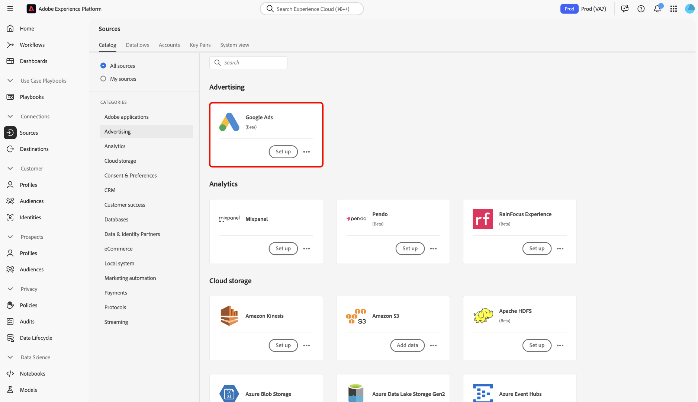
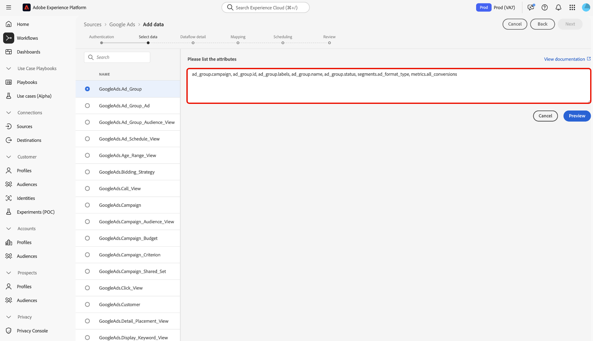

# Conectar [!DNL Google Ads] a Experience Platform mediante la interfaz de usuario

>[!NOTE]
>
>El origen [!DNL Google Ads] está en la versión beta. Consulte [Resumen de fuentes](../../../../home.md#terms-and-conditions) para obtener más información sobre cómo usar fuentes etiquetadas como beta.

Lea esta guía para obtener información sobre cómo conectar su cuenta de [!DNL Google Ads] a Adobe Experience Platform mediante el área de trabajo de orígenes en la interfaz de usuario de Experience Platform.

## Introducción 

Este tutorial requiere una comprensión práctica de los siguientes componentes de Experience Platform:

* [[!DNL Experience Data Model (XDM)] Sistema](../../../../../xdm/home.md): El marco estandarizado mediante el cual Experience Platform organiza los datos de experiencia del cliente.
   * [Aspectos básicos de la composición de esquemas](../../../../../xdm/schema/composition.md): obtenga información sobre los componentes básicos de los esquemas XDM, incluidos los principios clave y las prácticas recomendadas en la composición de esquemas.
   * [Tutorial del editor de esquemas](../../../../../xdm/tutorials/create-schema-ui.md): Aprenda a crear esquemas personalizados mediante la interfaz de usuario del editor de esquemas.
* [[!DNL Real-Time Customer Profile]](../../../../../profile/home.md): proporciona un perfil de consumidor unificado y en tiempo real basado en los datos agregados de varias fuentes.

Si ya tiene una conexión [!DNL Google Ads] válida, puede omitir el resto de este documento y continuar con el tutorial sobre [configuración de un flujo de datos](../../dataflow/advertising.md)

### Recopilar credenciales necesarias

Para obtener información sobre la autenticación, lea la [[!DNL Google Ads] descripción general del origen](../../../../connectors/advertising/ads.md).

## Conecte su cuenta de Google Ads

En la interfaz de usuario de Experience Platform, seleccione **[!UICONTROL Fuentes]** en el panel de navegación izquierdo para acceder al área de trabajo *[!UICONTROL Fuentes]*. Puede seleccionar la categoría adecuada en el panel *[!UICONTROL Categorías]*. También puede utilizar la barra de búsqueda para desplazarse al origen específico que desee utilizar.

Para usar [!DNL Google Ads], selecciona la tarjeta de origen de **[!UICONTROL Google Ads]** en *[!UICONTROL Advertising]* y, a continuación, selecciona **[!UICONTROL Agregar datos]**.

.

### Cuenta existente

Para usar una cuenta existente, seleccione **[!UICONTROL Cuenta existente]** y luego seleccione la cuenta que desee usar de la lista de cuentas en la interfaz.

Una vez que haya seleccionado su cuenta, seleccione **[!UICONTROL Siguiente]** para continuar con el paso siguiente.

.

### Nueva cuenta

Si no tiene una cuenta existente, debe crear una nueva cuenta proporcionando las credenciales de autenticación necesarias que se correspondan con su origen.

Para crear una cuenta nueva, selecciona **[!UICONTROL Cuenta nueva]** y, a continuación, proporciona un nombre de cuenta y, opcionalmente, una descripción para los detalles de la cuenta. A continuación, proporcione los valores de autenticación adecuados para autenticar el origen con Experience Platform:

* **ID de cliente cliente**: El ID de cliente es el número de cuenta que corresponde a la cuenta de cliente [!DNL Google Ads] que desea administrar con la API [!DNL Google Ads]. Este identificador sigue la plantilla de `123-456-7890`.
* **Id. de cliente de inicio de sesión**: El Id. de cliente de inicio de sesión es el número de cuenta que corresponde a su cuenta de administrador [!DNL Google Ads] y se usa para obtener datos de informe de un cliente operativo específico. Para obtener más información sobre el ID de cliente de inicio de sesión, lea la [[!DNL Google Ads] documentación de la API](https://developers.google.com/search-ads/reporting/concepts/login-customer-id).
* **Token para desarrolladores**: el token para desarrolladores le permite acceder a la API [!DNL Google Ads]. Puede usar el mismo token de desarrollador para realizar solicitudes en todas sus cuentas de [!DNL Google Ads]. Recupere su token de desarrollador al [iniciar sesión en su cuenta de administrador](https://ads.google.com/home/tools/manager-accounts/) y luego navegar a la página del Centro de API.
* **Token de actualización**: el token de actualización forma parte de la autenticación [!DNL OAuth2]. Este token le permite volver a generar los tokens de acceso una vez caducados.
* **ID de cliente**: el ID de cliente se usa junto con el secreto de cliente como parte de la autenticación [!DNL OAuth2]. En conjunto, el ID de cliente y el secreto de cliente permiten que su aplicación funcione en nombre de su cuenta al identificar su aplicación en [!DNL Google].
* **Secreto de cliente**: el secreto de cliente se usa junto con el identificador de cliente como parte de la autenticación [!DNL OAuth2]. En conjunto, el ID de cliente y el secreto de cliente permiten que su aplicación funcione en nombre de su cuenta al identificar su aplicación en [!DNL Google].
* **[!DNL Google Ads]versión de API**: La versión de API actual admitida por [!DNL Google Ads]. Aunque la versión más reciente es `v18`, la última versión compatible con Experience Platform es `v17`.

Una vez que haya ingresado sus credenciales, seleccione **[!UICONTROL Conectarse al origen]** y espere unos momentos para que se procese la conexión. Cuando termine, seleccione **[!UICONTROL Siguiente]**.

.

## Seleccionar datos {#select-data}

Con [!DNL Google Ads], debe proporcionar la lista de atributos para la ingesta durante la fase de selección de datos del flujo de trabajo. Para recuperar estos atributos, debe usar [[!DNL Google Ads Query Builder]](https://developers.google.com/google-ads/api/fields/v17/overview_query_builder).

En [!DNL Google Ads Query Builder], vaya al tipo de recurso que desee usar y, a continuación, utilice el selector de atributos para seleccionar atributos, segmentos y métricas.

Los atributos que seleccione rellenan el panel [!DNL Google Ads Query Language]. Asegúrese de usar el modo [!DNL Standard] y, a continuación, seleccione **[!DNL Enter or edit a query]**.

A continuación, seleccione **[!DNL Validate Query]** para validar su consulta [!DNL Google Ads].

Si se ejecuta correctamente, [!DNL Google Ads Query Builder] devolverá un mensaje que indica que la consulta es válida. A continuación, copie **solo los atributos** de la consulta.

Vaya de nuevo a la fase de selección de datos del flujo de trabajo de orígenes en la interfaz de usuario de Experience Platform y pegue los atributos en el panel *[!UICONTROL Atributos de lista]*.

Seleccione **[!UICONTROL Vista previa]** para obtener una vista previa de los datos y, a continuación, seleccione **[!UICONTROL Siguiente]** para continuar.

## Creación de un flujo de datos para introducir datos publicitarios

Al seguir este tutorial, ha establecido una conexión con su cuenta de Google Ads. Ahora puede continuar con el siguiente tutorial y [configurar un flujo de datos para llevar datos publicitarios a la plataforma](../../dataflow/advertising.md).
