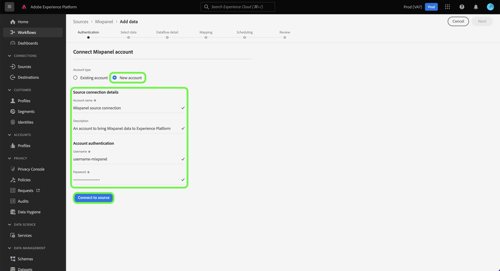

# (Beta) Cree un [!DNL Mixpanel] conexión de origen en la interfaz de usuario

>[!NOTE]
>
>La variable [!DNL Mixpanel] el origen está en versión beta. Consulte la [información general sobre fuentes](../../../../home.md#terms-and-conditions) para obtener más información sobre el uso de fuentes con etiquetas beta.

Este tutorial proporciona los pasos para crear un [!DNL Mixpanel] conexión de origen mediante la interfaz de usuario de Adobe Experience Platform Platform.

## Primeros pasos

Este tutorial requiere una comprensión práctica de los siguientes componentes de Experience Platform:

* [[!DNL Experience Data Model (XDM)] Sistema](../../../../../xdm/home.md): El marco normalizado por el cual [!DNL Experience Platform] organiza los datos de experiencia del cliente.
   * [Aspectos básicos de la composición del esquema](../../../../../xdm/schema/composition.md): Obtenga información sobre los componentes básicos de los esquemas XDM, incluidos los principios clave y las prácticas recomendadas en la composición de esquemas.
   * [Tutorial del Editor de esquemas](../../../../../xdm/tutorials/create-schema-ui.md): Obtenga información sobre cómo crear esquemas personalizados mediante la interfaz de usuario del Editor de esquemas.
* [[!DNL Real-Time Customer Profile]](../../../../../profile/home.md): Proporciona un perfil de cliente unificado y en tiempo real basado en datos agregados de varias fuentes.

### Recopilar las credenciales necesarias

Para conectarse [!DNL Mixpanel] en Platform, debe proporcionar valores para las siguientes propiedades de conexión:

| Credencial | Descripción | Ejemplo |
| --- | --- | --- |
| Nombre de usuario | El nombre de usuario de la cuenta de servicio correspondiente a su [!DNL Mixpanel] cuenta. Consulte la [[!DNL Mixpanel] documentación de cuentas de servicio](https://developer.mixpanel.com/reference/service-accounts#authenticating-with-a-service-account) para obtener más información. | `Test8.6d4ee7.mp-service-account` |
| Una contraseña | La contraseña de la cuenta de servicio correspondiente a su [!DNL Mixpanel] cuenta. | `dLlidiKHpCZtJhQDyN2RECKudMeTItX1` |
| ID del proyecto | Su [!DNL Mixpanel] ID del proyecto. Este ID es necesario para crear una conexión de origen. Consulte la [[!DNL Mixpanel] documentación de configuración del proyecto](https://help.mixpanel.com/hc/en-us/articles/115004490503-Project-Settings) y [[!DNL Mixpanel] guía sobre la creación y administración de proyectos](https://help.mixpanel.com/hc/en-us/articles/115004505106-Create-and-Manage-Projects) para obtener más información. | `2384945` |
| Zona horaria | La zona horaria que corresponde a su [!DNL Mixpanel] proyecto. Se requiere zona horaria para crear una conexión de origen. Consulte la [Documentación de la configuración del proyecto de Mixpanel](https://help.mixpanel.com/hc/en-us/articles/115004490503-Project-Settings) para obtener más información. | `Pacific Standard Time` |

Para obtener más información sobre cómo autenticar su [!DNL Mixpanel] fuente, consulte la [[!DNL Mixpanel] información general de la fuente](../../../../connectors/analytics/mixpanel.md).

## Conecte su [!DNL Mixpanel] account

En la interfaz de usuario de Platform, seleccione **[!UICONTROL Fuentes]** en la barra de navegación izquierda para acceder a la [!UICONTROL Fuentes] espacio de trabajo. La variable [!UICONTROL Catálogo] muestra una variedad de fuentes con las que puede crear una cuenta.

Puede seleccionar la categoría adecuada del catálogo en la parte izquierda de la pantalla. Alternativamente, puede encontrar la fuente específica con la que desea trabajar usando la opción de búsqueda.

En el *Analytics* categoría, seleccione [!DNL Mixpanel]y, a continuación, seleccione **[!UICONTROL Añadir datos]**.

La variable **[!UICONTROL Conectar cuenta de panel mixto]** se abre. En esta página, puede usar credenciales nuevas o existentes.

### Cuenta existente

Para usar una cuenta existente, seleccione la opción [!DNL Mixpanel] cuenta con la que desee crear un nuevo flujo de datos y, a continuación, seleccione **[!UICONTROL Siguiente]** para continuar.

### Nueva cuenta

Si está creando una cuenta nueva, seleccione **[!UICONTROL Nueva cuenta]** y, a continuación, proporcione un nombre, una descripción opcional y sus credenciales. Cuando termine, seleccione **[!UICONTROL Conectar a origen]** y, a continuación, permita que la nueva conexión se establezca durante algún tiempo.

## Seleccionar el ID del proyecto y la zona horaria {#project-id-and-timezone}

>[!CONTEXTUALHELP]
>id="platform_sources_mixpanel_timezone"
>title="Establecer una zona horaria para la ingesta de Mixpanel"
>abstract="La zona horaria debe ser la misma que la configuración de la zona horaria del perfil de Mixpanel, ya que Platform utiliza la zona horaria del proyecto designada para ingerir datos relevantes de Mixpanel. Mixpanel ajustará su zona horaria para coordinarse con la zona horaria del proyecto antes de registrar el evento en un almacén de datos de Mixpanel."
>additional-url="https://experienceleague.adobe.com/docs/experience-platform/sources/ui-tutorials/create/analytics/mixpanel.html?lang=es#project-id-and-timezone" text="Obtenga más información en la documentación"

Una vez autenticado el origen, proporcione el ID del proyecto y la zona horaria y, a continuación, seleccione **[!UICONTROL Select]**.

La zona horaria que designe antes de ingerir su [!DNL Mixpanel] Los datos de Platform deben ser los mismos que su [!DNL Mixpanel] configuración de zona horaria del perfil. Cualquier cambio en la zona horaria de los datos solo se aplicará a los eventos nuevos y los eventos antiguos permanecerán en la zona horaria que designó anteriormente. [!DNL Mixpanel] se adapta al horario de verano y ajustará adecuadamente la marca de tiempo de ingesta. Para obtener más información sobre cómo afectan las zonas horarias a los datos, consulte la [!DNL Mixpanel] guía sobre [administración de zonas horarias para proyectos](https://help.mixpanel.com/hc/en-us/articles/115004547203-Manage-Timezones-for-Projects-in-Mixpanel).

Después de unos momentos, la interfaz correcta se actualiza a un panel de vista previa, lo que le permite inspeccionar el esquema antes de crear un flujo de datos. Cuando termine, seleccione **[!UICONTROL Siguiente]**.

## Pasos siguientes

Al seguir este tutorial, ha establecido una conexión con su [!DNL Mixpanel] cuenta. Ahora puede continuar con el siguiente tutorial y [configurar un flujo de datos para incorporar datos de análisis a Platform](../../dataflow/analytics.md).

## Recursos adicionales {#additional-resources}

Las secciones a continuación proporcionan recursos adicionales a los que puede hacer referencia al usar la variable [!DNL Mixpanel] fuente.

### Validación {#validation}

A continuación se describen los pasos que puede seguir para validar que ha conectado correctamente su [!DNL Mixpanel] origen y que [!DNL Mixpanel] se están incorporando eventos a Platform.

En la interfaz de usuario de Platform, seleccione **[!UICONTROL Conjuntos de datos]** en la barra de navegación izquierda para acceder a la [!UICONTROL Conjuntos de datos] espacio de trabajo. La variable [!UICONTROL Actividad de conjunto de datos] muestra los detalles de las ejecuciones.

A continuación, seleccione el ID de ejecución de flujo de datos del flujo de datos que desea ver para ver detalles específicos sobre ese flujo de datos ejecutado.

Finalmente, seleccione **[!UICONTROL Vista previa del conjunto de datos]** para mostrar los datos introducidos.

Puede verificar estos datos con los datos del [!DNL Mixpanel] > [!DNL Events] página. Consulte la [[!DNL Mixpanel] documento sobre eventos](https://help.mixpanel.com/hc/en-us/articles/4402837164948-Events-formerly-Live-View-) para obtener más información.

### esquema de Mixpanel

La tabla siguiente enumera las asignaciones admitidas que deben configurarse para [!DNL Mixpanel].

>[!TIP]
>
>Consulte [API de exportación de eventos > Descargar](https://developer.mixpanel.com/reference/raw-event-export) para obtener más información sobre la API.

| Fuente | Tipo |
|---|---|
| `distinct_id` | string |
| `event_name` | string |
| `import` | Booleano |
| `insert_id` | string |
| `item_id` | string |
| `item_name` | string |
| `item_price` | string |
| `mp_api_endpoint` | string |
| `mp_api_timestamp_ms` | entero |
| `mp_processing_time_ms` | entero |
| `time` | entero |

### Límites {#limits}

* Tiene un máximo de 100 consultas simultáneas y 60 consultas por hora, según se indica en [Exportar límites de velocidad de API](https://help.mixpanel.com/hc/en-us/articles/115004602563-Rate-Limits-for-API-Endpoints).
