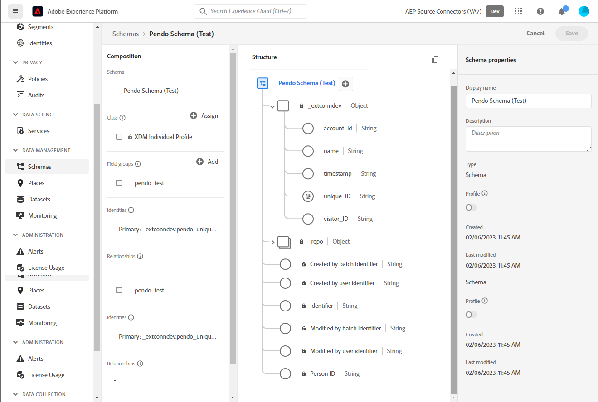
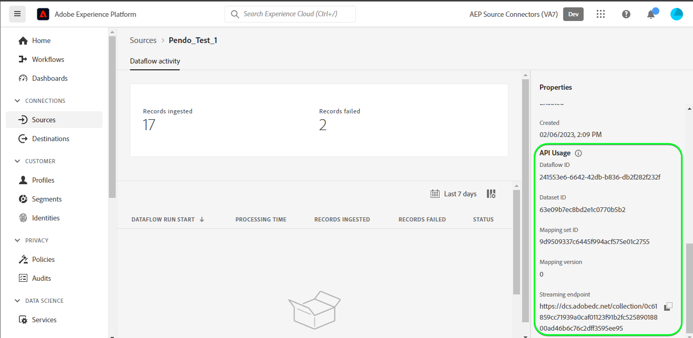

# Crear un [!DNL Pendo] flujo de datos de la conexión de origen y en la IU

>[!NOTE]
>
>El [!DNL Pendo] el origen está en versión beta. Lea el [información general de orígenes](../../../../home.md#terms-and-conditions) para obtener más información sobre el uso de fuentes etiquetadas como beta.

Este tutorial proporciona los pasos para crear una [!DNL Pendo] conexión de origen y flujo de datos mediante la interfaz de usuario de Adobe Experience Platform.

## Introducción {#getting-started}

Este tutorial requiere una comprensión práctica de los siguientes componentes de Experience Platform:

* [[!DNL Experience Data Model (XDM)] Sistema](../../../../../xdm/home.md): El marco estandarizado mediante el cual [!DNL Experience Platform] organiza los datos de experiencia del cliente.
   * [Conceptos básicos de composición de esquemas](../../../../../xdm/schema/composition.md): Obtenga información acerca de los componentes básicos de los esquemas XDM, incluidos los principios clave y las prácticas recomendadas en la composición de esquemas.
   * [Tutorial del Editor de esquemas](../../../../../xdm/tutorials/create-schema-ui.md): Aprenda a crear esquemas personalizados mediante la interfaz de usuario del Editor de esquemas.
* [[!DNL Real-Time Customer Profile]](../../../../../profile/home.md): Proporciona un perfil de consumidor unificado y en tiempo real basado en los datos agregados de varias fuentes.

## Requisitos previos {#prerequisites}

En la siguiente sección se proporciona información sobre los requisitos previos que se deben completar para poder crear una [!DNL Pendo] conexión de origen.

### JSON de muestra para definir el esquema de origen de [!DNL Pendo] {#prerequisites-json-schema}

Antes de crear un [!DNL Pendo] conexión de origen, necesitará que se proporcione un esquema de origen. Puede utilizar el siguiente JSON.

```
{
  "accountId": "58f79ee324d3f",
  "timestamp": 1673372516,
  "visitorId": "test@test.com",
  "uniqueId": "166e50cdf40930fe1367e4d44795c9c74d88b83a",
  "properties": {
    "guideProperties": {
  "name": "Guide Conversion Test"
  }
}
}
```

Para obtener más información, lea la [[!DNL Pendo] guía de webhooks](https://support.pendo.io/hc/en-us/articles/360032285012-Webhooks).

### Creación de un esquema de Platform para [!DNL Pendo] {#create-platform-schema}

También debe asegurarse de crear primero un esquema de Platform para utilizarlo en el origen. Consulte el tutorial sobre [creación de un esquema de Platform](../../../../../xdm/schema/composition.md) para obtener información detallada sobre cómo crear un esquema.



## Conecte su [!DNL Pendo] account {#connect-account}

En la IU de Platform, seleccione **[!UICONTROL Fuentes]** desde la navegación izquierda para acceder a [!UICONTROL Fuentes] workspace y vea un catálogo de fuentes disponibles en Experience Platform.

Utilice el *[!UICONTROL Categorías]* para filtrar los orígenes por categoría. También puede introducir un nombre de origen en la barra de búsqueda para buscar un origen específico del catálogo.

Vaya a la [!UICONTROL Analytics] para ver la [!DNL Pendo] tarjeta de origen. Para empezar, seleccione **[!UICONTROL Añadir datos]**.


## Seleccionar datos {#select-data}

El **[!UICONTROL Seleccionar datos]** Este paso aparece y proporciona una interfaz para que seleccione los datos que desea llevar a Platform.

* La parte izquierda de la interfaz es un explorador que le permite ver los flujos de datos disponibles en su cuenta;
* La parte derecha de la interfaz de le permite previsualizar hasta 100 filas de datos de un archivo JSON.

Seleccionar **[!UICONTROL Cargar archivos]** para cargar un archivo JSON desde el sistema local. También puede arrastrar y soltar el archivo JSON que desee cargar en [!UICONTROL Arrastrar y soltar archivos] panel.


Una vez cargado el archivo, la interfaz de vista previa se actualiza para mostrar una vista previa del esquema cargado. La interfaz de vista previa permite inspeccionar el contenido y la estructura de un archivo. También puede utilizar la variable [!UICONTROL Campo de búsqueda] para acceder a elementos específicos desde el esquema.

Cuando termine, seleccione **[!UICONTROL Siguiente]**.


## Detalles de flujo de datos {#dataflow-detail}

El **Detalles del flujo de datos** Este paso se muestra y le proporciona opciones para utilizar un conjunto de datos existente o establecer un nuevo conjunto de datos para su flujo de datos, así como la oportunidad de proporcionar un nombre y una descripción para su flujo de datos. Durante este paso, también puede configurar las opciones de Ingesta de perfiles, diagnósticos de error, ingesta parcial y alertas.

Cuando termine, seleccione **[!UICONTROL Siguiente]**.


## Asignación {#mapping}

El [!UICONTROL Asignación] Este paso aparece y le proporciona una interfaz para asignar los campos de origen del esquema de origen a sus campos XDM de destino adecuados en el esquema de destino.

Platform proporciona recomendaciones inteligentes para campos asignados automáticamente en función del esquema o el conjunto de datos de destino seleccionado. Puede ajustar manualmente las reglas de asignación para adaptarlas a sus casos de uso. En función de sus necesidades, puede elegir asignar campos directamente o utilizar funciones de preparación de datos para transformar los datos de origen y derivar valores calculados o calculados. Para ver los pasos detallados sobre el uso de la interfaz de asignación y los campos calculados, consulte la [Guía de IU de preparación de datos](../../../../../data-prep/ui/mapping.md).

Las asignaciones enumeradas a continuación son obligatorias y deben configurarse antes de continuar con la [!UICONTROL Revisar] escenario.

| Campo de destino | Descripción |
| --- | --- |
| `uniqueId` | El [!DNL Pendo] identificador del evento. |

Una vez que los datos de origen se hayan asignado correctamente, seleccione **[!UICONTROL Siguiente]**.


## Consulte {#review}

El **[!UICONTROL Revisar]** Este paso aparece, lo que le permite revisar el nuevo flujo de datos antes de crearlo. Los detalles se agrupan en las siguientes categorías:

* **[!UICONTROL Conexión]**: Muestra el tipo de origen, la ruta relevante del archivo de origen elegido y la cantidad de columnas dentro de ese archivo de origen.
* **[!UICONTROL Asignar campos de conjunto de datos y asignación]**: Muestra en qué conjunto de datos se están ingiriendo los datos de origen, incluido el esquema al que se adhiere el conjunto de datos.

Una vez revisado el flujo de datos, seleccione **[!UICONTROL Finalizar]** y deje pasar un tiempo para crear el flujo de datos.


## Obtener la URL del extremo de flujo continuo {#get-streaming-endpoint-url}

Con el flujo de datos de flujo continuo creado, ahora puede recuperar la URL del extremo de flujo continuo. Este punto de conexión se utilizará para suscribirse al webhook, lo que permitirá que el origen de la transmisión se comunique con el Experience Platform.

Para construir la URL utilizada para configurar el webhook en [!DNL Pendo] debe recuperar lo siguiente:

* **[!UICONTROL ID de flujo de datos]**
* **[!UICONTROL Extremo de streaming]**

Para recuperar su **[!UICONTROL ID de flujo de datos]** y **[!UICONTROL Extremo de streaming]**, vaya a la [!UICONTROL Actividad de flujo de datos] página del flujo de datos que acaba de crear y copie los detalles de la parte inferior de la [!UICONTROL Propiedades] panel.



Una vez que haya recuperado el extremo de flujo continuo y el ID de flujo de datos, cree una URL basada en el siguiente patrón: ```{STREAMING_ENDPOINT}?x-adobe-flow-id={DATAFLOW_ID}```. Por ejemplo, una URL de gancho web construida puede tener el siguiente aspecto: ```https://dcs.adobedc.net/collection/0c61859cc71939a0caf01123f91b2fc52589018800ad46b6c76c2dff3595ee95```

## Configuración del webhook en [!DNL Pendo] {#set-up-webhook}

A continuación, inicie sesión en su cuenta en [[!DNL Pendo]](https://pendo.io/) y cree un webhook. Para ver los pasos sobre cómo crear un webhook usando el [!DNL Pendo] interfaz de usuario, consulte la [[!DNL Pendo] guía para crear un webhook](https://support.pendo.io/hc/en-us/articles/360032285012-Webhooks#create-a-webhook-0-4).

Una vez creado el webhook, vaya a la página de configuración de su [!DNL Pendo] webhook e introduzca su URL de webhook en la [!DNL URL] field.


>[!TIP]
>
>Puede suscribirse a diferentes categorías de eventos para determinar el tipo de eventos que desea enviar desde su [!DNL Pendo] a Platform. Para obtener más información sobre los diferentes eventos, consulte la [[!DNL Pendo] documentación](https://support.pendo.io/hc/en-us/articles/360032285012-Webhooks#create-a-webhook-0-4).

## Pasos siguientes {#next-steps}

Al seguir este tutorial, ha configurado correctamente un flujo de datos de flujo continuo para traer su [!DNL Pendo] datos al Experience Platform. Para monitorizar los datos que se están introduciendo, consulte la guía de [monitorización de flujos de datos de streaming mediante la IU de Platform](../../monitor-streaming.md).

## Recursos adicionales {#additional-resources}

Las secciones siguientes proporcionan recursos adicionales a los que puede hacer referencia al utilizar el [!DNL Pendo] origen.

### Validación {#validation}

Para validar que ha configurado correctamente el origen y [!DNL Pendo] Si se están introduciendo mensajes, siga los pasos a continuación:

* Puede consultar la [!DNL Pendo] **[!UICONTROL Informes]** > **[!UICONTROL Historial de chat]** para identificar los eventos que captura [!DNL Pendo].


* En la IU de Platform, seleccione **[!UICONTROL Ver flujos de datos]** al lado del [!DNL Pendo] menú de tarjeta en el catálogo de fuentes. A continuación, seleccione **[!UICONTROL Previsualizar conjunto de datos]** para verificar los datos introducidos para los webhooks configurados en [!DNL Pendo].


### Errores y solución de problemas {#errors-and-troubleshooting}

Al comprobar la ejecución de un flujo de datos, puede encontrar el siguiente mensaje de error: `The message can't be validated ... uniqueID:expected minLength:1, actual 0].`


Para corregir este error, debe comprobar que la variable *uniqueID* se ha configurado la asignación. Para obtener más información, consulte la [Asignación](#mapping) sección.

Para obtener más información, visite la [[!DNL Pendo] Centro de ayuda](https://www.pendo.io/help-center/).
