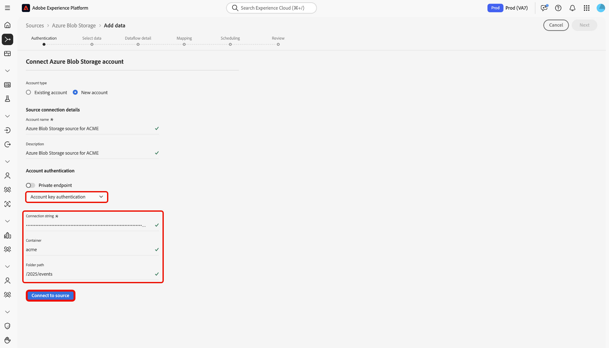

# Conectar [!DNL Azure Blob Storage] a Experience Platform mediante la interfaz de usuario

Lea esta guía para aprender a conectar su instancia de [!DNL Azure Blob Storage] a Adobe Experience Platform mediante el espacio de trabajo de orígenes en la interfaz de usuario de Experience Platform.

## Introducción

Este tutorial requiere una comprensión práctica de los siguientes componentes de Adobe Experience Platform:

* [[!DNL Experience Data Model (XDM)] Sistema](../../../../../xdm/home.md): el marco estandarizado para organizar los datos de experiencia del cliente en Experience Platform.
   * [Aspectos básicos de la composición de esquemas](../../../../../xdm/schema/composition.md): obtenga información sobre los componentes básicos de los esquemas XDM, incluidos los principios clave y las prácticas recomendadas en la composición de esquemas.
   * [Tutorial del editor de esquemas](../../../../../xdm/tutorials/create-schema-ui.md): Aprenda a crear esquemas personalizados mediante la interfaz de usuario del editor de esquemas.
* [[!DNL Real-Time Customer Profile]](../../../../../profile/home.md): proporciona un perfil de consumidor unificado y en tiempo real basado en los datos agregados de varias fuentes.

Si ya tiene una conexión [!DNL Azure Blob Storage] válida, puede omitir el resto de este documento y continuar con el tutorial sobre [configuración de un flujo de datos](../../dataflow/batch/cloud-storage.md).

### Formatos de archivo compatibles

Experience Platform admite la ingesta de los siguientes formatos de archivo desde almacenamientos externos:

* Valores separados por delimitadores (DSV): puede utilizar cualquier delimitador de columna individual, como una tabulación, una coma, una barra vertical, un punto y coma o un hash, para recopilar archivos planos en cualquier formato.
* Notación de objetos de JavaScript (JSON): los archivos de datos con formato JSON deben ser compatibles con XDM.
* Apache Parquet: Los archivos de datos con formato Parquet deben ser compatibles con XDM.

### Recopilar credenciales necesarias

Lea la [[!DNL Azure Blob Storage] descripción general](../../../../connectors/cloud-storage/blob.md#authentication) para obtener información sobre la autenticación.

## Navegar por el catálogo de fuentes

En la interfaz de usuario de Experience Platform, seleccione **[!UICONTROL Fuentes]** en el panel de navegación izquierdo para acceder al área de trabajo *[!UICONTROL Fuentes]*. Elija una categoría o utilice la barra de búsqueda para encontrar el origen.

Para conectarse a [!DNL Azure Blob Storage], vaya a la categoría *[!UICONTROL Almacenamiento en la nube]*, seleccione la tarjeta de origen de **[!UICONTROL Azure Blob Storage]** y, a continuación, seleccione **[!UICONTROL Configurar]**.

>[!TIP]
>
>Las fuentes muestran **[!UICONTROL Configurado]** para nuevas conexiones y **[!UICONTROL Agregar datos]** si ya existe una cuenta.

## Usar una cuenta existente

Para usar una cuenta existente, seleccione **[!UICONTROL Cuenta existente]** y luego seleccione la cuenta [!DNL Azure Blob Storage] que desee usar.

## Crear una nueva cuenta

Para crear una cuenta nueva, selecciona **[!UICONTROL Cuenta nueva]** y, a continuación, proporciona un nombre y, opcionalmente, agrega una descripción para tu cuenta. Puede conectar su cuenta de [!DNL Azure Blob Storage] a Experience Platform mediante los siguientes tipos de autenticación:

* **Autenticación de clave de cuenta**: Utiliza la clave de acceso de la cuenta de almacenamiento para autenticarse y conectarse a su cuenta de [!DNL Azure Blob Storage].
* **Firma de acceso compartido (SAS)**: Utiliza un URI de SAS para proporcionar acceso delegado y limitado en el tiempo a los recursos de su cuenta de [!DNL Azure Blob Storage].
* **Autenticación basada en entidad de seguridad de servicio**: Utiliza una entidad de seguridad de servicio de Azure Active Directory (AAD) (ID de cliente y secreto) para autenticarse de forma segura en su cuenta de Azure Blob Storage.

>[!BEGINTABS]

>[!TAB Autenticación de clave de cuenta]

Seleccione **[!UICONTROL Autenticación de clave de cuenta]** y proporcione sus `connectionString`, `container` y `folderPath`. A continuación, seleccione **[!UICONTROL Conectarse al origen]** y espere unos momentos para que se establezca la conexión.

>[!TAB Firma de acceso compartido]

Seleccione **[!UICONTROL Firma de acceso compartido]** y proporcione sus `sasUri`, `container` y `folderPath`. A continuación, seleccione **[!UICONTROL Conectarse al origen]** y espere unos momentos para que se establezca la conexión.

>[!TAB Autenticación basada en entidad de seguridad de servicio]

Seleccione **[!UICONTROL Autenticación basada en entidad de seguridad de servicio]** y proporcione sus `serviceEndpoint`, `servicePrincipalId`, `servicePrincipalKey`, `accountKind`, `tenant`, `container` y `folderPath`. A continuación, seleccione **[!UICONTROL Conectarse al origen]** y espere unos momentos para que se establezca la conexión.

>[!ENDTABS]

## Próximos pasos

Al seguir este tutorial, ha establecido una conexión con su cuenta de [!DNL Azure Blob Storage]. Ahora puede continuar con el siguiente tutorial y [configurar un flujo de datos para traer datos de su almacenamiento en la nube a Experience Platform](../../dataflow/batch/cloud-storage.md).
