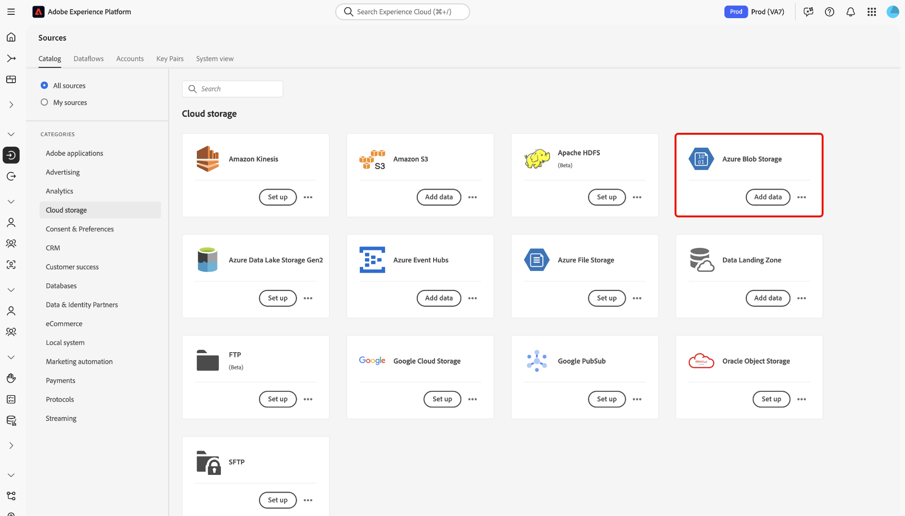

# Crear una conexión de origen [!DNL Azure Blob] en la interfaz de usuario

Este tutorial proporciona los pasos para crear una conexión de origen de [!DNL Azure Blob] (denominada en adelante como &quot;[!DNL Blob]&quot;) mediante la interfaz de usuario de Platform.

## Introducción

Este tutorial requiere una comprensión práctica de los siguientes componentes de Adobe Experience Platform:

* [[!DNL Experience Data Model (XDM)] Sistema](../../../../../xdm/home.md): El marco de trabajo estandarizado para organizar los datos de experiencia del cliente en Experience Platform.
   * [Aspectos básicos de la composición de esquemas](../../../../../xdm/schema/composition.md): obtenga información sobre los componentes básicos de los esquemas XDM, incluidos los principios clave y las prácticas recomendadas en la composición de esquemas.
   * [Tutorial del editor de esquemas](../../../../../xdm/tutorials/create-schema-ui.md): Aprenda a crear esquemas personalizados mediante la interfaz de usuario del editor de esquemas.
* [[!DNL Real-Time Customer Profile]](../../../../../profile/home.md): proporciona un perfil de consumidor unificado y en tiempo real basado en los datos agregados de varias fuentes.

Si ya tiene una conexión [!DNL Blob] válida, puede omitir el resto de este documento y continuar con el tutorial sobre [configuración de un flujo de datos](../../dataflow/batch/cloud-storage.md).

### Formatos de archivo compatibles

Experience Platform admite la ingesta de los siguientes formatos de archivo desde almacenes externos:

* Valores separados por delimitadores (DSV): puede utilizar cualquier delimitador de columna individual, como una tabulación, una coma, una barra vertical, un punto y coma o un hash, para recopilar archivos planos en cualquier formato.
* Notación de objetos de JavaScript (JSON): los archivos de datos con formato JSON deben ser compatibles con XDM.
* Apache Parquet: Los archivos de datos con formato Parquet deben ser compatibles con XDM.

### Recopilar credenciales necesarias

Para tener acceso al almacenamiento de [!DNL Blob] en el Experience Platform, debe proporcionar valores válidos para las siguientes credenciales:

>[!BEGINTABS]

>[!TAB Autenticación de cadena de conexión]

| Credencial | Descripción |
| --- | --- |
| Cadena de conexión | Cadena que contiene la información de autorización necesaria para autenticar [!DNL Blob] en el Experience Platform. El patrón de cadena de conexión [!DNL Blob] es: `DefaultEndpointsProtocol=https;AccountName={ACCOUNT_NAME};AccountKey={ACCOUNT_KEY}`. Para obtener más información sobre las cadenas de conexión, consulte este documento de [!DNL Blob] en [configuración de cadenas de conexión](https://docs.microsoft.com/en-us/azure/storage/common/storage-configure-connection-string). |

>[!TAB Autenticación de URI de SAS]

| Credencial | Descripción |
| --- | --- |
| URI de SAS | URI de firma de acceso compartido que puede usar como tipo de autenticación alternativo para conectar su cuenta de [!DNL Blob]. El patrón de URI de SAS [!DNL Blob] es: `https://{ACCOUNT_NAME}.blob.core.windows.net/?sv=<storage version>&st={START_TIME}&se={EXPIRE_TIME}&sr={RESOURCE}&sp={PERMISSIONS}>&sip=<{IP_RANGE}>&spr={PROTOCOL}&sig={SIGNATURE}>` Para obtener más información, consulte este documento de [!DNL Blob] sobre [URI de firma de acceso compartido](https://docs.microsoft.com/en-us/azure/data-factory/connector-azure-blob-storage#shared-access-signature-authentication). |
| Contenedor | El nombre del contenedor al que desea designar el acceso. Al crear una nueva cuenta con el origen [!DNL Blob], puede proporcionar un nombre de contenedor para especificar el acceso del usuario a la subcarpeta que elija. |
| Ruta de carpeta | La ruta a la carpeta a la que desea proporcionar acceso. |

>[!ENDTABS]

Una vez que haya recopilado las credenciales necesarias, puede seguir los pasos a continuación para conectar su almacenamiento de [!DNL Blob] al Experience Platform

## Conectar su cuenta de [!DNL Blob]

En la interfaz de usuario de Platform, seleccione **[!UICONTROL Sources]** en la barra de navegación izquierda para acceder al área de trabajo [!UICONTROL Sources]. La pantalla [!UICONTROL Catálogo] muestra una variedad de orígenes con los que puede crear una cuenta.

Puede seleccionar la categoría adecuada del catálogo en la parte izquierda de la pantalla. También puede encontrar la fuente específica con la que desea trabajar en la barra de búsqueda.

En la categoría [!UICONTROL Almacenamiento en la nube], seleccione **[!UICONTROL Almacenamiento de blob de Azure]** y, a continuación, seleccione **[!UICONTROL Agregar datos]**.

Aparecerá la página **[!UICONTROL Conectar con Azure Blob Storage]**. En esta página, puede usar credenciales nuevas o existentes.

### Cuenta existente

Para usar una cuenta existente, seleccione la cuenta de [!DNL Blob] con la que desee crear un nuevo flujo de datos y, a continuación, seleccione **[!UICONTROL Siguiente]** para continuar.

### Nueva cuenta

>[!TIP]
>
>Una vez creada, no se puede cambiar el tipo de autenticación de una conexión base de [!DNL Blob]. Para cambiar el tipo de autenticación, debe crear una nueva conexión base.

Si va a crear una cuenta nueva, seleccione **[!UICONTROL Nueva cuenta]** y, a continuación, proporcione un nombre y una descripción opcional para la nueva cuenta de [!DNL Blob].

El origen [!DNL Blob] admite la autenticación de clave de cuenta y la autenticación de firma de acceso compartido (SAS). Una autenticación basada en claves de cuenta requiere una cadena de conexión para la verificación, mientras que una autenticación SAS utiliza un URI que permite la autorización delegada y segura de su cuenta.

Durante este paso, también puede designar las subcarpetas a las que tendrá acceso su cuenta definiendo el nombre del contenedor y la ruta de acceso a la subcarpeta.

>[!BEGINTABS]

>[!TAB Cadena de conexión]

Para autenticarse con una clave de cuenta, seleccione **[!UICONTROL Autenticación de clave de cuenta]** y proporcione la cadena de conexión. Durante este paso, también puede designar el nombre del contenedor y la ruta de acceso a la subcarpeta a la que desea acceder. Cuando termine, seleccione **[!UICONTROL Conectarse al origen]**.

>[!TAB URI SAS]

Puede utilizar SAS para crear credenciales de autenticación con distintos grados de acceso, ya que la autenticación basada en SAS le permite establecer permisos, fechas de inicio y caducidad, así como disposiciones para recursos específicos.

Para autenticarse con una firma de acceso compartido, seleccione **[!UICONTROL Autenticación de firma de acceso compartido]** y proporcione el URI de SAS. Durante este paso, también puede designar el nombre del contenedor y la ruta de acceso a la subcarpeta a la que desea acceder. Cuando termine, seleccione **[!UICONTROL Conectarse al origen]**.

>[!ENDTABS]

## Pasos siguientes

Al seguir este tutorial, ha establecido una conexión con su cuenta de [!DNL Blob]. Ahora puede continuar con el siguiente tutorial y [configurar un flujo de datos para traer datos de su almacenamiento en la nube a Platform](../../dataflow/batch/cloud-storage.md).
