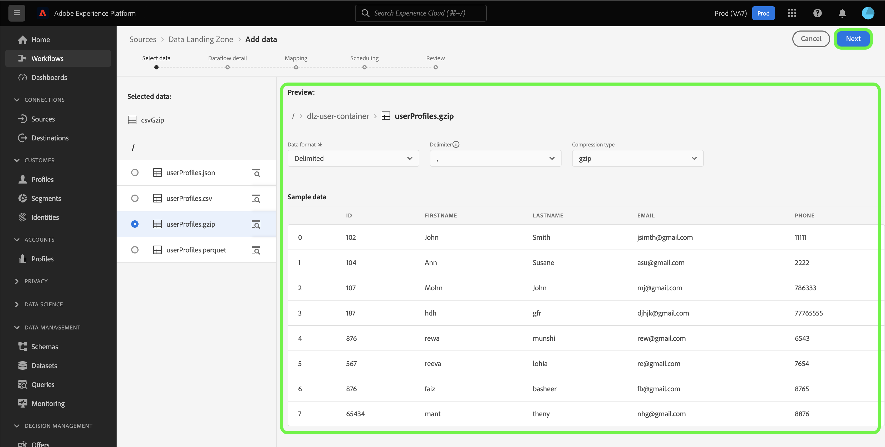
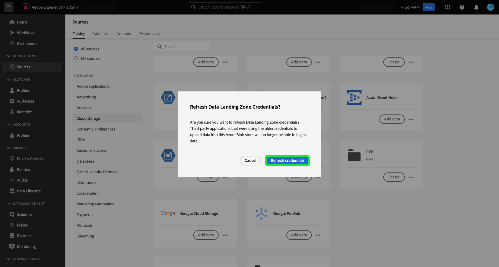
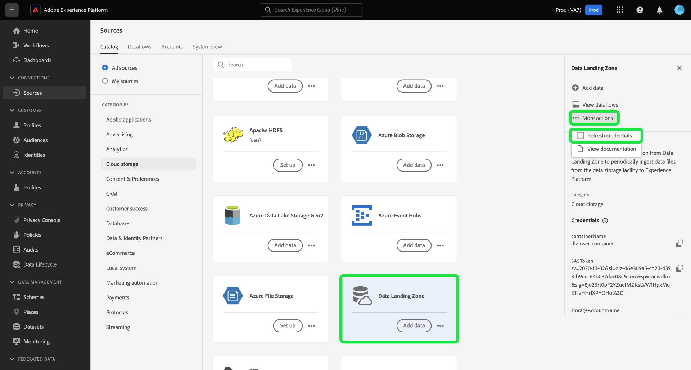

# Connect [!DNL Data Landing Zone] a Platform mediante la IU

>[!IMPORTANT]
>
>Esta página es específica de [!DNL Data Landing Zone] *origen* conector en el Experience Platform. Para obtener información sobre la conexión a [!DNL Data Landing Zone] *destino* conector, consulte el [[!DNL Data Landing Zone] página de documentación de destino](/help/destinations/catalog/cloud-storage/data-landing-zone.md).

[!DNL Data Landing Zone] es una función de almacenamiento de archivos segura y basada en la nube que permite introducir archivos en Adobe Experience Platform. Los datos se eliminan automáticamente del [!DNL Data Landing Zone] después de siete días.

Este tutorial proporciona los pasos para crear una [!DNL Data Landing Zone] conexión de origen mediante la interfaz de usuario de Platform.

## Introducción

Este tutorial requiere una comprensión práctica de los siguientes componentes de Adobe Experience Platform:

* [Fuentes](../../../../home.md): Experience Platform permite la ingesta de datos desde varias fuentes y, al mismo tiempo, le ofrece la capacidad de estructurar, etiquetar y mejorar los datos entrantes mediante los servicios de Platform.
* [Zonas protegidas](../../../../../sandboxes/home.md): El Experience Platform proporciona entornos limitados virtuales que dividen una sola instancia de Platform en entornos virtuales independientes para ayudar a desarrollar y evolucionar aplicaciones de experiencia digital.

## Traer los archivos de [!DNL Data Landing Zone] a Platform

En la IU de Platform, seleccione **[!UICONTROL Fuentes]** desde la navegación izquierda para acceder a [!UICONTROL Fuentes] workspace. El [!UICONTROL Catálogo] La pantalla muestra una variedad de fuentes con las que puede crear una cuenta.

Puede seleccionar la categoría adecuada del catálogo en la parte izquierda de la pantalla. También puede encontrar la fuente específica con la que desea trabajar en la barra de búsqueda.

En el [!UICONTROL almacenamiento en la nube] categoría, seleccionar [!DNL Data Landing Zone] y luego seleccione **[!UICONTROL Añadir datos]**.

El [!UICONTROL Añadir datos] Este paso aparece y le proporciona una interfaz para seleccionar y previsualizar los datos que desea llevar a Platform.

* La parte izquierda de la interfaz es un explorador de carpetas, que le proporciona una lista de archivos del contenedor que puede llevar a Platform.
* La parte derecha de la interfaz de permite obtener una vista previa de hasta 100 filas de datos de un archivo compatible.

Seleccione el archivo que desea llevar al Experience Platform y espere unos momentos para que la interfaz correcta se actualice en una pantalla de previsualización.

>[!TIP]
>
>Platform detecta automáticamente la información de propiedad del archivo seleccionado, incluida la información sobre el formato de datos del archivo, el delimitador de columna designado y el tipo de compresión.

La interfaz de vista previa permite inspeccionar el contenido y la estructura de un archivo. De forma predeterminada, la interfaz de vista previa muestra el primer archivo de la carpeta seleccionada.

Para obtener una vista previa de un archivo diferente, seleccione el icono de vista previa junto al nombre del archivo que desea inspeccionar.

Cuando termine, seleccione **[!UICONTROL Siguiente]**.

Para obtener una guía detallada paso a paso sobre cómo crear un flujo de datos para una fuente de almacenamiento en la nube, consulte el tutorial sobre [creación de un flujo de datos de almacenamiento en la nube para llevar datos a Platform](../../dataflow/batch/cloud-storage.md).

## Recupere su [!DNL Data Landing Zone] credenciales

[!DNL Data Landing Zone] es una fuente que viene con su licencia de fuentes de Adobe Experience Platform. [!DNL Data Landing Zone] utiliza un URI SAS y autenticación basada en token SAS. Puede recuperar sus credenciales de autenticación desde el [!UICONTROL Catálogo de fuentes] página.

Para recuperar las credenciales, seleccione la **[!UICONTROL Zona de aterrizaje de datos]** y, a continuación, copie las credenciales del carril derecho que aparece.

Aparece una ventana emergente que muestra el nombre del contenedor, el token SAS, el nombre de la cuenta de almacenamiento, el URI SAS y la fecha de caducidad.

## Actualice su [!DNL Data Landing Zone] credenciales

Su [!DNL Data Landing Zone] las credenciales de se establecen para que caduquen automáticamente pasados 90 días y debe utilizar las nuevas credenciales de para volver a conectarse a [!DNL Data Landing Zone] después del vencimiento. Los flujos de datos de Experience Platform no se ven afectados por la caducidad de las credenciales y puede seguir trabajando con los flujos de datos nuevos y existentes con las credenciales nuevas.

Existen dos maneras de actualizar su [!DNL Data Landing Zone] credenciales:

>[!BEGINTABS]

>[!TAB Usar la tarjeta de origen]

Para actualizar las credenciales desde la página del catálogo de orígenes, seleccione los puntos suspensivos (**`...`**) en el [!DNL Data Landing Zone] y seleccione. **[!UICONTROL Actualizar credenciales]**.

Aparece una ventana emergente que le solicita confirmación antes de continuar. Cuando esté listo, seleccione **[!UICONTROL Actualizar credenciales]**.

>[!TAB Utilice el carril derecho]

Para actualizar las credenciales con el carril derecho, seleccione la **[!UICONTROL Zona de aterrizaje de datos]** tarjeta de origen y, a continuación, seleccione **[!UICONTROL Más acciones]**. A continuación, seleccione **[!UICONTROL Actualizar credenciales]** y, a continuación, confirme utilizando la ventana emergente que aparece.

>[!ENDTABS]

## Pasos siguientes

Al seguir este tutorial, ha accedido a su [!DNL Data Landing Zone] y aprendió a recuperar y actualizar sus credenciales. Ahora puede continuar con el siguiente tutorial sobre [creación de un flujo de datos para llevar los datos de un almacenamiento en la nube a Platform](../../dataflow/batch/cloud-storage.md).
