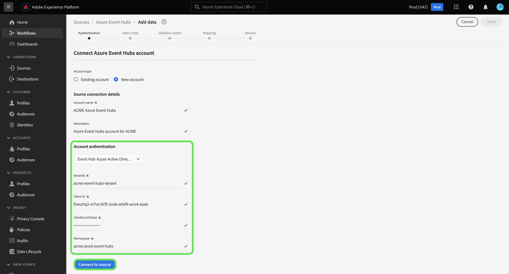

# Crear una conexión de origen [!DNL Azure Event Hubs] en la interfaz de usuario

>[!IMPORTANT]
>
>El origen [!DNL Azure Event Hubs] está disponible en el catálogo de orígenes para los usuarios que han adquirido Real-Time Customer Data Platform Ultimate.

Lea este tutorial para aprender a crear una cuenta de [!DNL Azure Event Hubs] mediante la interfaz de usuario de Adobe Experience Platform.

## Introducción

Este tutorial requiere una comprensión práctica de los siguientes componentes de Adobe Experience Platform:

* [[!DNL Experience Data Model (XDM)] Sistema](../../../../../xdm/home.md): El marco de trabajo estandarizado mediante el cual [!DNL Experience Platform] organiza los datos de la experiencia del cliente.
   * [Aspectos básicos de la composición de esquemas](../../../../../xdm/schema/composition.md): obtenga información sobre los componentes básicos de los esquemas XDM, incluidos los principios clave y las prácticas recomendadas en la composición de esquemas.
   * [Tutorial del editor de esquemas](../../../../../xdm/tutorials/create-schema-ui.md): Aprenda a crear esquemas personalizados mediante la interfaz de usuario del editor de esquemas.
* [[!DNL Real-Time Customer Profile]](../../../../../profile/home.md): proporciona un perfil de consumidor unificado y en tiempo real basado en los datos agregados de varias fuentes.

Si ya tiene una conexión [!DNL Event Hubs] válida, puede omitir el resto de este documento y continuar con el tutorial sobre [configuración de un flujo de datos](../../dataflow/streaming/cloud-storage-streaming.md).

### Recopilar credenciales necesarias

Para autenticar el conector de origen [!DNL Event Hubs], debe proporcionar valores para las siguientes propiedades de conexión:

>[!BEGINTABS]

>[!TAB Autenticación estándar]

| Credencial | Descripción |
| --- | --- |
| Nombre de clave SAS | Nombre de la regla de autorización, que también se conoce como nombre de clave SAS. |
| Clave SAS | La clave principal del espacio de nombres [!DNL Event Hubs]. El `sasPolicy` al que corresponde el `sasKey` debe tener `manage` derechos configurados para que se rellene la lista [!DNL Event Hubs]. |
| Área de nombres | El área de nombres de [!DNL Event Hub] al que está accediendo. Un espacio de nombres [!DNL Event Hub] proporciona un contenedor de ámbito único, en el que puede crear uno o varios [!DNL Event Hubs]. |

>[!TAB Autenticación SAS]

| Credencial | Descripción |
| --- | --- |
| Nombre de clave SAS | Nombre de la regla de autorización, que también se conoce como nombre de clave SAS. |
| Clave SAS | La clave principal del espacio de nombres [!DNL Event Hub]. El `sasPolicy` al que corresponde el `sasKey` debe tener `manage` derechos configurados para que se rellene la lista [!DNL Event Hubs]. |
| Área de nombres | El área de nombres de [!DNL Event Hub] al que está accediendo. Un espacio de nombres [!DNL Event Hub] proporciona un contenedor de ámbito único, en el que puede crear uno o varios [!DNL Event Hubs]. |
| Nombre del centro de eventos | Rellene su nombre de [!DNL Azure Event Hub]. Lea la [documentación de Microsoft](https://learn.microsoft.com/en-us/azure/event-hubs/event-hubs-create#create-an-event-hub) para obtener más información sobre [!DNL Event Hub] nombres. |

>[!TAB Autenticación de Active Directory de Azure del centro de eventos]

| Credencial | Descripción |
| --- | --- |
| ID de inquilino | El ID de inquilino desde el que desea solicitar permiso. Su ID de inquilino puede tener el formato de GUID o de nombre descriptivo. **Nota**: El identificador de inquilino se conoce como &quot;Id. de directorio&quot; en la interfaz [!DNL Microsoft Azure]. |
| ID de cliente | El ID de aplicación asignado a su aplicación. Puede recuperar este identificador del portal [!DNL Microsoft Entra ID] donde registró su [!DNL Azure Active Directory]. |
| Valor secreto de cliente | El secreto de cliente que se utiliza junto con el ID de cliente para autenticar la aplicación. Puede recuperar el secreto de cliente del portal [!DNL Microsoft Entra ID] en el que registró su [!DNL Azure Active Directory]. |
| Área de nombres | El área de nombres de [!DNL Event Hub] al que está accediendo. Un espacio de nombres [!DNL Event Hub] proporciona un contenedor de ámbito único, en el que puede crear uno o varios [!DNL Event Hubs]. |

Para obtener más información sobre [!DNL Azure Active Directory], lea la guía de [Azure sobre el uso del Microsoft Entra ID](https://learn.microsoft.com/en-us/azure/healthcare-apis/register-application).

>[!TAB Autenticación de Azure Active Directory con ámbito de concentrador de eventos]

| Credencial | Descripción |
| --- | --- |
| ID de inquilino | El ID de inquilino desde el que desea solicitar permiso. Su ID de inquilino puede tener el formato de GUID o de nombre descriptivo. **Nota**: El identificador de inquilino se conoce como &quot;Id. de directorio&quot; en la interfaz [!DNL Microsoft Azure]. |
| ID de cliente | El ID de aplicación asignado a su aplicación. Puede recuperar este identificador del portal [!DNL Microsoft Entra ID] donde registró su [!DNL Azure Active Directory]. |
| Valor secreto de cliente | El secreto de cliente que se utiliza junto con el ID de cliente para autenticar la aplicación. Puede recuperar el secreto de cliente del portal [!DNL Microsoft Entra ID] en el que registró su [!DNL Azure Active Directory]. |
| Área de nombres | El área de nombres de [!DNL Event Hub] al que está accediendo. Un espacio de nombres [!DNL Event Hub] proporciona un contenedor de ámbito único, en el que puede crear uno o varios [!DNL Event Hubs]. |
| Nombre del centro de eventos | Rellene su nombre de [!DNL Azure Event Hub]. Lea la [documentación de Microsoft](https://learn.microsoft.com/en-us/azure/event-hubs/event-hubs-create#create-an-event-hub) para obtener más información sobre [!DNL Event Hub] nombres. |

Para obtener más información sobre [!DNL Azure Active Directory], lea la guía de [Azure sobre el uso del Microsoft Entra ID](https://learn.microsoft.com/en-us/azure/healthcare-apis/register-application).

>[!ENDTABS]

Una vez que haya recopilado las credenciales necesarias, puede seguir los pasos a continuación para vincular su cuenta de [!DNL Event Hubs] a Experience Platform.

## Conectar su cuenta de [!DNL Event Hubs]

En la interfaz de usuario de Experience Platform, seleccione **[!UICONTROL Fuentes]** en el panel de navegación izquierdo para acceder al área de trabajo [!UICONTROL Fuentes]. La pantalla [!UICONTROL Catálogo] muestra una variedad de orígenes con los que puede crear una cuenta.

Puede seleccionar la categoría adecuada del catálogo en la parte izquierda de la pantalla. También puede encontrar la fuente específica con la que desea trabajar utilizando la opción de búsqueda.

En la categoría [!UICONTROL Almacenamiento en la nube], seleccione **[!UICONTROL Azure Event Hubs]** y, a continuación, seleccione **[!UICONTROL Agregar datos]**.

Aparecerá el cuadro de diálogo **[!UICONTROL Conectarse a Azure Event Hubs]**. En esta página, puede usar credenciales nuevas o existentes.

### Cuenta existente

Para usar una cuenta existente, seleccione la cuenta de [!DNL Event Hubs] que desee usar y, a continuación, seleccione **[!UICONTROL Siguiente]** para continuar.

### Nueva cuenta

>[!TIP]
>
>Una vez creada, no se puede cambiar el tipo de autenticación de una conexión base de [!DNL Event Hubs]. Para cambiar el tipo de autenticación, debe crear una nueva conexión base.

Para crear una nueva cuenta, selecciona **[!UICONTROL Nueva cuenta]** y, a continuación, proporciona un nombre y una descripción opcional para la nueva cuenta de [!DNL Event Hubs].

>[!BEGINTABS]

>[!TAB Autenticación estándar]

Para crear una cuenta de [!DNL Event Hubs] con autenticación estándar, usa el menú desplegable [!UICONTROL Autenticación de cuenta] y luego selecciona **[!UICONTROL Autenticación estándar]**. A continuación, proporcione valores para su [!UICONTROL nombre de clave SAS], [!UICONTROL clave SAS] y [!UICONTROL espacio de nombres].

Una vez que haya ingresado sus credenciales de autenticación, seleccione **[!UICONTROL Conectarse al origen]**.

>[!TAB Autenticación SAS]

Para crear una cuenta [!DNL Event Hubs] con autenticación SAS, use el menú desplegable [!UICONTROL Autenticación de cuenta] y luego seleccione **[!UICONTROL Autenticación SAS]**. A continuación, proporcione valores para su [!UICONTROL nombre de clave SAS], [!UICONTROL clave SAS], [!UICONTROL espacio de nombres] y [!UICONTROL nombre de concentradores de eventos].

Una vez que haya ingresado sus credenciales de autenticación, seleccione **[!UICONTROL Conectarse al origen]**.

>[!TAB Autenticación de Active Directory de Azure del centro de eventos]

Para crear una cuenta de [!DNL Event Hubs] con la autenticación de Azure Active Directory de Event Hub, use el menú desplegable [!UICONTROL Autenticación de cuenta] y, a continuación, seleccione **[!UICONTROL Azure Active Directory de Event Hub]**. A continuación, proporcione valores para su [!UICONTROL ID de inquilino], [!UICONTROL ID de cliente], [!UICONTROL valor secreto de cliente] y [!UICONTROL área de nombres].

>[!TAB Autenticación de Azure Active Directory con ámbito de concentrador de eventos]

Para crear una cuenta de [!DNL Event Hubs] con la autenticación de Azure Active Directory con ámbito de Event Hub, use el menú desplegable [!UICONTROL Autenticación de cuenta] y, a continuación, seleccione **[!UICONTROL Azure Active Directory con ámbito de Event Hub]**. A continuación, proporcione valores para su [!UICONTROL ID de inquilino], [!UICONTROL ID de cliente], [!UICONTROL valor secreto de cliente], [!UICONTROL área de nombres] y [!UICONTROL nombre del centro de eventos].

>[!ENDTABS]

## Pasos siguientes

Al seguir este tutorial, ha conectado su cuenta de [!DNL Event Hubs] a Experience Platform. Ahora puede continuar con el siguiente tutorial y [configurar un flujo de datos para traer datos de su almacenamiento en la nube a Experience Platform](../../dataflow/streaming/cloud-storage-streaming.md).
