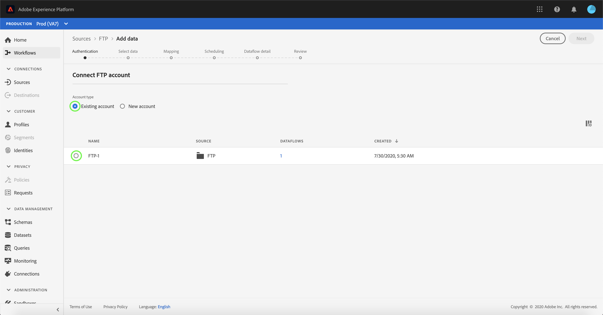

# Creación de una conexión de origen FTP en la interfaz de usuario

>[!NOTE]
>
>El conector FTP está en versión beta. Consulte la [información general de las fuentes](../../../../home.md#terms-and-conditions) para obtener más información sobre el uso de conectores con etiquetas beta.

Este tutorial proporciona los pasos para crear una conexión de origen FTP mediante la interfaz de usuario de Adobe Experience Platform.

## Primeros pasos

Este tutorial requiere un conocimiento práctico de los siguientes componentes de Adobe Experience Platform:

* [[!DNL Experience Data Model (XDM)] Sistema](../../../../../xdm/home.md): El esquema estandarizado por el cual el Experience Platform organiza los datos de experiencia del cliente.
   * [Conceptos básicos de la composición](../../../../../xdm/schema/composition.md) de esquemas: Obtenga información sobre los componentes básicos de los esquemas XDM, incluidos los principios clave y las prácticas recomendadas en la composición de esquemas.
   * [Tutorial](../../../../../xdm/tutorials/create-schema-ui.md) del Editor de esquemas: Obtenga información sobre cómo crear esquemas personalizados mediante la interfaz de usuario del Editor de Esquemas.
* [[!DNL Real-time Customer Profile]](../../../../../profile/home.md):: Proporciona un perfil de consumo unificado y en tiempo real basado en datos agregados de varias fuentes.

Si ya tiene una conexión FTP válida, puede omitir el resto de este documento y continuar con el tutorial sobre [configuración de un flujo de datos](../../dataflow/batch/cloud-storage.md).

### Recopilar las credenciales necesarias

Para conectarse a FTP, debe proporcionar valores para las siguientes propiedades de conexión:

| Credencial | Descripción |
| ---------- | ----------- |
| `host` | El nombre o la dirección IP asociados con el servidor FTP. |
| `username` | El nombre de usuario con acceso al servidor FTP. |
| `password` | La contraseña del servidor FTP. |

## Conectar con el servidor FTP

Una vez recopiladas las credenciales necesarias, puede seguir los pasos a continuación para crear una nueva cuenta de FTP para conectarse a Platform.

Inicie sesión en [Adobe Experience Platform](https://platform.adobe.com) y, a continuación, seleccione **[!UICONTROL Fuentes]** en la barra de navegación izquierda para acceder al espacio de trabajo [!UICONTROL Fuentes]. La pantalla [!UICONTROL Catálogo] muestra una variedad de orígenes para los que puede crear una cuenta de entrada.

Puede seleccionar la categoría adecuada en el catálogo a la izquierda de la pantalla. También puede encontrar la fuente específica con la que desea trabajar mediante la opción de búsqueda.

En la categoría [!UICONTROL Cloud almacenamiento], seleccione **[!UICONTROL FTP]**. Si es la primera vez que utiliza este conector, seleccione **[!UICONTROL Configurar]**. De lo contrario, seleccione **[!UICONTROL Añadir datos]** para crear una nueva conexión FTP.

Aparece la página **[!UICONTROL Conectar a FTP]**. En esta página, puede usar credenciales nuevas o existentes.

### Nueva cuenta

Si está utilizando nuevas credenciales, seleccione **[!UICONTROL Nueva cuenta]**. En el formulario de entrada que aparece, especifique un nombre, una descripción opcional y sus credenciales. Cuando termine, seleccione **[!UICONTROL Conectar]** y, a continuación, deje transcurrir algún tiempo para que se establezca la nueva conexión.

### Cuenta existente

Para conectar una cuenta existente, seleccione la cuenta de FTP con la que desea conectarse y, a continuación, seleccione **[!UICONTROL Siguiente]** para continuar.

## Pasos siguientes

Siguiendo este tutorial, ha establecido una conexión con su cuenta de FTP. Ahora puede continuar con el siguiente tutorial y [configurar un flujo de datos para traer datos del almacenamiento de nube a la plataforma](../../dataflow/batch/cloud-storage.md).