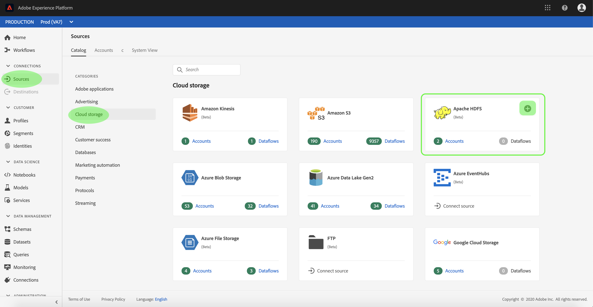

# Creación de un conector de origen [!DNL Apache] HDFS en la interfaz de usuario

>[!NOTE]
>
>El conector [!DNL Apache] HDFS está en versión beta. Consulte la descripción general [de](../../../../home.md#terms-and-conditions) Fuentes para obtener más información sobre el uso de conectores con etiquetas beta.

Los conectores de origen de [!DNL Adobe Experience Platform] proporcionan la capacidad de ingerir datos externos de forma programada. Este tutorial proporciona los pasos para autenticar un conector de origen [!DNL Apache Hadoop Distributed File System] (en lo sucesivo denominado &quot;HDFS&quot;) mediante la interfaz [!DNL Platform] de usuario.

## Primeros pasos

Este tutorial requiere un conocimiento práctico de los siguientes componentes de [!DNL Platform]:

- [[!DNL Experience Data Model] (XDM) Sistema](../../../../../xdm/home.md): El marco normalizado por el cual [!DNL Experience Platform] organiza los datos de experiencia del cliente.
   - [Conceptos básicos de la composición](../../../../../xdm/schema/composition.md)de esquemas: Obtenga información sobre los componentes básicos de los esquemas XDM, incluidos los principios clave y las prácticas recomendadas en la composición de esquemas.
   - [Tutorial](../../../../../xdm/tutorials/create-schema-ui.md)del Editor de esquemas: Obtenga información sobre cómo crear esquemas personalizados mediante la interfaz de usuario del Editor de Esquemas.
- [[!Perfil del cliente en tiempo real de DNL]](../../../../../profile/home.md): Proporciona un perfil de consumo unificado y en tiempo real basado en datos agregados de varias fuentes.

Si ya tiene una conexión HDFS válida, puede omitir el resto de este documento y continuar con el tutorial sobre la [configuración de un flujo de datos](../../dataflow/batch/cloud-storage.md).

### Recopilar las credenciales necesarias

Para autenticar el conector de origen HDFS, debe proporcionar valores para la siguiente propiedad de conexión:

| Credencial | Descripción |
| ---------- | ----------- |
| `url` | La URL define parámetros de autenticación necesarios para conectarse a HDFS de forma anónima. Para obtener más información sobre cómo obtener este valor, consulte el siguiente documento sobre autenticación [HTTPS para HDFS](https://hadoop.apache.org/docs/r1.2.1/HttpAuthentication.html). |

## Conectar la cuenta de HDFS

Una vez que haya recopilado las credenciales requeridas, puede seguir los pasos a continuación para vincular su cuenta de HDFS a [!DNL Platform].

Inicie sesión en [Adobe Experience Platform](https://platform.adobe.com) y seleccione **[!UICONTROL Fuentes]** en la barra de navegación izquierda para acceder al espacio de trabajo **[!UICONTROL Fuentes]** . La pantalla **[!UICONTROL Catálogo]** muestra una serie de orígenes con los que puede crear una cuenta.

Puede seleccionar la categoría adecuada en el catálogo a la izquierda de la pantalla. También puede encontrar la fuente específica con la que desea trabajar mediante la opción de búsqueda.

En la categoría **[!UICONTROL Cloud almacenamiento]** , seleccione **[!UICONTROL Apache HDFS]**. Si es la primera vez que utiliza este conector, seleccione **[!UICONTROL Configurar]**. De lo contrario, seleccione **[!UICONTROL Añadir datos]** para crear un nuevo conector HDFS.

Aparece la página **[!UICONTROL Conectar a HDFS]** . En esta página, puede usar credenciales nuevas o existentes.

### Nueva cuenta

Si está utilizando nuevas credenciales, seleccione **[!UICONTROL Nueva cuenta]**. En el formulario de entrada que aparece, especifique un nombre, una descripción opcional y sus credenciales de HDFS. Cuando termine, seleccione **[!UICONTROL Conectar a origen]** y, a continuación, espere un poco para que se establezca la nueva conexión.

### Cuenta existente

Para conectar una cuenta existente, seleccione la cuenta de HDFS con la que desea conectarse y, a continuación, seleccione **[!UICONTROL Siguiente]** para continuar.

## Pasos siguientes

Siguiendo este tutorial, ha establecido una conexión con su cuenta de HDFS. Ahora puede continuar con el siguiente tutorial y [configurar un flujo de datos para traer datos del almacenamiento de nube a [!DNL Platform]](../../dataflow/batch/cloud-storage.md).