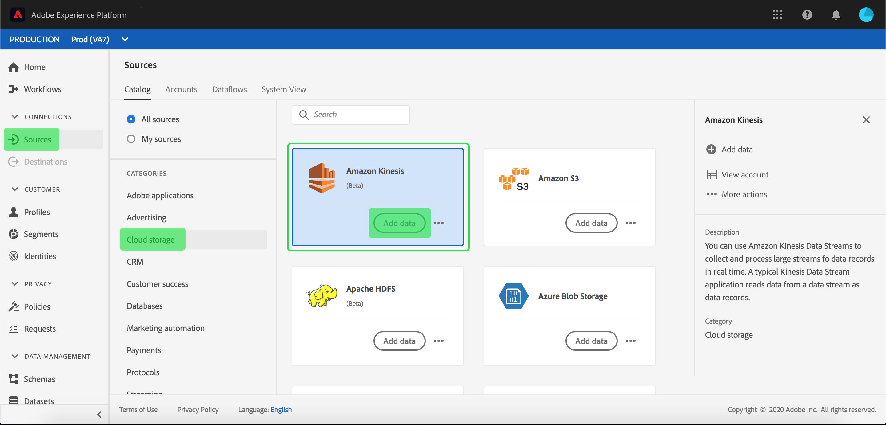

# Crear una conexión de origen [!DNL Amazon Kinesis] en la interfaz de usuario

>[!IMPORTANT]
>
>El origen [!DNL Amazon Kinesis] está disponible en el catálogo de orígenes para los usuarios que han adquirido Real-time Customer Data Platform Ultimate.

Los conectores de Source en Adobe Experience Platform permiten introducir datos de origen externo de forma programada. Este tutorial proporciona los pasos para autenticar un conector de origen [!DNL Amazon Kinesis] (en adelante denominado [!DNL "Kinesis"]) mediante la interfaz de usuario [!DNL Platform].

## Introducción

Este tutorial requiere una comprensión práctica de los siguientes componentes de Adobe Experience Platform:

- [[!DNL Experience Data Model (XDM)] Sistema](../../../../../xdm/home.md): El marco de trabajo estandarizado mediante el cual [!DNL Experience Platform] organiza los datos de la experiencia del cliente.
   - [Aspectos básicos de la composición de esquemas](../../../../../xdm/schema/composition.md): obtenga información sobre los componentes básicos de los esquemas XDM, incluidos los principios clave y las prácticas recomendadas en la composición de esquemas.
   - [Tutorial del editor de esquemas](../../../../../xdm/tutorials/create-schema-ui.md): Aprenda a crear esquemas personalizados mediante la interfaz de usuario del editor de esquemas.
- [[!DNL Real-Time Customer Profile]](../../../../../profile/home.md): proporciona un perfil de consumidor unificado y en tiempo real basado en los datos agregados de varias fuentes.

Si ya tiene una conexión [!DNL Kinesis] válida, puede omitir el resto de este documento y continuar con el tutorial sobre [configuración de un flujo de datos](../../dataflow/streaming/cloud-storage-streaming.md).

### Recopilar credenciales necesarias

Para autenticar el conector de origen [!DNL Kinesis], debe proporcionar valores para las siguientes propiedades de conexión:

| Credencial | Descripción |
| ---------- | ----------- |
| `accessKeyId` | Identificador de clave de acceso de su cuenta de [!DNL Kinesis]. |
| `Secret access key` | La clave secreta de acceso para su cuenta de [!DNL Kinesis]. |
| `region` | La región del servidor de AWS. |

Para obtener más información sobre estos valores, consulte [este [!DNL Kinesis] documento](https://docs.aws.amazon.com/streams/latest/dev/getting-started.html).

## Conectar su cuenta de [!DNL Kinesis]

Una vez que haya recopilado las credenciales requeridas, puede seguir los pasos a continuación para vincular su cuenta de [!DNL Kinesis] a [!DNL Platform].

Inicie sesión en [Adobe Experience Platform](https://platform.adobe.com) y, a continuación, seleccione **[!UICONTROL Fuentes]** en la barra de navegación izquierda para acceder al área de trabajo de **[!UICONTROL Fuentes]**. La pantalla **[!UICONTROL Catálogo]** muestra una variedad de orígenes con los que puede crear una cuenta.

Puede seleccionar la categoría adecuada del catálogo en la parte izquierda de la pantalla. También puede encontrar la fuente específica con la que desea trabajar utilizando la opción de búsqueda.

En la categoría **[!UICONTROL Almacenamiento en la nube]**, seleccione **[!UICONTROL Amazon Kinesis]**. Si es la primera vez que usa este conector, seleccione **[!UICONTROL Configurar]**. De lo contrario, seleccione **[!UICONTROL Agregar datos]** para crear un nuevo conector [!DNL Kinesis].

Aparecerá el cuadro de diálogo **[!UICONTROL Conectarse a Amazon Kinesis]**. En esta página, puede usar credenciales nuevas o existentes.

### Nueva cuenta

Si está usando credenciales nuevas, seleccione **[!UICONTROL Nueva cuenta]**. En el formulario de entrada que aparece, proporcione un nombre, una descripción opcional y sus credenciales de [!DNL Kinesis]. Cuando termine, seleccione **[!UICONTROL Conectar]** y deje pasar un tiempo para que se establezca la nueva conexión.

### Cuenta existente

Para conectar una cuenta existente, seleccione la cuenta de [!DNL Kinesis] con la que desee conectarse y, a continuación, seleccione **[!UICONTROL Siguiente]** para continuar.

## Pasos siguientes

Siguiendo este tutorial, se ha conectado a su cuenta de [!DNL Kinesis] a [!DNL Platform]. Ahora puede continuar con el siguiente tutorial y [configurar un flujo de datos para traer datos de su almacenamiento en la nube a [!DNL Platform]](../../dataflow/streaming/cloud-storage-streaming.md).
