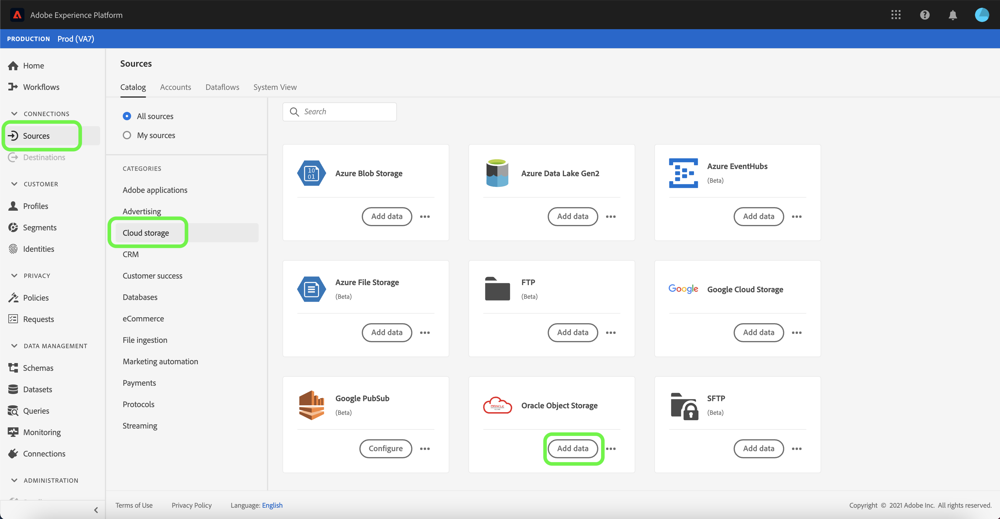
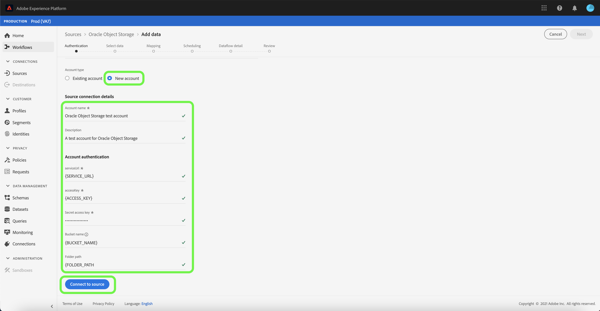

# Crear una conexión de origen [!DNL Oracle Object Storage] en la interfaz de usuario

Este tutorial proporciona los pasos para crear una conexión de origen [!DNL Oracle Object Storage] mediante la interfaz de usuario de Adobe Experience Platform.

## Primeros pasos

Este tutorial requiere un conocimiento práctico de los siguientes componentes de Adobe Experience Platform:

* [Fuentes](../../../../home.md): Experience Platform permite la ingesta de datos desde diversas fuentes, al tiempo que le permite estructurar, etiquetar y mejorar los datos entrantes mediante los servicios de plataforma.
* [Simuladores](../../../../../sandboxes/home.md): Experience Platform proporciona entornos limitados virtuales que dividen una sola instancia de Plataforma en entornos virtuales independientes para ayudar a desarrollar y desarrollar aplicaciones de experiencia digital.

### Recopilar las credenciales necesarias

Para conectarse a [!DNL Oracle Object Storage], debe proporcionar valores para las siguientes propiedades de conexión:

| Credencial | Descripción |
| ---------- | ----------- |
| `serviceUrl` | El extremo [!DNL Oracle Object Storage] requerido para la autenticación. El formato del extremo es: `https://{OBJECT_STORAGE_NAMESPACE}.compat.objectstorage.eu-frankfurt-1.oraclecloud.com` |
| `accessKey` | Se requiere el ID de la clave de acceso [!DNL Oracle Object Storage] para la autenticación. |
| `secretKey` | La contraseña [!DNL Oracle Object Storage] requerida para la autenticación. |
| `bucketName` | Se requiere el nombre del bloque permitido si el usuario tiene acceso restringido. El nombre del bloque debe tener entre tres y 63 caracteres, debe comenzar y finalizar con una letra o un número y sólo puede contener letras minúsculas, números o guiones (`-`). No se puede dar formato al nombre del bloque como una dirección IP. |
| `folderPath` | La ruta de la carpeta permitida que se requiere si el usuario tiene acceso restringido. |

Para obtener más información sobre cómo obtener estos valores, consulte la [guía de autenticación del Almacenamiento de objetos Oracle](https://docs.oracle.com/en-us/iaas/Content/Identity/Concepts/usercredentials.htm#User_Credentials).

Una vez recopiladas las credenciales necesarias, puede seguir los pasos a continuación para crear una nueva cuenta de Oracle de Almacenamiento de objetos para conectarse a Platform.

## Conectar al Almacenamiento de objetos Oracle

En la interfaz de usuario de la plataforma, seleccione **[!UICONTROL Fuentes]** en el panel de navegación izquierdo para acceder al espacio de trabajo [!UICONTROL Fuentes]. La pantalla [!UICONTROL Catálogo] muestra una variedad de orígenes con los que puede crear una cuenta.

Puede seleccionar la categoría adecuada en el catálogo a la izquierda de la pantalla. También puede encontrar la fuente específica con la que desea trabajar mediante la barra de búsqueda.

En la categoría [!UICONTROL Cloud almacenamiento], seleccione **[!UICONTROL Oracle del Almacenamiento de objetos]** y, a continuación, seleccione **[!UICONTROL Añadir datos]**.

### Cuenta existente

Para utilizar una cuenta existente, seleccione la cuenta [!DNL Oracle Object Storage] con la que desea crear un nuevo flujo de datos y, a continuación, seleccione **[!UICONTROL Siguiente]** para continuar.

### Nueva cuenta

Si va a crear una cuenta nueva, seleccione **[!UICONTROL Nueva cuenta]** y, a continuación, proporcione un nombre, una descripción opcional y sus [!DNL Oracle Object Storage] credenciales. Cuando termine, seleccione **[!UICONTROL Conectar con origen]** y, a continuación, deje transcurrir un tiempo para que se establezca la nueva conexión.

## Pasos siguientes

Siguiendo este tutorial, ha establecido una conexión con su cuenta [!DNL Oracle Object Storage]. Ahora puede continuar con el siguiente tutorial sobre [configuración de un flujo de datos para traer datos de su almacenamiento de nube a la plataforma](../../dataflow/batch/cloud-storage.md).
