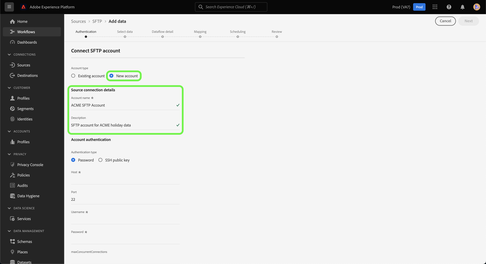

# Cree un [!DNL SFTP] conexión de origen en la interfaz de usuario

Este tutorial proporciona los pasos para crear un [!DNL SFTP] conexión de origen mediante la interfaz de usuario de Adobe Experience Platform.

## Primeros pasos

Este tutorial requiere una comprensión práctica de los siguientes componentes de Platform:

* [[!DNL Experience Data Model (XDM)] Sistema](../../../../../xdm/home.md): El marco estandarizado mediante el cual el Experience Platform organiza los datos de experiencia del cliente.
   * [Aspectos básicos de la composición del esquema](../../../../../xdm/schema/composition.md): Obtenga información sobre los componentes básicos de los esquemas XDM, incluidos los principios clave y las prácticas recomendadas en la composición de esquemas.
   * [Tutorial del Editor de esquemas](../../../../../xdm/tutorials/create-schema-ui.md): Obtenga información sobre cómo crear esquemas personalizados mediante la interfaz de usuario del Editor de esquemas.
* [[!DNL Real-Time Customer Profile]](../../../../../profile/home.md): Proporciona un perfil de cliente unificado y en tiempo real basado en datos agregados de varias fuentes.

>[!IMPORTANT]
>
>Se recomienda evitar nuevas líneas o retornos de carro al introducir objetos JSON con un [!DNL SFTP] conexión de origen. Para solucionar la limitación, utilice un único objeto JSON por línea y utilice líneas múltiples para los archivos posteriores.

Si ya tiene una [!DNL SFTP] conexión, puede omitir el resto de este documento y continuar con el tutorial en [configuración de un flujo de datos](../../dataflow/batch/cloud-storage.md).

### Recopilar las credenciales necesarias

Para conectarse a [!DNL SFTP], debe proporcionar valores para las siguientes propiedades de conexión:

| Credencial | Descripción |
| ---------- | ----------- |
| `host` | El nombre o la dirección IP asociados con su [!DNL SFTP] servidor. |
| `port` | La variable [!DNL SFTP] puerto de servidor al que se está conectando. Si no se proporciona, el valor predeterminado es `22`. |
| `username` | El nombre de usuario con acceso a su [!DNL SFTP] servidor. |
| `password` | La contraseña de su [!DNL SFTP] servidor. |
| `privateKeyContent` | El contenido de clave privada SSH codificada Base64. El tipo de clave OpenSSH debe clasificarse como RSA o DSA. |
| `passPhrase` | La frase de contraseña o contraseña para descifrar la clave privada si el archivo de clave o el contenido de la clave están protegidos por una frase de contraseña. Si PrivateKeyContent está protegido por contraseña, este parámetro debe utilizarse con la frase de contraseña de PrivateKeyContent como valor. |
| `maxConcurrentConnections` | Este parámetro le permite especificar un límite máximo para el número de conexiones simultáneas que Platform creará al conectarse al servidor SFTP. Debe configurar este valor para que sea menor que el límite establecido por SFTP. **Nota**: Cuando esta configuración está habilitada para una cuenta SFTP existente, solo afecta a flujos de datos futuros y no a flujos de datos existentes. |
| Ruta de carpeta | Ruta a la carpeta a la que desea proporcionar acceso. [!DNL SFTP] , puede proporcionar la ruta de la carpeta para especificar el acceso del usuario a la subcarpeta que desee. |

Una vez que haya reunido las credenciales necesarias, puede seguir los pasos a continuación para crear una nueva [!DNL SFTP] para conectarse a Platform.

## Conéctese a su [!DNL SFTP] server

En la interfaz de usuario de Platform, seleccione **[!UICONTROL Fuentes]** en la barra de navegación izquierda para acceder a la [!UICONTROL Fuentes] espacio de trabajo. La variable [!UICONTROL Catálogo] muestra una variedad de fuentes con las que puede crear una cuenta.

Puede seleccionar la categoría adecuada del catálogo en la parte izquierda de la pantalla. Alternativamente, puede encontrar la fuente específica con la que desea trabajar usando la opción de búsqueda.

En el [!UICONTROL Almacenamiento en la nube] categoría, seleccione **[!UICONTROL SFTP]** y, a continuación, seleccione **[!UICONTROL Añadir datos]**.

La variable **[!UICONTROL Conectarse a SFTP]** se abre. En esta página, puede usar credenciales nuevas o existentes.

### Cuenta existente

Para conectar una cuenta existente, seleccione la cuenta de FTP o SFTP con la que desee conectarse y, a continuación, seleccione **[!UICONTROL Siguiente]** para continuar.

### Nueva cuenta

>[!IMPORTANT]
>
>SFTP admite una clave OpenSSH de tipo RSA o DSA. Asegúrese de que el contenido del archivo clave comience por `"-----BEGIN [RSA/DSA] PRIVATE KEY-----"` y termina con `"-----END [RSA/DSA] PRIVATE KEY-----"`. Si el archivo de clave privada es un archivo en formato PPK, utilice la herramienta PuTTY para convertir del formato PPK al formato OpenSSH.

Si está creando una cuenta nueva, seleccione **[!UICONTROL Nueva cuenta]** y, a continuación, proporcione un nombre y una descripción opcional para la nueva [!DNL SFTP] cuenta.

La variable [!DNL SFTP] source admite autenticación básica y autenticación mediante clave pública SSH.

>[!BEGINTABS]

>[!TAB Autenticación básica]

Para utilizar la autenticación básica, seleccione **[!UICONTROL Contraseña]** y, a continuación, proporcione los valores de host y puerto a los que conectarse, junto con su nombre de usuario y contraseña. Durante este paso, también puede designar la ruta a la subcarpeta a la que desea proporcionar acceso. Cuando termine, seleccione **[!UICONTROL Conectar a origen]**.

>[!TAB Autenticación de clave pública SSH]

Para utilizar credenciales SSH basadas en claves públicas, seleccione **[!UICONTROL Clave pública SSH]**  y, a continuación, proporcione los valores de host y puerto, así como la combinación de contenido de clave privada y frase de contraseña. Durante este paso, también puede designar la ruta a la subcarpeta a la que desea proporcionar acceso. Cuando termine, seleccione **[!UICONTROL Conectar a origen]**.

>[!ENDTABS]

## Pasos siguientes

Siguiendo este tutorial, ha establecido una conexión con su cuenta SFTP. Ahora puede continuar con el siguiente tutorial y [configurar un flujo de datos para incorporar datos del almacenamiento en la nube a Platform](../../dataflow/batch/cloud-storage.md).
