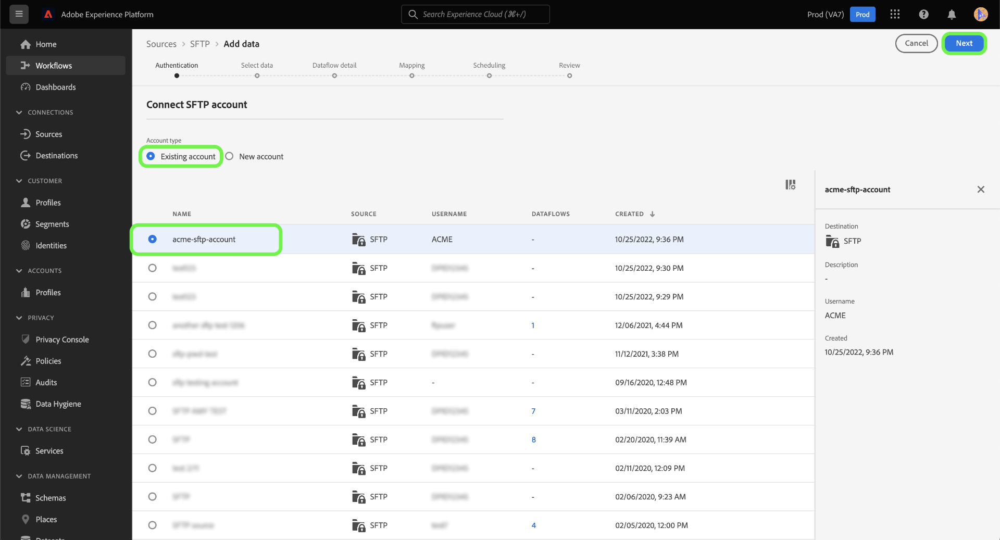

# Creación de una conexión de origen SFTP en la interfaz de usuario

Este tutorial proporciona los pasos para crear una conexión de origen SFTP mediante la interfaz de usuario de Adobe Experience Platform.

## Primeros pasos

Este tutorial requiere una comprensión práctica de los siguientes componentes de Adobe Experience Platform:

* [[!DNL Experience Data Model (XDM)] Sistema](../../../../../xdm/home.md): El marco estandarizado mediante el cual el Experience Platform organiza los datos de experiencia del cliente.
   * [Aspectos básicos de la composición](../../../../../xdm/schema/composition.md) del esquema: Obtenga información sobre los componentes básicos de los esquemas XDM, incluidos los principios clave y las prácticas recomendadas en la composición de esquemas.
   * [Tutorial del Editor de esquemas](../../../../../xdm/tutorials/create-schema-ui.md): Aprenda a crear esquemas personalizados mediante la interfaz de usuario del Editor de esquemas.
* [[!DNL Real-time Customer Profile]](../../../../../profile/home.md): Proporciona un perfil de cliente unificado y en tiempo real basado en datos agregados de varias fuentes.

>[!IMPORTANT]
>
>Se recomienda evitar nuevas líneas o retornos de carro al introducir objetos JSON con una conexión de origen SFTP. Para solucionar la limitación, utilice un único objeto JSON por línea y utilice líneas múltiples para los archivos posteriores.

Si ya tiene una conexión SFTP válida, puede omitir el resto de este documento y continuar con el tutorial sobre la [configuración de un flujo de datos](../../dataflow/batch/cloud-storage.md).

### Recopilar las credenciales necesarias

Para conectarse a SFTP, debe proporcionar valores para las siguientes propiedades de conexión:

| Credencial | Descripción |
| ---------- | ----------- |
| `host` | El nombre o la dirección IP asociados con su servidor SFTP. |
| `username` | El nombre de usuario con acceso a su servidor SFTP. |
| `password` | La contraseña del servidor SFTP. |
| `privateKeyContent` | El contenido de clave privada SSH codificada Base64. El tipo de clave OpenSSH debe clasificarse como RSA o DSA. |
| `passPhrase` | La frase de contraseña o contraseña para descifrar la clave privada si el archivo de clave o el contenido de la clave están protegidos por una frase de contraseña. Si PrivateKeyContent está protegido por contraseña, este parámetro debe utilizarse con la frase de contraseña de PrivateKeyContent como valor. |

Una vez que haya recopilado las credenciales necesarias, puede seguir los pasos a continuación para crear una nueva cuenta SFTP que se conecte a Platform.

## Conectarse al servidor SFTP

Inicie sesión en [Adobe Experience Platform](https://platform.adobe.com) y, a continuación, seleccione **[!UICONTROL Sources]** en la barra de navegación izquierda para acceder al espacio de trabajo [!UICONTROL Sources]. La pantalla [!UICONTROL Catalog] muestra una variedad de fuentes para las que puede crear una cuenta de entrada.

Puede seleccionar la categoría adecuada del catálogo en la parte izquierda de la pantalla. Alternativamente, puede encontrar la fuente específica con la que desea trabajar usando la opción de búsqueda.

En la categoría [!UICONTROL Cloud storage], seleccione **[!UICONTROL SFTP]**. Si es la primera vez que utiliza este conector, seleccione **[!UICONTROL Configure]**. De lo contrario, seleccione **[!UICONTROL Add data]** para crear una nueva conexión SFTP.

Aparece la página **[!UICONTROL Connect to SFTP]**. En esta página, puede usar credenciales nuevas o existentes.

### Nueva cuenta

Si está utilizando credenciales nuevas, seleccione **[!UICONTROL New account]**. En el formulario de entrada que aparece, indique un nombre, una descripción opcional y sus credenciales. Cuando termine, seleccione **[!UICONTROL Connect]** y, a continuación, deje que se establezca la nueva conexión.

El conector SFTP proporciona diferentes tipos de autenticación para el acceso. En **[!UICONTROL Account authentication]** seleccione **[!UICONTROL Password]** para utilizar una credencial basada en contraseña.

Como alternativa, puede seleccionar **[Clave pública SSH]** y conectar su cuenta SFTP mediante una combinación de [!UICONTROL Private key content] y [!UICONTROL Passphrase].

>[!IMPORTANT]
>
>El conector SFTP admite una clave OpenSSH de tipo RSA o DSA. Asegúrese de que el contenido del archivo clave comienza por `"-----BEGIN [RSA/DSA] PRIVATE KEY-----"` y termina por `"-----END [RSA/DSA] PRIVATE KEY-----"`. Si el archivo de clave privada es un archivo en formato PPK, utilice la herramienta PuTTY para convertir del formato PPK al formato OpenSSH.

| Credencial | Descripción |
| ---------- | ----------- |
| Contenido de clave privada | El contenido de clave privada SSH codificada Base64. El tipo de clave OpenSSH debe clasificarse como RSA o DSA. |
| Frase de contraseña | Especifica la frase de contraseña o contraseña para descifrar la clave privada si el archivo de clave o el contenido de la clave están protegidos por una frase de contraseña. Si PrivateKeyContent está protegido por contraseña, este parámetro debe utilizarse con la frase de contraseña de PrivateKeyContent como valor. |

### Cuenta existente

Para conectar una cuenta existente, seleccione la cuenta de FTP o SFTP con la que desee conectarse y, a continuación, seleccione **[!UICONTROL Next]** para continuar.

## Pasos siguientes

Siguiendo este tutorial, ha establecido una conexión con su cuenta de FTP o SFTP. Ahora puede continuar con el siguiente tutorial y [configurar un flujo de datos para importar los datos del almacenamiento en la nube a Platform](../../dataflow/batch/cloud-storage.md).