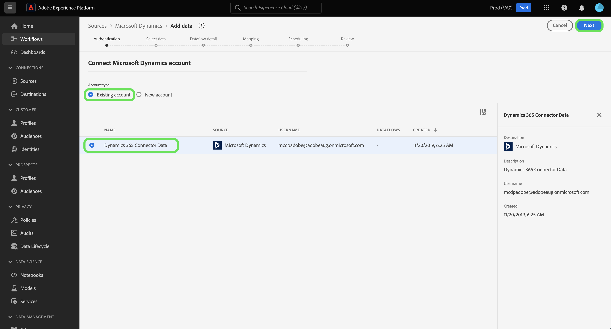

# Crear un conector de origen [!DNL Microsoft Dynamics] en la interfaz de usuario

Este tutorial proporciona los pasos para crear un conector de origen [!DNL Microsoft Dynamics] (en adelante denominado &quot;[!DNL Dynamics]&quot;) mediante la interfaz de usuario de la plataforma.

## Primeros pasos

Este tutorial requiere un conocimiento práctico de los siguientes componentes de Adobe Experience Platform:

* [[!DNL Experience Data Model (XDM)] Sistema](../../../../../xdm/home.md): El esquema estandarizado por el cual el Experience Platform organiza los datos de experiencia del cliente.
   * [Conceptos básicos de la composición](../../../../../xdm/schema/composition.md) de esquemas: Obtenga información sobre los componentes básicos de los esquemas XDM, incluidos los principios clave y las prácticas recomendadas en la composición de esquemas.
   * [Tutorial](../../../../../xdm/tutorials/create-schema-ui.md) del Editor de esquemas: Obtenga información sobre cómo crear esquemas personalizados mediante la interfaz de usuario del Editor de Esquemas.
* [[!DNL Real-time Customer Profile]](../../../../../profile/home.md):: Proporciona un perfil de consumo unificado y en tiempo real basado en datos agregados de varias fuentes.

Si ya tiene una cuenta [!DNL Dynamics] válida, puede omitir el resto de este documento y continuar con el tutorial sobre [configuración de un flujo de datos para un origen de CRM](../../dataflow/crm.md).

### Recopilar las credenciales necesarias

| Credencial | Descripción |
| ---------- | ----------- |
| `serviceUri` | La dirección URL del servicio de su instancia [!DNL Dynamics]. |
| `username` | El nombre de usuario de su cuenta de [!DNL Dynamics] usuario. |
| `password` | La contraseña de su cuenta [!DNL Dynamics]. |
| `servicePrincipalId` | ID de cliente de su cuenta [!DNL Dynamics]. Este ID es necesario cuando se utiliza la autenticación de clave de servicio y la autenticación basada en claves. |
| `servicePrincipalKey` | La clave secreta principal del servicio. Esta credencial es necesaria cuando se utiliza la autenticación basada en clave y la principal del servicio. |

Para obtener más información sobre cómo empezar, consulte [this [!DNL Dynamics] documento](https://docs.microsoft.com/en-us/powerapps/developer/common-data-service/authenticate-oauth).

## Conectar su cuenta [!DNL Dynamics]

Una vez recopiladas las credenciales requeridas, puede seguir los pasos a continuación para vincular su cuenta [!DNL Dynamics] a la plataforma.

Inicie sesión en [Adobe Experience Platform](https://platform.adobe.com) y, a continuación, seleccione **[!UICONTROL Fuentes]** en la barra de navegación izquierda para acceder al espacio de trabajo [!UICONTROL Fuentes]. La pantalla **[!UICONTROL Catálogo]** muestra una variedad de fuentes con las que puede crear una cuenta.

Puede seleccionar la categoría adecuada en el catálogo a la izquierda de la pantalla. También puede encontrar la fuente específica con la que desea trabajar mediante la opción de búsqueda.

En la categoría **[!UICONTROL CRM]**, seleccione **[!UICONTROL Microsoft Dynamics]**. Si es la primera vez que utiliza este conector, seleccione **[!UICONTROL Configurar]**. De lo contrario, seleccione **[!UICONTROL Añadir datos]** para crear un nuevo conector [!DNL Dynamics].

Aparece la página **[!UICONTROL Conectar con Dynamics]**. En esta página, puede usar credenciales nuevas o existentes.

### Nueva cuenta

Si está utilizando nuevas credenciales, seleccione **[!UICONTROL Nueva cuenta]**. En el formulario de entrada que aparece, proporcione un nombre y una descripción opcional para su nueva cuenta [!DNL Dynamics].

El conector [!DNL Dynamics] proporciona diferentes tipos de autenticación para el acceso. En [!UICONTROL Autenticación de cuenta] seleccione **[!UICONTROL Autenticación básica]** para utilizar credenciales basadas en contraseña.

Cuando termine, seleccione **[!UICONTROL Conectar con origen]** y, a continuación, deje tiempo para que se establezca la nueva cuenta.

También puede seleccionar **[!UICONTROL Service-principal y autenticación de clave]** y conectar su cuenta [!DNL Dynamics] mediante una combinación de [!UICONTROL Service principal ID] y [!UICONTROL Service principal key].

>[!IMPORTANT]
>
> La autenticación básica en [!DNL Dynamics] puede estar bloqueada por la autenticación de dos factores, que actualmente no es compatible con Platform. En este caso, se recomienda utilizar la autenticación basada en claves para crear un conector de origen mediante [!DNL Dynamics].

| Credencial | Descripción |
| ---------- | ----------- |
| [!UICONTROL ID principal del servicio] | ID de cliente de su cuenta [!DNL Dynamics]. Este ID es necesario cuando se utiliza la autenticación de clave de servicio y la autenticación basada en claves. |
| [!UICONTROL Clave principal de servicio] | La clave secreta principal del servicio. Esta credencial es necesaria cuando se utiliza la autenticación basada en clave y la principal del servicio. |

### Cuenta existente

Para conectar una cuenta existente, seleccione la cuenta [!DNL Dynamics] con la que desea conectarse y, a continuación, seleccione **[!UICONTROL Siguiente]** en la esquina superior derecha para continuar.

## Pasos siguientes

Siguiendo este tutorial, ha establecido una conexión con su cuenta [!DNL Dynamics]. Ahora puede continuar con el siguiente tutorial y [configurar un flujo de datos para traer datos a Platform](../../dataflow/crm.md).