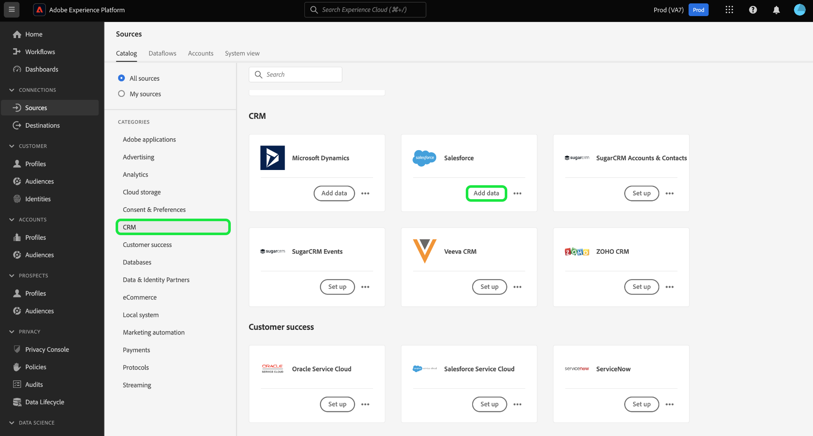

# Crear una conexión de origen [!DNL Salesforce] en la interfaz de usuario

Los conectores de origen de Adobe Experience Platform permiten la ingesta de datos CRM de origen externo de forma programada. Este tutorial proporciona los pasos para crear un conector de origen [!DNL Salesforce] mediante la interfaz de usuario [!DNL Platform].

## Primeros pasos

Este tutorial requiere un conocimiento práctico de los siguientes componentes de Adobe Experience Platform:

* [[!DNL Experience Data Model (XDM)] Sistema](../../../../../xdm/home.md): Marco normalizado por el cual se  [!DNL Experience Platform] organizan los datos de experiencia del cliente.
   * [Conceptos básicos de la composición](../../../../../xdm/schema/composition.md) de esquemas: Obtenga información sobre los componentes básicos de los esquemas XDM, incluidos los principios clave y las prácticas recomendadas en la composición de esquemas.
   * [Tutorial](../../../../../xdm/tutorials/create-schema-ui.md) del Editor de esquemas: Obtenga información sobre cómo crear esquemas personalizados mediante la interfaz de usuario del Editor de Esquemas.
* [[!DNL Real-time Customer Profile]](../../../../../profile/home.md):: Proporciona un perfil de consumo unificado y en tiempo real basado en datos agregados de varias fuentes.

Si ya tiene una cuenta [!DNL Salesforce] válida, puede omitir el resto de este documento y continuar con el tutorial sobre [configuración de un flujo de datos](../../dataflow/crm.md).

### Recopilar las credenciales necesarias

| Credencial | Descripción |
| ---------- | ----------- |
| `environmentUrl` | Dirección URL de la instancia de origen [!DNL Salesforce]. |
| `username` | El nombre de usuario de la cuenta de usuario [!DNL Salesforce]. |
| `password` | La contraseña de la cuenta de usuario [!DNL Salesforce]. |
| `securityToken` | El distintivo de seguridad para la cuenta de usuario [!DNL Salesforce]. |

Para obtener más información sobre cómo empezar, consulte [este documento de Salesforce](https://developer.salesforce.com/docs/atlas.en-us.api_rest.meta/api_rest/intro_understanding_authentication.htm).

## Conectar su cuenta [!DNL Salesforce]

Una vez recopiladas las credenciales requeridas, puede seguir los pasos a continuación para vincular su cuenta [!DNL Salesforce] a [!DNL Platform].

Inicie sesión en [Adobe Experience Platform](https://platform.adobe.com) y, a continuación, seleccione **[!UICONTROL Fuentes]** en la barra de navegación izquierda para acceder al espacio de trabajo **[!UICONTROL Fuentes]**. La pantalla **[!UICONTROL Catálogo]** muestra una variedad de fuentes con las que puede crear una cuenta.

Puede seleccionar la categoría adecuada en el catálogo a la izquierda de la pantalla. También puede encontrar la fuente específica con la que desea trabajar mediante la opción de búsqueda.

En la categoría **[!UICONTROL Bases de datos]**, seleccione **[!UICONTROL Salesforce]**. Si es la primera vez que utiliza este conector, seleccione **[!UICONTROL Configurar]**. De lo contrario, seleccione **[!UICONTROL Añadir datos]** para crear un nuevo conector de Salesforce.

Aparece la página **[!UICONTROL Conectar con Salesforce]**. En esta página, puede usar credenciales nuevas o existentes.

### Nueva cuenta

Si está utilizando nuevas credenciales, seleccione **[!UICONTROL Nueva cuenta]**. En el formulario de entrada que aparece, especifique un nombre, una descripción opcional y sus credenciales [!DNL Salesforce]. Cuando termine, seleccione **[!UICONTROL Conectar]** y, a continuación, deje transcurrir algún tiempo para que se establezca la nueva conexión.

### Cuenta existente

Para conectar una cuenta existente, seleccione la cuenta [!DNL Salesforce] con la que desea conectarse y, a continuación, seleccione **[!UICONTROL Siguiente]** en la esquina superior derecha para continuar.

## Pasos siguientes

Siguiendo este tutorial, ha establecido una conexión con su cuenta [!DNL Salesforce]. Ahora puede continuar con el siguiente tutorial y [configurar un flujo de datos para traer datos a [!DNL Platform]](../../dataflow/crm.md).