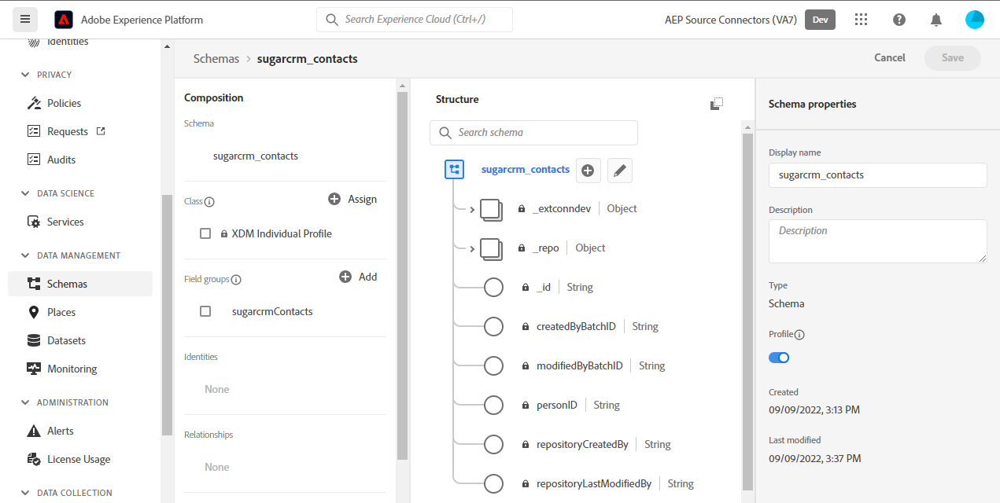
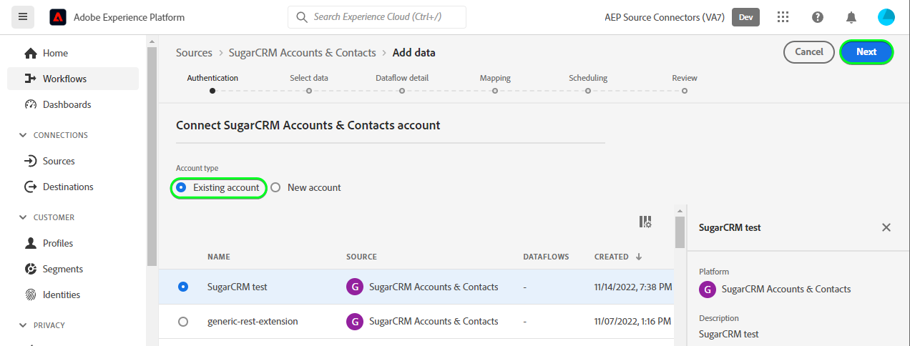

# Crear una conexión de origen [!DNL SugarCRM Accounts & Contacts] en la interfaz de usuario

Este tutorial proporciona los pasos para crear una conexión de origen [!DNL SugarCRM Accounts & Contacts] mediante la interfaz de usuario de Adobe Experience Platform.

## Introducción

Este tutorial requiere una comprensión práctica de los siguientes componentes de Experience Platform:

* [[!DNL Experience Data Model (XDM)] Sistema](../../../../../xdm/home.md): El marco de trabajo estandarizado mediante el cual [!DNL Experience Platform] organiza los datos de la experiencia del cliente.
   * [Aspectos básicos de la composición de esquemas](../../../../../xdm/schema/composition.md): obtenga información sobre los componentes básicos de los esquemas XDM, incluidos los principios clave y las prácticas recomendadas en la composición de esquemas.
   * [Tutorial del editor de esquemas](../../../../../xdm/tutorials/create-schema-ui.md): Aprenda a crear esquemas personalizados mediante la interfaz de usuario del editor de esquemas.
* [[!DNL Real-Time Customer Profile]](../../../../../profile/home.md): proporciona un perfil de consumidor unificado y en tiempo real basado en los datos agregados de varias fuentes.

Si ya tiene una cuenta de [!DNL SugarCRM] válida, puede omitir el resto de este documento y continuar con el tutorial sobre [configuración de un flujo de datos](../../dataflow/crm.md).

### Recopilar credenciales necesarias

Para conectar [!DNL SugarCRM Accounts & Contacts] a Experience Platform, debe proporcionar valores para las siguientes propiedades de conexión:

| Credencial | Descripción | Ejemplo |
| --- | --- | --- |
| `Host` | El punto final de la API de SugarCRM al que se conecta el origen. | `developer.salesfusion.com` |
| `Username` | Su nombre de usuario de cuenta de desarrollador de SugarCRM. | `abc.def@example.com@sugarmarketdemo000.com` |
| `Password` | Contraseña de su cuenta de desarrollador de SugarCRM. | `123456789` |

### Creación de un esquema de Experience Platform

Antes de crear una conexión de origen de [!DNL SugarCRM], también debe asegurarse de crear primero un esquema de Experience Platform para utilizarlo en el origen. Consulte el tutorial de [creación de un esquema de Experience Platform](../../../../../xdm/schema/composition.md) para ver los pasos detallados sobre cómo crear un esquema.

[!DNL SugarCRM Accounts & Contacts] admite varias API. Esto significa que debe crear un esquema independiente, según el tipo de objeto que esté aprovechando. Consulte los ejemplos siguientes para ver esquemas de cuentas y contactos:

>[!BEGINTABS]

>[!TAB Cuentas]

>[!TAB Contactos]

>[!ENDTABS]

## Conectar su cuenta de [!DNL SugarCRM Accounts & Contacts]

En la interfaz de usuario de Experience Platform, seleccione **[!UICONTROL Fuentes]** en la barra de navegación izquierda para acceder al área de trabajo de [!UICONTROL Fuentes]. La pantalla [!UICONTROL Catálogo] muestra una variedad de orígenes con los que puede crear una cuenta.

Puede seleccionar la categoría adecuada del catálogo en la parte izquierda de la pantalla. También puede encontrar la fuente específica con la que desea trabajar utilizando la opción de búsqueda.

En la categoría *CRM*, seleccione **[!UICONTROL Cuentas y contactos de SugarCRM]** y luego seleccione **[!UICONTROL Agregar datos]**.

Aparecerá la página **[!UICONTROL Conectar cuenta y contactos de SugarCRM]**. En esta página, puede usar credenciales nuevas o existentes.

### Cuenta existente

Para usar una cuenta existente, seleccione la cuenta de [!DNL SugarCRM Accounts & Contacts] con la que desee crear un nuevo flujo de datos y, a continuación, seleccione **[!UICONTROL Siguiente]** para continuar.

### Nueva cuenta

Si va a crear una cuenta nueva, seleccione **[!UICONTROL Cuenta nueva]** y, a continuación, proporcione un nombre, una descripción opcional y sus credenciales. Cuando termine, seleccione **[!UICONTROL Conectarse al origen]** y deje pasar un tiempo para que se establezca la nueva conexión.

### Seleccionar datos

Finalmente, debe seleccionar el tipo de objeto que desea introducir en Experience Platform.

| Tipo de objeto | Descripción |
| --- | --- |
| `Accounts` | Las empresas con las que su organización tiene relación. |
| `Contacts` | Las personas individuales con las que su organización tiene una relación establecida. |

>[!BEGINTABS]

>[!TAB Cuentas]

>[!TAB Contactos]

>[!ENDTABS]

## Pasos siguientes

Al seguir este tutorial, ha establecido una conexión con su cuenta de [!DNL SugarCRM Accounts & Contacts]. Ahora puede continuar con el siguiente tutorial y [configurar un flujo de datos para introducir datos en Experience Platform](../../dataflow/crm.md).

## Recursos adicionales

Las secciones siguientes proporcionan recursos adicionales a los que puede hacer referencia al usar el origen [!DNL SugarCRM].

### Mecanismos de protección {#guardrails}

Las velocidades de aceleración de API [!DNL SugarCRM] son de 90 llamadas por minuto o 2000 llamadas por día, lo que suceda primero. Sin embargo, esta restricción se ha eludido añadiendo un parámetro a la especificación de conexión que retrasará el tiempo de solicitud para que nunca se alcance el límite de velocidad.

### Validación {#validation}

Para comprobar que ha configurado correctamente el origen y que se están ingiriendo los datos de [!DNL SugarCRM Accounts & Contacts], siga los pasos a continuación:

* En la interfaz de usuario de Experience Platform, seleccione **[!UICONTROL Ver flujos de datos]** junto al menú de tarjeta [!DNL SugarCRM Accounts & Contacts] en el catálogo de fuentes. A continuación, seleccione **[!UICONTROL Previsualizar conjunto de datos]** para verificar los datos ingeridos.

* Según el tipo de objeto con el que esté trabajando, puede comprobar los datos agregados con los recuentos visibles en las siguientes páginas de [!DNL SugarMarket] cuentas o contactos:

>[!BEGINTABS]

>[!TAB Cuentas]

>[!TAB Contactos]

>[!ENDTABS]

>[!NOTE]
>
>Las páginas [!DNL SugarMarket] no incluyen los recuentos de objetos eliminados. Sin embargo, los datos recuperados a través de esta fuente también incluirán el recuento eliminado, que se marcaría con un indicador eliminado.
